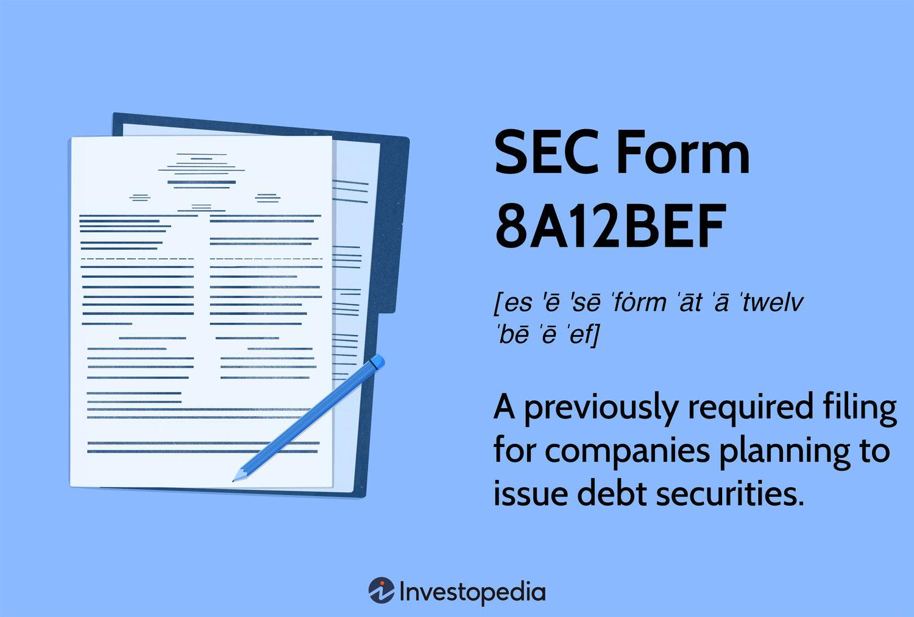

## Table of Contents

## What is SEC Form 8A12BEF?

SEC Form 8A12BEF is a document that companies file with the Securities and Exchange Commission (SEC) when they want to register a new type of security. This form is used to register securities that will be traded on a national exchange, like stocks or bonds. It helps the SEC keep track of what companies are doing and make sure they follow the rules.

When a company fills out Form 8A12BEF, they need to give a lot of information about the security they want to register. This includes details like what the security is, how it will be traded, and any special rules that apply to it. By filing this form, the company makes sure that their security can be legally traded and that investors have all the information they need to make good choices.

## Who needs to file SEC Form 8A12BEF?

Companies need to file SEC Form 8A12BEF when they want to register a new type of security that will be traded on a national exchange. This includes things like stocks or bonds. By filing this form, the company makes sure that their security can be legally traded and that everyone knows about it.

The form is important because it helps the Securities and Exchange Commission keep track of what companies are doing. It makes sure that companies follow the rules and that investors have all the information they need to make good choices. So, any company planning to list a new security on a national exchange has to file this form.

## When should SEC Form 8A12BEF be filed?

SEC Form 8A12BEF should be filed by a company before they start trading a new type of security on a national exchange. This means they need to submit the form to the Securities and Exchange Commission (SEC) before the security, like a stock or bond, can be legally traded.

The timing is important because the SEC needs to review the information in the form to make sure everything is okay. By filing the form early enough, the company gives the SEC time to look over the details and approve the security for trading. This helps keep things fair and transparent for everyone involved.

## What is the purpose of filing SEC Form 8A12BEF?

The purpose of filing SEC Form 8A12BEF is to register a new type of security that a company wants to trade on a national exchange. This form helps the Securities and Exchange Commission (SEC) keep track of what companies are doing and make sure they follow the rules. By filing this form, a company can legally trade their new security, like stocks or bonds, on the exchange.

Filing SEC Form 8A12BEF also makes sure that investors have all the information they need to make good choices. The form includes details about the security, how it will be traded, and any special rules that apply to it. This helps keep the trading process fair and transparent for everyone involved.

## How does SEC Form 8A12BEF differ from other SEC forms?

SEC Form 8A12BEF is different from other SEC forms because it is specifically used for registering a new type of security that a company wants to trade on a national exchange. Other forms might be used for different purposes, like reporting financial information or announcing major company changes. For example, Form 10-K is used for annual financial reports, while Form 8-K is used for reporting significant events.

Form 8A12BEF focuses on providing detailed information about the new security, like stocks or bonds, including how it will be traded and any special rules that apply to it. This is different from other forms that might not need such specific details about securities. By filing Form 8A12BEF, a company makes sure that their security can be legally traded and that investors have all the necessary information to make informed decisions.

## What are the key components or sections of SEC Form 8A12BEF?

SEC Form 8A12BEF has several important parts that help the Securities and Exchange Commission understand the new security a company wants to trade. The form starts with basic information about the company, like its name and address. It then goes into details about the security itself, such as what type it is (like stocks or bonds) and how it will be traded on the national exchange. This section is crucial because it tells the SEC exactly what the security is and how it will work.

The form also includes information about any special rules or conditions that apply to the security. This could be things like voting rights for stockholders or interest rates for bondholders. By including these details, the form makes sure that everyone knows how the security will function. Finally, the form requires the company to sign off on the information, confirming that everything is accurate and complete. This helps keep the process honest and transparent for investors and the SEC.

## What are the common mistakes to avoid when filing SEC Form 8A12BEF?

When filing SEC Form 8A12BEF, it's important to avoid common mistakes that can cause delays or issues. One big mistake is not including all the required information. The form asks for details about the new security, like what it is and how it will be traded. If any of this information is missing or incomplete, the SEC might not approve the security for trading. Another mistake is not following the right format. The form has specific sections that need to be filled out correctly. If the format is wrong, it can make the filing process harder and slower.

Another common mistake is not filing the form on time. Companies need to submit SEC Form 8A12BEF before they start trading the new security on a national exchange. If the form is filed late, it can delay the trading process and might even lead to penalties. It's also important to double-check all the information for accuracy. Mistakes or errors in the details can cause problems and might need to be corrected later, which takes more time and effort. By avoiding these mistakes, companies can make sure their new security gets approved and starts trading smoothly.

## How can one access and submit SEC Form 8A12BEF?

You can access SEC Form 8A12BEF on the Securities and Exchange Commission's (SEC) website. Just go to the SEC's homepage, find the section for forms, and look for Form 8A12BEF. You can download it as a PDF or fill it out online if that option is available. Make sure you have a good internet connection and a device that can open PDF files.

To submit the form, you usually need to do it electronically through the SEC's Electronic Data Gathering, Analysis, and Retrieval (EDGAR) system. First, you need to register for an EDGAR account if you don't already have one. Once you're logged in, you can upload your completed Form 8A12BEF. Make sure all the information is correct and complete before you submit it. If you need help, the SEC's website has guides and support to walk you through the process.

## What are the consequences of not filing SEC Form 8A12BEF on time?

If a company does not file SEC Form 8A12BEF on time, it can face some big problems. The main issue is that the new security, like stocks or bonds, cannot be traded on a national exchange until the form is filed and approved. This delay can hurt the company because it means they can't start selling the security to investors when they planned to. This can lead to lost opportunities and might make investors less confident in the company.

On top of that, the SEC might take action against the company for not following the rules. This could mean fines or other penalties. The SEC wants companies to file on time to keep the market fair and transparent for everyone. So, it's really important for companies to make sure they file SEC Form 8A12BEF before they start trading their new security.

## Can SEC Form 8A12BEF be amended after filing, and if so, how?

Yes, SEC Form 8A12BEF can be amended after it's been filed. If a company realizes there's a mistake or needs to update some information, they can file an amendment. This is important because it helps keep the information accurate and up-to-date for the SEC and investors.

To amend the form, the company needs to go back into the SEC's EDGAR system, where they originally filed the form. They'll need to submit a new version of Form 8A12BEF, clearly marking it as an amendment. The company should explain what changes were made and why. This way, everyone knows the latest and correct information about the security.

## What recent changes or updates have been made to SEC Form 8A12BEF?

The SEC updates its forms from time to time to make sure they work well and follow the latest rules. Recently, there haven't been any big changes to SEC Form 8A12BEF, but the SEC always looks at its forms to see if they can be better. They might change the form to ask for more details about the security or to make the filing process easier.

If there are any changes, the SEC will let companies know through their website or by sending out notices. It's a good idea for companies to check the SEC's website regularly to stay up-to-date on any changes to Form 8A12BEF or other forms. This way, they can make sure they're always following the right rules when they file.

## How does SEC Form 8A12BEF impact the transparency and compliance of a company?

SEC Form 8A12BEF helps make sure that companies are open and honest about their new securities. When a company wants to trade a new security, like stocks or bonds, on a national exchange, they have to fill out this form. It asks for a lot of details about the security, like what it is and how it will be traded. By sharing this information with the SEC, the company makes sure that everyone knows about their new security. This helps investors make smart choices because they have all the facts they need.

Filing SEC Form 8A12BEF also helps companies follow the rules. The SEC uses the information in the form to check if the company is doing things the right way. If the company doesn't file the form on time or if they leave out important details, they might get in trouble. This could mean fines or other penalties. So, by filing the form correctly and on time, companies show that they are playing by the rules and being responsible. This makes the market fair and safe for everyone involved.

## References & Further Reading

[1]: Allen, F., & Yago, G. (2010). ["Global Perspectives on the SEC's Regulatory Mandate."](https://www.semanticscholar.org/paper/Financing-the-Future%3A-Market-Based-Innovations-for-Allen-Yago/01505a1cc543f885b3cdb69a8865c20ebdb87a9d) Wharton Financial Institutions Center.

[2]: Lopez de Prado, M. (2018). ["Advances in Financial Machine Learning."](https://www.amazon.com/Advances-Financial-Machine-Learning-Marcos/dp/1119482089) Wiley.

[3]: Malkiel, B. G. (2015). ["A Random Walk Down Wall Street: The Time-Tested Strategy for Successful Investing."](https://www.amazon.com/Random-Walk-Down-Wall-Street/dp/0393358380) W. W. Norton & Company.

[4]: Johnson, B., & Dalton, J. (2012). ["How Algorithmic Trading Has Changed the Market."](https://research.gold.ac.uk/id/eprint/27283/1/McGroarty2019_Article_HighFrequencyTradingStrategies.pdf) Investopedia.

[5]: Gomber, P., Arndt, B., Lutat, M., & Uhle, T. (2011). ["High-Frequency Trading."](https://www.researchgate.net/publication/271631628_High-Frequency-Trading) Working Paper, Goethe University Frankfurt.