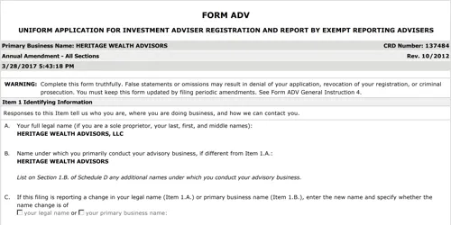

## Table of Contents

## What is SEC Form ADV-W?

SEC Form ADV-W is a form used by investment advisers to withdraw their registration with the Securities and Exchange Commission (SEC). When an investment adviser decides to stop doing business or no longer wants to be registered with the SEC, they need to fill out and submit this form. It helps the SEC keep track of which advisers are still operating and which ones have stopped.

The form asks for basic information about the adviser, like their name, address, and the date they want their registration to end. It's important for advisers to submit this form correctly and on time to avoid any legal issues. Once the SEC receives and processes the form, the adviser's registration is officially withdrawn, and they are no longer under the SEC's oversight.

## Who needs to file SEC Form ADV-W?

Investment advisers who are registered with the SEC need to file SEC Form ADV-W when they want to stop their business or no longer want to be registered with the SEC. This form is important because it tells the SEC that the adviser is no longer operating or wants to end their registration. It helps the SEC keep their records up to date and know which advisers are still active.

Filing SEC Form ADV-W is a must for advisers who decide to close their business, merge with another firm, or switch to a different type of registration, like state registration. The adviser needs to fill out the form with basic information like their name, address, and the date they want their registration to end. Once the SEC gets the form and processes it, the adviser's registration is officially withdrawn, and they are no longer under the SEC's oversight.

## What is the purpose of filing Form ADV-W?

The main purpose of filing Form ADV-W is to tell the SEC that an investment adviser wants to stop being registered with them. When an adviser decides to close their business, merge with another company, or switch to a different type of registration, they need to let the SEC know. This helps the SEC keep their records up to date and know which advisers are still active.

Filing Form ADV-W is important because it officially ends the adviser's registration with the SEC. The adviser fills out the form with basic information like their name, address, and the date they want their registration to end. Once the SEC gets the form and processes it, the adviser is no longer under the SEC's oversight. This helps avoid any legal issues and makes sure everything is done correctly.

## How does one file Form ADV-W?

To file Form ADV-W, an investment adviser needs to go to the SEC's website and find the form. They can fill it out online or download it to fill out later. The adviser needs to give basic information like their name, address, and the date they want their registration to end. It's important to fill out the form carefully and make sure all the information is correct.

Once the form is filled out, the adviser can submit it online through the SEC's electronic filing system, called IARD (Investment Adviser Registration Depository). After the SEC gets the form and checks it, the adviser's registration will be officially withdrawn. It's a good idea to keep a copy of the form for their records, just in case they need it later.

## What are the deadlines for filing Form ADV-W?

When an investment adviser wants to stop being registered with the SEC, they need to file Form ADV-W. The deadline for filing this form is important. The adviser must file Form ADV-W within 30 days after they stop doing business as an investment adviser. This means they need to send the form to the SEC no later than 30 days after they close their business or stop giving investment advice.

If the adviser is switching from SEC registration to state registration, they need to file Form ADV-W before they can apply for state registration. This helps make sure there is no gap in their registration. It's important for advisers to follow these deadlines to avoid any legal problems and to make sure everything is done correctly with the SEC.

## What information is required on Form ADV-W?

Form ADV-W asks for basic information about the investment adviser. This includes the adviser's name, their address, and the date they want their registration with the SEC to end. The form also needs the adviser's SEC file number, which is a unique number given to them when they first registered. This helps the SEC keep track of who is filing the form.

The adviser also needs to explain why they are withdrawing their registration. They might be closing their business, merging with another company, or switching to state registration. It's important for the adviser to fill out all parts of the form correctly and make sure the information is accurate. Once the form is filled out, the adviser can submit it to the SEC through their online system.

## What are the fees associated with filing Form ADV-W?

When an investment adviser files Form ADV-W to stop being registered with the SEC, there is a small fee they have to pay. This fee is $150. The adviser needs to pay this fee when they submit their Form ADV-W through the SEC's online system called IARD.

The fee helps cover the costs of processing the form and keeping the SEC's records up to date. It's important for the adviser to include this fee when they file Form ADV-W, so their withdrawal can be processed correctly and on time.

## How does the SEC process Form ADV-W?

When an investment adviser sends in Form ADV-W, the SEC starts processing it right away. They check the form to make sure all the information is correct and that the adviser has paid the $150 fee. If everything is good, the SEC will update their records to show that the adviser is no longer registered with them. This usually doesn't take too long, but it depends on how busy the SEC is and if there are any issues with the form.

Once the SEC finishes processing the form, they will send a notice to the adviser to let them know their registration has been officially withdrawn. This means the adviser is no longer under the SEC's oversight. It's important for the adviser to keep a copy of this notice for their records, just in case they need it later. The whole process helps keep the SEC's records up to date and makes sure everything is done correctly.

## What are the consequences of not filing Form ADV-W on time?

If an investment adviser doesn't file Form ADV-W on time, they could get into trouble with the SEC. The adviser needs to file the form within 30 days after they stop doing business or they might face penalties. These penalties can include fines or other legal actions, which can be costly and bad for their reputation.

Not filing on time can also cause problems if the adviser wants to switch to state registration. They need to file Form ADV-W before applying for state registration, so if they miss the deadline, it could delay their new registration. This means they might have to stop working until everything is sorted out, which can hurt their business.

## Can Form ADV-W be amended after filing, and if so, how?

Yes, Form ADV-W can be amended after it's been filed. If an investment adviser needs to change something on the form, they can do that by sending in an amended Form ADV-W. They need to go back to the SEC's website, find the form, and fill it out again with the new information. It's important to clearly say that it's an amendment and explain what has changed.

The SEC will then check the new form just like they did with the first one. If everything looks good, they will update their records with the new information. It's a good idea for the adviser to keep a copy of the amended form, so they have a record of what they sent to the SEC.

## How does Form ADV-W relate to other SEC forms like ADV and ADV-E?

Form ADV-W is used by investment advisers to stop being registered with the SEC. It's different from Form ADV, which is used to register with the SEC in the first place or to update registration information. When an adviser wants to close their business or switch to state registration, they use Form ADV-W to tell the SEC they want to end their registration. On the other hand, Form ADV is all about starting or keeping their registration up to date.

Form ADV-E is another form that investment advisers use, but it's not directly related to Form ADV-W. Form ADV-E is used to show that an adviser has a certain amount of money, called assets under management, to make sure they can keep running their business. While Form ADV-W is about ending registration, Form ADV-E is about proving financial stability. So, these forms serve different purposes in the life of an investment adviser's relationship with the SEC.

## What are some common mistakes to avoid when filing Form ADV-W?

When filing Form ADV-W, it's important to avoid some common mistakes. One big mistake is not filing the form on time. Investment advisers need to send in Form ADV-W within 30 days after they stop doing business. If they miss this deadline, they could get fined or have other legal problems. Another mistake is forgetting to pay the $150 fee. The SEC won't process the form without this fee, so it's important to include it when submitting the form.

Another common mistake is not filling out the form correctly. Advisers need to make sure all the information they put on the form is right, like their name, address, and the date they want their registration to end. If there are mistakes, the SEC might send the form back, which can delay the whole process. It's also important to explain clearly why the adviser is withdrawing their registration, whether it's because they're closing their business, merging with another company, or switching to state registration.

## References & Further Reading

[1]: Bergstra, J., Bardenet, R., Bengio, Y., & Kégl, B. (2011). ["Algorithms for Hyper-Parameter Optimization."](https://dl.acm.org/doi/10.5555/2986459.2986743) Advances in Neural Information Processing Systems 24.

[2]: ["Advances in Financial Machine Learning"](https://www.amazon.com/Advances-Financial-Machine-Learning-Marcos/dp/1119482089) by Marcos Lopez de Prado

[3]: ["Evidence-Based Technical Analysis: Applying the Scientific Method and Statistical Inference to Trading Signals"](https://www.amazon.com/Evidence-Based-Technical-Analysis-Scientific-Statistical/dp/0470008741) by David Aronson

[4]: ["Machine Learning for Algorithmic Trading"](https://github.com/stefan-jansen/machine-learning-for-trading) by Stefan Jansen

[5]: ["Quantitative Trading: How to Build Your Own Algorithmic Trading Business"](https://www.amazon.com/Quantitative-Trading-Build-Algorithmic-Business/dp/1119800064) by Ernest P. Chan