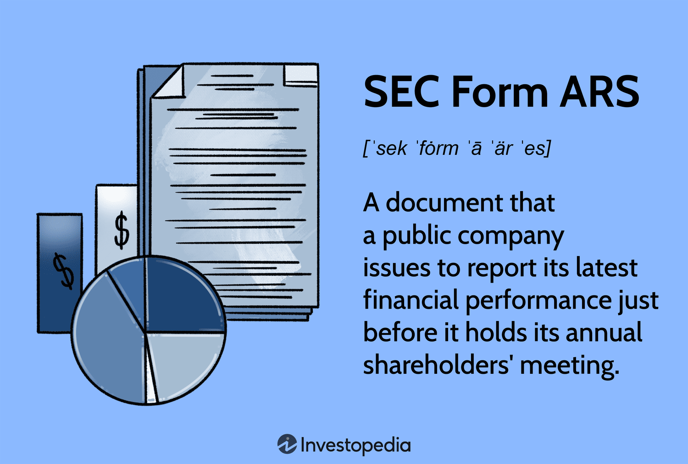

The financial reporting landscape for public companies is a critical component of modern capital markets, serving as a cornerstone for investor decision-making and corporate governance. Public companies are mandated to disclose their financial performance, operational activities, and strategic direction through detailed reports that provide transparency to stakeholders. These reports include financial statements, management discussions, and analyses that are essential for maintaining trust and accountability with shareholders.

Shareholder transparency and effective communication are vital in ensuring that investors have access to accurate and timely information, enabling them to make informed decisions. This transparency is achieved through various reporting tools and frameworks, among which the SEC Form ARS, or Annual Report to Shareholders, plays a significant role. The SEC Form ARS serves as a comprehensive document that offers a detailed account of a company’s annual operations, often paralleling the Form 10-K but with a focus on shareholder communication. It helps bridge the gap between complex financial data and the narrative that shareholders need to understand a company's performance and outlook.



The relationship between SEC Form ARS and Form 10-K is intrinsic, as both documents complement each other in providing a complete financial disclosure. While the Form 10-K is a structured, regulatory filing required by the Securities and Exchange Commission (SEC), presenting extensive financial and operational details, the SEC Form ARS distills this information to make it more accessible to shareholders. It often includes elements such as the income statement, balance sheet, cash flow statement, and management’s discussion, but with additional contextual insights that assist shareholders in grasping the broader business implications.

In the digital age, the nature of annual reports has transformed, driven by technological advancements and changes in regulatory requirements. Companies are increasingly leveraging digital platforms to present their annual reports, incorporating interactive and multimedia elements to enhance shareholder engagement. This evolution allows companies not only to meet their reporting obligations but also to utilize these platforms as a strategic tool for investor relations, thereby expanding their reach and effectiveness in communication.

With these dynamics, the SEC Form ARS remains pivotal, maintaining its relevance as a vehicle for financial transparency and strategic communication in an ever-evolving financial reporting landscape.

## Table of Contents

## What is SEC Form ARS?

SEC Form ARS, or the Annual Report to Shareholders, is a crucial financial document distributed to shareholders, providing an overview of a company's financial health and business activities over the fiscal year. The primary purpose of Form ARS is to ensure transparent communication with shareholders, enabling them to make informed judgments regarding the company's performance and future prospects. Unlike the more detailed SEC Form 10-K, which is filed with the Securities and Exchange Commission (SEC), the ARS is primarily a communication tool designed for the shareholders rather than a regulatory filing.

**Differences between Form ARS and Other Financial Reports**

The key distinction between Form ARS and other financial reports, such as Form 10-K, lies in their intended audiences and content depth. The ARS is a narrative-driven document combining financial performance data with management's commentary and analysis, often accompanied by visually engaging elements like graphs and images. This contrasts with the 10-K, a comprehensive filing required by the SEC that offers a detailed, technical account of the company's financial status, including risk factors, management discussion, and financial statements.

Additionally, quarterly reports like Form 10-Q focus on financial performance within shorter intervals and lack the strategic, broader insights typically found in the ARS. Meanwhile, the proxy statement, another important document, mainly addresses matters of corporate governance and executive compensation rather than financial results.

**Historical Context and Changes in Reporting Requirements**

Historically, the requirement for annual reports stems from the need for increased transparency following the stock market crash of 1929 and the ensuing Great Depression, leading to the establishment of the SEC in 1934. Over the decades, the format and content of annual reports have evolved significantly. Initially, these reports were dense with financial data and sparse on narrative content. However, the modern ARS encompasses a more comprehensive view of the company’s strategic direction, offering insights beyond the numerical data.

As regulatory requirements and market expectations have transformed, so too have the approaches to compiling these reports. Nowadays, with the rise of digital platforms, companies often supplement traditional ARS with interactive and online enhancements, providing shareholders with enhanced data accessibility and engagement opportunities.

**Why Companies Choose to Issue Form ARS**

Companies opt to issue Form ARS primarily to foster transparency and trust with their shareholders. By providing a clear picture of financial performance and strategic direction, companies can strengthen investor relations and potentially boost investor confidence. The ARS serves as a tool for corporate storytelling, allowing companies to highlight achievements, address challenges, and outline future plans within a cohesive narrative framework.

Moreover, an engaging ARS can be instrumental in distinguishing a company from its competitors by showcasing its unique value proposition and market position. It also functions as a valuable marketing document that can attract potential investors and stakeholders.

**Key Takeaways for Investors and Analysts**

For investors and analysts, the ARS offers significant insights into a company’s operational strategies and financial health, supplementing the detailed quantitative data found in other filings like the Form 10-K. Key takeaways from an ARS often include a comprehensive performance overview, management's vision for the company's future, and any significant market developments affecting the business.

Moreover, the report provides a platform for management to communicate directly with shareholders, lending a personal touch to corporate communication. For analysts, this qualitative information can enhance financial analysis and forecasting, providing a deeper understanding of the company’s position and potential growth trajectory.

In summary, SEC Form ARS is an essential tool in the landscape of corporate financial reporting, offering critical insights and narratives that complement the quantitative focus of regulatory filings. Its role in shareholder communication continues to evolve, reflecting broader changes in the regulatory environment and technological advancements.

## Components of an SEC Form ARS

SEC Form ARS, or the Annual Report to Shareholders, is a critical document for public companies, as it provides a comprehensive overview of a company's financial health, operations, and strategic direction. This section outlines the essential components typically included in an SEC Form ARS, highlighting its importance as a tool for effective shareholder communication.

A standard ARS generally comprises detailed financial information, such as the income statement, balance sheet, and cash flow statement. These financial documents offer a quantitative view of the company's performance over the fiscal year. The income statement reflects the company's revenues, expenses, and profits, revealing its profitability. The balance sheet provides a snapshot of the company's assets, liabilities, and shareholder equity, indicating its financial position at a specific point in time. The cash flow statement outlines the company's cash inflows and outflows, offering insights into its [liquidity](/wiki/liquidity-risk-premium) and financial flexibility.

Management commentary and forward-looking statements are also key features of an SEC Form ARS. These sections offer qualitative assessments and projections that provide context to the financial data, helping shareholders understand the company’s strategic initiatives, market conditions, and future prospects. Forward-looking statements may include market expansion plans, product innovation strategies, or anticipated regulatory changes, offering a glimpse into the company's future trajectory.

Supplemental reports within an ARS, such as auditor's comments and governance reviews, provide additional assurances about the accuracy and reliability of the financial statements. Independent auditor's opinions confirm whether the financial reports comply with accounting standards and accurately reflect the company's financial condition. Governance reviews highlight the company's adherence to corporate governance principles, reassuring shareholders about the integrity of its management practices.

To enhance shareholder engagement, companies often incorporate visual and narrative elements into their ARS. Infographics, charts, and photographs can make complex financial information more accessible and engaging, allowing stakeholders to grasp essential insights quickly. Narratives and storytelling techniques further enrich the report, providing a cohesive and compelling portrayal of the company’s achievements and future goals.

Overall, the SEC Form ARS serves as a vital instrument for conveying comprehensive financial and strategic information to shareholders, ensuring transparency and fostering informed decision-making.

## Understanding SEC Form ARS and Form 10-K

SEC Form ARS (Annual Report to Shareholders) and Form 10-K are both integral documents utilized by public companies to disclose financial information to their shareholders and the Securities and Exchange Commission (SEC) in the United States. These reports serve distinct purposes and offer different kinds of information and insights to investors, analysts, and regulators.

### Comparing and Contrasting SEC Form ARS and Form 10-K

**SEC Form ARS:**
- **Purpose and Content:** The ARS is primarily designed for communication with shareholders, offering a comprehensive overview of the company's financial performance, strategic direction, and corporate governance. It typically includes a visually engaging presentation of financial statements, management's discussion and analysis (MD&A), and information about the company’s market conditions and forward-looking strategies.
- **Presentation:** The ARS often includes graphical elements such as charts and infographics that make it accessible and engaging for shareholders who might not have an advanced understanding of financial jargon.

**Form 10-K:**
- **Purpose and Content:** Required by the SEC, the Form 10-K provides a detailed and structured presentation of a company’s financial performance over the fiscal year. The 10-K includes comprehensive financial statements, extensive footnotes, detailed MD&A, risk factors, and information about legal proceedings and management compensation.
- **Regulatory Requirement:** Unlike the ARS, the 10-K is a mandatory filing with the SEC that follows a specific format, ensuring uniformity and completeness of information. This requirement ensures that all relevant financial data is available in a consistent manner, facilitating comparative analysis across different companies.

### Advantages and Limitations of Each Form for Investors

- **Advantages of SEC Form ARS:**
  - **Engagement:** More engaging and easier to read for individual shareholders with its use of narrative and visual elements.
  - **Communication:** Often better communication tools for portraying the company's brand and strategic message.

- **Limitations of SEC Form ARS:**
  - **Detail and Structure:** Less comprehensive and structured compared to the 10-K, potentially lacking in-depth analysis or certain disclosures required by the SEC.

- **Advantages of Form 10-K:**
  - **Detail Orientation:** Offers a detailed and rigorous view of a company's financial health with adherence to SEC guidelines.
  - **Comparability:** Provides standardized information that facilitates benchmarking against peers.

- **Limitations of Form 10-K:**
  - **Complexity:** Can be dense and difficult for lay shareholders to interpret without a financial background.

### The Shift from Standalone ARS to Integrated Reporting with Form 10-K

In recent years, there has been a noticeable shift from standalone ARS documentation to integrated reporting practices where elements of the annual report to shareholders are either incorporated into the Form 10-K or distributed concurrently. This evolution aligns with both technological advancements and the increasing demand for comprehensive yet accessible financial information. Integrated reporting enhances transparency by merging narrative-driven elements from the ARS with the detailed, mandatory information of the Form 10-K.

### The Requirement of Form 10-K by the SEC and Its Comprehensive Nature

The SEC mandates that all publicly traded companies file an annual Form 10-K. This form’s comprehensive nature ensures that investors have access to the most critical and material information about a company’s operations, solvency, and compliance with financial regulations. The Form 10-K serves as a definitive resource for financial analysts and institutional investors, underpinning significant investment decisions and regulatory scrutiny.

### How Companies Leverage These Reports for Investor Relations

Companies leverage both the ARS and the Form 10-K to bolster their investor relations strategies. The ARS can function as a tool for enhancing the company’s narrative and engaging with shareholders through storytelling and visual appeal. On the other hand, by filing the Form 10-K, companies fulfill regulatory obligations and present a factual and measurable profile of their operations, essential for maintaining investor confidence and attracting potential investors.

In conclusion, while the ARS and Form 10-K serve distinct functions, together they offer a complementary view of a company's financial health, strategic direction, and governance, aiding varied stakeholders in making informed decisions.

## The Role of SEC Form ARS in Algo Trading

SEC Form ARS, or the Annual Report to Shareholders, is a critical document for understanding a company's financial health and strategic direction. For [algorithmic trading](/wiki/algorithmic-trading), these documents offer valuable data that can be parsed and analyzed to guide automated trading decisions. Here’s how annual reports like SEC Form ARS play a role in algorithmic trading strategies:

### Analyzing Financial Data from ARS for Automated Trading Decisions

Algorithmic trading relies heavily on quantitative data. The detailed financial information within SEC Form ARS, including income statements, balance sheets, and cash flow statements, provides a rich dataset for algorithmic models. By extracting key financial metrics such as earnings per share (EPS), return on equity (ROE), and debt-to-equity ratio, algorithms can establish patterns or predict future performance.

For instance, using Python, a basic analysis might employ libraries such as `pandas` for data manipulation and `numpy` for numerical operations to extract and analyze historical financial ratios:

```python
import pandas as pd
import numpy as np

# Assume df is a DataFrame containing financial data extracted from ARS
df = pd.read_csv('financial_report.csv')

# Calculate financial ratios
df['ROE'] = df['Net Income'] / df['Shareholder Equity']
df['Debt_to_Equity'] = df['Total Liabilities'] / df['Shareholder Equity']

# Use calculated ratios for decision making
signals = (df['ROE'] > 0.15) & (df['Debt_to_Equity'] < 1.0)
```

### Incorporating Forward-Looking Insights from ARS into Trading Models

Beyond historical data, SEC Form ARS provides management commentary and forward-looking statements which are pivotal for understanding future performance expectations. These qualitative insights can be systematically processed using Natural Language Processing (NLP) techniques. Python's `nltk` or `spaCy` libraries can be utilized to perform sentiment analysis on forward-looking statements, aiding the prediction of future stock movements.

```python
import spacy

nlp = spacy.load('en_core_web_sm')
doc = nlp("We expect revenue to increase significantly with new product launches.")

# Analyze sentiment and keywords
tokens = [token.text for token in doc if token.is_alpha]
positive_words = ['increase', 'growth', 'expansion']

# Simple sentiment analysis
sentiment_score = sum(1 for word in tokens if word in positive_words)

if sentiment_score > 0:
    decision = 'BUY'
else:
    decision = 'SELL'
```

### The Impact of High-Frequency Trading on Financial Disclosures

High-frequency trading ([HFT](/wiki/high-frequency-trading-strategies)) operates on the foundation of receiving and reacting to market information rapidly. Annual reports such as SEC Form ARS, when made publicly available, can influence HFT strategies. Though HFT is traditionally more reliant on real-time data feeds, the periodic insight from ARS impacts broader trading algorithms that support HFT positions with strategic insights.

### Challenges and Opportunities in Using ARS Data for Trading Algorithms

A primary challenge in leveraging ARS for trading is the unstructured nature of the textual data provided in management commentary and note disclosures. Moreover, the periodic nature of these reports means that some data might already be priced into the market by the time of disclosure. 

However, opportunities abound in integrating ARS data with other datasets, like real-time market data or social sentiment analysis, to enhance the robustness of trading strategies. Advanced [machine learning](/wiki/machine-learning) techniques, such as sentiment and event-driven algorithms, can provide a competitive edge by interpreting ARS disclosures alongside live data feeds for more nuanced investment strategies.

In summary, SEC Form ARS is a valuable resource for algorithmic trading, offering quantitative and qualitative insights that, when effectively processed and integrated, can inform and enhance trading algorithms. As technology advances, the ability to harness the power of ARS data will likely continue to grow, offering increasingly sophisticated analytic capabilities.

## Conclusion

SEC Form ARS plays a crucial role in the financial ecosystem for both companies and investors by fostering transparency and open communication. For companies, presenting clear and comprehensive financial information enhances their credibility with stakeholders, offering an authentic view of their operational health and strategic direction. Investors benefit as well, as access to detailed data about a company's performance aids informed decision-making. This underscores the value of SEC Form ARS as a cornerstone for investor confidence.

The convergence of financial transparency and technological advancements is reshaping the trading landscape. Real-time access to financial disclosures, facilitated by digital transformation, allows high-frequency trading systems to parse vast amounts of data rapidly. This immediacy in market response underscores the necessity for precise and timely financial reporting such as the ARS.

Looking to the future, financial reporting and shareholder communication are anticipated to evolve significantly. With advancements in technology, particularly in data analytics and [artificial intelligence](/wiki/ai-artificial-intelligence), reports like the SEC Form ARS will likely become more interactive and tailored, giving investors deeper insights into company performance. Moreover, increased regulatory scrutiny is expected to enhance the accuracy and reliability of these disclosures, ensuring that they meet the demands of a digital economy.

The evolution of regulatory frameworks will continue to influence how financial reports are structured and delivered. As regulators adapt to the changing financial landscape, companies must remain agile in their reporting practices. This evolution carries implications for how investors interpret and use these reports, emphasizing the need to stay informed about regulatory changes to maintain a competitive investment strategy.

Investors are encouraged to utilize the information contained in SEC Form ARS as part of their analytical toolkit. By critically assessing the comprehensive data and forward-looking statements provided, they can glean valuable insights into a company's potential for growth and risk factors. Cultivating a deep understanding of annual reports like the ARS enhances investors' ability to make well-informed decisions, ultimately contributing to a more transparent and efficient financial market.

## References

- U.S. Securities and Exchange Commission. "SEC Form ARS." Available at: https://www.sec.gov/about/forms/sec-forms.htm
- CFA Institute. "Guide to Financial Reporting and Analysis." Available at: https://www.cfainstitute.org/resources/cfa-program/curriculum/financial-reporting-analysis
- Financial Accounting Standards Board (FASB). "Standards, Concepts, and Implementation Guidance." Available at: https://www.fasb.org/home
- Jagolinzer, Alan D., et al. "The Role of Financial Reports in Predicting Stock Returns: Evidence from Form 10-K Filings." Journal of Financial Economics, vol. 121, no. 2, 2016, pp. 310-326.
- McKinsey & Company. "Harnessing the Power of Annual Reports in the Digital Age." Available at: https://www.mckinsey.com/business-functions/strategy-and-corporate-finance/our-insights
- Securities Industry and Financial Markets Association (SIFMA). "Algorithmic Trading: A Primer." Available at: https://www.sifma.org/resources/research/algorithmic-trading/
- Bodie, Zvi, et al. "Investments." 11th Edition, McGraw-Hill Education, 2018. This textbook provides foundational knowledge in financial analysis and investment strategies.
- Recognition and gratitude to financial analysts and regulatory experts who contributed insights for the development of this article. 

## References & Further Reading

[1]: U.S. Securities and Exchange Commission. ["SEC Form ARS."](https://www.sec.gov/submit-filings/forms-index)

[2]: CFA Institute. ["Guide to Financial Reporting and Analysis."](https://www.cfainstitute.org/-/media/documents/study-session/2019_l2_ss05.ashx)

[3]: Financial Accounting Standards Board (FASB). ["Standards, Concepts, and Implementation Guidance."](https://fasb.org/page/PageContent?pageId=/standards/concepts-statements.html)

[4]: Jagolinzer, Alan D., et al. "The Role of Financial Reports in Predicting Stock Returns: Evidence from Form 10-K Filings." Journal of Financial Economics, vol. 121, no. 2, 2016, pp. 310-326.

[5]: McKinsey & Company. ["Harnessing the Power of Annual Reports in the Digital Age."](https://www.mckinsey.com/featured-insights/year-in-review/year-in-charts)

[6]: Securities Industry and Financial Markets Association (SIFMA). ["Algorithmic Trading: A Primer."](https://www.sifma.org/)

[7]: Bodie, Zvi, et al. "Investments." 11th Edition, McGraw-Hill Education, 2018. 

[8]: Jansen, Stefan. ["Machine Learning for Algorithmic Trading."](https://github.com/stefan-jansen/machine-learning-for-trading)

[9]: Chan, Ernest P. ["Quantitative Trading: How to Build Your Own Algorithmic Trading Business."](https://github.com/ftvision/quant_trading_echan_book)