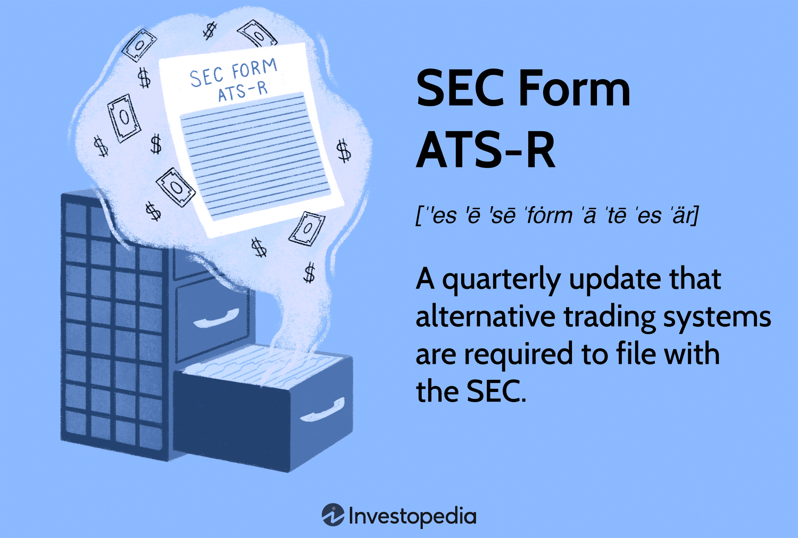

## Table of Contents

## What is SEC Form ATS-R?

SEC Form ATS-R is a form that alternative trading systems (ATS) need to file with the U.S. Securities and Exchange Commission (SEC) every year. An ATS is a platform where people can buy and sell securities, like stocks and bonds, without using a traditional stock exchange. The form helps the SEC keep track of these systems and make sure they are following the rules.

The form asks for information about the ATS's activities over the past year. This includes details about the types of securities traded, the number of trades, and any changes to the system's operations. By requiring this form, the SEC can monitor the ATS and make sure they are operating fairly and transparently.

## Who is required to file SEC Form ATS-R?

Any alternative trading system (ATS) that is registered with the SEC needs to file Form ATS-R every year. An ATS is a kind of platform where people can trade securities, like stocks and bonds, without using a traditional stock exchange. If an ATS is operating in the U.S., it has to follow the SEC's rules, and filing Form ATS-R is one of those rules.

The form helps the SEC keep an eye on what the ATS is doing. It asks for details about the types of securities that were traded on the ATS, how many trades happened, and if there were any changes to how the ATS works. By making ATSs file this form, the SEC can make sure they are working fairly and openly.

## What is the purpose of filing SEC Form ATS-R?

The main reason for filing SEC Form ATS-R is to help the SEC keep an eye on alternative trading systems (ATS). An ATS is a place where people can trade securities like stocks and bonds without using a regular stock exchange. The SEC wants to make sure these systems are following the rules and working fairly. By filing Form ATS-R every year, the ATS has to tell the SEC about what they did over the past year.

The form asks for information about the types of securities traded on the ATS, how many trades happened, and if there were any changes in how the ATS works. This helps the SEC understand what is going on with these systems. It also makes sure that the ATS is being open and honest about their activities. By keeping track of this information, the SEC can make sure that the ATS is operating in a way that is fair for everyone who uses it.

## How often must SEC Form ATS-R be filed?

SEC Form ATS-R needs to be filed once every year by alternative trading systems (ATS). An ATS is a place where people can trade things like stocks and bonds without using a regular stock exchange. The SEC, which is like a big boss that watches over these trades, wants to make sure the ATS is following the rules.

The form helps the SEC keep an eye on what the ATS is doing. It asks for information about what kinds of things were traded, how many trades happened, and if anything changed about how the ATS works. By filing this form every year, the ATS shows the SEC that they are being open and honest about their activities.

## What information is required in SEC Form ATS-R?

SEC Form ATS-R asks for information about what an alternative trading system (ATS) did over the past year. An ATS is a place where people can trade things like stocks and bonds without using a regular stock exchange. The form wants to know about the types of securities that were traded on the ATS. This means they want to know if it was stocks, bonds, or something else. They also want to know how many trades happened. This helps the SEC understand how busy the ATS was.

The form also asks if there were any changes in how the ATS works. This could be changes in the rules they follow or how they do their trading. By asking for this information, the SEC can make sure the ATS is being open and honest about what they are doing. It helps the SEC keep an eye on the ATS and make sure they are following the rules and working fairly for everyone who uses it.

## What are the key components of SEC Form ATS-R?

SEC Form ATS-R asks for details about what an alternative trading system (ATS) did over the past year. An ATS is a place where people can trade things like stocks and bonds without using a regular stock exchange. The form wants to know about the types of securities that were traded on the ATS. This means they want to know if it was stocks, bonds, or something else. They also want to know how many trades happened. This helps the SEC understand how busy the ATS was.

The form also asks if there were any changes in how the ATS works. This could be changes in the rules they follow or how they do their trading. By asking for this information, the SEC can make sure the ATS is being open and honest about what they are doing. It helps the SEC keep an eye on the ATS and make sure they are following the rules and working fairly for everyone who uses it.

## How does SEC Form ATS-R differ from other SEC forms?

SEC Form ATS-R is different from other SEC forms because it is specifically for alternative trading systems (ATS). An ATS is a place where people can trade things like stocks and bonds without using a regular stock exchange. The form asks for information about what the ATS did over the past year, like the types of securities traded, how many trades happened, and if there were any changes in how the ATS works. Other SEC forms might ask for different kinds of information, like financial statements or details about a company's operations, but Form ATS-R is focused on the activities of ATSs.

Unlike other forms that might be filed more often or at different times, SEC Form ATS-R needs to be filed once every year. This annual filing helps the SEC keep an eye on the ATS and make sure they are following the rules and working fairly. Other forms, like quarterly reports or event-specific filings, serve different purposes and have different deadlines. The specific focus on ATS activities and the annual filing requirement make Form ATS-R unique among the various forms that the SEC requires.

## What are the penalties for not filing SEC Form ATS-R on time?

If an alternative trading system (ATS) does not file SEC Form ATS-R on time, they might have to pay a fine. The SEC, which is like a big boss that watches over these trades, can give out these fines. The fines can be different amounts, depending on how late the form is and if it has happened before. The SEC wants to make sure that ATSs follow the rules, so they use fines to make sure everyone does what they are supposed to do.

Besides fines, not filing on time can also make the SEC look at the ATS more closely. They might start an investigation to see if the ATS is doing other things wrong. This can be bad for the ATS because it can hurt their reputation and make it harder for them to do business. So, it is really important for ATSs to file Form ATS-R on time to avoid these problems.

## Can amendments be made to SEC Form ATS-R, and if so, how?

Yes, amendments can be made to SEC Form ATS-R if something needs to be changed or corrected after it has been filed. If an alternative trading system (ATS) finds a mistake or if something important changes, they need to tell the SEC about it. They do this by filing an amendment to the form. The amendment is like a new version of the form that fixes the mistake or adds the new information.

To make an amendment, the ATS needs to fill out a new Form ATS-R with the correct or updated information. They then send this new form to the SEC. It's important for the ATS to do this quickly so that the SEC always has the right information about what the ATS is doing. This helps the SEC keep an eye on the ATS and make sure they are following the rules.

## How does the SEC use the data from Form ATS-R?

The SEC uses the data from Form ATS-R to keep an eye on alternative trading systems (ATS). An ATS is a place where people can trade things like stocks and bonds without using a regular stock exchange. By looking at the information in Form ATS-R, the SEC can see what types of securities were traded on the ATS, how many trades happened, and if there were any changes in how the ATS works. This helps the SEC make sure that the ATS is following the rules and working fairly.

The information from Form ATS-R also helps the SEC spot any problems or unusual activities in the ATS. If they see something that doesn't look right, they can look into it more closely. This helps keep the trading system honest and open. By using the data from Form ATS-R, the SEC can make sure that everyone who uses the ATS is treated fairly and that the system is working the way it should.

## What are the recent changes or updates to SEC Form ATS-R?

The SEC made some updates to Form ATS-R to make it better and more clear. One big change was to make the form ask for more detailed information about what the alternative trading system (ATS) does. Now, the form wants to know more about the types of securities traded and how many trades happened. This helps the SEC keep a closer eye on the ATS and make sure they are following the rules.

Another change was to make it easier for the ATS to fill out the form. The SEC added clearer instructions and made the form easier to understand. This helps the ATS give the right information to the SEC. These updates make sure that the SEC can keep watching the ATS and make sure they are working fairly and openly.

## How can technology assist in the filing of SEC Form ATS-R?

Technology can make filing SEC Form ATS-R easier and faster. Special software and online tools can help alternative trading systems (ATS) fill out the form correctly. These tools can guide the ATS through the form, making sure they don't miss any important parts. They can also check the information to make sure it's right before it's sent to the SEC. This can save time and help avoid mistakes that might lead to fines or more checks from the SEC.

Also, technology can help keep track of all the information the ATS needs for the form. Systems can store data about the types of securities traded and how many trades happened. This makes it easier to pull up the right numbers when it's time to file the form. Using technology can make the whole process smoother and help the ATS stay on top of their yearly filing with the SEC.

## References & Further Reading

[1]: Hendershott, T., Jones, C. M., & Menkveld, A. J. (2011). ["Does Algorithmic Trading Improve Liquidity?"](https://onlinelibrary.wiley.com/doi/full/10.1111/j.1540-6261.2010.01624.x) The Review of Financial Studies, 24(3), 1411-1455.

[2]: Securities and Exchange Commission. ["Regulation of Exchanges and Alternative Trading Systems"](https://www.sec.gov/rules-regulations/1998/12/regulation-exchanges-alternative-trading-systems), SEC Release Nos. 34-40760, File No. S7-12-98.

[3]: Scharfman, J. (2018). ["Alternative Investments: A Primer for Investment Professionals."](https://www.cfainstitute.org/sites/default/files/-/media/documents/book/rf-publication/2018/rf-v2018-n1-1.pdf) CFA Institute Research Foundation.

[4]: Gomber, P., Arndt, B., Lutat, M., & Uhle, T. (2011). ["High-Frequency Trading."](https://papers.ssrn.com/sol3/papers.cfm?abstract_id=1858626) Journal of Business Economics, 81, 270–291.

[5]: Jeria, A. (2020). ["Algorithmic and High-Frequency Trading Strategies on Emerging Markets: A Survey."](https://www.researchgate.net/publication/378548435_Algorithmic_Trading_and_AI_A_Review_of_Strategies_and_Market_Impact) In Applied Informatics and Cybernetics in Intelligent Systems (pp. 224-234). Springer, Cham.