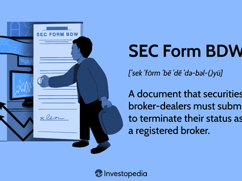

The financial industry is subject to stringent regulations designed to ensure transparency, protect investors, and uphold market integrity. These regulations are vital in maintaining the trust and stability necessary for effective market operations. Broker-dealers, as pivotal entities in the financial markets, facilitate trading and provide liquidity, thereby enabling the smooth functioning of financial exchanges. They act as intermediaries, executing transactions for themselves or on behalf of clients.

In the United States, it is mandatory for broker-dealers to register with the Securities and Exchange Commission (SEC), a process initiated by filing Form BD. This form, known as the Uniform Application for Broker-Dealer Registration, serves as a crucial instrument in the regulatory framework, aiming to ensure that broker-dealers comply with established legal obligations before they commence any brokerage activities. The registration process underscores the commitment of regulatory bodies to maintain a fair and orderly market environment, which is increasingly relevant in today’s rapidly evolving financial landscape.

This article will explore the broker-dealer registration process, examining the significance of SEC Form BD within this framework. Moreover, it will discuss the implications of these regulatory practices on algorithmic trading, a trading method characterized by the use of computer programs to execute trades at high speed and volume. As trading technologies continue to advance, understanding these regulatory processes becomes ever more critical to ensure robust market operations and investor protection.

## Table of Contents

## Understanding Broker-Dealer Registration

Broker-dealers are a fundamental component of the financial markets, engaged in the trading of securities either for their own accounts or on behalf of their clients. These entities or individuals act as intermediaries, facilitating the buying and selling of securities, thus providing liquidity and contributing to the efficient functioning of markets. To ensure that their activities align with regulatory standards and financial laws, broker-dealers operating in the United States are required to register with the Securities and Exchange Commission (SEC) prior to commencing any brokerage activities.

The registration process with the SEC is designed as a protective measure, aiming to ensure that all broker-dealers operate within a clearly defined regulatory framework. This framework is crucial for maintaining transparency, protecting investors from fraudulent activities, and preserving market integrity. Registration involves a stringent vetting process where broker-dealers must submit an array of forms and detailed information.

To successfully register, broker-dealers are often required to provide extensive documentation that showcases their ability to comply with federal securities laws and regulations. This includes financial disclosures, details about the firm’s ownership and management structure, and any past regulatory violations or sanctions. The information provided is scrutinized by the SEC to ascertain the trustworthiness and reliability of the broker-dealer, ensuring that only qualified entities participate in the securities trading landscape.

The registration process not only aims to scrutinize the eligibility of broker-dealers but also serves as a continuous compliance checkpoint. Broker-dealers must regularly update their registration information to reflect any significant changes, ensuring that the SEC has the most current data to evaluate their operations and compliance status.

Thus, SEC registration is a critical step for broker-dealers to adhere to, as it underscores their commitment to operating within ethical and legal boundaries. It is integral to the broader regulatory strategy that safeguards the financial markets and fosters investor confidence.

## The Role of SEC Form BD

SEC Form BD, formally known as the Uniform Application for Broker-Dealer Registration, is essential for broker-dealer registration in the United States. It functions as a comprehensive application form that collects a wide range of information about the broker-dealer applicant. The information includes, but is not limited to, firm structure, management policies, executive details, and past regulatory violations. This ample detail is crucial for assessing the suitability of applicants to engage in market activities.

By requiring exhaustive disclosures, Form BD helps the Securities and Exchange Commission (SEC) and other regulatory entities analyze the applicant’s background, affirming their ability to operate within legal confines. For instance, management policies information ensures that the broker-dealer adheres to industry best practices and maintains robust internal control structures. Executive details provide insights into the leadership team’s capability and experience, indicators of the firm’s operational integrity. Similarly, documented past violations enable regulators to identify any history of non-compliance, potentially affecting the assessment of an applicant's reliability and trustworthiness.

Furthermore, SEC Form BD is instrumental in ongoing supervision of broker-dealers. Once registered, broker-dealers are mandated to keep this information current, allowing the SEC to continuously evaluate their operations and manage any potential risks to market integrity. The central repository for Form BD is within the Financial Industry Regulatory Authority's (FINRA) Central Registration Depository (CRD) system, which plays a crucial role in facilitating this supervisory process.

In essence, Form BD is an indispensable regulatory tool that helps maintain the operational transparency of broker-dealers, aligning their activities with regulatory standards designed to protect the financial markets and its participants.

## Filing and Amending SEC Form BD

Form BD is an essential component of broker-dealer registration, and its filing process is conducted electronically through the Financial Industry Regulatory Authority's (FINRA) Central Registration Depository (CRD) system. This digital platform facilitates the efficient submission and management of registration data, enabling the SEC and other regulatory bodies to access and review the information as required.

Broker-dealers are required to update Form BD to reflect any changes in the information that was initially provided. Such changes may include alterations in the firm's management policies, executive team, or any disclosures of new legal or financial issues. The obligation to amend Form BD extends to any developments that might impact the firm's operations or its capacity to meet regulatory obligations.

Timeliness and accuracy in updating Form BD are paramount to maintaining regulatory compliance. Failure to provide accurate updates can lead to significant penalties, including fines or suspension of operations. The SEC imposes these requirements to ensure that broker-dealers remain transparent and accountable, preserving the integrity of financial markets.

Broker-dealers should implement robust internal systems to track and manage any changes that might necessitate amendments to Form BD. Establishing protocols for regular review and update of registration information can help mitigate the risks associated with non-compliance. Regular training and compliance audits can further ensure that all changes are captured and reported promptly, aligning with SEC expectations.

The electronic nature of the CRD system simplifies the amendment process, providing broker-dealers with a user-friendly interface for managing their registration data. By leveraging this technology, firms can ensure compliance while minimizing administrative burdens, facilitating their participation in the regulated securities market.

## Impact of Financial Regulation on Algorithmic Trading

Algorithmic trading refers to the use of computer algorithms to execute orders in financial markets at speeds and volumes that are typically beyond human capacity. This method leverages mathematical models to make quick decisions, capturing price discrepancies and exploiting market inefficiencies. The rapid increase in [algorithmic trading](/wiki/algorithmic-trading) has accentuated the necessity for stringent financial regulations to ensure market stability and protect investors.

Regulatory bodies, such as the Securities and Exchange Commission (SEC) in the United States, have implemented comprehensive frameworks to oversee the impacts of algorithmic trading on financial markets. These regulations are designed to mitigate the risks associated with high-speed trading, such as systemic failures and market manipulation. The SEC’s regulatory oversight involves several critical components:

1. **Enhanced Market Surveillance**: The SEC uses advanced technological tools to monitor trading activity and detect illegal practices such as spoofing and layering. These tools are essential for identifying irregularities created by algorithmic strategies that could disrupt market equilibrium.

2. **Compliance with SEC Regulations**: Broker-dealers engaged in algorithmic trading must adhere to specific regulatory requirements, including the accurate submission and updating of registration forms. For instance, they must ensure that their SEC Form BD, a registration document for broker-dealers, reflects accurate and current information regarding their trading operations and compliance history.

3. **Risk Management Protocols**: Broker-dealers are required to implement rigorous risk management systems. These protocols are designed to prevent unintended consequences arising from algorithmic errors, often referred to as "rogue algorithms," which could lead to significant financial losses or market disturbances.

4. **Pre-Trade Risk Controls**: Regulations mandate broker-dealers to establish pre-trade risk controls. These include measures such as price and volume thresholds that prevent orders from adversely affecting market prices. Such controls are crucial in maintaining fair and orderly markets in the presence of high-frequency trading activities.

5. **Transparency and Reporting**: Broker-dealers must maintain transparency in their trading activities, facilitating regulatory review and analysis. They are often required to submit detailed reports on their algorithmic trading strategies, including the logic and parameters of their algorithms, to regulatory bodies.

Compliance with these regulatory requirements is not only a legal obligation but a crucial practice for ensuring the sustainable operation of algorithmic trading systems. By adhering to stringent regulations, broker-dealers can help maintain a stable and transparent market environment, which benefits all market participants. The ongoing evolution of financial regulation seeks to balance innovation in trading technologies with the need to safeguard market integrity.

## Conclusion

Financial regulation, epitomized by SEC Form BD, is essential for sustaining market stability and safeguarding investor interests. The registration and regulation of broker-dealers form the backbone of the financial market's integrity, notably amidst the burgeoning landscape of algorithmic trading. Algorithmic trading, which relies heavily on speed and precision, necessitates rigorous oversight to mitigate risks such as systemic errors and market manipulation.

SEC Form BD plays a pivotal role in this regulatory framework by ensuring that broker-dealers operate transparently and possess the requisite credentials and ethics. The data and insights collected through Form BD allow regulatory bodies to monitor activities, enforce compliance, and conduct thorough scrutiny of broker-dealers' operations. This oversight is vital in maintaining trust in financial systems, particularly as trading technologies evolve rapidly.

For broker-dealers, it is imperative to thoroughly grasp the regulatory requirements and continually adapt to changes. This understanding facilitates compliance, thereby avoiding legal repercussions and ensuring their operations align with established legal standards. By adhering to these regulations, broker-dealers contribute to a robust market environment that is both transparent and resilient, fostering healthy financial transactions and protecting market participants.

## References & Further Reading

[1]: ["Guide to Broker-Dealer Registration"](https://www.sec.gov/about/divisions-offices/division-trading-markets/division-trading-markets-compliance-guides/guide-broker-dealer-registration) by the U.S. Securities and Exchange Commission (SEC)

[2]: ["Form BD - Uniform Application for Broker-Dealer Registration"](https://www.sec.gov/about/forms/formbd.pdf) by the Financial Industry Regulatory Authority (FINRA)

[3]: Skinner, C., & Higgins, M. (2020). ["The Evolution of Algorithmic Trading: From First Steps to State-of-the-Art."](https://www.tandfonline.com/doi/full/10.1080/03004430.2020.1855155) CFA Institute

[4]: Hasbrouck, J., & Saar, G. (2013). ["Low-latency trading."](https://www.sciencedirect.com/science/article/abs/pii/S1386418113000165) The Review of Financial Studies

[5]: Narang, R. (2009). ["Inside the Black Box: The Simple Truth About Quantitative Trading"](https://onlinelibrary.wiley.com/doi/book/10.1002/9781118267738) by Rishi K. Narang