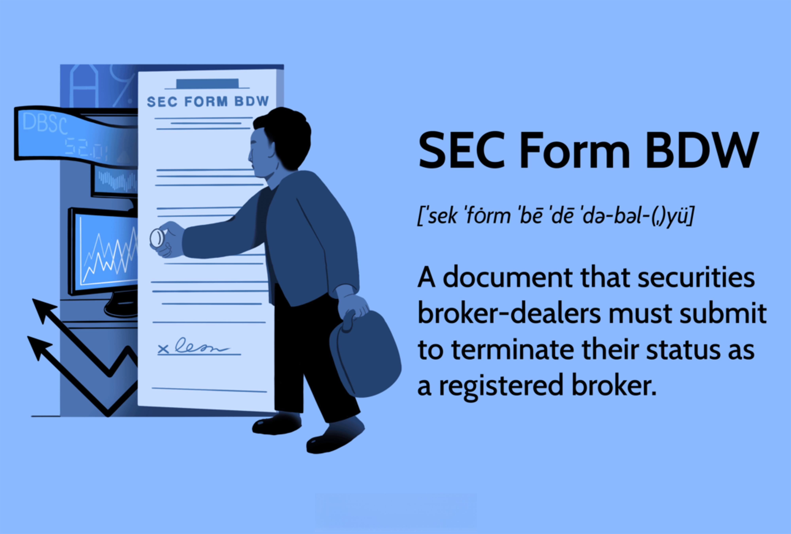

Understanding the intricacies of the financial market involves comprehending various regulatory forms and processes. Broker-dealers, who act as intermediaries facilitating the buying and selling of securities, need to navigate a complex regulatory landscape to maintain compliance and protect their businesses. Among these regulations, the SEC Form BDW is a pivotal document for broker-dealers who wish to cease operations and exit the market, either partially or entirely. This mandatory form, filed with the Securities and Exchange Commission (SEC), facilitates the orderly withdrawal of a broker-dealer's registration.

In recent years, the trading environment has evolved significantly with the rise of algorithmic trading. Algorithmic trading uses computer programs to execute orders at speeds and frequencies that a human trader would find difficult to achieve. This modern trading method has introduced new challenges and considerations for broker-dealers, particularly regarding regulatory compliance and the procedures for withdrawing from market participation.

This article provides a comprehensive guide to SEC Form BDW and its implications for traders and firms. By examining the withdrawal process for broker-dealers, especially those involved in algorithmic trading, we aim to clarify the complexities surrounding this form and the critical role it plays in ensuring a smooth transition out of the market. Moreover, the article emphasizes the importance of regulatory compliance within the algorithmic trading environment, highlighting the need for broker-dealers to stay informed about regulatory requirements to mitigate risks effectively.

As the financial markets continue to evolve with technological advancements, broker-dealers must remain vigilant in their understanding of regulatory processes like SEC Form BDW. This awareness is essential for maintaining market integrity and ensuring that transitions—whether due to complete business cessation or jurisdiction-specific withdrawals—are conducted in a compliant and efficient manner.

## Table of Contents

## What is SEC Form BDW?

SEC Form BDW is a pivotal document required for broker-dealers seeking to terminate their registration with the Securities and Exchange Commission (SEC). The form's primary function is to ensure that the cessation of a broker-dealer's activities is conducted in a manner that safeguards the public interest. It involves the formal process by which a broker-dealer withdraws its SEC registration, encompassing both full and partial withdrawals.

A full withdrawal signifies the complete termination of the broker-dealer's business operations, implying that the firm will cease all activities related to brokerage and dealing in securities. Conversely, a partial withdrawal allows a broker-dealer to terminate its registration in specific jurisdictions while continuing operations in others. This flexibility offers firms the ability to strategically navigate their market presence and regulatory obligations.

The importance of SEC Form BDW extends beyond its immediate function as a termination tool. It ensures that the withdrawal process is transparent and aligns with legal and regulatory standards. Broker-dealers must provide comprehensive information about their business cessation plans and verify that all customer and financial obligations are adequately addressed prior to withdrawing.

Understanding the intricacies of Form BDW is essential for broker-dealers to maintain compliance with securities regulations. The form requires meticulous attention to detail, as inaccuracies or incomplete information could lead to regulatory scrutiny or potential penalties. Thus, it serves not only as a procedural requirement but also as a checkpoint for ensuring the orderly wind-down of broker-dealer operations.

By adhering to the structured guidelines of SEC Form BDW, broker-dealers can ensure that their [exit](/wiki/exit-strategy) from the securities market is in compliance with the necessary legal frameworks, thereby protecting the interests of both the firm and its clientele.

## The Role of FINRA and the Central Registration Depository (CRD)

The Financial Industry Regulatory Authority (FINRA) plays a pivotal role in the regulation and oversight of broker-dealers within the securities market. As an essential component of this framework, SEC Form BDW is submitted electronically through the Central Registration Depository (CRD) system, which FINRA administers. This process is crucial in facilitating the termination of a broker-dealer's registration, ensuring that it aligns with regulatory standards and public interest considerations.

Before a broker-dealer can proceed with filing Form BDW, FINRA requires that any inaccuracies or outdated information in Form BD, which details the broker-dealer's registration, be corrected. This prerequisite underscores the importance of maintaining accurate records, as errors can lead to compliance issues or delays in the withdrawal process. The CRD system acts as a centralized repository for all broker-dealer registration details, making it easy to manage and update the necessary information efficiently.

The utilization of the CRD system streamlines the procedural steps involved in withdrawing a broker-dealer's registration. By centralizing the data management, the CRD enhances transparency and simplifies the verification of compliance with both SEC regulations and state-specific requirements. This integration is particularly beneficial for jurisdictions with unique filing procedures, as it avoids the need for redundant data submissions and potential discrepancies across different regulatory bodies.

The collaboration between FINRA, the CRD, and broker-dealers is vital for ensuring a seamless exit from the market. FINRA's oversight guarantees that the entire process is conducted in an orderly manner, minimizing risks associated with regulatory non-compliance or operational disruptions. Moreover, the electronic nature of the CRD system significantly reduces the administrative burden on broker-dealers, allowing them to focus on strategic decisions during their market exit.

In summary, the CRD serves as a critical tool in managing broker-dealer withdrawals, enabling a smooth and effective transition. By adhering to FINRA's requirements and utilizing the CRD for accurate data management, broker-dealers can ensure their withdrawal process is compliant and efficient.

## Algorithmic Trading and Broker-Dealer Withdrawals

Algorithmic trading has brought significant changes to the broker-dealer industry, enabling rapid and efficient trade execution but also presenting new regulatory challenges. With the emergence of complex trading algorithms, firms face increased scrutiny from regulatory bodies such as the Securities and Exchange Commission (SEC) and the Financial Industry Regulatory Authority (FINRA). These challenges become particularly pertinent when a broker-dealer decides to exit the market, necessitating a thorough understanding of SEC Form BDW.

Regulatory compliance in [algorithmic trading](/wiki/algorithmic-trading) is more stringent due to the potential risks associated with high-frequency trading activities. The automation and speed involved can sometimes lead to market disruptions, as seen in events like the 2010 Flash Crash. Therefore, when broker-dealers engaged in algorithmic trading consider withdrawing their registration, they must conduct this transition meticulously. SEC Form BDW becomes a tool not just for withdrawing but for ensuring that this exit does not negatively impact market integrity.

The automation in algorithmic trading requires broker-dealers to maintain comprehensive records of their trading strategies and transactions. This data becomes crucial when filling SEC Form BDW because discrepancies might trigger investigations or penalties. Broker-dealers must systematically document decision processes and algorithm adjustments, ensuring this information is accurate and up to date before withdrawal. For instance, compliance reports highlighting how algorithmic strategies comply with regulatory frameworks help ensure that the cessation of operations is smooth and compliant.

Several case studies illustrate the complexities faced by broker-dealers involved in algorithmic trading when filing for withdrawal. For example, a firm specializing in high-frequency trading found that inaccuracies in algorithm documentation delayed their exit process, requiring additional clarification to regulatory authorities. Proper preparation and thorough documentation were crucial in resolving these issues.

Ensuring a seamless transition also involves anticipating how cessation affects existing trading algorithms. Broker-dealers need to terminate or adjust their algorithms effectively, which may include deactivating trading software or transferring asset management functions in compliance with legal frameworks. Failure to appropriately manage these elements during withdrawal could result in continued unintended market participation, creating operational risks and potential regulatory breaches.

In conclusion, algorithmic trading introduces unique challenges for broker-dealers intending to withdraw from market operations. SEC Form BDW serves as a critical regulatory tool in this context, requiring detailed and accurate reporting to ensure compliance. Effective preparation, including accurate documentation and strategic cessation planning, is essential to navigating the withdrawal process successfully. As algorithmic trading evolves, broker-dealers must remain vigilant and adapt to emerging regulatory requirements to maintain a compliant exit strategy.

## Steps to File SEC Form BDW

Filing SEC Form BDW requires careful attention to detail and adherence to regulatory guidelines to ensure a smooth and compliant withdrawal process for broker-dealers. The following steps outline the necessary procedures and considerations:

1. **Verify Broker-Dealer Information**: Before initiating the filing process, broker-dealers must ensure that all information contained within the Form BD, which is the registration form for broker-dealers, is accurate and current. This is crucial as any discrepancies could lead to complications or delays in the withdrawal process.

2. **Electronic Submission via CRD**: The Central Registration Depository (CRD) is the system through which Form BDW is electronically submitted. Broker-dealers should access the CRD system to file their withdrawal form, ensuring they comply with both SEC regulations and any pertinent local jurisdictional requirements. This electronic submission facilitates efficient processing and record-keeping.

3. **Address State and SRO Requirements**: Different states and self-regulatory organizations (SROs) may have unique filing procedures or additional requirements for broker-dealers planning to withdraw. It is important to check for any specific guidelines or forms required by these entities to avoid potential compliance issues.

4. **Full and Partial Withdrawals**: When filing Form BDW, broker-dealers must distinguish between full and partial withdrawals. A full withdrawal entails a complete cessation of operations and deregistration, while a partial withdrawal might involve exiting specific jurisdictions or eliminating certain activities. The appropriate documents and supplementary information should accompany the form, which may differ between full and partial withdrawals.

5. **Submit Necessary Documentation**: Depending on the nature of the withdrawal, additional documents may be required alongside Form BDW. These could include financial statements, notices to clients, or other regulatory forms that substantiate the withdrawal and assure compliance with all relevant legal obligations.

6. **Practical Tips and Common Pitfalls**:
   - **Thorough Review**: Prior to submission, conduct a meticulous review of all forms and documents to confirm accuracy and completeness.
   - **Timely Submission**: Ensure that all filings are submitted within the required timelines to prevent any regulatory infractions.
   - **Clear Communication**: Maintain transparent communication with regulatory bodies, such as the SEC and FINRA, to address any questions or concerns promptly.
   - **Avoid Assumptions**: Do not presume that procedures are uniform across all jurisdictions or SROs; carefully research each applicable entity's requirements.

By following these steps, broker-dealers can effectively navigate the process of filing SEC Form BDW, ensuring that their withdrawal from the market is both compliant and congenial to regulatory standards.

## Conclusion

SEC Form BDW plays a pivotal role in the lifecycle of a broker-dealer, particularly in the dynamic sphere of algorithmic trading. Effectively navigating the process of withdrawal through this form is paramount for ensuring compliance with regulatory standards, mitigating risks, and maintaining a firm’s integrity as it exits the market. The complexity of this procedure emphasizes the importance of precise execution and awareness.

Collaboration between broker-dealers, the Financial Industry Regulatory Authority (FINRA), and the Securities and Exchange Commission (SEC) is crucial in safeguarding market integrity. This triad helps streamline the withdrawal process, ensuring that broker-dealers meet all necessary regulatory obligations. Such cooperation reflects the broader ethos of transparency and accountability, elements that are key to sustaining investor confidence and the stability of financial markets.

The expansion of algorithmic trading introduces new challenges and opportunities that broker-dealers must navigate with caution. As algorithmic trading continues to transform financial markets, the regulatory environment will inevitably evolve. This progression necessitates an increased awareness and understanding of essential documents like the SEC Form BDW. Staying informed about regulatory changes and their implications is integral to managing a successful exit strategy.

This article functions as a guide for broker-dealers, aiding them in the complex task of market withdrawal by outlining the necessary steps to comply with regulatory demands. By following this framework, firms can ensure a seamless and compliant transition, mitigating risks associated with their exit strategy. Such preparedness and attention to regulatory detail are indispensable in today's fast-paced trading environment.

## References & Further Reading

[1]: Sarkar, D.G., & Singh, H. (2021). ["The Regulation of Algorithmic Trading in Financial Markets."](https://onlinelibrary.wiley.com/doi/10.1002/hsr2.345) ResearchGate.

[2]: Securities and Exchange Commission. ["Guide to Broker-Dealer Registration."](https://www.sec.gov/about/divisions-offices/division-trading-markets/division-trading-markets-compliance-guides/guide-broker-dealer-registration) SEC.gov.

[3]: Financial Industry Regulatory Authority. ["Broker-Dealer Withdrawal (Form BDW)."](https://www.finra.org/registration-exams-ce/broker-dealers/registration-forms/form-bdw) FINRA.org.

[4]: Hasbrouck, J., & Saar, G. (2013). ["Low-latency Trading."](https://www.sciencedirect.com/science/article/abs/pii/S1386418113000165) The Review of Financial Studies, 26(9), 3281-3330.

[5]: Aldridge, I. (2013). ["High-Frequency Trading: A Practical Guide to Algorithmic Strategies and Trading Systems."](https://www.amazon.com/High-Frequency-Trading-Practical-Algorithmic-Strategies/dp/1118343506) Wiley.