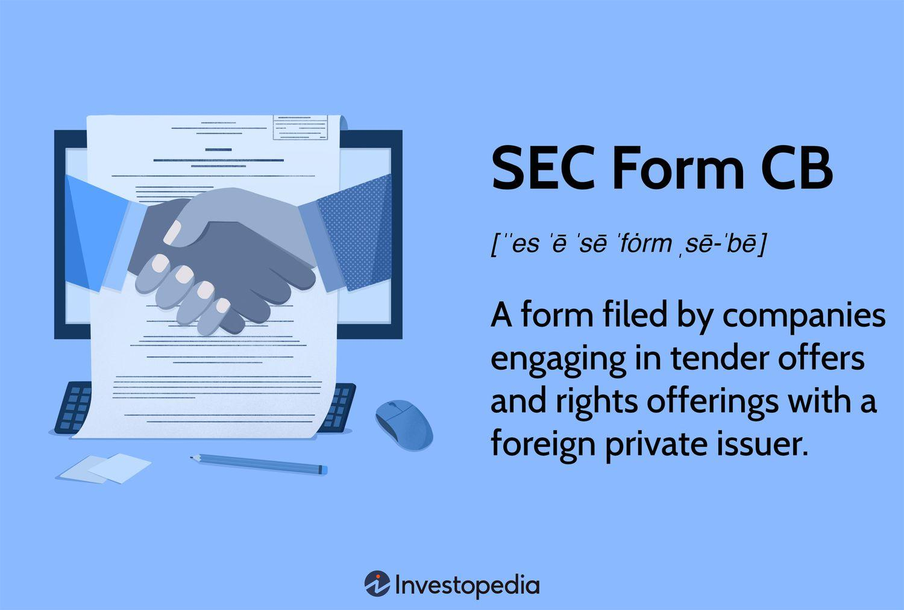

## Table of Contents

## What is SEC Form CB?

SEC Form CB is a document that companies must file with the U.S. Securities and Exchange Commission (SEC) when they want to make a significant change to their business structure. This form is used for reporting events like mergers, acquisitions, or other types of corporate reorganizations. By filing Form CB, a company lets the public and investors know about these changes, which helps maintain transparency in the market.

The form requires companies to provide detailed information about the proposed change, including the reasons for the change and how it will affect the company and its shareholders. This information helps investors make informed decisions about whether to buy, sell, or hold their shares. Filing Form CB is an important step in the process of corporate restructuring, ensuring that all relevant parties are aware of the changes and can respond accordingly.

## Why was SEC Form CB created?

SEC Form CB was created to help keep the stock market fair and open. When a company wants to make big changes like merging with another company or reorganizing its structure, it has to tell everyone. This is important because these changes can affect the value of the company's stock and the decisions that investors make. By requiring companies to file Form CB, the SEC makes sure that everyone has the same information at the same time.

This form helps investors understand what is happening with the company they have invested in. It gives them details about why the company is making changes and how those changes might impact the company's future. When investors have this information, they can decide if they want to keep their shares, sell them, or buy more. This transparency helps keep the market honest and helps investors feel more confident about their investments.

## Who needs to file SEC Form CB?

Companies need to file SEC Form CB when they want to make big changes to their business. This includes things like merging with another company, buying another business, or reorganizing how the company is set up. The form helps the company tell everyone about these changes.

Filing Form CB is important because it keeps things fair for everyone who might want to buy or sell the company's stock. By sharing this information, the company makes sure that investors know what is happening and can make good choices about their investments.

## When should SEC Form CB be filed?

SEC Form CB should be filed when a company wants to make big changes like merging with another company, buying another business, or reorganizing its structure. The company needs to file this form before the change happens. This way, everyone knows about the change before it takes place.

Filing Form CB on time is important because it helps keep things fair for everyone who might want to buy or sell the company's stock. By sharing this information early, the company makes sure that investors know what is happening and can make good choices about their investments.

## What information is required on SEC Form CB?

SEC Form CB requires companies to give details about the big changes they want to make. This includes saying what kind of change it is, like a merger or reorganization. The company also needs to explain why they want to make this change and how it might affect the company and its shareholders. They have to include any important agreements or documents that are part of the change.

The form also asks for information about when the change will happen and how it will be done. Companies need to tell if they need any special approvals from shareholders or regulators. This helps everyone understand the timeline and steps involved in the change. By giving all this information, the company makes sure that investors know what is going on and can make good decisions about their investments.

## How does one file SEC Form CB?

To file SEC Form CB, a company needs to go to the SEC's website and use their Electronic Data Gathering, Analysis, and Retrieval (EDGAR) system. First, the company has to sign up for an EDGAR account if they don't already have one. Once they have an account, they can log in and find the section where they can file Form CB. They need to fill out all the required information on the form, like what kind of change they are making, why they are making it, and how it will affect the company and its shareholders.

After filling out the form, the company needs to attach any important documents or agreements that are part of the change. They then submit the form through the EDGAR system. The SEC will review the filing to make sure it has all the needed information. Once the SEC accepts the filing, the information becomes public, and everyone can see it on the SEC's website. This helps keep things fair and open for everyone who might want to buy or sell the company's stock.

## What are the common mistakes to avoid when filing SEC Form CB?

When filing SEC Form CB, companies often make mistakes by not giving all the needed information. It's important to explain clearly what change is happening, like a merger or reorganization, and why it's happening. Companies should also say how the change might affect the company and its shareholders. If they miss any of this information, the SEC might not accept the filing, and it could cause problems later.

Another common mistake is not attaching important documents or agreements that are part of the change. These documents help everyone understand the details of what's happening. If a company forgets to include them, it can make the filing incomplete. Also, companies should double-check the timeline and steps involved in the change to make sure everything is correct. This helps avoid delays and keeps things fair for investors.

## How does SEC Form CB relate to other SEC filings?

SEC Form CB is one part of a bigger picture when it comes to SEC filings. It is used when a company wants to make big changes like merging with another company or reorganizing its structure. This form helps the company tell everyone about these changes before they happen. It works together with other forms like Form 8-K, which companies use to report important events that happen after the changes are made. Form 8-K helps keep investors updated on what's happening after the big change.

Form CB also connects with other filings like Schedule 13D or 13G, which are used when someone buys a lot of a company's stock. These forms help keep track of who owns big parts of the company, which can be important during big changes. By filing Form CB along with these other forms, companies make sure that everyone knows about the changes and how they might affect the company and its shareholders. This helps keep things fair and open for everyone in the market.

## What are the consequences of not filing SEC Form CB on time?

If a company does not file SEC Form CB on time, it can face big problems. The SEC might fine the company for not following the rules. This can hurt the company's reputation and make investors lose trust in it. They might think the company is not being honest or open about what it is doing.

Also, not filing on time can delay the big changes the company wants to make. If the SEC does not know about the changes, it can't approve them. This can slow down the company's plans and cause it to lose money or miss out on good opportunities. It's really important for companies to file Form CB on time to keep things fair and smooth for everyone involved.

## Can SEC Form CB be amended, and if so, how?

Yes, SEC Form CB can be amended if a company needs to change or update the information they filed. If something important changes after the company files the form, they need to tell the SEC about it. They do this by filing an amendment to Form CB. This helps keep everyone informed about what's happening with the company's big changes.

To amend Form CB, the company goes back to the SEC's EDGAR system. They log into their account and find the section where they can file amendments. They fill out the new information or changes and submit it through the system. The SEC will review the amendment to make sure it has all the needed information. Once it's accepted, the updated information becomes public, helping investors stay up to date.

## What recent changes have been made to SEC Form CB?

Recently, the SEC made some changes to Form CB to make it easier for companies to use and for investors to understand. One big change is that companies now have to give more details about why they are making the big change and how it will affect the company and its shareholders. This helps everyone know more about what is happening and why.

Another change is that the SEC now wants companies to file Form CB faster. They want the information to be public sooner so that investors can make good choices about their investments. These changes help keep the market fair and open for everyone.

## How does SEC Form CB impact corporate governance and transparency?

SEC Form CB helps make corporate governance better by making companies tell everyone about big changes like mergers or reorganizations. When a company has to file this form, it has to explain why it is making the change and how it will affect the company and its shareholders. This makes the company think carefully about its decisions and be more open about what it is doing. It also helps the people who run the company be more responsible because they know everyone is watching.

This form also makes things more transparent for investors. When a company files Form CB, it gives investors important information about what is happening with the company. This helps investors decide if they want to buy, sell, or keep their shares. By making sure everyone has the same information at the same time, Form CB helps keep the market fair and open. This way, investors can trust that the companies they invest in are being honest and clear about their big changes.

## References & Further Reading

[1]: Anabtawi, I. H. (2020). ["Cross-Border Tender Offers and Other Business Combinations: Regulation & Compliance."](https://www.sec.gov/resources-small-businesses/small-business-compliance-guides/revisions-cross-border-tender-offer-exchange-offer-rights-offerings-business-combination-rules) Bloomberg BNA.

[2]: SEC. (2021). ["Form CB: Tender Offer Statement Pursuant to Rule 13e-4(h)(8) or Regulation 14D."](https://www.secrant.com/rant/sec-football/mighty-b1g-is-too-fast-and-physical-for-weak-sec/116903882/page-2/) U.S. Securities and Exchange Commission.

[3]: SEC. (2021). ["EDGAR Filer Manual."](https://www.sec.gov/submit-filings/edgar-filer-manual) U.S. Securities and Exchange Commission.

[4]: De Prado, M. L. (2018). ["Advances in Financial Machine Learning."](https://www.amazon.com/Advances-Financial-Machine-Learning-Marcos/dp/1119482089) Wiley.

[5]: Chan, E. (2009). ["Quantitative Trading: How to Build Your Own Algorithmic Trading Business."](https://github.com/ftvision/quant_trading_echan_book) Wiley.

[6]: Hull, J. (2017). ["Options, Futures, and Other Derivatives."](https://elibrary.pearson.de/book/99.150005/9781292212920) Pearson.

[7]: Fabozzi, F. J., Focardi, S. M., & Kolm, P. N. (2010). ["Quantitative Equity Investing: Techniques and Strategies."](https://www.semanticscholar.org/paper/Quantitative-Equity-Investing%3A-Techniques-and-Fabozzi-Focardi/1c49a2a53919f7e65cb96f16691b8ff726fd3cd7) Wiley.