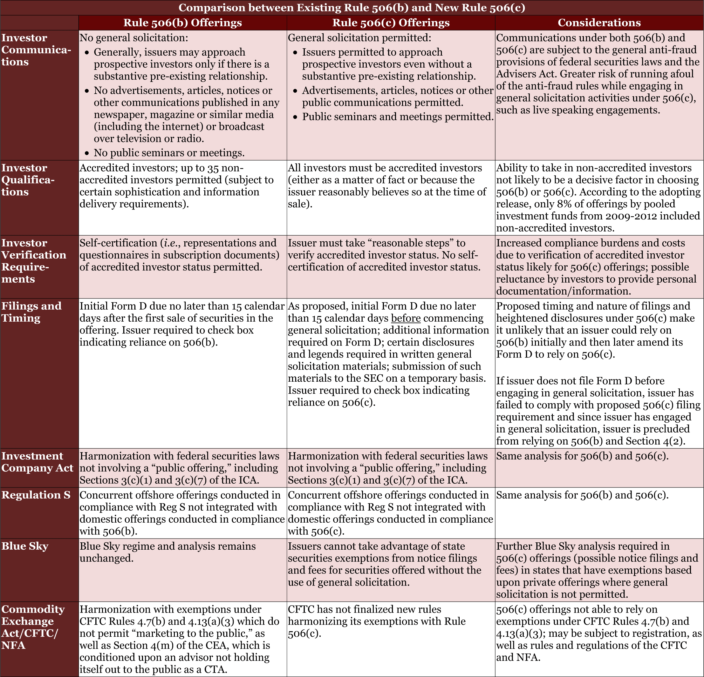

## Table of Contents

## What is SEC Form D?

SEC Form D is a document that companies file with the U.S. Securities and Exchange Commission (SEC) when they want to raise money by selling securities without having to register them. This form is used for what's called a "private placement," which means the company is selling its securities to a smaller group of investors, rather than offering them to the public.

Filing Form D is important because it lets the SEC know about the private offering. It includes basic information about the company and the securities being offered. By filing this form, the company can take advantage of certain exemptions from the usual registration requirements, making it easier and quicker to raise funds.

## Why is SEC Form D important for companies?

SEC Form D is important for companies because it allows them to raise money more easily. When a company wants to sell securities like stocks or bonds, they usually have to go through a long and expensive process called registration. But by filing Form D, a company can use a special rule that lets them skip this registration process. This makes it faster and cheaper for the company to get the money they need to grow or start their business.

Another reason Form D is important is that it helps companies keep their offerings private. Instead of selling securities to the general public, they can offer them to a smaller, select group of investors. This can be useful for companies that want to keep their financial plans confidential or don't want to deal with the publicity that comes with a public offering. By filing Form D, the company can legally raise money in this private way, as long as they follow the rules set by the SEC.

## Who needs to file SEC Form D?

Companies need to file SEC Form D when they want to sell securities like stocks or bonds to raise money without going through the full registration process. This is called a private placement. By filing Form D, a company can use a special rule that lets them skip the long and expensive registration process. This makes it easier and faster for them to get the money they need to grow or start their business.

Any company that wants to take advantage of this special rule must file Form D with the SEC. This includes startups, small businesses, and even larger companies that are looking to raise funds privately. The form lets the SEC know about the private offering and includes basic information about the company and the securities being offered. By following this rule, companies can legally raise money from a smaller group of investors without having to offer their securities to the public.

## What are the basic requirements for filing SEC Form D?

To file SEC Form D, a company needs to provide basic information about itself and the securities it is offering. This includes the name and address of the company, the type of securities being sold, the total amount of money the company wants to raise, and the date when the first sale of the securities will happen. The company also needs to list the people who are in charge of the offering, like the executives or directors.

The form must be filed with the SEC no later than 15 days after the first sale of the securities. It's important to file on time because if a company doesn't, they could face penalties or lose the special rule that lets them skip the full registration process. The form can be filed online through the SEC's website, which makes it easier and quicker for companies to submit their information.

## How does one file SEC Form D?

To file SEC Form D, you need to go to the SEC's website and use their online filing system called EDGAR. First, you have to create an account on EDGAR if you don't already have one. Once you have an account, you can log in and start filling out Form D. You'll need to enter basic information about your company, like its name and address, and details about the securities you're offering, such as the type of securities, how much money you want to raise, and the date of the first sale.

After you've filled out all the required information, you can submit the form through the EDGAR system. It's important to file Form D within 15 days after the first sale of your securities. If you don't file on time, you could face penalties or lose the special rule that lets you skip the full registration process. Once you've submitted the form, you'll get a confirmation from the SEC, and your Form D filing will be available to the public on the SEC's website.

## What are the deadlines for filing SEC Form D?

You need to file SEC Form D within 15 days after you first sell your securities. This is important because if you don't file on time, you could get in trouble or lose the special rule that lets you skip the full registration process.

Once you've filled out all the information on the form, you can submit it through the SEC's online system called EDGAR. After you submit it, you'll get a confirmation from the SEC, and your Form D filing will be available for anyone to see on their website.

## What information is required on SEC Form D?

When you fill out SEC Form D, you need to include basic information about your company and the securities you're selling. This includes the name and address of your company, the type of securities you're offering, like stocks or bonds, and the total amount of money you want to raise. You also need to tell the SEC when you plan to make the first sale of these securities.

In addition to the company and securities details, you have to list the people who are in charge of the offering. These are usually the executives or directors of your company. All this information helps the SEC keep track of your private placement and make sure you're following the rules that let you skip the full registration process.

## How does SEC Form D relate to Regulation D offerings?

SEC Form D is closely related to Regulation D offerings because it's the form companies need to file when they want to use Regulation D to raise money. Regulation D is a set of rules that lets companies sell securities to investors without going through the full registration process. By filing Form D, a company tells the SEC about their private placement and follows the rules that let them skip the long and expensive registration process.

When a company decides to use Regulation D, they need to file Form D within 15 days after they first sell their securities. This form includes basic information about the company, the type of securities they're offering, how much money they want to raise, and who is in charge of the offering. By doing this, the company can legally raise money from a smaller group of investors without having to offer their securities to the public.

## What are the common mistakes to avoid when filing SEC Form D?

When filing SEC Form D, it's important to make sure you get all the details right. A common mistake is missing the deadline. You need to file the form within 15 days after you first sell your securities. If you don't, you could face penalties or lose the special rule that lets you skip the full registration process. Another mistake is not providing all the required information. You need to include the name and address of your company, the type of securities you're offering, how much money you want to raise, and the date of the first sale. Missing any of these details can cause problems with your filing.

Another common error is not listing the people who are in charge of the offering, like the executives or directors of your company. The SEC needs to know who these people are to keep track of your private placement. Also, make sure you use the SEC's online system called EDGAR correctly. If you don't file the form properly through EDGAR, your filing might not be accepted. By avoiding these mistakes, you can make sure your SEC Form D filing goes smoothly and helps you raise money the way you planned.

## What are the consequences of not filing SEC Form D on time?

If you don't file SEC Form D on time, you could get into trouble. The SEC says you need to file this form within 15 days after you first sell your securities. If you miss this deadline, the SEC might give you a penalty. This could mean you have to pay a fine, which can be expensive. Also, if you don't file on time, you might lose the special rule that lets you skip the full registration process. This rule is important because it makes it easier and faster for you to raise money.

Losing the special rule means you would have to go through the long and expensive process of registering your securities with the SEC. This can slow down your plans to raise money and make it harder for your company to grow. So, it's really important to file SEC Form D on time to avoid these problems and keep your private placement going smoothly.

## How can amendments be made to SEC Form D?

If you need to change something on your SEC Form D, you can file an amendment. This is important if any of the information you first gave changes, like the total amount of money you want to raise or the people in charge of the offering. To file an amendment, you go back to the SEC's online system called EDGAR, log in to your account, and find the option to amend your Form D. You then update the information that needs to change and submit the amendment.

It's good to file amendments quickly because it keeps your information up to date with the SEC. If you don't file an amendment when you should, you could get in trouble or lose the special rule that lets you skip the full registration process. So, always make sure to keep your Form D accurate by filing amendments whenever something changes.

## What advanced strategies can be used to optimize the use of SEC Form D in business planning?

Using SEC Form D smartly can really help a business grow. One good strategy is to plan your private placement carefully. Before you even file Form D, think about who you want to invest in your company. Pick investors who not only have money but also understand your business and can help it grow. Also, think about how much money you really need. It's better to ask for a realistic amount that you can use well, rather than a big number that might scare investors away. By planning this way, you can make sure your Form D filing helps you get the right investors and the right amount of money.

Another strategy is to use Form D to keep your business flexible. Since you can file amendments to Form D if things change, you can adjust your plans as your business grows. For example, if you find out you need more money later, you can file an amendment to increase the amount you're raising. Or, if you bring in new executives or directors, you can update the form to show that. By keeping your Form D up to date, you show investors that you're on top of things and ready to adapt. This can make them more confident in your company and more likely to invest.

## References & Further Reading

[1]: Securities and Exchange Commission. ["Regulation D Offerings"](https://www.investor.gov/introduction-investing/investing-basics/glossary/regulation-d-offerings) on the official SEC website.

[2]: Goldstein, M. A., Kumar, P., & Graves, F. C. (2007). ["Computerized and High-Frequency Trading."](https://papers.ssrn.com/sol3/papers.cfm?abstract_id=2379842) CFA Institute.

[3]: Lopez de Prado, M. (2018). ["Advances in Financial Machine Learning."](https://www.amazon.com/Advances-Financial-Machine-Learning-Marcos/dp/1119482089) Wiley.

[4]: Securities and Exchange Commission. ["Guide to Regulation D"](https://www.dealmaker.tech/content/the-definitive-guide-to-regulation-d-reg-d-raising-capital-privately-and-efficiently) on the official SEC website.

[5]: Alvino, A., & Klinger, L. (2020). ["Understanding Form D."](https://pure.uvt.nl/ws/portalfiles/portal/45853527/A2020_62507.pdf) HG.org.

[6]: Chan, E. P. (2009). ["Quantitative Trading: How to Build Your Own Algorithmic Trading Business."](https://github.com/ftvision/quant_trading_echan_book) Wiley. 

[7]: Ernst & Young. (2019). ["Five Key Considerations for Private Placements Under Regulation D."](https://www.ey.com/en_jp/newsroom/2019/11/ey-japan-news-release-2019-11-26-01-en)