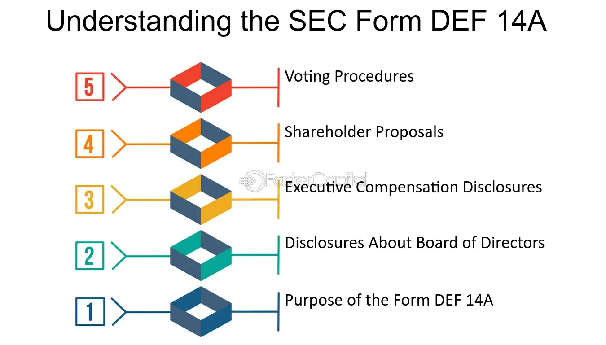

## Table of Contents

## What is SEC Form DEF 14A?

SEC Form DEF 14A is a document that companies file with the U.S. Securities and Exchange Commission (SEC). It is used to provide shareholders with important information before a meeting where they will vote on company matters. This form is also known as a definitive proxy statement. It includes details about the meeting, the issues to be voted on, and information about the company's leadership and their compensation.

The purpose of the DEF 14A is to make sure that shareholders have all the information they need to make informed decisions. It helps them understand what they are voting on and why it matters. The form often includes information about the company's performance, future plans, and any proposals that need shareholder approval. By reading the DEF 14A, shareholders can better participate in the governance of the company.

## Who is required to file SEC Form DEF 14A?

Companies that are publicly traded in the United States need to file SEC Form DEF 14A. This means any company whose stocks are bought and sold on stock exchanges like the New York Stock Exchange or NASDAQ must use this form. The main reason for filing is to tell shareholders about important meetings where they will vote on company issues.

The form is filed by the company's management. They need to make sure shareholders get all the information they need before voting. This includes details about the meeting, what will be voted on, and information about the company's leaders and their pay. By doing this, the company helps shareholders make smart choices about the company's future.

## What is the purpose of SEC Form DEF 14A for shareholders?

SEC Form DEF 14A helps shareholders by giving them important information before they vote at a company meeting. It tells them about the meeting, what they will be voting on, and who the company's leaders are. This form makes sure shareholders know everything they need to make good choices about the company's future.

By reading the DEF 14A, shareholders can understand the company's performance and plans. They can see how much the leaders are paid and learn about any big changes the company wants to make. This helps shareholders take part in deciding what happens next for the company.

## How does SEC Form DEF 14A differ from other SEC forms?

SEC Form DEF 14A is different from other SEC forms because it focuses on giving shareholders information before they vote at a company meeting. It tells them about the meeting, what they will vote on, and who runs the company. Other forms, like the 10-K or 10-Q, are more about the company's financial health and performance over time. The 10-K is a yearly report, and the 10-Q is a quarterly report. These forms don't talk about voting or meetings but give details on how the company is doing financially.

Another form, the 8-K, is used to tell investors about important events that happen between the regular reports. It might be about changes in the company's leadership or big deals the company makes. Unlike the DEF 14A, the 8-K isn't about preparing shareholders for a vote but about keeping them updated on what's happening. So, while the DEF 14A is all about helping shareholders make decisions at meetings, other forms focus on different kinds of information that help investors understand the company better.

## What information is typically included in SEC Form DEF 14A?

SEC Form DEF 14A includes important details that shareholders need before they vote at a company meeting. It tells them when and where the meeting will happen, and what they will be voting on. This can include things like choosing new board members, approving the company's pay plan for its leaders, or deciding on big changes the company wants to make. The form also gives information about the people who run the company, like their names, jobs, and how much they get paid.

The form also has information about the company's performance and future plans. It might talk about how the company did in the last year and what it hopes to do in the future. This helps shareholders understand if the company is doing well and what it wants to achieve. By reading the DEF 14A, shareholders can make smart choices about the company's future and feel more involved in its decisions.

## How often is SEC Form DEF 14A filed?

SEC Form DEF 14A is usually filed once a year. This is because companies have an annual meeting where shareholders vote on important things. The form needs to be sent out before this meeting so that shareholders have time to read it and make decisions.

Sometimes, a company might need to have more than one meeting in a year. If this happens, they would file the DEF 14A before each meeting. But most of the time, it's just once a year for the big annual meeting.

## What are the key sections of SEC Form DEF 14A that shareholders should focus on?

When looking at SEC Form DEF 14A, shareholders should pay close attention to the section about the meeting details. This part tells you when and where the meeting will happen, and what you will be voting on. It's important because it helps you plan to attend the meeting or send in your vote if you can't be there. You'll also find information about the proposals that need your vote, like choosing new board members or approving the company's pay plan for its leaders. Understanding these proposals helps you make smart choices about the company's future.

Another key section to focus on is the one about the company's leaders. This part gives you the names and jobs of the people running the company, and how much they get paid. It's good to know who is in charge and if their pay seems fair for the work they do. The form also includes information about the company's performance over the last year and what it plans to do in the future. This helps you see if the company is doing well and if its plans make sense. By reading these sections carefully, you can feel more involved in the company's decisions and vote in a way that you think is best.

## How can shareholders use the information from SEC Form DEF 14A to make informed decisions?

Shareholders can use the information from SEC Form DEF 14A to make informed decisions by understanding the details about the upcoming meeting. The form tells them when and where the meeting will happen, and what they will be voting on. This includes important things like choosing new board members or approving the company's pay plan for its leaders. By knowing these details, shareholders can plan to attend the meeting or send in their vote if they can't be there. This helps them be part of the company's big decisions.

The form also gives information about the company's leaders and their pay. Shareholders can see who is running the company and if their pay seems fair for the work they do. This helps shareholders decide if they want to keep the same leaders or if they think changes are needed. Additionally, the form includes details about the company's performance over the last year and its future plans. By looking at this, shareholders can see if the company is doing well and if its plans make sense. This information helps them vote in a way that they think is best for the company's future.

## What are the deadlines for filing SEC Form DEF 14A?

Companies need to file SEC Form DEF 14A before their annual meeting where shareholders vote. The form has to be sent to shareholders at least 21 days before the meeting. This gives shareholders enough time to read the information and make their voting decisions.

If a company needs to have more than one meeting in a year, they would file the DEF 14A before each of those meetings too. But usually, it's just once a year for the big annual meeting. Making sure the form is filed on time helps shareholders stay informed and take part in the company's decisions.

## What are the consequences of not filing SEC Form DEF 14A on time?

If a company does not file SEC Form DEF 14A on time, it can face big problems. The main problem is that shareholders won't get the information they need before the meeting. This means they might not be able to make good choices about voting. If shareholders don't have the right information, they might not vote at all, which can make the meeting less effective.

The SEC might also take action against the company for not following the rules. This could mean the company gets fined or has to deal with other punishments. Not filing on time can make the company look bad and hurt its reputation. It's important for companies to follow the rules and file the form on time to keep shareholders happy and avoid trouble with the SEC.

## How has the requirement for SEC Form DEF 14A evolved over time?

The requirement for SEC Form DEF 14A has changed over time to make sure shareholders get the information they need. When it first started, the form was simpler and didn't have as much detail. But as time went on, the SEC realized that shareholders needed more information to make good choices. So, they added more sections to the form, like details about the company's leaders and their pay, and more about the company's performance and future plans.

Now, the form is much more detailed than it used to be. It has to be filed at least 21 days before the meeting to give shareholders enough time to read it. The SEC keeps updating the rules to make sure the form stays useful and helps shareholders understand what they are voting on. This way, shareholders can be more involved in the company's decisions and feel confident about their votes.

## What advanced strategies can shareholders employ using the data from SEC Form DEF 14A?

Shareholders can use the data from SEC Form DEF 14A to make smart voting choices. They can look at the company's performance and future plans to see if the company is doing well. If the company's plans make sense, shareholders might vote to keep the same leaders or approve the company's proposals. They can also check the leaders' pay to see if it's fair. If it's too high, they might vote against it. By understanding what they are voting on, shareholders can make choices that help the company do better in the future.

Another strategy is to compare the information in the DEF 14A with other SEC forms like the 10-K or 10-Q. This helps shareholders see if the company's leaders are telling the truth about the company's performance. If the numbers in the DEF 14A don't match the numbers in the other forms, shareholders might want to ask questions or vote differently. They can also use this information to talk to other shareholders and work together to make changes in the company. By using the data wisely, shareholders can have a bigger say in how the company is run.

## References & Further Reading

[1]: U.S. Securities and Exchange Commission. ["SEC Form DEF 14A."](https://www.sec.gov/submit-filings/forms-index)

[2]: Glass, Lewis & Co. ["Proxy Voting and Engagement Solutions."](https://www.glasslewis.com/proxy-voting-2/)

[3]: Institutional Shareholder Services (ISS). ["Proxy Voting Services."](https://www.issgovernance.com/solutions/proxy-voting-services/)

[4]: Singleton, D. C., & Handelsman, G. (2020). ["Algorithmic Trading and Its Impacts on the Market."](https://www.boj.or.jp/en/research/wps_rev/rev_2020/data/rev20e05.pdf)

[5]: Lopez de Prado, M. (2018). ["Advances in Financial Machine Learning."](https://www.amazon.com/Advances-Financial-Machine-Learning-Marcos/dp/1119482089)

[6]: Jensen, M. C., Murphy, K. J., & Wruck, E. G. (2004). ["Remuneration: Where We've Been, How We Got to Here, What are the Problems, and How to Fix Them."](https://papers.ssrn.com/sol3/papers.cfm?abstract_id=561305) Harvard Business School NOM Working Paper No. 04-28.
