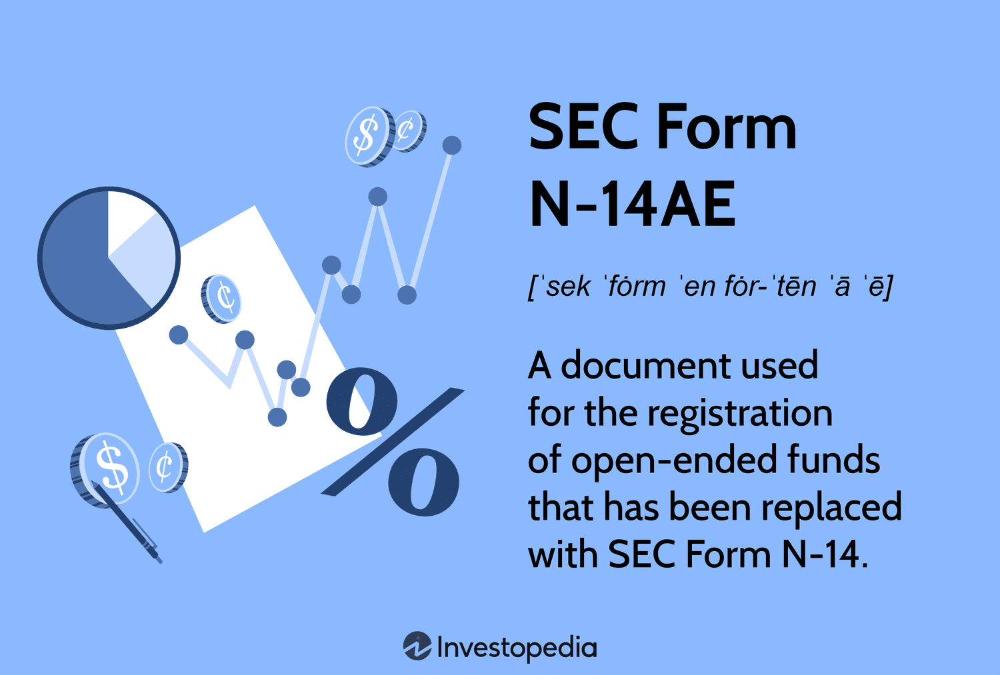

## Table of Contents

## What is SEC Form DEFM14A?

SEC Form DEFM14A is a document that companies file with the Securities and Exchange Commission (SEC) when they want to inform their shareholders about important decisions that need their vote. This form is used for what's called a "definitive proxy statement," which means it's the final version of the information being sent to shareholders before a meeting where they will vote on things like mergers, acquisitions, or changes in company structure.

The form includes detailed information about the meeting, what will be voted on, and why it's important. It's crucial because it helps shareholders make informed decisions. By reading the DEFM14A, shareholders can understand the potential impacts of their votes on the company's future and their investments.

## Who is required to file SEC Form DEFM14A?

Companies that are publicly traded in the United States need to file SEC Form DEFM14A. This is because these companies have shareholders who own parts of the company and have a say in important decisions. When the company wants to make big changes, like merging with another company or changing how it's run, it has to tell its shareholders about these plans. The DEFM14A is the form they use to do this.

The form is filed with the Securities and Exchange Commission, or SEC, which is the government agency that makes sure companies follow the rules about telling shareholders what's going on. By filing the DEFM14A, the company makes sure that all shareholders get the same information at the same time. This is important so that everyone can make fair and informed decisions when they vote at the shareholder meeting.

## What is the purpose of filing SEC Form DEFM14A?

The main reason for filing SEC Form DEFM14A is to let shareholders know about important decisions they need to vote on. This form is like a detailed message from the company to its owners, telling them what's going to be discussed and voted on at the next big meeting. It's called a definitive proxy statement because it's the final version of this important information that goes out to everyone who owns a piece of the company.

By using Form DEFM14A, the company makes sure all shareholders get the same information at the same time. This is really important because it helps everyone make fair and smart choices when they vote. The form tells shareholders about things like merging with another company, changing how the company is run, or other big decisions. This way, shareholders can understand how these changes might affect the company and their investment in it.

## How does SEC Form DEFM14A differ from other SEC forms?

SEC Form DEFM14A is different from other SEC forms because it's specifically used to tell shareholders about important decisions they need to vote on. It's called a definitive proxy statement, which means it's the final version of the information that goes out to shareholders before a big meeting. This form is all about making sure shareholders know what's going on and can make informed decisions. It's used for things like mergers, acquisitions, or changes in how the company is run.

Other SEC forms might have different purposes. For example, Form 10-K is an annual report that tells investors how the company did over the past year. Form 8-K is used to share important events that happen between those annual reports, like a change in leadership or a big sale. Unlike DEFM14A, these forms aren't about getting shareholders ready to vote on something; they're more about keeping investors updated on the company's performance and news.

So, while Form DEFM14A is focused on getting shareholders ready for a vote, other forms like 10-K and 8-K are about sharing financial information and updates. Each form has its own job in keeping shareholders informed, but DEFM14A is unique because it's all about preparing for those big decision-making moments at shareholder meetings.

## What information is typically included in SEC Form DEFM14A?

SEC Form DEFM14A includes important details that shareholders need to know before they vote at a meeting. It tells them when and where the meeting will happen, what they will be voting on, and why those votes matter. This form also explains any big changes the company wants to make, like merging with another company or changing how it's run. It's all about making sure shareholders have the information they need to make good decisions.

The form also includes information about the people who are running for positions on the company's board of directors. It tells shareholders who these people are, what experience they have, and why they are good for the job. This helps shareholders decide if they want to vote for these people to help lead the company. By reading the DEFM14A, shareholders can understand how their votes might affect the company and their investments.

## When must SEC Form DEFM14A be filed?

SEC Form DEFM14A needs to be filed with the Securities and Exchange Commission at least 21 days before the shareholder meeting where the vote will happen. This rule makes sure that shareholders have enough time to read the information and think about their choices before they vote.

The company has to send the DEFM14A to all its shareholders too. This way, everyone gets the same information at the same time. It's important because it helps make the voting fair and gives everyone a chance to understand what's going on with the company.

## What are the key components of SEC Form DEFM14A?

SEC Form DEFM14A is a document that tells shareholders about important decisions they need to vote on at a meeting. It includes details like when and where the meeting will happen, what shareholders will be voting on, and why those votes are important. The form also explains any big changes the company wants to make, like merging with another company or changing how it's run. This helps shareholders understand what's going on and how their votes might affect the company.

The form also has information about the people who want to be on the company's board of directors. It tells shareholders who these people are, what experience they have, and why they would be good for the job. This helps shareholders decide if they want to vote for these people to help lead the company. By reading the DEFM14A, shareholders can make informed choices about the future of their investments.

## How can shareholders use the information provided in SEC Form DEFM14A?

Shareholders can use the information in SEC Form DEFM14A to make smart choices about how to vote at the company's meeting. The form tells them about important things like mergers, changes in how the company is run, or who should be on the board of directors. By reading it, shareholders can understand what the company wants to do and why. This helps them decide if they agree with the company's plans and if they want to vote for them.

The form also gives details about the people who want to be on the board of directors. It tells shareholders about their experience and why they would be good for the job. This information helps shareholders decide if they want to vote for these people to help lead the company. By using the DEFM14A, shareholders can make sure their votes reflect what they think is best for the company and their investments.

## What are the potential consequences of not filing SEC Form DEFM14A on time?

If a company doesn't file SEC Form DEFM14A on time, it can face some big problems. The Securities and Exchange Commission, or SEC, might take action against the company. This could mean fines or other punishments. The SEC wants to make sure all shareholders get the information they need to vote, so if the company doesn't follow the rules, it could be in trouble.

Not filing on time can also upset shareholders. They might feel like the company isn't being fair or open about what's going on. This could make them less likely to trust the company and might even make them want to sell their shares. If lots of shareholders feel this way, it could hurt the company's reputation and its stock price.

## How has the filing process for SEC Form DEFM14A evolved with technological advancements?

The filing process for SEC Form DEFM14A has changed a lot because of technology. Before, companies had to send out paper copies of the form to all their shareholders, which took a lot of time and money. Now, they can file the form online through the SEC's Electronic Data Gathering, Analysis, and Retrieval (EDGAR) system. This makes it faster and easier for companies to share important information with shareholders. Shareholders can also access the form online, which means they can read it and make decisions more quickly.

Technology has also made it easier for companies to reach more shareholders. With the internet, companies can send out emails or post information on their websites to make sure everyone gets the same information at the same time. This helps keep things fair and open. Plus, new tools like electronic voting make it easier for shareholders to vote without having to go to a meeting in person. All these changes help make the process smoother and more efficient for everyone involved.

## What are some common challenges companies face when preparing SEC Form DEFM14A?

One big challenge companies face when preparing SEC Form DEFM14A is making sure all the information is correct and complete. The form has to include a lot of details about what shareholders will vote on, why it's important, and who is running for the board of directors. If any information is wrong or missing, it can cause problems with the SEC or upset shareholders. Companies have to be very careful and spend a lot of time checking everything to make sure it's right.

Another challenge is meeting the deadline. The form has to be filed at least 21 days before the shareholder meeting, which can be tough if the company is also busy with other things. It takes a lot of work to gather all the information, write it up, and get it approved by the right people in the company. If they miss the deadline, they could face fines or other problems with the SEC. It's a lot of pressure to get everything done on time.

## How can companies ensure compliance and accuracy when filing SEC Form DEFM14A?

Companies can make sure they follow the rules and get everything right when filing SEC Form DEFM14A by being very careful and thorough. They need to double-check all the information they put in the form. This means going over the details about what shareholders will vote on, why it's important, and who is running for the board of directors. It's a good idea to have different people in the company look at the form to catch any mistakes. Using special software that helps with compliance can also make sure they don't miss anything important.

Another way to ensure compliance and accuracy is to start working on the form early. This gives the company plenty of time to gather all the information they need and to meet the deadline of filing at least 21 days before the shareholder meeting. It's also helpful to have a clear plan and schedule for getting the form ready. By staying organized and on track, companies can avoid rushing at the last minute and make sure they file the form correctly and on time.

## References & Further Reading

[1]: U.S. Securities and Exchange Commission, "SEC Form DEFM14A," SEC.gov, [Accessed Online](https://www.sec.gov/search-filings), providing insights into the requirements and components of the definitive proxy statement, crucial for shareholder voting in mergers and acquisitions.

[2]: Bruner, R. F., "Applied Mergers and Acquisitions," John Wiley & Sons, 2004. This book offers a comprehensive study on mergers and acquisitions, including the role of SEC filings in facilitating informed shareholder decisions.

[3]: Zeng, D. D. & He, X., "Algorithmic Trading: A Literature Review," Journal of Computational Finance, 2020. This article explores the integration of AI in financial decision-making and the impact of algorithms on trading dynamics and shareholder communications.

[4]: Fama, E. F., & French, K. R., "The Capital Asset Pricing Model: Theory and Evidence," Journal of Economic Perspectives, 2004. Discusses financial theories relevant to evaluating risk factors communicated in proxy statements.

[5]: CNBC, "The AT&T-Time Warner Merger Saga: Key Facts and Chronology," 2018, providing an overview of the merger process, including the role of communications with shareholders and proxy statement filing.