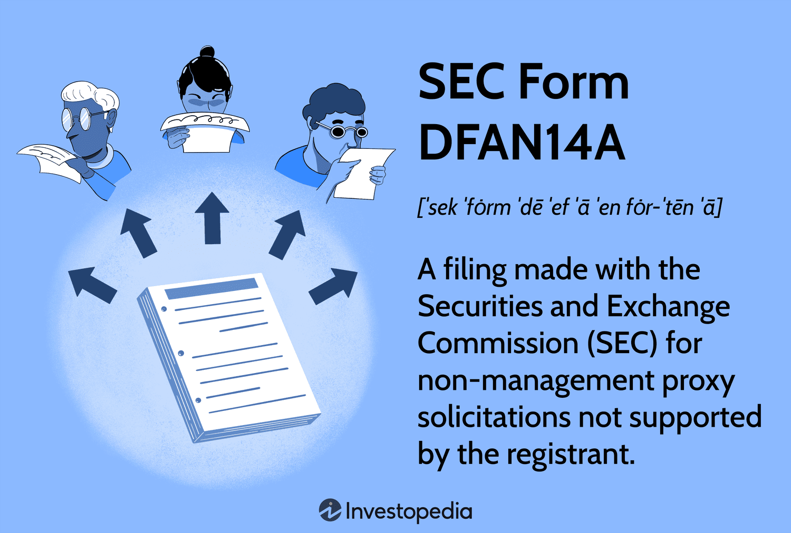

## Table of Contents

## What is SEC Form DFAN14A?

SEC Form DFAN14A is a document that companies file with the U.S. Securities and Exchange Commission (SEC). It is used to share important information with shareholders about changes or proposals that might affect the company. This form is often used when there are significant events like mergers, acquisitions, or other big changes in the company's structure.

When a company files a DFAN14A, it means they want to make sure shareholders know about these changes before they vote on them. The form includes details about the proposals, reasons for the changes, and how they might impact the company and its shareholders. This helps shareholders make informed decisions when they vote on these important issues.

## Why is SEC Form DFAN14A important for investors?

SEC Form DFAN14A is important for investors because it gives them key information about big changes happening in a company. When a company wants to do something big like merge with another company or change its structure, they have to tell their shareholders about it. This form helps investors understand what's going on and why the company is making these changes. It's like getting a heads-up before you have to make a decision.

By reading the DFAN14A, investors can see how these changes might affect the company and their investment. It helps them decide if they should vote for or against the proposals. Knowing this information can help investors make smarter choices about their money. It's all about being informed so you can protect your investment and maybe even make it grow.

## Who is required to file SEC Form DFAN14A?

SEC Form DFAN14A is filed by companies that are publicly traded and need to tell their shareholders about big changes. These changes can be things like mergers, acquisitions, or other major shifts in the company's structure. The company has to file this form to make sure all shareholders get the information they need before they vote on these changes.

The form is usually filed by the company's management or board of directors. They are the ones who come up with these big proposals and need to share them with everyone who owns part of the company. By filing the DFAN14A, they make sure that all shareholders have a chance to understand and vote on the proposed changes.

## When should SEC Form DFAN14A be filed?

SEC Form DFAN14A should be filed when a company wants to tell its shareholders about big changes, like mergers or acquisitions. The company needs to file this form before shareholders vote on these changes. This way, everyone who owns part of the company gets the information they need to make a good decision.

The timing of filing the DFAN14A is important. It has to be done early enough so that shareholders have time to read and understand the information before they vote. Usually, the company's management or board of directors will file the form as soon as they have all the details ready, to make sure shareholders are well-informed.

## What information is included in SEC Form DFAN14A?

SEC Form DFAN14A includes important details about big changes happening in a company. It tells shareholders about things like mergers, acquisitions, or other big shifts in the company's structure. The form explains what the changes are and why the company wants to make them. It also talks about how these changes might affect the company and its shareholders.

The form also includes information about the voting process. It tells shareholders when and how they can vote on these big changes. This helps everyone who owns part of the company know what's going on and make smart choices about their investment. By reading the DFAN14A, shareholders can understand the reasons behind the proposals and decide if they agree with them.

## How does SEC Form DFAN14A differ from other SEC forms?

SEC Form DFAN14A is different from other SEC forms because it focuses on sharing information about big changes in a company, like mergers or acquisitions, with shareholders. It's used when the company needs to tell shareholders about these changes before they vote on them. Other forms might be used for different things, like reporting the company's financial health or announcing new stock offerings. For example, Form 10-K gives a detailed look at the company's financial performance over the year, while Form S-1 is used when a company wants to go public and sell its stock for the first time.

The main goal of Form DFAN14A is to make sure shareholders have all the information they need to make smart voting decisions. It includes details about the proposals, the reasons for the changes, and how they might affect the company and its shareholders. In contrast, other forms like the DEF 14A (Definitive Proxy Statement) might also be used in voting situations but typically cover a broader range of topics, including the election of directors and other routine business matters. So, while DFAN14A is specific to big changes, other forms might cover a wider variety of company updates and decisions.

## What are the steps to file SEC Form DFAN14A?

To file SEC Form DFAN14A, a company first needs to prepare all the information about the big changes they want to tell their shareholders about. This includes details about the proposals, why they want to make these changes, and how it might affect the company and its shareholders. Once they have all this information ready, they need to fill out the form carefully, making sure everything is clear and correct. They can do this either on paper or electronically, but most companies use the SEC's online filing system called EDGAR.

After filling out the form, the company submits it through the EDGAR system. They need to make sure they file it early enough so that shareholders have time to read and understand the information before they vote. Once the form is submitted, it becomes public, and shareholders can access it to learn about the proposed changes. The company's management or board of directors usually handles this process to make sure everything goes smoothly and shareholders get the information they need.

## What are the common mistakes to avoid when filing SEC Form DFAN14A?

When filing SEC Form DFAN14A, one common mistake to avoid is not providing enough detail about the proposed changes. The form needs to clearly explain what the changes are, why the company wants to make them, and how they might affect the company and its shareholders. If the information is not clear or complete, shareholders might not understand what they are voting on, which can lead to confusion and bad decisions.

Another mistake to watch out for is filing the form too late. It's important to give shareholders enough time to read and understand the information before they vote. If the form is filed too close to the voting date, shareholders might not have enough time to make informed decisions. So, make sure to file the form early enough to give everyone a fair chance to review the details.

## How can companies ensure compliance when using SEC Form DFAN14A?

To make sure they follow the rules when using SEC Form DFAN14A, companies need to be very careful about the information they share. They should make sure the form has all the details about the big changes, like mergers or acquisitions, and explain why these changes are happening. It's important to tell shareholders how these changes might affect the company and their investment. By being clear and complete, the company helps shareholders understand what they are voting on and makes sure they follow the SEC's rules.

Another way companies can stay compliant is by filing the form on time. They need to give shareholders enough time to read and think about the information before voting. This means filing the form early, so everyone has a fair chance to make a good decision. By doing this, the company shows that they care about keeping their shareholders informed and following the SEC's guidelines.

## What are the potential consequences of non-compliance with SEC Form DFAN14A?

If a company does not follow the rules when using SEC Form DFAN14A, they could face big problems. The SEC might investigate them and find out they did something wrong. This could lead to fines or other punishments. The company might have to pay a lot of money, and this can hurt their business. It can also make people trust the company less, which is bad for their reputation.

Another problem is that shareholders might get confused or upset if they don't get the right information about big changes. This can lead to bad decisions when they vote. If shareholders feel like they were not told everything they needed to know, they might even take the company to court. This can create more trouble for the company and make it harder for them to do business in the future.

## How has the filing process for SEC Form DFAN14A evolved over time?

The filing process for SEC Form DFAN14A has changed a lot over the years, mostly because of new technology. Before, companies had to fill out paper forms and mail them to the SEC, which took a long time. But now, with the internet, companies can use the SEC's online system called EDGAR to file their forms quickly and easily. This makes it faster for the information to reach shareholders and the public.

Also, the rules about what needs to be in the form have gotten more detailed. The SEC wants to make sure shareholders have all the information they need to make good decisions. So, they've added more requirements about what companies have to tell shareholders about big changes. This helps keep things fair and makes sure everyone knows what's going on before they vote.

## What advanced strategies can companies use to optimize their use of SEC Form DFAN14A?

Companies can optimize their use of SEC Form DFAN14A by making the information as clear and easy to understand as possible. They should explain the big changes, like mergers or acquisitions, in simple terms so that all shareholders can understand what's happening and why. It's also helpful to use visuals like charts or graphs to show how these changes might affect the company and its shareholders. By doing this, the company can make sure everyone gets the important information they need to make a good decision when they vote.

Another strategy is to use technology to make the filing process smoother and quicker. Companies can use tools that help them fill out the form correctly and submit it through the SEC's online system, EDGAR, without any mistakes. They can also use digital communication to reach shareholders faster, like sending emails or posting updates on their website. This way, shareholders get the information sooner and can take more time to think about their vote. By using these advanced strategies, companies can make sure they follow the rules and help their shareholders make smart choices.

## References & Further Reading

1. U.S. Securities and Exchange Commission. "SEC Form DEF 14A." This document provides a detailed overview of proxy statements, aligning with regulatory requirements under the SEC. It is essential reading for understanding the fundamentals and legal implications of proxy communications. Access the document on the official SEC website: [SEC Form DEF 14A](https://www.sec.gov).

2. Glass, Lewis & Co. "Proxy Voting and Engagement Solutions." This resource offers insights into how institutional investors can optimize their voting strategies to impact corporate governance effectively. Glass Lewis provides actionable analytics and research integral for investors interested in probative proxy voting solutions. More details can be found on their website: [Glass Lewis](https://www.glasslewis.com).

3. Institutional Shareholder Services (ISS). "Proxy Voting Services." As a leading provider of governance and investment solutions, ISS offers comprehensive proxy voting services that help institutional investors leverage governance policies in their investment strategies. Access further information here: [ISS Proxy Voting Services](https://www.issgovernance.com).

4. Singleton, D. C., & Handelsman, G. "Algorithmic Trading and Its Impacts on the Market." This paper explores the evolving landscape of algorithmic trading, examining statistical models and algorithms that pivotally affect market dynamics. It's essential for understanding the quant-based approaches in financial markets. Discover more in their published research through academic or financial research databases.

5. Lopez de Prado, M. "Advances in Financial Machine Learning." This book covers state-of-the-art techniques in machine learning as applied to financial market data, offering practitioners methodologies to refine algorithmic trading strategies. The book is invaluable for professionals seeking quantitative tools to enhance market analysis and trading. It is available through various academic and professional book retailers.

These resources provide a foundational understanding and practical insights for stakeholders involved in proxy analysis, shareholder communication, and [algorithmic trading](/wiki/algorithmic-trading).

