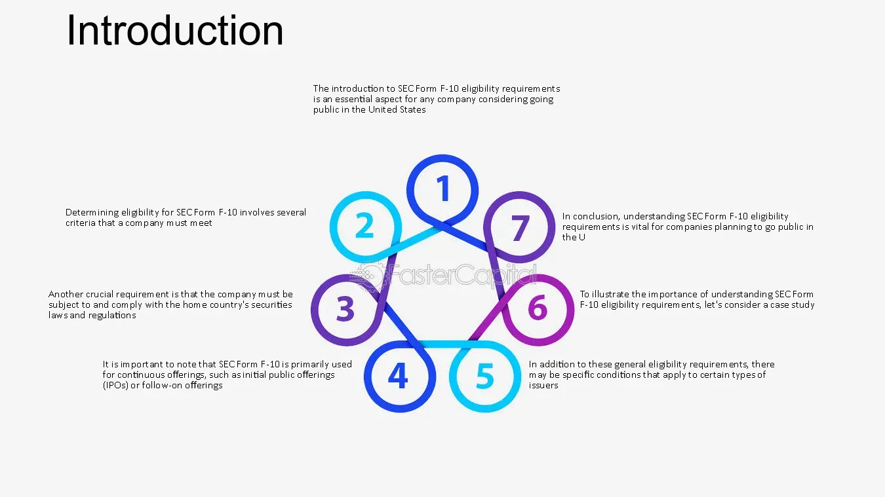

## Table of Contents

## What is SEC Form F-10?

SEC Form F-10 is a form that companies from Canada use when they want to sell their stocks or other securities in the United States. It's a special form that helps make it easier for Canadian companies to follow U.S. rules about selling securities. The form is used for what's called a "registration statement," which is a detailed document that tells investors important information about the company and the securities being sold.

The form is used by certain Canadian companies that meet specific requirements. These companies must be what's called "qualifying for the multijurisdictional disclosure system," which means they follow rules in both Canada and the U.S. This system helps make it simpler for these companies to sell their securities in the U.S. without having to do a lot of extra work to meet U.S. regulations.

## Who is eligible to file SEC Form F-10?

Canadian companies can use SEC Form F-10 if they want to sell their stocks or other securities in the United States. To be able to use this form, the company must follow certain rules. These rules are part of something called the "multijurisdictional disclosure system," which helps Canadian companies meet both Canadian and U.S. rules more easily.

The company needs to be what's called a "qualifying issuer" under this system. This means they have to be well-known and meet specific standards set by both Canadian and U.S. regulators. If a company fits these rules, they can use Form F-10 to tell U.S. investors about their securities and follow U.S. laws without too much extra work.

## What are the main purposes of filing Form F-10?

The main purpose of filing Form F-10 is to let Canadian companies sell their stocks or other securities in the United States. When a Canadian company wants to do this, they need to follow U.S. rules. Form F-10 helps make this easier by letting the company use a special form that fits both Canadian and U.S. rules. This form is called a "registration statement," and it gives U.S. investors important information about the company and the securities being sold.

Another purpose of Form F-10 is to help Canadian companies that meet certain standards, called "qualifying issuers," to follow the multijurisdictional disclosure system. This system makes it simpler for these companies to sell their securities in the U.S. without having to do a lot of extra work to meet U.S. regulations. By using Form F-10, these companies can share the needed information with U.S. investors and regulators in a way that works for both countries.

## What types of securities can be registered using Form F-10?

Form F-10 can be used to register different types of securities that Canadian companies want to sell in the United States. This includes common stocks, which are the basic shares of a company that people can buy and own. It also includes preferred stocks, which are a special type of share that can give owners certain benefits, like getting paid before common stockholders.

In addition to stocks, Form F-10 can be used for other types of securities like debt securities. These are like loans to the company, where the company promises to pay back the money with interest. This form can also be used for warrants and rights, which are special kinds of securities that give the owner the right to buy more stocks at a set price in the future.

Overall, Form F-10 is a flexible tool that helps Canadian companies register a variety of securities in the U.S., making it easier for them to follow the rules and sell their securities to American investors.

## What are the key components and sections of Form F-10?

Form F-10 is a document that Canadian companies use when they want to sell their securities in the United States. It has several important parts that help the company share information with U.S. investors and regulators. The form includes a cover page that gives basic information about the company and the securities being sold. There's also a section for the prospectus, which is a detailed document that explains everything investors need to know about the securities, like how much they cost, what risks are involved, and how the company plans to use the money it raises.

Another key part of Form F-10 is the financial statements section. This part shows the company's financial health, including its income, expenses, assets, and debts. It helps investors see if the company is doing well and if it's a good idea to buy its securities. The form also includes exhibits, which are extra documents like legal agreements or contracts that provide more details about the company and the securities. All these parts together help make sure that U.S. investors have all the information they need to make smart choices about buying the Canadian company's securities.

## How does Form F-10 differ from other SEC registration forms?

Form F-10 is a special form used by Canadian companies to sell their stocks or other securities in the United States. It's different from other SEC registration forms because it's designed for companies that follow both Canadian and U.S. rules through something called the multijurisdictional disclosure system. This system makes it easier for these companies to meet U.S. regulations without a lot of extra work. Other forms, like Form S-1, are used by U.S. companies or foreign companies that don't qualify for this special system, and they have to follow different rules and provide different information.

Another way Form F-10 differs is in its flexibility. It can be used to register a variety of securities, like common stocks, preferred stocks, debt securities, warrants, and rights. This makes it easier for Canadian companies to sell different types of securities in the U.S. Other forms might be more specific or limited in what types of securities they can register. For example, Form S-3 is often used for certain types of securities offerings by companies that meet specific U.S. requirements, but it might not be as flexible as Form F-10 for Canadian companies.

## What are the specific financial statement requirements for Form F-10?

When a Canadian company uses Form F-10 to sell securities in the United States, it needs to include financial statements in the form. These statements show the company's financial health and help U.S. investors understand if the company is doing well. The financial statements must include the company's income statement, which shows how much money the company made and spent over a certain time. They also need to include the balance sheet, which lists what the company owns and owes, and the cash flow statement, which shows how money moves in and out of the company.

The financial statements in Form F-10 need to follow specific rules. They must be prepared according to Canadian accounting standards, but they also need to be reconciled with U.S. Generally Accepted Accounting Principles (GAAP) or International Financial Reporting Standards (IFRS). This means the company has to explain any differences between the Canadian numbers and what they would be under U.S. or international rules. This helps U.S. investors understand the company's financials in a way that's familiar to them. The financial statements also need to be audited by an independent accountant to make sure they're accurate and trustworthy.

## What are the disclosure requirements for issuers using Form F-10?

When Canadian companies use Form F-10 to sell their securities in the United States, they have to share a lot of information with U.S. investors. This information is called disclosure, and it helps investors understand the company and the securities they might buy. The company needs to include a prospectus, which is a detailed document that explains everything about the securities, like their price, the risks involved, and how the company plans to use the money it raises. The prospectus also needs to talk about the company's business, its management team, and any legal issues it might have.

The company also has to include financial statements in Form F-10. These statements show how much money the company is making, spending, and what it owns and owes. The financial statements need to follow Canadian accounting rules, but they also have to be adjusted to match U.S. or international accounting rules. This helps U.S. investors understand the company's financial health in a way that's familiar to them. The company also has to explain any big changes or events that could affect the securities, like mergers or new products. All of this information helps make sure that U.S. investors have what they need to make smart choices about buying the Canadian company's securities.

## How does the filing process for Form F-10 work, including timelines and fees?

When a Canadian company wants to use Form F-10 to sell securities in the U.S., they start by preparing the form and all the required information. This includes a prospectus that explains the securities and the company's financial statements. Once everything is ready, the company files Form F-10 with the Securities and Exchange Commission (SEC). The SEC then reviews the form to make sure it has all the needed information and follows the rules. This review process can take about 30 days, but it might take longer if the SEC has questions or needs more details.

After the SEC finishes its review and approves the form, the company can start selling its securities in the U.S. The company also has to pay a fee when they file Form F-10. This fee is based on how much money the company plans to raise from selling the securities. The fee is usually a small percentage of that amount, and it helps cover the costs of the SEC's work in reviewing the form. Once the fee is paid and the form is approved, the company can go ahead with its plans to sell securities to U.S. investors.

## What are common challenges or pitfalls when preparing Form F-10?

One common challenge when preparing Form F-10 is making sure all the financial statements are correct and follow both Canadian and U.S. accounting rules. Canadian companies need to show their financials in a way that U.S. investors can understand, which means they have to adjust their numbers to match U.S. or international standards. This can be tricky and time-consuming, and any mistakes can lead to delays or even rejection by the SEC.

Another pitfall is ensuring that the prospectus is complete and clear. The prospectus needs to explain everything about the securities and the company, including any risks or legal issues. If the prospectus is missing important information or is hard to understand, the SEC might ask for more details, which can slow down the whole process. It's important for companies to work carefully and maybe get help from experts to make sure everything is right.

## How can issuers ensure compliance with SEC regulations when using Form F-10?

To make sure they follow SEC rules when using Form F-10, Canadian companies need to be very careful and detailed. They should start by making sure their financial statements are correct and follow both Canadian and U.S. accounting rules. This means they have to show their financials in a way that U.S. investors can understand, which might involve adjusting their numbers to match U.S. or international standards. It's also important for companies to work with accountants and lawyers who know the rules well to make sure everything is right.

Another key part of staying compliant is making sure the prospectus is complete and easy to understand. The prospectus needs to explain everything about the securities and the company, including any risks or legal issues. If something is missing or hard to understand, the SEC might ask for more information, which can slow things down. Companies should take their time to make sure all the details are clear and correct, and they might want to get help from experts to review everything before they file the form.

## What recent changes or updates have been made to Form F-10 requirements?

Recently, there have been some changes to the rules about Form F-10 to make it easier for Canadian companies to sell their securities in the U.S. One big change is that the SEC now lets companies use more flexible ways to share their financial information. This means they can use different accounting standards as long as they explain the differences clearly. This helps make the process smoother and less confusing for both the companies and U.S. investors.

Another update is about how companies can update their information. Now, they can use what's called a "shelf registration" to keep their Form F-10 up to date over time. This means they can file the form once and then add new information later without having to start all over again. This makes it easier for companies to keep their information current and helps them save time and money when they want to sell more securities in the future.

## References & Further Reading

[1]: ["Multijurisdictional Disclosure and Modifications Rules"](https://www.investopedia.com/terms/m/multijurisdictional-disclosure-system-mjds.asp) by the U.S. Securities and Exchange Commission

[2]: ["Securities Act of 1933"](https://www.govinfo.gov/content/pkg/COMPS-1884/pdf/COMPS-1884.pdf) by the U.S. Securities and Exchange Commission

[3]: ["Introduction to Canadian Capital Markets for Foreign Issuers"](https://www.dorsey.com/~/media/files/canada/dorseycanadianissuerguideotcqxotcqbseptember2020.pdf) by the Ontario Securities Commission

[4]: ["Regulation of Algorithmic Trading in Capital Markets"](https://www.sec.gov/about/reports-publications/algo_trading_report_2020)646543_EN.pdf) by the European Parliament

[5]: Aldridge, I. (2013). ["High-Frequency Trading: A Practical Guide to Algorithmic Strategies and Trading Systems"](https://www.amazon.com/High-Frequency-Trading-Practical-Algorithmic-Strategies/dp/1118343506) by Wiley Finance