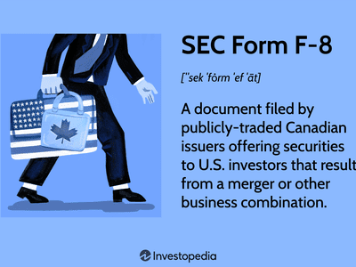

In the ever-evolving world of finance, regulatory compliance and technological advancements play pivotal roles in ensuring the smooth operation of financial markets. Among these, SEC Form F-8 and algorithmic trading are two significant components that impact international securities trading and financial reporting. The Securities and Exchange Commission (SEC) is integral to financial reporting, particularly through SEC Form F-8, which plays a vital role for Canadian issuers seeking to engage with U.S. markets. This form is fundamental in facilitating cross-border transactions while maintaining transparency and compliance with U.S. regulatory standards.

At the same time, algorithmic trading is transforming the way trading activities are conducted. Through the use of sophisticated algorithms, trading processes are automated, leading to increased speed and volume of transactions. This shift introduces new dynamics and complexities into the market, challenging existing regulatory frameworks and necessitating adaptation to maintain market integrity and prevent manipulative practices.

Understanding the intricacies of SEC Form F-8 is crucial for Canadian companies aiming to access U.S. capital markets, as it ensures that they meet transparency and compliance requirements. Meanwhile, algorithmic trading continues to shape market operations, raising important considerations for regulators, including the SEC, to address challenges related to market manipulation and transparency.

Investors, companies, and regulators must comprehend these developments to effectively navigate the complexities of modern financial markets. Both SEC Form F-8 and algorithmic trading have far-reaching implications, thus awareness of their roles is vital for leveraging cross-border opportunities and achieving compliance in a dynamic financial ecosystem.

## Table of Contents

## What is SEC Form F-8?

SEC Form F-8 is a regulatory filing mandated by the U.S. Securities and Exchange Commission (SEC) specifically for Canadian issuers aiming to register securities within the United States. The primary function of this form is to facilitate significant business transactions, including mergers, exchange offers, and other business combinations that necessitate a shareholder vote. The form serves a critical role by acting as a wraparound for Canadian securities documentation, which ensures that U.S. investors receive rights equivalent to those available to foreign shareholders. By using SEC Form F-8, Canadian companies can streamline compliance with U.S. securities regulations while conducting cross-border transactions.

To utilize SEC Form F-8 effectively, Canadian companies must fulfill specific criteria. These include maintaining a market capitalization exceeding C$75 million. This requirement ensures that only companies with a significant market presence can take advantage of the simplified registration process offered by this form. As a component of the Multijurisdictional Disclosure System (MJDS), SEC Form F-8 plays an essential role in aligning Canadian and U.S. securities regulations, thereby simplifying the legal framework for Canadian businesses operating in the U.S. markets.

The importance of SEC Form F-8 arises from its capacity to facilitate efficient and compliant participation in international securities markets, offering Canadian companies a streamlined pathway to engage with U.S. investors. The form's structure and requirements exemplify the ongoing efforts by regulatory bodies to harmonize standards and promote fair and equitable treatment for all market participants, regardless of their geographical location.

## Understanding the Multijurisdictional Disclosure System (MJDS)

The Multijurisdictional Disclosure System (MJDS) was established to facilitate [capital raising](/wiki/hedge-fund-capital-raising) efforts by Canadian companies in the United States, aiming to streamline and harmonize regulatory requirements between the two countries. This system is a collaborative initiative between the U.S. Securities and Exchange Commission (SEC) and the Canadian Securities Administrators (CSA), designed to ease cross-border activities and reduce the complexities involved in adhering to dual regulatory frameworks.

The primary advantage of the MJDS is its ability to simplify the filing process for Canadian issuers looking to tap into the U.S. capital markets. Under the MJDS, Canadian companies are allowed to utilize their domestic disclosure documents when filing with the SEC, thereby minimizing the need for repetitive documentation and reducing the administrative burden associated with securities offerings. This allows Canadian firms to present their financial statements and other required disclosures primarily under Canadian regulatory standards, making the process more efficient and cost-effective.

MJDS effectively reduces the barriers to entry for Canadian companies in U.S. markets by aligning requirements and thereby diminishing the costs associated with dual compliance. This reduction in administrative overhead not only saves resources but also encourages more Canadian entities to participate in U.S. capital markets, subsequently enhancing the [liquidity](/wiki/liquidity-risk-premium) and depth of these markets.

SEC Form F-8 plays a critical role within the MJDS framework as it permits Canadian issuers to register securities in the U.S. with greater ease during specific transactions, such as mergers or exchange offers. The Form F-8 acts as a wraparound document that ensures U.S. investors receive equivalent rights and protections as foreign shareholders, thereby maintaining the integrity of cross-border securities offerings.

Overall, the MJDS, coupled with instruments like SEC Form F-8, represents a significant step towards financial integration between Canada and the United States, supporting a more seamless and efficient landscape for international securities trading.

## Algorithmic Trading and Its Impact on Financial Reporting

Algorithmic trading involves employing computer algorithms to automate various trading processes, bringing a profound impact on market efficiency and liquidity. By executing pre-programmed trading instructions, it significantly accelerates transaction speeds and turnover volumes, offering both opportunities and challenges to market participants and regulators.

One of the primary advantages of [algorithmic trading](/wiki/algorithmic-trading) is its potential to improve market efficiency. Enhanced speed allows traders to exploit fleeting market opportunities, often resulting in tighter bid-ask spreads and reduced transaction costs. However, this increased speed also poses significant challenges for regulatory bodies, such as the Securities and Exchange Commission (SEC). Monitoring potential market manipulation becomes more difficult amid the rapid transitions brought on by algorithms. For instance, strategies like spoofing, where traders place fake orders to manipulate market prices, can be executed and withdrawn swiftly, making detection and intervention challenging.

The high [volume](/wiki/volume-trading-strategy) of transactions generated by algorithmic trading introduces complexities within financial reporting frameworks. Current regulations must adapt to the nuances of algorithmic trades that can execute thousands of transactions per second. This necessitates robust reporting requirements to ensure transparency and prevent market abuse. Regulators, including the SEC, have recognized the need to update legal frameworks to keep pace with the evolving landscape. Enhanced scrutiny is required to ensure algorithms do not disrupt fair trading practices or pose systemic risks to market stability.

Algorithmic trading intersects with regulatory frameworks in several crucial ways. The SEC enforces guidelines designed to uphold market integrity, thereby influencing strategies adopted by market participants who rely on these algorithms. The implementation of algorithms requires adherence to strict compliance measures, including real-time monitoring and detailed recordkeeping. Market participants must ensure that their systems comply with established norms and provide adequate safeguards against malfunctions and erroneous trades, which can ripple through the financial markets. Algorithms must also adjust to meet financial reporting standards, often necessitating real-time reporting capabilities to prevent adverse effects on market stability.

In summary, while algorithmic trading enhances market efficiency and liquidity, it also introduces complexities that demand adaptive regulatory frameworks. As the financial landscape continues to evolve, proactive measures are essential to ensure that algorithmic trading enhances, rather than undermines, the fairness and transparency of global financial markets.

## The Role of the SEC in Algorithmic Trading

The Securities and Exchange Commission (SEC) plays a vital role in regulating algorithmic trading to maintain market integrity and protect investors. Algorithmic trading, characterized by the use of computer algorithms to execute trades at high speeds and volumes, has revolutionized financial markets. However, it presents unique challenges, such as the potential for market manipulation and systemic risks, which the SEC addresses through specific regulatory measures.

The SEC's regulatory framework for algorithmic trading includes the implementation of rules designed to prevent market disruptions and ensure fair trading practices. One key focus is preventing flash crashes, sudden, drastic drops in security prices caused by automated trading systems. To mitigate such risks, the SEC requires exchanges and trading firms to implement robust risk management controls. These controls include circuit breakers, which temporarily halt trading during extreme price [volatility](/wiki/volatility-trading-strategies), allowing the market to stabilize before trading resumes.

Another critical aspect of the SEC's regulation involves enhancing market transparency and surveillance. The SEC mandates real-time monitoring and reporting systems to track algorithmic trading activities. This ensures that trading practices remain transparent and that any irregularities can be swiftly identified and addressed. Advanced data analytics and [machine learning](/wiki/machine-learning) tools are increasingly employed by the SEC to analyze vast volumes of trading data, enabling the detection of suspicious trading patterns that might indicate manipulative behavior.

To further protect market integrity, the SEC enforces compliance with rules like the Regulation NMS (National Market System), which ensures transparent and efficient securities trading across various exchanges. This includes the Order Protection Rule, which prevents trade-throughs, ensuring that investors receive the best possible price execution available across the network of trading venues.

Moreover, the SEC imposes stringent requirements on trading firms regarding their algorithmic trading strategies. Firms must thoroughly test their algorithms to ensure they adhere to compliance standards and do not disrupt market functions. This includes performing pre- and post-trade risk assessments, documenting the algorithms' logic and functionality, and regularly reviewing and updating the algorithms to adapt to changing market conditions.

In summary, through a comprehensive regulatory approach, the SEC aims to address the unique challenges presented by algorithmic trading. By implementing rules to prevent flash crashes, enhancing market surveillance, and ensuring compliance with trading regulations, the SEC plays a crucial role in fostering a stable and transparent trading environment. This robust regulatory oversight is essential for maintaining investor confidence and the integrity of modern financial markets.

## Conclusion

Both SEC Form F-8 and algorithmic trading are integral to the modern financial ecosystem, significantly impacting market participants, issuers, and regulators. Understanding the intricacies of SEC Form F-8 is particularly important for Canadian issuers who seek to engage in the U.S. financial markets. By complying with Form F-8 requirements, these issuers can seamlessly navigate the complexities of international securities regulations, ensuring that they align with both Canadian and U.S. standards. This alignment facilitates cross-border business combinations and offers, promoting economic integration and expansion for Canadian firms.

Algorithmic trading, on the other hand, has revolutionized market dynamics. It has increased transaction speeds and volumes, contributing to enhanced market efficiency and liquidity. However, this technological advancement also necessitates adaptive regulatory frameworks to prevent potential risks such as market manipulation and to ensure transparent trading environments. The Securities and Exchange Commission (SEC) plays a crucial role in this context by enforcing rules that oversee algorithmic trading activities, thereby safeguarding market integrity.

As financial markets evolve, stakeholders, including investors, companies, and regulators, must remain vigilant to adapt to these changes. Awareness of key regulatory tools like SEC Form F-8 and the implications of algorithmic trading is essential for effectively leveraging cross-border opportunities. By understanding and navigating these components, market participants can uphold robust compliance with international standards, fostering a secure and equitable trading ecosystem amidst increasing complexity.

## References & Further Reading

[1]: ["SEC Form F-8."](https://www.sec.gov/files/formf-8.pdf) Securities and Exchange Commission (SEC) Website

[2]: ["Multijurisdictional Disclosure System (MJDS)."](https://www.sec.gov/about/divisions-offices/division-corporation-finance/financial-reporting-manual/frm-topic-16) Ontario Securities Commission (OSC)

[3]: ["Algorithmic Trading and DMA: An introduction to direct access trading strategies"](https://archive.org/details/algorithmictradi0000john) by Barry Johnson

[4]: Bain, Jonathan, et al. (2003) ["Algorithmic Trading Models and Methods."](https://link.springer.com/chapter/10.1007/978-3-031-62843-6_8) Financial Research Department

[5]: ["High-Frequency Trading: A Practical Guide to Algorithmic Strategies and Trading Systems"](https://www.ahmetbeyefendi.com/wp-content/uploads/2020/07/High-Frequency-Trading-Irene-Aldridge.pdf) by Irene Aldridge