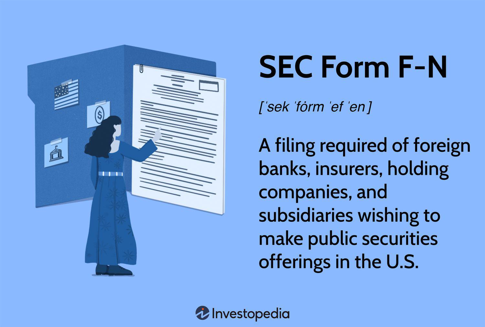

The financial landscape is constantly evolving, especially with the increasing reliance on algorithmic trading, which employs complex mathematical models and high-speed data analysis to execute trades. This technological approach has revolutionized the trading process, offering the potential for higher efficiency and improved market liquidity. However, with these advancements comes the imperative for stringent oversight and compliance with securities regulations.

For foreign entities, understanding the intricacies of U.S. securities regulations becomes crucial when they decide to participate in the U.S. markets. These regulations are designed to ensure market integrity, transparency, and the protection of investors. Among the myriad of regulatory requirements, the SEC (Securities and Exchange Commission) Form F-N stands out as a particularly vital document.

SEC Form F-N serves as a notification of the appointment of an agent for service of process by certain foreign institutions. It is specifically required for foreign banks, insurers, and holding companies that wish to make public securities offerings in the U.S. market. By appointing a U.S.-based agent, these foreign entities ensure that they have a legal point of contact for any processes or proceedings initiated by the SEC. This requirement underscores the importance of having accessible and accountable representatives, ensuring that foreign entities can competently navigate U.S. legal landscapes.

In this article, we will explore the significance of Form F-N in detail, examining its requirements and understanding its relevance to algorithmic trading within the U.S. securities regulation framework. This understanding is essential for foreign entities aiming to engage in algorithmic trading, as compliance with these regulations is paramount to avoid legal penalties and ensure seamless trading operations.

## Table of Contents

## Understanding SEC Form F-N

SEC Form F-N serves as a formal notification for the appointment of an agent for service by specific foreign institutions. This requirement is crucial for foreign banks, insurers, and holding companies that wish to offer securities within the United States. The filing of Form F-N is a mandatory process that ensures these entities have a designated representative to handle legal matters, particularly in the face of any potential legal disputes or regulatory issues that might arise from their activities in the U.S. securities market.

The necessity for Form F-N arises from the regulatory framework established by the U.S. Securities and Exchange Commission (SEC), which aims to maintain a transparent and orderly market environment. By mandating this filing, the SEC ensures that foreign entities engaging in U.S. securities offerings have a clear and accountable legal presence within the country. This presence is critical for enforcing U.S. securities laws and regulations effectively.

Foreign institutions are required to submit Form F-N electronically, which aligns with the SEC's broader initiative to streamline filing processes and enhance access to information. This electronic submission is part of the comprehensive F series of SEC filings specifically designed for foreign companies. The F series includes various forms and regulations that cater to the unique needs and obligations of foreign issuers, facilitating their operations in compliance with U.S. laws.

In summary, SEC Form F-N is a pivotal document that underpins the participation of foreign financial entities in the U.S. markets. By fulfilling this filing requirement, these entities ensure they are legally equipped to offer securities and engage with U.S. investors, thereby contributing to a more integrated global financial system.

## SEC Form F-N in the Context of Algorithmic Trading

With the proliferation of [algorithmic trading](/wiki/algorithmic-trading), the financial landscape has transformed dramatically, necessitating stringent regulatory measures in markets like the U.S. For foreign entities wishing to engage, compliance with these regulations is critical to prevent severe penalties or access restrictions. In this context, SEC Form F-N plays an instrumental role.

SEC Form F-N is specifically designed to ensure that foreign banks, insurers, and holding companies can align with U.S. regulations, effectively facilitating their participation in algorithmic trading activities. This compliance focuses on transparency, a cornerstone principle in algorithmic trading, where speed and automation dominate market mechanics.

Algorithmic trading relies on complex mathematical models and trading strategies executed with high-frequency precision. As such, the participation of foreign entities subject to U.S. jurisdiction necessitates adherence to comprehensive regulatory frameworks, including the filing of Form F-N. This document not only signifies compliance but also establishes a legal channel for service of process within the U.S., thereby reinforcing market oversight and accountability.

For foreign firms venturing into algorithmic trading, Form F-N serves as an essential tool, ensuring their strategies and operations align with U.S. market regulations. By mandating the appointment of a U.S.-based agent for service, SEC Form F-N creates a layer of legal and procedural clarity, enhancing the integrity and fluidity of trading operations on American soil. As algorithmic trading continues to evolve, the role of SEC filings like Form F-N becomes increasingly significant, ensuring that the growing participation of foreign entities complements the robust regulatory, legal, and ethical standards of U.S. financial markets.

## Key Differences: SEC Form F-N vs. Form F-X

Both SEC Form F-N and Form F-X serve the critical function of designating a U.S. agent for service of process, a requirement for foreign entities engaging in certain activities within the United States. However, these forms target distinct statutory and regulatory needs, allowing for overlaps and specific exclusions based on the nature of securities offerings and the entity's operational profile.

Form F-N primarily focuses on foreign banks, insurance companies, and holding companies involved in public securities offerings in the U.S. It mandates the appointment of a U.S. agent who can accept legal processes on behalf of the foreign entity, ensuring legal compliance and accountability within U.S. jurisdictions. This form is crucial for entities establishing new or expanded market participation, ensuring they align with U.S. securities laws.

Conversely, Form F-X is used by a broader range of foreign private issuers as well as by other foreign entities required to conform with the procedural requirements under various U.S. securities acts for registering securities or filing reports. A common example involves entities registering securities under the Securities Act of 1933 or the Securities Exchange Act of 1934. 

A pivotal [factor](/wiki/factor-investing) distinguishing the two forms is the exemptions available for filing Form F-N. An entity may be exempt from filing Form F-N if it has already filed Form F-X. This overlap implies that once Form F-X designates a process agent, additional filings through Form F-N may not be necessary, streamlining compliance for entities undertaking complex or continuous financial activities across borders. Furthermore, exemptions from Form F-N filing are extended to entities issuing debt securities or non-voting preferred shares, recognizing different levels of risk and legal considerations compared to conventional equity offerings.

In summary, understanding whether Form F-N or Form F-X applies depends significantly on the type of foreign entity involved, the nature of securities offered, and whether any past filings already cover the need for a legal process agent designation. Such distinctions are essential for effective compliance with U.S. securities regulations and seamless operation within the U.S. financial landscape.

## Requirements and Structure of Form F-N

SEC Form F-N is specifically designed for foreign issuers, particularly foreign banks, insurance companies, and their financial subsidiaries that aim to engage in securities offerings within the United States. Additionally, it applies to certain foreign issuers under the Investment Company Act of 1940, underscoring its broad applicability within the financial sector.

The form mandates the provision of detailed information to ensure that the Securities and Exchange Commission (SEC) can effectively oversee and regulate foreign entities participating in U.S. markets. Among the critical data points required in Form F-N are:

1. **Identification of the Filer**: The form must clearly identify the filing entity. This includes the name, jurisdiction of incorporation, and the address of the principal business office. This information ensures that the SEC and investors are aware of the entity's basic background and origin.

2. **Nature of the Submission**: The form must specify whether the submission represents an original filing or an amendment to a previously submitted form. This distinction is crucial for maintaining accurate and up-to-date records within the SEC's database. If the form is an amendment, details regarding the changes from the original submission should be included.

3. **Agent for Service of Process**: A vital aspect of Form F-N is designating a U.S. agent for service of process. This requirement ensures that there is a domestic representative available to receive legal documents on behalf of the foreign entity, thereby facilitating legal accountability and streamlined communication with U.S. regulatory bodies.

4. **Securities Offering Details**: The form requires comprehensive information about the securities offering. This includes the type of securities being offered, the amount, and any pertinent details that could influence the SEC's oversight or investor decision-making. Such transparency is integral to maintaining the integrity and functionality of the U.S. securities markets.

Collectively, the structured requirements of Form F-N enable the SEC to manage foreign participation in U.S. financial markets effectively. Adherence to these specifications ensures that foreign entities are held to consistent regulatory standards, promoting fairness and stability within the securities trading landscape.

## The Impact of SEC Regulations on Algorithmic Trading

SEC regulations play a crucial role in overseeing algorithmic trading within the U.S. financial markets, a domain characterized by rapid transactions executed by computer algorithms. These regulations provide a structural framework that ensures fair trading practices, minimizes potential fraud, and safeguards investor interests.

One integral component of these regulations is SEC Form F-N, which facilitates the participation of foreign entities in U.S. markets under transparent and legal conditions. By mandating the appointment of a U.S. agent for service, Form F-N ensures that foreign investors are accounted for and held responsible under U.S. jurisdiction. This requirement is particularly important as it subjects foreign participants to the same scrutiny and regulations as their domestic counterparts, fostering an equitable trading environment.

Algorithmic trading, defined by high-frequency transaction capabilities, requires robust oversight to prevent market abuses such as spoofing or layering. Spoofing involves placing and then canceling orders to manipulate stock prices, while layering consists of creating a false sense of demand or supply in the market. SEC regulations mandate compliance with legal and ethical trading standards, thus curbing these practices. By imposing stringent reporting and audit trails, these regulations uphold market integrity, providing a level playing field for all operators.

Moreover, these regulations promote transparency in trading algorithms. By requiring the disclosure of algorithmic strategies and parameters, the SEC mitigates systemic risks associated with highly automated trading environments. This transparency ensures that trading algorithms do not introduce unforeseen risks or [volatility](/wiki/volatility-trading-strategies) into the financial system.

For instance, the SEC's Market Access Rule (SEC Rule 15c3-5) requires firms to have risk management controls in place to limit financial exposure and ensure compliance with all pertinent regulations before executing trades. This rule necessitates pre-trade checks and balances, which are integral to preventing market disruptions resulting from erroneous trading orders.

In summary, SEC regulations are pivotal in guiding algorithmic trading practices within a controlled legal framework. By enforcing compliance through mechanisms like Form F-N and ensuring detailed oversight of algorithmic activities, these regulations maintain the integrity and stability of U.S. financial markets, thereby protecting investors and enhancing market confidence.

## Conclusion

Navigating SEC requirements, such as Form F-N, is crucial for foreign entities participating in algorithmic trading within U.S. financial markets. Compliance with these regulatory frameworks enables firms to engage in trading activities while adhering to U.S. securities laws, which are designed to maintain market integrity and protect investors. Understanding Form F-N and similar documents ensures that foreign institutions can seamlessly integrate into the market environment, avoiding potential legal complications or penalties. By meeting these requirements, firms not only solidify their presence in the U.S. market but also contribute to a transparent and well-regulated trading ecosystem, ensuring their operations are both efficient and sustainable. This regulatory compliance forms the backbone of a robust strategy for foreign entities aiming to thrive in algorithmic trading across U.S. platforms.

## References & Further Reading

[1]: ["SEC Form F-N: Appointment of Agent for Service of Process by Certain Foreign Institutions"](https://www.sec.gov/submit-filings/forms-index/aboutformsformf-xpdf) - U.S. Securities and Exchange Commission.

[2]: Lopez de Prado, M. (2018). ["Advances in Financial Machine Learning"](https://www.amazon.com/Advances-Financial-Machine-Learning-Marcos/dp/1119482089). Wiley.

[3]: Chan, E. P. (2009). ["Quantitative Trading: How to Build Your Own Algorithmic Trading Business"](https://github.com/ftvision/quant_trading_echan_book). Wiley.

[4]: U. S. Securities and Exchange Commission. ["Market Access Rule (SEC Rule 15c3-5)"](https://www.sec.gov/files/rules/final/2010/34-63241.pdf).

[5]: Jansen, S. (2020). ["Machine Learning for Algorithmic Trading"](https://github.com/stefan-jansen/machine-learning-for-trading). Packt Publishing.

[6]: ["Investment Company Act of 1940"](https://www.sec.gov/investment/laws-and-rules) - U.S. Securities and Exchange Commission.