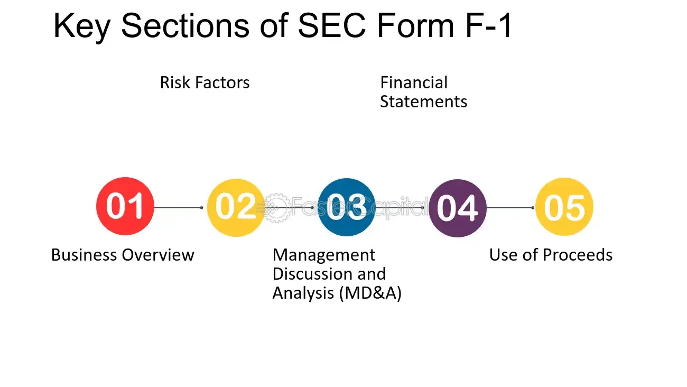

## Table of Contents

## What is SEC Form F-1?

SEC Form F-1 is a document that foreign companies need to fill out when they want to sell their stocks or other securities in the United States. It's like a detailed report that tells investors important information about the company, such as its business, the risks involved, and how it plans to use the money it raises.

The form is important because it helps the U.S. Securities and Exchange Commission (SEC) make sure that the company is being honest and clear with investors. By requiring this form, the SEC can protect investors and maintain fairness in the market. When a foreign company completes the Form F-1 and gets it approved, it can then go ahead and offer its securities to the public in the U.S.

## Who needs to file SEC Form F-1?

Foreign companies that want to sell their stocks or securities in the United States need to file SEC Form F-1. This form is required by the U.S. Securities and Exchange Commission (SEC) to make sure that these companies provide clear and honest information to potential investors.

The form helps the SEC keep an eye on what foreign companies are doing when they want to raise money in the U.S. It's a way to protect investors by making sure they have all the important details about the company, like its business, the risks involved, and how it plans to use the money it raises. Once the SEC approves the Form F-1, the foreign company can then offer its securities to the public in the U.S.

## What is the purpose of filing SEC Form F-1?

The main purpose of filing SEC Form F-1 is to let foreign companies sell their stocks or securities in the United States. When a company from another country wants to raise money by selling its securities to U.S. investors, it needs to fill out this form. This helps the U.S. Securities and Exchange Commission (SEC) keep track of what the foreign company is doing and make sure they are following the rules.

Filing Form F-1 is important because it gives investors the information they need to make smart choices. The form includes details about the company's business, the risks involved in investing, and how the company plans to use the money it raises. By requiring this form, the SEC can protect investors and make sure that the market stays fair and honest. Once the SEC approves the Form F-1, the foreign company can then offer its securities to the public in the U.S.

## What are the key components of SEC Form F-1?

SEC Form F-1 has several important parts that help investors understand a foreign company better. The form starts with basic information about the company, like its name, where it's from, and who runs it. It also includes a detailed description of the company's business, explaining what it does, its products or services, and how it makes money. This section is crucial because it gives investors a clear picture of what the company is all about.

Another key part of Form F-1 is the section on financial information. Here, the company shares its financial statements, like balance sheets and income statements, which show how much money the company has made or lost over time. This helps investors see if the company is doing well financially. The form also includes a section on risk factors, where the company lists things that could go wrong and affect its business. This is important because it helps investors understand the potential dangers of putting their money into the company.

Lastly, Form F-1 has sections on how the company plans to use the money it raises from selling securities and details about the securities themselves. This includes information on the type of securities being offered, how many are being sold, and at what price. The form also requires the company to talk about any legal issues or past problems that could affect its business. All these parts together help the SEC make sure the company is being honest and clear with investors, so they can make informed decisions about whether to invest.

## How does the filing process of SEC Form F-1 work?

When a foreign company wants to sell its stocks or securities in the United States, it starts the process by filling out SEC Form F-1. The company gathers all the important information about its business, finances, and plans, and puts it into the form. This includes details like the company's name, what it does, how it makes money, its financial statements, and any risks investors should know about. The company also explains how it plans to use the money it raises and provides information about the securities it wants to sell. Once the form is complete, the company sends it to the U.S. Securities and Exchange Commission (SEC).

After the SEC receives the Form F-1, it starts reviewing the information to make sure everything is correct and clear. The SEC might ask the company to fix or add more details if something is missing or unclear. This back-and-forth can take some time, but it's important to make sure the form is right. Once the SEC is happy with the form and approves it, the company can then go ahead and offer its securities to the public in the U.S. This whole process helps keep the market fair and protects investors by making sure they have all the information they need to make good choices.

## What are the eligibility requirements for filing SEC Form F-1?

To file SEC Form F-1, a company must be a foreign private issuer, which means it's based outside the United States and most of its key people, like executives and board members, are not American. The company also needs to want to sell its stocks or other securities in the U.S. market. This could be the first time the company is selling securities in the U.S., or it might already have securities listed but wants to issue more.

The company has to provide a lot of information in the form, like details about its business, financial statements, and any risks investors should know about. It also needs to explain how it plans to use the money it raises. The SEC will review this information to make sure it's clear and honest. If the SEC approves the form, the company can then offer its securities to the public in the U.S.

## What are the financial disclosure requirements in SEC Form F-1?

When a foreign company fills out SEC Form F-1, it has to share a lot of financial information. This includes showing its financial statements, like balance sheets, income statements, and cash flow statements. These statements need to be for the last three years, or however long the company has been in business if it's less than three years. The company also has to explain how it made these financial statements, including the accounting rules it followed. This helps investors see how much money the company has made or lost and understand its financial health.

Besides the main financial statements, the company also has to include notes that explain more about the numbers in the statements. These notes can talk about things like how the company values its assets, any debts it has, and any special financial deals it's made. The company also needs to talk about any big changes in its financial situation since the last financial statement. All this information helps investors make smart choices about whether to buy the company's securities.

## How long does it typically take to get SEC Form F-1 approved?

The time it takes to get SEC Form F-1 approved can vary a lot. It depends on things like how complete the form is when it's first sent in, how quickly the company answers any questions the SEC has, and how busy the SEC is at the time. On average, it can take anywhere from a few months to over a year to get the form approved. 

The SEC looks at the form carefully to make sure all the information is right and clear. If the SEC finds anything missing or unclear, they will ask the company to fix it. This back-and-forth can slow things down. Once the SEC is happy with everything, they will approve the form, and the company can start selling its securities in the U.S.

## What are the common challenges faced when preparing SEC Form F-1?

Preparing SEC Form F-1 can be tough for foreign companies because it requires a lot of detailed information. One big challenge is making sure all the financial statements are correct and follow the right accounting rules. Companies have to show their balance sheets, income statements, and cash flow statements for the last three years. This means they need to make sure their numbers are right and that they can explain how they came up with them. If there are any mistakes or if the information is not clear, the SEC might ask for more details, which can take more time and effort.

Another challenge is explaining the company's business and the risks involved in a way that U.S. investors can understand. The company has to write about what it does, how it makes money, and any big risks that could affect its business. This can be hard because the company needs to make sure the information is clear and honest. If the SEC thinks something is missing or not clear enough, they will ask the company to fix it. This back-and-forth can make the whole process longer and more complicated.

## How does SEC Form F-1 differ from other SEC registration forms like S-1?

SEC Form F-1 and SEC Form S-1 are both used for registering securities to be sold to the public, but they are for different kinds of companies. Form F-1 is for foreign companies that want to sell their stocks or other securities in the United States. These companies are called foreign private issuers, and most of their important people, like executives and board members, are not American. On the other hand, Form S-1 is for companies based in the United States. So, the main difference is the location of the company filing the form.

Both forms require a lot of the same information, like details about the company's business, financial statements, and any risks for investors. But because Form F-1 is for foreign companies, it might need extra information to help U.S. investors understand the company better. For example, a foreign company might need to explain how its home country's laws and business practices could affect its business in the U.S. This makes Form F-1 a bit more complicated for foreign companies to fill out compared to Form S-1 for U.S. companies.

## What are the recent changes or updates to SEC Form F-1 regulations?

The U.S. Securities and Exchange Commission (SEC) keeps an eye on the rules for SEC Form F-1 and sometimes makes changes to keep up with new situations. One big change that happened a few years ago was about how companies talk about their risks. Now, companies have to be more detailed about what could go wrong and how it might affect their business. This helps investors understand the dangers better before they decide to buy the company's securities.

Another change has to do with how quickly companies need to share important news. If something big happens that could change how investors see the company, they have to tell the SEC faster than before. This makes sure that investors always have the latest information to make good choices. These updates show that the SEC wants to keep the market fair and protect investors by making sure they have all the facts they need.

## What strategies can be employed to ensure a successful SEC Form F-1 filing?

To make sure a foreign company's SEC Form F-1 filing goes smoothly, it's important to start by putting together a good team. This team should include people who know a lot about the rules the SEC has, like lawyers and accountants. They can help make sure all the information in the form is right and follows the rules. It's also a good idea to work with experts who understand the U.S. market and can help explain the company's business in a way that U.S. investors will understand. By having a strong team, the company can get through the filing process faster and with fewer problems.

Another key part of a successful filing is to be very careful and detailed when filling out the form. The company needs to make sure all the financial statements are correct and that they explain any risks clearly. If the SEC finds anything missing or unclear, they will ask for more information, which can slow things down. So, it's important to double-check everything before sending it in. Also, the company should be ready to answer any questions the SEC might have quickly. By being thorough and responsive, the company can increase its chances of getting the form approved without too many delays.

## References & Further Reading

[1]: ["SEC Form F-1 Registration Statement"](https://www.sec.gov/files/formf-1.pdf) on the U.S. Securities and Exchange Commission website.

[2]: ["Algorithmic Trading: Winning Strategies and Their Rationale"](https://www.wiley.com/en-us/Algorithmic+Trading%3A+Winning+Strategies+and+Their+Rationale-p-9781118460146) by Ernest P. Chan.

[3]: Barth, J. R., Tatom, J. A., & Yago, G. (Eds.). (2009). ["Financial Markets and Institutions: A European Perspective"](https://link.springer.com/book/10.1007/978-0-387-93769-4). Springer.

[4]: Narang, R. K. (2013). ["Inside the Black Box: A Simple Guide to Quantitative and High-Frequency Trading"](https://onlinelibrary.wiley.com/doi/book/10.1002/9781118662717). Wiley.

[5]: ["The Journal of Finance"](https://onlinelibrary.wiley.com/journal/15406261) for articles on IPOs and algorithmic trading research.