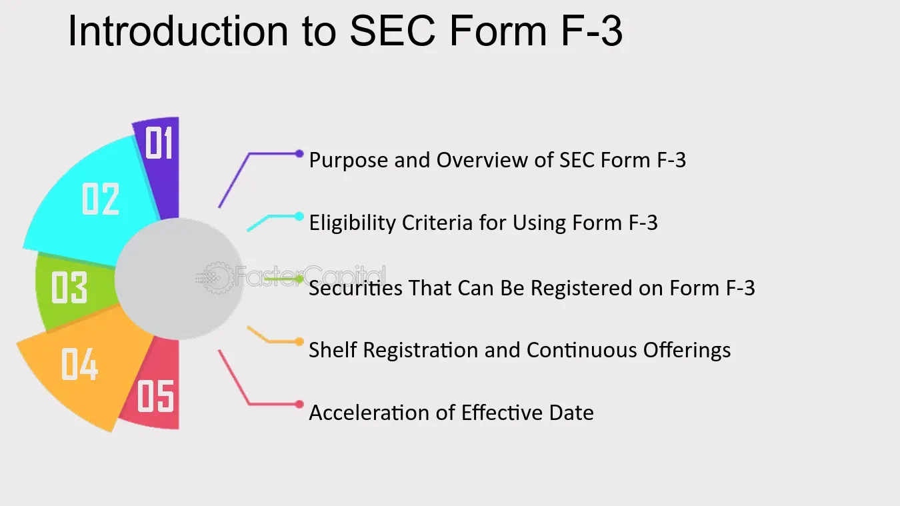

## Table of Contents

## What is SEC Form F-3?

SEC Form F-3 is a document that foreign companies use when they want to offer and sell securities in the United States. It's like a simplified registration form that makes it easier for these companies to raise money from American investors. The Securities and Exchange Commission (SEC) created this form to help streamline the process for well-known and established foreign companies.

To use Form F-3, a company must meet certain requirements. For example, it needs to have been reporting to the SEC for at least 12 months and must have filed all the necessary documents on time. This form is popular because it's less detailed than other forms, which means less paperwork and faster approval. This can save time and money for the company looking to sell securities.

## What is the primary purpose of filing SEC Form F-3?

The main reason a company files SEC Form F-3 is to offer and sell securities in the United States. This form is used by foreign companies that want to raise money from American investors. It's a simpler way for these companies to register their securities, making the process easier and quicker.

To use Form F-3, a company must meet certain rules set by the SEC. They need to have been reporting to the SEC for at least a year and must have filed all their required documents on time. This form is popular because it requires less paperwork than other forms, which can save the company time and money when they want to sell securities.

## Who is eligible to file SEC Form F-3?

Foreign companies that want to sell securities in the United States can use SEC Form F-3. This form is for companies that are already well-known and have been reporting to the SEC for at least a year. They also need to have filed all their required documents on time. This makes it easier for them to raise money from American investors.

Using Form F-3 is simpler than other forms because it requires less paperwork. This can save the company time and money when they want to sell securities. The SEC created this form to help these companies go through the process more quickly and easily.

## How does SEC Form F-3 differ from other SEC registration forms?

SEC Form F-3 is different from other SEC registration forms because it is specifically designed for foreign companies that want to sell securities in the United States. Unlike other forms, Form F-3 is easier to use and requires less paperwork. This makes it quicker for these companies to raise money from American investors. To use Form F-3, a company must have been reporting to the SEC for at least a year and must have filed all their required documents on time.

Other SEC registration forms, like Form S-1, are more detailed and can take longer to complete. Form S-1 is used by companies, both domestic and foreign, that are new to the market or do not meet the criteria for simpler forms like F-3. These forms require more information about the company's business, financials, and risks, which can make the process slower and more expensive. Form F-3 is a streamlined option for well-established foreign companies, helping them save time and money when they want to sell securities.

## What types of securities can be registered using SEC Form F-3?

SEC Form F-3 can be used by foreign companies to register different types of securities in the United States. These securities can include common stock, which are shares that represent ownership in the company. They can also include preferred stock, which gives shareholders certain advantages like fixed dividends. Debt securities, like bonds, can also be registered using Form F-3. These are loans to the company that pay interest over time.

In addition to these, Form F-3 can be used to register warrants, which give the holder the right to buy stock at a certain price in the future. It can also be used for rights offerings, where existing shareholders get the chance to buy more shares before they are offered to the public. This form is versatile and allows foreign companies to offer a variety of securities to American investors, making it easier for them to raise money.

## What are the specific requirements for a company to use SEC Form F-3?

To use SEC Form F-3, a foreign company needs to meet certain rules set by the SEC. The company must have been reporting to the SEC for at least 12 months. This means they have been regularly sending in information about their business and finances. They also need to have filed all their required documents on time. This shows that the company is responsible and follows the rules.

These requirements make sure that only well-established and reliable foreign companies can use Form F-3. The form is simpler than other registration forms, so it saves time and money. It's a good option for companies that want to sell securities like stocks, bonds, or warrants to American investors without going through a long and complicated process.

## How does the eligibility for SEC Form F-3 benefit foreign private issuers?

The eligibility for SEC Form F-3 helps foreign private issuers by making it easier for them to sell securities in the United States. If a foreign company has been reporting to the SEC for at least a year and has filed all their documents on time, they can use this form. This means less paperwork and a quicker process, which saves the company time and money. It's like a fast track for well-known and reliable foreign companies to raise money from American investors.

Using Form F-3 is a big advantage because it's simpler than other forms. For example, Form S-1 requires more detailed information and can take longer to complete. By using Form F-3, a foreign company can quickly offer securities like stocks, bonds, or warrants to the U.S. market. This streamlined process helps these companies focus more on their business and less on the paperwork, making it easier to grow and expand.

## What are the advantages of using SEC Form F-3 for a company?

Using SEC Form F-3 has big advantages for a foreign company that wants to sell securities in the U.S. The main benefit is that it's a lot simpler and quicker than other forms. If a company has been reporting to the SEC for at least a year and has filed all their documents on time, they can use Form F-3. This means less paperwork and less time waiting for approval. This can save the company a lot of time and money, which is really helpful for businesses that want to grow.

Another advantage is that Form F-3 lets companies offer different types of securities, like stocks, bonds, and warrants, to American investors. This flexibility makes it easier for the company to raise money in the way that works best for them. By using Form F-3, a well-known and reliable foreign company can focus more on their business and less on the complicated process of selling securities. This helps them expand and reach more investors in the U.S. market.

## Can you explain the process of filing SEC Form F-3?

Filing SEC Form F-3 is a process that foreign companies use to sell securities in the United States. First, the company needs to make sure they meet the rules to use Form F-3. They must have been reporting to the SEC for at least a year and filed all their documents on time. Once they know they qualify, they gather all the information they need about the securities they want to sell, like stocks, bonds, or warrants. They fill out the form with details about their company and the securities, and then they send it to the SEC.

After the company submits Form F-3, the SEC reviews it to make sure everything is correct and complete. This review process is usually faster than with other forms because Form F-3 is simpler. If the SEC has any questions or needs more information, they will contact the company. Once the SEC approves the form, the company can start selling their securities to American investors. This streamlined process helps the company save time and money, making it easier for them to raise funds in the U.S. market.

## What are the common mistakes to avoid when filing SEC Form F-3?

When filing SEC Form F-3, it's important for companies to make sure they meet all the rules. A common mistake is not checking if they have been reporting to the SEC for at least a year and if they have filed all their documents on time. If a company doesn't meet these requirements, they can't use Form F-3 and their filing will be rejected. Another mistake is not including all the required information about the securities they want to sell, like stocks, bonds, or warrants. Missing details can delay the process and cause problems with the SEC.

Another common error is not double-checking the form for accuracy before sending it in. Small mistakes or typos can lead to the SEC asking for more information or even rejecting the filing. It's also important for companies to respond quickly if the SEC has any questions or needs more details. Ignoring these requests can slow down the approval process. By avoiding these mistakes, companies can make sure their Form F-3 filing goes smoothly and they can start selling their securities to American investors without delays.

## How has the use of SEC Form F-3 evolved over time?

The use of SEC Form F-3 has changed a lot since it was first created. It was made to help foreign companies sell securities in the U.S. more easily. Over time, more and more foreign companies started using it because it's simpler and faster than other forms. This made it easier for them to raise money from American investors. The SEC also made some updates to the rules to make sure only reliable companies could use it.

Today, Form F-3 is still a popular choice for foreign companies. It's used a lot because it saves time and money. Companies that have been reporting to the SEC for at least a year and have filed all their documents on time can use it. This helps them focus on growing their business instead of dealing with complicated paperwork. The form has become a key tool for well-known foreign companies looking to expand in the U.S. market.

## What are the potential impacts of regulatory changes on the use of SEC Form F-3?

Changes in regulations can affect how foreign companies use SEC Form F-3. If the rules become stricter, fewer companies might be able to use the form. For example, if the SEC decides that companies need to have been reporting for longer than a year, or if they need to meet new financial requirements, this could limit who can use Form F-3. On the other hand, if the rules get easier, more companies might be able to use it, making it simpler for them to sell securities in the U.S.

These regulatory changes can also impact how quickly companies can raise money. If the rules change and make the form more complicated, it might take longer for the SEC to approve the filings. This could slow down the process of selling securities and affect the company's plans to grow. But if the changes make the form simpler, it could speed up the process, helping companies get the funds they need faster and more easily.

## How do automation and algorithmic trading impact securities offerings?

Automation and [algorithmic trading](/wiki/algorithmic-trading) are transforming the landscape of securities offerings, bringing enhanced efficiency and precision to the execution of trades. Foreign issuers utilizing SEC Form F-3 stand to gain significantly from these technological advancements. By leveraging sophisticated algorithms, issuers can optimize their trading strategies, allowing for improved decision-making and a more streamlined process when accessing U.S. capital markets.

Algorithmic trading employs complex mathematical models and formulas to execute orders at the best possible prices, taking into account various market conditions. This is particularly beneficial for high-frequency trading environments, where speed and accuracy are crucial. The formula for a basic algorithmic trading model might involve parameters such as price, time, and [volume](/wiki/volume-trading-strategy). For instance, a simple moving average (SMA) could be calculated using:

$$
\text{SMA} = \frac{1}{n} \sum_{i=0}^{n-1} P_i
$$

where $P_i$ is the price at time $i$ and $n$ is the number of time periods.

Foreign issuers can implement these strategies to not only execute large volumes of trades efficiently but also to minimize market impact and transaction costs. The integration of algorithmic approaches can enhance [liquidity](/wiki/liquidity-risk-premium) availability and provide deeper market insights, allowing companies to react swiftly to market fluctuations.

Moreover, automation in trading enables issuers to process vast amounts of data rapidly, providing actionable insights that were previously unattainable through manual methods. This capability is critical in the modern financial landscape, where data-driven decisions often determine the success of capital-raising activities.

By adopting algorithmic trading strategies, companies using SEC Form F-3 can maintain a competitive edge. The advantages of speed, efficiency, and market adaptability underscore the importance of integrating such technologies in capital markets. Moving towards these automated systems helps ensure that foreign issuers can effectively meet their financial objectives while complying with regulatory standards.

## References & Further Reading

[1]: SEC. (1933). ["Securities Act of 1933."](https://www.govinfo.gov/content/pkg/COMPS-1884/pdf/COMPS-1884.pdf)

[2]: SEC. ["Instructions for Form F-3."](https://www.sec.gov/about/forms/formf-3.pdf)

[3]: [Gordon, J.N. (2016). "Form F-3 and the Foreign Issuer: Facilitating Capital Formation."](https://en.wikipedia.org/wiki/List_of_United_States_Navy_people) Journal of International Finance.

[4]: ["International Finance and the U.S. Regulatory Framework"](https://crsreports.congress.gov/product/pdf/R/R44918/8) by D. M. Smith

[5]: ["Securities Regulation: Cases and Materials"](https://scholarship.law.columbia.edu/books/342/) (13th ed.) by J.C. Coffee, H. Sale, & R.J. Jackson

[6]: U.S. Securities and Exchange Commission. ["Fast Answers: Shelf Offerings."](https://www.investopedia.com/terms/s/shelfoffering.asp) 

[7]: Lopez de Prado, M. (2018). ["Advances in Financial Machine Learning."](https://www.amazon.com/Advances-Financial-Machine-Learning-Marcos/dp/1119482089) Wiley. 

[8]: Chan, E. P. (2009). ["Quantitative Trading: How to Build Your Own Algorithmic Trading Business."](https://github.com/ftvision/quant_trading_echan_book) Wiley.