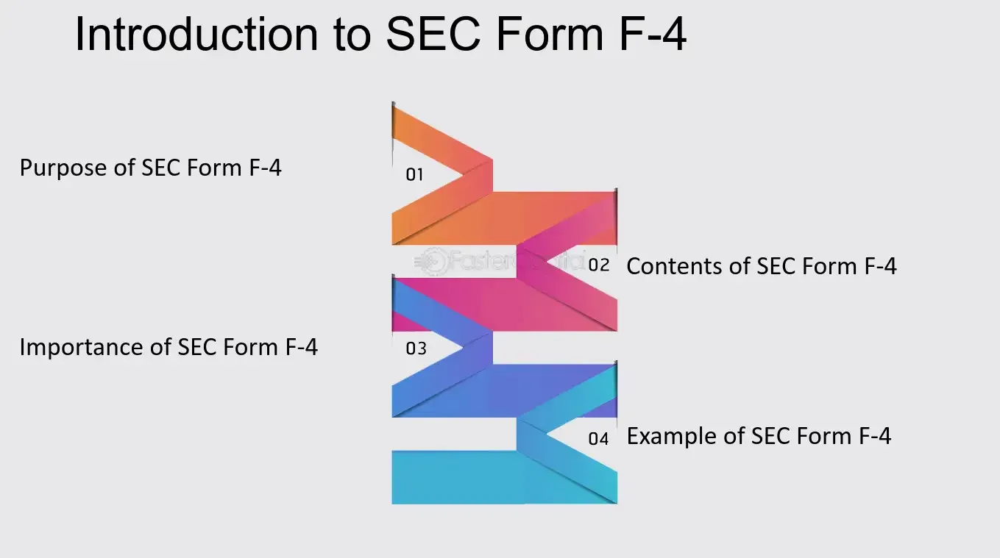

## Table of Contents

## What is SEC Form F-4?

SEC Form F-4 is a document that companies use when they want to merge or acquire another company. It is filed with the Securities and Exchange Commission (SEC) in the United States. The form provides important information about the deal, like the terms of the merger or acquisition, and details about the companies involved. This helps investors make informed decisions about whether to buy, sell, or hold their shares in the companies.

The form is especially used when the deal involves a foreign company and a U.S. company. It includes information about the securities being offered, like stocks or bonds, and any potential risks involved. By making this information public, the SEC ensures that the process is transparent and that investors have all the necessary details to understand the transaction. This helps maintain trust in the financial markets.

## Who is required to file SEC Form F-4?

SEC Form F-4 is filed by companies that are involved in a merger or acquisition where a foreign company is offering securities to U.S. investors. This form is needed when the foreign company wants to give stocks, bonds, or other securities to shareholders of a U.S. company as part of the deal.

The companies that need to file this form include the foreign company making the offer and sometimes the U.S. company that is being acquired. By filing Form F-4, these companies make sure that U.S. investors have all the important information they need about the merger or acquisition. This helps investors decide what to do with their shares in the companies involved.

## What is the primary purpose of SEC Form F-4?

The main goal of SEC Form F-4 is to give important details about a merger or acquisition to investors. When a foreign company wants to merge with or buy a U.S. company, they use this form to share information about the deal. This includes things like what the terms of the merger or acquisition are, and what kinds of securities, like stocks or bonds, are being offered.

By filing Form F-4, companies make sure that U.S. investors know everything they need to make good choices about their investments. This helps keep the process open and honest, so investors can trust that they have all the facts. The form helps maintain trust in the financial markets by making sure everyone has the same information.

## How does SEC Form F-4 differ from other SEC forms?

SEC Form F-4 is different from other SEC forms because it is used specifically for mergers and acquisitions that involve a foreign company offering securities to U.S. investors. While other forms like Form S-4 are used for similar purposes but for domestic companies, Form F-4 focuses on transactions where at least one company is from outside the U.S. This means that Form F-4 includes special information that helps U.S. investors understand the risks and details of dealing with a foreign company.

Another key difference is that Form F-4 is part of the SEC's efforts to ensure transparency in international transactions. Unlike forms such as Form 10-K, which companies file annually to provide a comprehensive overview of their financial health, or Form 8-K, which is used for reporting significant events, Form F-4 is specifically tailored to the unique needs of cross-border mergers and acquisitions. It helps investors make informed decisions by providing detailed information about the securities being offered and the terms of the deal, ensuring that the complexities of international business are clearly communicated.

## What are the key components of SEC Form F-4?

SEC Form F-4 has several important parts that help investors understand a merger or acquisition involving a foreign company. The form includes details about the deal, such as what the terms are and what kinds of securities, like stocks or bonds, are being offered. It also explains how the merger or acquisition will work and what shareholders need to do. This information is crucial for investors to decide if they want to keep, sell, or buy more shares in the companies involved.

Another key part of Form F-4 is the information about the companies themselves. It tells investors about the foreign company and the U.S. company, including their financial health and any potential risks of the deal. This helps investors understand if the merger or acquisition is a good idea. By providing all this information, Form F-4 makes sure that the process is clear and open, so investors can trust the information they are getting.

## What information must be included in SEC Form F-4?

SEC Form F-4 must include details about the merger or acquisition, like what the terms are and what kinds of securities, such as stocks or bonds, are being offered. It also explains how the merger or acquisition will happen and what shareholders need to do. This information helps investors decide if they want to keep, sell, or buy more shares in the companies involved.

The form also needs to have information about the companies themselves. It tells investors about the foreign company and the U.S. company, including their financial health and any risks that might come with the deal. This helps investors understand if the merger or acquisition is a good idea. By including all this information, Form F-4 makes sure that the process is clear and open, so investors can trust the information they are getting.

## How is SEC Form F-4 structured?

SEC Form F-4 is divided into different sections to help explain a merger or acquisition between a foreign company and a U.S. company. The form starts with a summary of the deal, which tells investors about the main terms of the merger or acquisition. It also explains what kinds of securities, like stocks or bonds, are being offered. This part helps investors understand what they need to do with their shares.

Next, the form includes detailed information about the companies involved. It talks about the financial health of both the foreign company and the U.S. company, and any risks that might come with the deal. This section is important because it helps investors decide if the merger or acquisition is a good idea. By putting all this information in one place, Form F-4 makes sure that the process is clear and open, so investors can trust the information they are getting.

## What are the filing requirements and deadlines for SEC Form F-4?

When a foreign company wants to merge with or buy a U.S. company, they need to file SEC Form F-4 with the Securities and Exchange Commission. The form must be filed before the deal can happen. This is to make sure that U.S. investors have all the information they need about the merger or acquisition. The company usually files the form as soon as they have all the details about the deal ready.

There isn't a strict deadline for filing Form F-4, but it's important to file it early enough so that investors have time to review the information before they need to make decisions about their shares. The SEC reviews the form to make sure it has all the necessary details. If the SEC finds any problems or missing information, they might ask the company to fix it before the deal can go forward. This process helps keep everything open and honest, so investors can trust the information they get.

## What are the common challenges faced when preparing SEC Form F-4?

Preparing SEC Form F-4 can be challenging because it involves a lot of detailed information about the merger or acquisition. Companies need to make sure they include all the important details about the deal, like what the terms are and what kinds of securities, like stocks or bonds, are being offered. They also need to explain how the merger or acquisition will happen and what shareholders need to do. If any important information is missing or not clear, the SEC might ask the company to fix it before the deal can go forward. This can delay the process and make it more complicated.

Another challenge is that the form requires information about the financial health of both the foreign company and the U.S. company. This means the companies need to gather a lot of data and make sure it's accurate. They also need to explain any risks that might come with the deal. This can be hard because it involves understanding and explaining complex financial and business information. By making sure all this information is included and clear, companies help investors make good choices about their investments, but it takes a lot of work and attention to detail.

## How can companies ensure compliance when filing SEC Form F-4?

Companies can make sure they follow the rules when filing SEC Form F-4 by being very careful and thorough. They need to include all the important details about the merger or acquisition, like the terms of the deal and what kinds of securities, like stocks or bonds, are being offered. They also have to explain how the merger or acquisition will happen and what shareholders need to do. If any information is missing or not clear, the SEC might ask the company to fix it, which can delay the process. So, it's important for companies to double-check everything and make sure all the information is accurate and complete.

Another way companies can ensure compliance is by working with experts, like lawyers and accountants, who know a lot about SEC rules. These experts can help make sure the form has all the right information about the financial health of both the foreign company and the U.S. company. They can also help explain any risks that might come with the deal. By getting help from these experts, companies can make sure they are following all the rules and that the information they give to investors is clear and trustworthy. This helps keep the process open and honest, so investors can make good choices about their investments.

## What are the implications of SEC Form F-4 for mergers and acquisitions?

SEC Form F-4 is very important for mergers and acquisitions because it helps investors understand what is happening. When a foreign company wants to merge with or buy a U.S. company, they have to file this form. It tells investors about the deal, like what the terms are and what kinds of securities, like stocks or bonds, are being offered. This information helps investors decide if they want to keep, sell, or buy more shares in the companies involved. By making sure all this information is shared, the form helps keep the process clear and honest, so investors can trust the information they get.

Another big impact of SEC Form F-4 is that it can affect how quickly a merger or acquisition happens. The form needs to be filed before the deal can go forward, and the SEC checks it to make sure all the important details are included. If something is missing or not clear, the SEC might ask the company to fix it, which can delay the deal. This means companies need to be very careful and thorough when they prepare the form. By getting everything right the first time, companies can help make sure the merger or acquisition goes smoothly and quickly.

## How have recent regulatory changes affected the use of SEC Form F-4?

Recent changes in regulations have made it easier for companies to use SEC Form F-4 for mergers and acquisitions. The SEC has updated some rules to make the process simpler and faster. For example, they now allow more flexibility in how companies can share information with investors. This means companies can use new ways to explain the deal, like videos or online presentations, which can make it easier for investors to understand what is happening.

These changes also mean that companies need to be more careful about the information they include in Form F-4. The SEC now has stricter rules about making sure all the details are accurate and complete. If companies miss something or if the information is not clear, the SEC might ask them to fix it before the deal can go forward. This can delay the merger or acquisition, so companies need to be very thorough when they prepare the form.

## References & Further Reading

[1]: Lipton, A., & Hardiman, S. (2020). ["Algorithmic Trading and Machine Learning."](https://github.com/kevincdurand1/Machine-Learning-for-Algorithmic-Trading-Second-Edition) Quantitative Finance, 20(8), 1183-1197.

[2]: Koller, T., Goedhart, M., & Wessels, D. (2015). ["Valuation: Measuring and Managing the Value of Companies,"](https://www.mckinsey.com/capabilities/strategy-and-corporate-finance/our-insights/valuation-measuring-and-managing-the-value-of-companies) 6th Edition, Wiley Finance.

[3]: Securities and Exchange Commission. ["General Instructions for Form F-4."](https://www.sec.gov/files/formf-4.pdf)

[4]: DePamphilis, D. M. (2019). ["Mergers, Acquisitions, and Other Restructuring Activities: An Integrated Approach to Process, Tools, Cases, and Solutions,"](https://www.sciencedirect.com/book/9780128016091/mergers-acquisitions-and-other-restructuring-activities) Academic Press.

[5]: Hasbrouck, J. (2007). ["Empirical Market Microstructure: The Institutions, Economics, and Econometrics of Securities Trading."](https://academic.oup.com/book/52241) Oxford University Press.

[6]: Goergen, M. (2018). ["The Case for Clarifying Corporate Mergers and Acquisitions Research."](https://www.profmarcgoergen.com/p/my-publications.html) Wiley Encyclopedia of Management.

[7]: U.S. Securities and Exchange Commission. ["Securities Act of 1933."](https://www.sec.gov/rules-regulations/statutes-regulations)