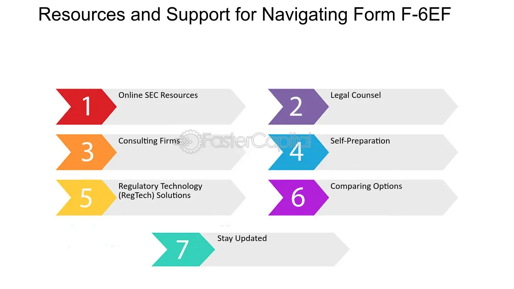

## Table of Contents

## What is SEC Form F-6?

SEC Form F-6 is a form that companies use when they want to register securities that will be part of an American Depositary Receipt (ADR) program. An ADR is a way for non-U.S. companies to have their stocks traded on U.S. stock exchanges. The form helps the U.S. Securities and Exchange Commission (SEC) keep track of these securities and make sure everything is done correctly.

Filing Form F-6 is important because it gives the SEC all the details they need about the ADR program. This includes information about the foreign company, the type of securities being offered, and how the ADRs will work. By using this form, the SEC can protect investors and make sure that the ADR program follows all the rules.

## Who needs to file SEC Form F-6?

SEC Form F-6 needs to be filed by banks or other financial institutions that want to start an American Depositary Receipt (ADR) program. An ADR program lets people in the U.S. buy and sell shares of a foreign company on American stock exchanges. The bank or financial institution acts as a depositary and needs to register the securities that will be part of the ADR program with the SEC.

The form is important because it helps the SEC keep track of these securities and make sure everything is done correctly. When a bank or financial institution files Form F-6, they provide all the necessary information about the foreign company, the type of securities being offered, and how the ADRs will work. This helps the SEC protect investors and ensure that the ADR program follows all the rules.

## What is the purpose of filing Form F-6?

The main reason for filing Form F-6 is to register securities that will be used in an American Depositary Receipt (ADR) program. This form is filed by banks or other financial institutions that want to help a foreign company have its stocks traded on U.S. stock exchanges. By filing Form F-6, the bank or financial institution gives the U.S. Securities and Exchange Commission (SEC) all the important details about the foreign company and the securities involved.

Filing Form F-6 helps the SEC keep track of these securities and make sure everything is done the right way. It's important because it helps protect investors by making sure the ADR program follows all the rules. When the SEC has all the information from Form F-6, they can make sure that the ADR program is set up correctly and that people in the U.S. can safely buy and sell the foreign company's stocks.

## What are the eligibility criteria for using Form F-6?

To use Form F-6, the bank or financial institution setting up the American Depositary Receipt (ADR) program must be eligible to act as a depositary. This means they must be a bank or trust company that is in good standing and authorized to act as a depositary by the SEC. The foreign company whose securities will be part of the ADR program must also meet certain requirements, such as being a foreign private issuer as defined by the SEC.

Additionally, the securities being registered through Form F-6 must be eligible for the ADR program. This typically includes equity securities like stocks or shares that are already issued and outstanding in the foreign company's home market. The form must include detailed information about the securities, the terms of the deposit agreement, and how the ADRs will be issued and traded in the U.S. This ensures that the SEC has all the information needed to approve the registration and protect investors.

## How does one apply for Form F-6 registration?

To apply for Form F-6 registration, the bank or financial institution that wants to start an American Depositary Receipt (ADR) program needs to prepare the form. They will fill out the form with all the important details about the foreign company and the securities that will be part of the ADR program. This includes information about the type of securities, how the ADRs will work, and the terms of the deposit agreement. Once the form is complete, they need to file it with the U.S. Securities and Exchange Commission (SEC).

After filing Form F-6, the SEC will review the application to make sure everything is in order. The SEC will check that the bank or financial institution is eligible to act as a depositary and that the foreign company meets the requirements to be part of an ADR program. If everything is correct and follows the rules, the SEC will approve the registration. This allows the ADRs to be traded on U.S. stock exchanges, helping investors in the U.S. buy and sell the foreign company's stocks.

## What are the key components of Form F-6?

Form F-6 is a document that banks or financial institutions fill out when they want to start an American Depositary Receipt (ADR) program. The form includes important information about the foreign company whose stocks will be part of the ADR program. This includes the company's name, where it is based, and details about the securities that will be used in the ADR program. The form also has information about the bank or financial institution that is setting up the ADR program, like their name and contact details.

Another key part of Form F-6 is the description of how the ADRs will work. This includes the terms of the deposit agreement, which explains how the ADRs will be issued and traded in the U.S. The form also needs to include any fees that might be charged to investors and how the ADRs can be exchanged back into the original foreign securities. All this information helps the U.S. Securities and Exchange Commission (SEC) make sure that the ADR program follows the rules and protects investors.

## What are the fees associated with filing Form F-6?

When a bank or financial institution files Form F-6 with the SEC, they need to pay a fee. This fee is called a filing fee, and it is based on the value of the securities that will be part of the ADR program. The SEC uses a formula to figure out how much the fee will be. The more valuable the securities, the higher the fee will be. This fee helps the SEC cover the costs of reviewing and processing the form.

Besides the filing fee, there might be other costs involved with setting up an ADR program. These can include legal fees for getting advice on how to fill out the form correctly and any fees charged by the stock exchange where the ADRs will be traded. It's important for the bank or financial institution to consider all these costs when planning to start an ADR program.

## How long does the SEC review process for Form F-6 typically take?

The time it takes for the SEC to review Form F-6 can vary. Usually, it takes about 30 days, but it can take longer if the SEC has questions or needs more information about the ADR program. The SEC looks at the form to make sure everything is correct and follows the rules.

Sometimes, the SEC might ask for more details or changes to the form. If this happens, the bank or financial institution needs to send back the updated information. This can make the review process take longer, so it's important to be ready to answer any questions the SEC might have quickly.

## What are common reasons for Form F-6 rejection?

Form F-6 can be rejected if it is not filled out correctly. This means that all the information about the foreign company and the securities must be complete and accurate. If there are any mistakes or missing details, the SEC might send the form back and ask for corrections. For example, if the name of the foreign company or the type of securities is not clear, the form could be rejected.

Another reason for rejection is if the bank or financial institution setting up the ADR program does not meet the eligibility requirements. They must be in good standing and authorized to act as a depositary. If they are not, the SEC will not approve the form. Also, the foreign company must meet the SEC's definition of a foreign private issuer. If any of these requirements are not met, the Form F-6 will be rejected, and the ADR program cannot go forward.

## How can amendments be made to a Form F-6 filing?

If you need to make changes to a Form F-6 after it has been filed, you can do this by filing an amendment. The amendment is called Form F-6/A. You fill out this form with the new or corrected information and send it to the SEC. This could be because you found a mistake in the original form, or because something about the ADR program or the foreign company has changed.

The SEC will review the amendment just like they did with the original Form F-6. They will check to make sure the new information is correct and follows all the rules. If everything is okay, they will approve the amendment. This keeps the information about the ADR program up to date and helps protect investors by making sure they have the right details about the foreign company's securities.

## What are the ongoing reporting requirements after filing Form F-6?

After filing Form F-6 and setting up an ADR program, the bank or financial institution needs to keep the SEC updated with ongoing reports. These reports make sure that investors have the latest information about the foreign company and the securities in the ADR program. The main report that needs to be filed is called Form 20-F, which is an annual report. This report gives details about the foreign company's financials, operations, and any important changes that happened during the year.

Besides the annual report, there might be other reports that need to be filed if something big happens with the foreign company or the ADR program. For example, if there is a big change in the company's management or if there are new securities being added to the ADR program, a special report might be needed. Keeping these reports up to date helps the SEC make sure that everything is still following the rules and that investors are protected.

## How does Form F-6 relate to other SEC forms and international securities regulations?

Form F-6 is closely related to other SEC forms and international securities regulations because it is used to register securities for an American Depositary Receipt (ADR) program. When a foreign company wants its stocks to be traded on U.S. stock exchanges, they need to work with a bank or financial institution that files Form F-6. This form is connected to other SEC forms like Form 20-F, which is the annual report that the foreign company must file to keep investors informed about its financials and operations. By filing these forms, the SEC can keep track of the foreign company's activities and make sure they follow U.S. securities laws.

Additionally, Form F-6 ties into international securities regulations because it helps bridge the gap between the foreign company's home market and the U.S. market. The ADR program allows U.S. investors to buy and sell the foreign company's stocks more easily. However, the foreign company still needs to comply with its home country's regulations as well as U.S. rules. This means that the bank or financial institution setting up the ADR program must understand both sets of regulations to make sure everything is done correctly. By doing this, they can ensure that the ADR program operates smoothly and legally in both markets.

## References & Further Reading

[1]: ["SEC Form F-6"](https://www.sec.gov/files/formf-6.pdf) - Official document from the U.S. Securities and Exchange Commission.

[2]: Lopez de Prado, M. (2018). ["Advances in Financial Machine Learning"](https://www.amazon.com/Advances-Financial-Machine-Learning-Marcos/dp/1119482089) - Wiley.

[3]: Chan, E. P. (2008). ["Quantitative Trading: How to Build Your Own Algorithmic Trading Business"](https://github.com/ftvision/quant_trading_echan_book) - Wiley.

[4]: Pilbeam, K. (2018). ["International Finance"](https://books.google.com/books/about/International_Finance.html?id=K7OvEAAAQBAJ) - Palgrave Macmillan.

[5]: "Algorithmic Trading and the Risk of Flash Crashes" by Jonathan Brogaard, Terrence Hendershott & Ryan Riordan. The study discusses the impact of high-frequency trading and was published in *Financial Analysts Journal*.