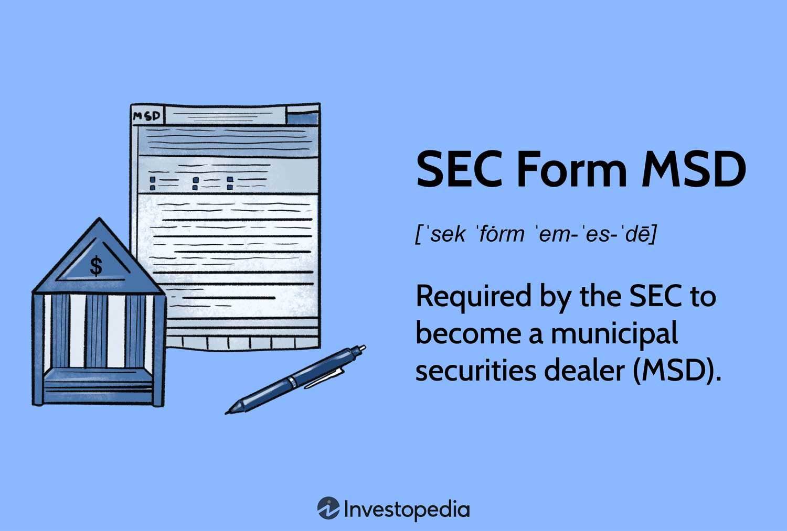

Understanding the regulatory landscape in the financial market is essential for municipal securities dealers, as this field is tightly controlled to ensure market stability and investor protection. Municipal securities dealers, entities that buy and sell securities issued by local governments, play a pivotal role in the financial ecosystem. Their activities are vital for the functioning of the municipal bond market, which local governments rely on to raise funds for public projects and services.

A critical component of regulatory compliance for these dealers is adherence to the Securities Exchange Act of 1934. A central aspect of this compliance framework is the SEC Form MSD, which serves as a registration requirement for banks and financial institutions acting as municipal securities dealers. This form helps the Securities and Exchange Commission (SEC) maintain oversight and enforce accountability and transparency in the municipal securities market.

In recent years, technological advancements have significantly impacted the trading environment, introducing new methodologies like algorithmic trading. This modern approach leverages computer algorithms to execute trades at high speed and with precision, altering how municipal securities are traded. Algorithmic trading can enhance liquidity and reduce costs but also presents new regulatory challenges for municipal securities dealers. These challenges necessitate balancing innovation with rigorous compliance to adapt to an evolving landscape effectively.

This article aims to provide a comprehensive overview that explores the critical intersection of municipal securities, regulations, and modern trading techniques. By examining these intertwined relationships, we offer insights that are valuable for financial professionals and enthusiasts interested in securities regulation and trading. Through exploring SEC Form MSD's role and the impacts of algorithmic trading, we aim to shed light on the complexities and opportunities present in today's financial markets.

## Table of Contents

## What Are Municipal Securities Dealers?

Municipal securities dealers are specialized financial entities engaged in the buying and selling of municipal securities, with a primary focus on municipal bonds. These dealers play a pivotal role in the financial ecosystem by ensuring liquidity within the secondary market. By providing quotes and facilitating transactions, they enable the smooth functioning of the market and ensure that both buyers and sellers can readily engage in trade.

For local governments, municipal securities dealers are indispensable. These dealers assist municipalities in raising capital by marketing and distributing municipal bonds to investors. Municipal bonds are a critical tool for local governments to finance projects such as infrastructure development, schools, and public utilities. Hence, the effectiveness of these dealers directly impacts the ability of municipalities to secure necessary funding.

The existence of municipal securities dealers is crucial for maintaining an efficient and orderly municipal bond market. They contribute to market efficiency by narrowing the bid-ask spreads and ensuring that the market prices of bonds reflect their intrinsic values. Furthermore, dealers often provide insights and analysis that help investors make informed decisions, thereby enhancing market transparency and confidence.

Investors benefit from the activities of municipal securities dealers as they offer opportunities to invest in securities that often come with tax advantages. Many municipal bonds provide tax-exempt interest income, making them an attractive option for investors seeking tax-efficient investment strategies. This aspect of municipal securities further underscores the importance of these dealers in offering valuable investment opportunities while also supporting public financing needs.

## Understanding SEC Regulation and SEC Form MSD

SEC Form MSD is a critical component of the regulatory framework governing municipal securities dealers. As mandated by the Securities Exchange Act of 1934, this form is essential for compliance and effective market functioning. The act itself was established to bring transparency and prevent fraudulent activities in the securities markets, and Form MSD plays a pivotal role in achieving these goals. 

When a bank or financial institution intends to operate as a municipal securities dealer, filing Form MSD becomes a compulsory requirement. This process officially registers the institution with the Securities and Exchange Commission (SEC) as a municipal securities dealer. Through this registration, the SEC aims to enhance the market's transparency by ensuring that only qualified entities engage in the trading and dealing of municipal securities.

The completion of SEC Form MSD requires detailed disclosure from the filing entity. Key information that must be revealed includes the institution's organizational structure, the nature of its business, and the personnel directly involved in municipal securities trading. Such disclosures are paramount for maintaining an accountable and transparent trading environment, as they allow the SEC to monitor and evaluate the participants in the municipal securities market effectively.

This requirement also serves as a mechanism to promote market stability and confidence. By compelling detailed disclosures, the SEC is better equipped to oversee trading activities and identify potential risks or irregularities. Consequently, Form MSD acts as both a gatekeeper and a tool for ongoing oversight, ensuring that municipal securities dealers operate in a manner that aligns with regulatory standards and contributes to the overall integrity of the financial system.

In summary, SEC Form MSD is a foundational element in assuring compliance, accountability, and transparency for municipal securities dealers. It aligns with the broader objectives of the Securities Exchange Act of 1934 to foster an orderly and secure financial market, thereby supporting the efficient functioning of the municipal bond market and safeguarding investor interests.

## The Impact of Algorithmic Trading on Municipal Securities

Algorithmic trading has significantly altered traditional trading practices, including those used by municipal securities dealers. By leveraging advanced technologies, [algorithmic trading](/wiki/algorithmic-trading) facilitates faster execution and more efficient pricing of municipal securities, thereby enhancing market effectiveness and offering improved outcomes for investors and issuers alike.

At its core, algorithmic trading utilizes computer algorithms to execute trades at speeds not feasible for human traders. This rapid execution capability is particularly beneficial in the municipal securities market, which traditionally experiences lower [liquidity](/wiki/liquidity-risk-premium) compared to other markets. By enabling quicker buy and sell transactions, algorithmic trading can increase market liquidity, providing more opportunities for investors to enter or [exit](/wiki/exit-strategy) positions in municipal bonds.

The efficiency brought by algorithmic trading is not only in execution speed but also in pricing. Algorithms can analyze vast amounts of market data in real-time, allowing them to identify optimal pricing strategies quickly. This data-driven approach can lead to more accurate pricing of municipal securities, ensuring that the securities are traded at fair market values, which benefits both buyers and sellers.

However, the adoption of algorithmic trading in municipal securities trading is not without its challenges. One primary concern is regulatory compliance. The introduction of these technologies necessitates adherence to existing regulations while navigating the new regulatory landscapes they create. Municipal securities dealers must ensure that their algorithmic trading systems comply with regulations such as those enforced by the U.S. Securities and Exchange Commission (SEC) to maintain market integrity and investor trust.

Importantly, the shift towards algorithmic trading demands that municipal securities dealers balance innovation with regulatory compliance. They need to develop robust systems and processes to monitor their trading activities and ensure compliance with applicable laws. This might include regular system audits, implementing real-time monitoring tools, and conducting thorough risk assessments to avoid any potential market manipulation or unfair trading practices that algorithms could inadvertently introduce.

Algorithmic trading also presents an opportunity to reduce trading costs. By automating the trading process, dealers can reduce the labor costs associated with manual trading. Additionally, the increased trading efficiency can lower bid-ask spreads, which directly benefits traders by reducing transaction costs.

In summary, algorithmic trading introduces transformative changes to municipal securities trading by enhancing execution speed, pricing efficiency, and market liquidity. However, it also raises new regulatory challenges that must be carefully managed. For municipal securities dealers, the integration of algorithmic trading technologies represents both an opportunity and a responsibility to innovate while maintaining strict compliance with regulatory standards.

## Compliance Challenges and Best Practices

Municipal securities dealers encounter several distinct challenges in ensuring compliance with SEC regulations, necessitating a proactive and well-structured approach to maintain adherence to these regulatory standards. One of the fundamental best practices is conducting regular audits. These audits are essential for evaluating a dealer’s operations and ensuring that all practices adhere to regulatory requirements. Regular audits help in identifying areas that may need improvement and ensure that any potential violations are addressed promptly.

Updating internal controls is another critical practice. As regulations evolve, internal control systems must also be updated to reflect current requirements. Internal controls refer to the mechanisms, rules, and procedures implemented by dealers to ensure the integrity of financial and accounting information, promote accountability, and prevent fraud. By updating these controls regularly, dealers can ensure that their processes remain aligned with regulatory requirements and can effectively manage any risks associated with non-compliance.

Continuous training for staff is paramount to maintaining compliance. The regulatory landscape is dynamic, and staying informed about the latest changes through training programs, workshops, and seminars can enhance the ability of staff to uphold compliance standards. Training provides employees with the necessary knowledge and skills to navigate complex regulatory requirements and [carry](/wiki/carry-trading) out their responsibilities effectively and ethically.

Staying informed about the latest regulatory changes is crucial. Regulatory bodies frequently update guidelines and regulations, and remaining informed about these changes enables dealers to adapt their practices accordingly. This can be achieved through subscriptions to relevant regulatory updates, attending industry conferences, and participating in professional networks that focus on securities regulations.

Collaborating with legal experts can greatly assist dealers in understanding complex regulatory requirements. Legal professionals who specialize in securities regulation can provide valuable insights and guidance, helping dealers to interpret and implement regulatory updates correctly. This collaboration can prevent misinterpretations of the law that may lead to compliance infractions.

Implementing robust systems to monitor trading activities is critical to preventing potential compliance issues. Technological solutions can provide real-time monitoring and reporting capabilities, enabling dealers to detect irregularities swiftly. For instance, automated systems can flag unusual trading patterns that may indicate market manipulation or other forms of non-compliance, allowing for timely intervention.

In conclusion, by adhering to best practices such as conducting regular audits, updating internal controls, providing continuous staff training, staying informed about regulatory changes, collaborating with legal experts, and implementing advanced monitoring systems, municipal securities dealers can navigate the complexities of SEC compliance effectively. This proactive approach not only safeguards the dealers but also enhances the overall integrity of the municipal securities market.

## Conclusion

Municipal securities dealers are essential to the financial markets, ensuring the smooth trading of municipal bonds that provide vital funding for local governments. By participating in this market, dealers enable liquidity and facilitate transactions, which are crucial for both issuers seeking capital and investors looking for investment opportunities. Regulatory compliance is a cornerstone for maintaining the integrity and functionality of these markets. SEC Form MSD serves as a crucial tool for registering and monitoring these dealers, ensuring transparency, accountability, and adherence to the standards set by the Securities Exchange Act of 1934.

The rise of algorithmic trading presents both opportunities and challenges for municipal securities dealers. This innovation allows for enhanced execution speed and more precise pricing in bond markets. However, the rapid integration of technology necessitates a careful balancing act between embracing innovation and adhering to existing regulatory frameworks. Combining these advances with strict compliance protocols will be pivotal for dealers to leverage the benefits while mitigating potential risks associated with high-frequency trading and algorithmic decision-making. 

Ensuring success in an evolving financial landscape requires that stakeholders maintain current knowledge of regulatory developments and technological advancements. Municipal securities dealers must embrace a culture of adaptability, frequently updating training and procedures to handle novel challenges and seize emerging opportunities. Staying informed not only ensures compliance but also positions these entities to strategically navigate the complex interactions between emerging technologies and regulatory requirements, ultimately benefiting the broader financial ecosystem.

## References & Further Reading

[1]: Hu, G., Pan, J., & Wang, J. (2019). ["The Impacts of Regulating High-Frequency Trading: What Do We Know and the Way Forward."](https://www.sciencedirect.com/science/article/pii/S2211285519307220) The Review of Financial Studies, 32(8), 2923-2956.

[2]: Securities and Exchange Commission. (1934). ["Securities Exchange Act of 1934."](https://www.sec.gov/rules-regulations/statutes-regulations)

[3]: Securities Industry and Financial Markets Association. ["Municipal Securities Market Overview."](https://www.sifma.org/committees/municipal-securities/)

[4]: Kwan, S. H. (2005). ["Risk and Return of Publicly Held Versus Privately Owned Banks."](https://resources.newyorkfed.org/medialibrary/media/research/epr/04v10n2/0409kwan.pdf) Federal Reserve Bank of San Francisco, Working Paper Series.

[5]: Petrella, G., & Resti, A. (2013). ["Supervising algorithmic trading: a comprehensive market abuse framework."](https://econpapers.repec.org/RePEc:eee:jbfina:v:37:y:2013:i:12:p:5406-5420) ESMA Economic Staff Paper Series 2013/05.

[6]: Securities and Exchange Commission. ["Municipal Securities."](https://www.sec.gov/about/divisions-offices/office-municipal-securities)