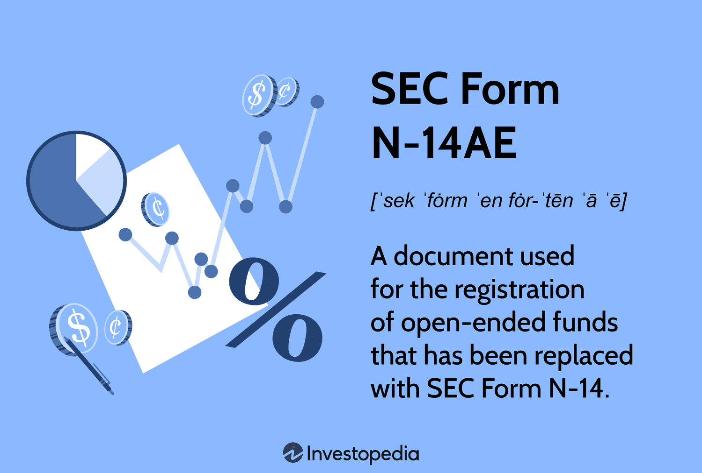

## Table of Contents

## What is SEC Form N-14?

SEC Form N-14 is a document used by investment companies when they want to merge or reorganize. It is filed with the Securities and Exchange Commission (SEC) and gives important details about the merger or reorganization. This form helps investors understand what is happening and make informed decisions about their investments.

The form includes information like the reasons for the merger, how it will affect shareholders, and any changes to the investment company's structure. It also has details about the fees and expenses that might change because of the merger. By reading the Form N-14, investors can see if the merger is good for them and decide what to do with their investments.

## Why is SEC Form N-14 important for investors?

SEC Form N-14 is important for investors because it gives them clear information about a merger or reorganization of an investment company. When an investment company wants to make big changes, they have to tell investors about it using this form. This way, investors can see what the company plans to do and how it might affect their investments. The form explains why the company is making these changes and what will happen to the shareholders' money.

By reading the SEC Form N-14, investors can make smart choices about their investments. The form shows any new fees or expenses that might come up because of the merger. It also tells investors about any changes in how the company will work after the merger. This helps investors decide if they want to keep their money in the company or take it out. Knowing all this information helps investors protect their money and plan for the future.

## Who is required to file SEC Form N-14?

SEC Form N-14 is filed by investment companies when they want to merge or reorganize. This includes mutual funds and other types of investment companies that need to tell the SEC about big changes they are planning. The form helps the SEC keep track of these changes and make sure they follow the rules.

When an investment company decides to merge with another company or change its structure, they have to fill out this form. It's a way for them to explain their plans to both the SEC and their investors. By doing this, they make sure everyone knows what's happening and can make good decisions about their investments.

## What kind of information is included in SEC Form N-14?

SEC Form N-14 includes important information about a merger or reorganization of an investment company. It tells investors why the company wants to make these changes and how it will affect them. The form explains the reasons for the merger and any new fees or expenses that might come up because of it.

The form also gives details about how the company will work after the merger. It shows any changes to the company's structure and what will happen to shareholders' money. By reading the SEC Form N-14, investors can understand the plans and make smart choices about their investments.

## How does SEC Form N-14 differ from other SEC forms?

SEC Form N-14 is special because it is used just for mergers and reorganizations of investment companies. Unlike other forms that might deal with things like new stock offerings or yearly reports, Form N-14 focuses on telling investors about big changes in the company. It helps investors understand why the company is merging or changing and how it might affect their money.

Other SEC forms, like Form 10-K, are used for different purposes. For example, Form 10-K is an annual report that gives a detailed look at a company's financial health and operations over the past year. Form N-14, on the other hand, is all about explaining a specific event - a merger or reorganization - and what it means for shareholders. This makes it a unique tool for investors to make informed decisions during times of change.

## What are the key sections of SEC Form N-14?

SEC Form N-14 has several important parts that help investors understand a merger or reorganization. The first part explains why the company wants to merge or change. It tells investors the reasons behind the decision and what the company hopes to achieve. This section also includes details about any new fees or expenses that might come up because of the merger. It's important for investors to know these costs so they can decide if the changes are good for them.

The second part of the form talks about how the merger or reorganization will affect shareholders. It explains what will happen to their money and any changes in how the company will work after the merger. This section helps investors see if their investments will be safe and if they should keep their money in the company or take it out. By reading these key sections, investors can make smart choices about their investments during times of change.

## How can one access SEC Form N-14 filings?

You can access SEC Form N-14 filings by visiting the SEC's official website, which is called EDGAR (Electronic Data Gathering, Analysis, and Retrieval). On the EDGAR website, you can search for the company you are interested in. Once you find the company, you can look through their filings and find the Form N-14. The website is easy to use and lets you see all the important details about the merger or reorganization.

Another way to access these filings is through financial news websites or databases that keep track of SEC filings. These websites often have search tools that let you find specific forms like the N-14. They might also give you summaries or explanations of what the form means, which can be helpful if you want to understand the information better. Both the SEC's website and these other resources make it easy for anyone to stay informed about investment company changes.

## What are the deadlines for filing SEC Form N-14?

The deadline for filing SEC Form N-14 depends on when the merger or reorganization is going to happen. Investment companies need to file the form at least 21 days before they send out the proxy statement to shareholders. This gives investors enough time to read the form and decide what to do with their investments.

If the merger or reorganization is happening quickly, the company might need to file the form sooner. The SEC wants to make sure investors have all the information they need before big changes happen. So, the company has to follow these rules and file the form on time to keep everything fair and open for everyone involved.

## How does the SEC review and process Form N-14?

When an investment company files SEC Form N-14, the SEC starts to review it right away. The SEC looks at the form to make sure it has all the right information about the merger or reorganization. They check to see if the company explained everything clearly and if the form follows all the rules. If the SEC finds any problems or missing information, they might ask the company to fix it before they approve the form.

Once the SEC is happy with the form, they will approve it. This usually happens within a few weeks, but it can take longer if there are a lot of changes or if the SEC needs more time to check everything. After the form is approved, the company can send out the proxy statement to shareholders. This gives investors the information they need to make good choices about their money during the merger or reorganization.

## What are the common issues or deficiencies found in SEC Form N-14 filings?

Common issues in SEC Form N-14 filings often include missing information or unclear explanations. Sometimes, the company might not explain why they want to merge or change, or they might not tell investors about all the new fees and expenses that could happen. The SEC looks for these problems and asks the company to fix them before they approve the form. This makes sure that investors have all the information they need to make good choices about their money.

Another common problem is that the form might not clearly show how the merger or reorganization will affect shareholders. If the form does not explain what will happen to their money or how the company will work after the merger, investors might be confused. The SEC wants the form to be easy to understand so that everyone can see if the changes are good for them. By fixing these issues, the company can make sure the form is clear and helpful for investors.

## How has SEC Form N-14 evolved over time, and what recent changes have been made?

SEC Form N-14 has changed over time to make sure it gives investors the best information about mergers and reorganizations. When it first started, the form was simpler and did not have as many details as it does now. Over the years, the SEC has added more sections to the form to explain why companies want to merge or change and how it might affect shareholders. This helps investors make better choices about their money. The form now includes more information about fees and expenses, which is important for investors to know before they decide what to do.

Recently, the SEC made some changes to Form N-14 to make it even clearer and more useful. One big change is that the form now has to be filed earlier, at least 21 days before the company sends out the proxy statement. This gives investors more time to read the form and understand the merger or reorganization. The SEC also wants companies to explain things in simpler language so that everyone can understand what is happening. These changes help make sure that investors have all the information they need to make smart decisions about their investments.

## What are the best practices for preparing and reviewing SEC Form N-14?

When preparing SEC Form N-14, it's important to start early and gather all the needed information. Make sure to explain clearly why the company wants to merge or change and how it will affect shareholders. Include all details about new fees and expenses that might come up because of the merger. It's also a good idea to have a team of experts, like lawyers and financial advisors, check the form to make sure everything is correct and complete. This helps avoid any mistakes or missing information that could cause problems later.

When reviewing SEC Form N-14, take your time to read through it carefully. Look for any parts that are not clear or that might be missing important details. Make sure the form explains everything in simple language so that investors can understand what is happening. If you find any issues, work with the team to fix them before sending the form to the SEC. This helps make sure the form is ready for approval and that investors have all the information they need to make good choices about their investments.

## References & Further Reading

[1]: Securities and Exchange Commission. (n.d.). ["Form N-14 Registration Statement Under the Securities Act of 1933."](https://www.sec.gov/forms

[2]: U.S. Securities and Exchange Commission. (2023). ["Electronic Data Gathering, Analysis, and Retrieval system (EDGAR)."](https://www.sec.gov/search-filings)

[3]: Harris, L. (2003). ["Trading & Exchanges: Market Microstructure for Practitioners."](https://www.amazon.com/Trading-Exchanges-Market-Microstructure-Practitioners/dp/0195144708) Oxford University Press.

[4]: Aldridge, I. (2013). ["High-Frequency Trading: A Practical Guide to Algorithmic Strategies and Trading Systems."](https://www.amazon.com/High-Frequency-Trading-Practical-Algorithmic-Strategies/dp/1118343506) Wiley.

[5]: Patterson, S. (2013). ["Dark Pools: The Rise of the Machine Traders and the Rigging of the U.S. Stock Market."](https://www.amazon.com/Dark-Pools-Machine-Traders-Rigging/dp/0307887189) Crown Publishing Group.