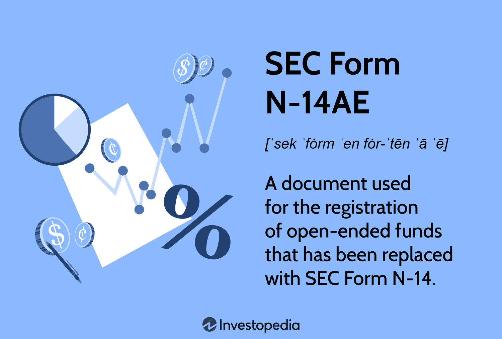

## Table of Contents

## What is SEC Form N-14AE?

SEC Form N-14AE is a document used by the Securities and Exchange Commission (SEC) in the United States. It is specifically for investment companies that want to merge or reorganize. The form helps the SEC make sure that the merger or reorganization is fair and follows the rules.

When an investment company fills out Form N-14AE, they have to give a lot of information. This includes details about the companies involved, the reasons for the merger or reorganization, and how it will affect the shareholders. The goal is to make sure that everyone involved understands what is happening and that their rights are protected.

## Why was SEC Form N-14AE created?

SEC Form N-14AE was created to help the Securities and Exchange Commission keep an eye on mergers and reorganizations of investment companies. The main reason for this form is to make sure these big changes are done fairly and follow the rules. When companies want to merge or reorganize, they need to tell the SEC all about it using this form.

The form asks for a lot of details so the SEC can understand what the companies are planning and how it will affect the people who own shares in these companies. By having all this information, the SEC can make sure that shareholders are treated fairly and that everything is done the right way. This helps protect investors and keeps the financial markets honest and transparent.

## Who is required to file SEC Form N-14AE?

Investment companies that want to merge or reorganize are the ones who need to file SEC Form N-14AE. This form is important because it helps the Securities and Exchange Commission keep track of what's happening and make sure everything is done correctly.

When an investment company plans to merge or reorganize, they have to give a lot of information in the form. This includes details about the companies involved, why they want to merge or reorganize, and how it will affect the people who own shares. By filing this form, the SEC can check that the process is fair and that shareholders are protected.

## What types of transactions does SEC Form N-14AE cover?

SEC Form N-14AE covers transactions where investment companies want to merge or reorganize. This means when two or more investment companies decide to combine into one, or when one company wants to change its structure or operations in a big way, they need to use this form.

The form is important because it helps the SEC understand what is happening and make sure the transactions are fair. It covers details about why the companies want to merge or reorganize, how it will affect the people who own shares, and other important information. This helps protect investors and keep the financial markets honest.

## What are the key components of SEC Form N-14AE?

SEC Form N-14AE has several important parts that help the Securities and Exchange Commission understand what is happening when investment companies want to merge or reorganize. The form includes information about the companies involved in the transaction. This means you will find details about who the companies are, what they do, and why they want to merge or reorganize. It also explains the reasons behind the decision, making it clear why the companies think this change is a good idea.

Another key part of the form is how the merger or reorganization will affect the shareholders. This includes telling shareholders what will happen to their shares, if they will get new shares, and any other changes that might affect them. The form also includes legal and financial information to make sure everything is done fairly and follows the rules. This helps the SEC make sure that the shareholders' rights are protected and that the transaction is honest and transparent.

## How does SEC Form N-14AE differ from other SEC forms?

SEC Form N-14AE is special because it's just for investment companies that want to merge or reorganize. It's different from other SEC forms because it focuses on making sure these big changes are done fairly and follow the rules. Other forms might be about different things, like registering new securities or reporting financial information, but N-14AE is all about mergers and reorganizations.

The form asks for a lot of details about the companies involved, why they want to merge or reorganize, and how it will affect the people who own shares. This is different from other forms that might not need this kind of information. By using Form N-14AE, the SEC can make sure that shareholders are treated fairly and that everything is done the right way during these big changes.

## What are the filing deadlines for SEC Form N-14AE?

When investment companies want to merge or reorganize, they need to file SEC Form N-14AE. The main deadline for this form is that it must be filed at least 21 days before the shareholders' meeting where they will vote on the merger or reorganization. This gives shareholders enough time to look at the information and decide how to vote.

If there are any changes to the information in the form after it's been filed, the company has to file an amendment right away. This makes sure that the SEC and the shareholders always have the most up-to-date information. By following these deadlines, the SEC can make sure that everything is done fairly and the shareholders' rights are protected.

## How can one access SEC Form N-14AE filings?

You can find SEC Form N-14AE filings on the SEC's official website, which is called EDGAR (Electronic Data Gathering, Analysis, and Retrieval). Just go to the EDGAR website, and you can search for the form using the company's name or the form type. Once you find the filing, you can read it online or download it to your computer.

If you want to see the filings in person, you can also visit a public library that has access to SEC filings. Some libraries have special computers or terminals where you can look up and read these documents. This way, you can go through the form and understand how the merger or reorganization might affect the shareholders.

## What are the common mistakes to avoid when filing SEC Form N-14AE?

When filing SEC Form N-14AE, one common mistake to avoid is not providing all the required information. The form needs a lot of details about the companies involved, why they want to merge or reorganize, and how it will affect shareholders. If you leave out important information, the SEC might not approve the merger or reorganization, and it could delay the whole process.

Another mistake to watch out for is missing the filing deadline. You have to file the form at least 21 days before the shareholders' meeting where they will vote on the merger or reorganization. If you file it too late, shareholders won't have enough time to look at the information and make a good decision. Also, if there are any changes to the information after you file, you need to file an amendment right away. Not doing this can cause problems and make the SEC question if the process is fair.

## What are the implications of non-compliance with SEC Form N-14AE requirements?

If an investment company does not follow the rules for SEC Form N-14AE, it can face serious problems. The SEC might not approve the merger or reorganization, which means the company's plans could be delayed or even stopped completely. This can be a big setback for the company because it might have to start the process all over again, which takes time and money. Also, if the SEC finds out that the company did not give all the required information or missed the filing deadline, it could lead to fines or other penalties.

Not following the rules can also hurt the shareholders. If the company does not file the form on time or leaves out important details, shareholders might not have all the information they need to make a good decision about the merger or reorganization. This can make them feel unsure or unhappy, which is not good for the company's relationship with its investors. In the end, non-compliance can damage the company's reputation and make it harder to do business in the future.

## How has the use of SEC Form N-14AE evolved over time?

The use of SEC Form N-14AE has changed over time as rules and technology have improved. When the form first came out, it was mainly used on paper. Companies had to send in physical copies to the SEC, which could take a long time. As technology got better, the SEC started using the EDGAR system. This let companies file the form online, making the process faster and easier. Now, anyone can look up these filings on the internet, which helps keep everything more open and honest.

Over the years, the SEC has also made changes to the form to make sure it keeps up with new rules and the needs of investors. They have added new parts to the form to ask for more details about how mergers and reorganizations might affect shareholders. This helps the SEC make sure that these big changes are done fairly. The form has become more important as more investment companies have merged or reorganized, and it helps protect investors by making sure they have all the information they need to make good decisions.

## What future changes might affect SEC Form N-14AE?

In the future, SEC Form N-14AE might change to keep up with new technology and rules. As more companies use digital tools, the SEC might make the form easier to fill out online. They could also add new parts to the form to ask for more details about how mergers and reorganizations affect shareholders. This would help make sure that everything is done fairly and that investors have all the information they need.

Another change could be about making the form easier to understand. The SEC might want to use simpler language so that more people can read and understand the form. This would help shareholders make better decisions about the merger or reorganization. Overall, any future changes to SEC Form N-14AE would be about making the process smoother, more transparent, and fairer for everyone involved.

## References & Further Reading

[1]: Securities and Exchange Commission. (n.d.). ["EDGAR - Search and Access."](https://www.sec.gov/search-filings) Retrieved from the SEC website.

[2]: U.S. Securities and Exchange Commission. (n.d.). ["SEC.gov | Filings & Forms."](https://www.sec.gov/search-filings) Learn and explore various SEC filings and forms.

[3]: Johnson, B. (2010). ["Algorithmic Trading & DMA: An introduction to direct access trading strategies."](https://archive.org/details/algorithmictradi0000john) 4Myeloma Press.

[4]: Bell, S. (2016). ["Quantitative Finance For Dummies."](https://www.amazon.com/Quantitative-Finance-Dummies-Steve-DPhil/dp/1118769465) Wiley.

[5]: Lopez de Prado, M. (2018). ["Advances in Financial Machine Learning."](https://www.amazon.com/Advances-Financial-Machine-Learning-Marcos/dp/1119482089) Wiley.