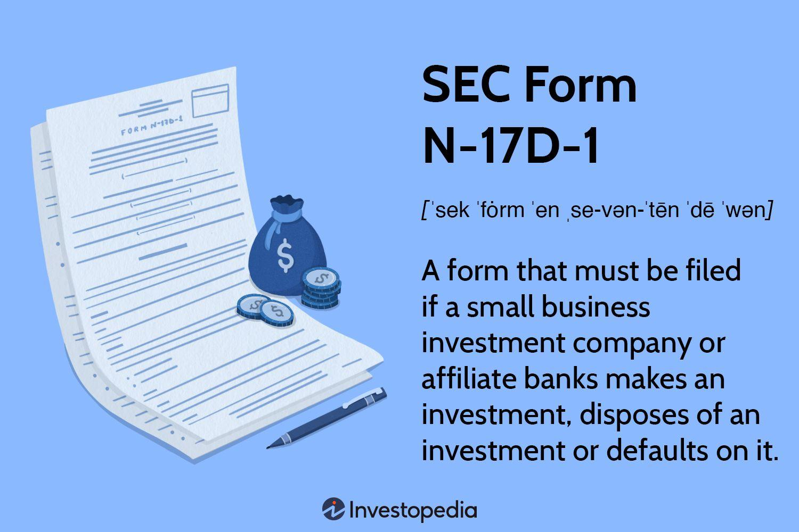

SEC Form N-17D-1 is a crucial document mandated by the Securities and Exchange Commission (SEC) for Small Business Investment Companies (SBICs) and their affiliated banks. This form plays an essential role in ensuring transparency and accountability in financial reporting, particularly when it involves investments associated with SBICs. By requiring detailed documentation of investment activities, SEC Form N-17D-1 contributes significantly to the integrity and transparency of financial markets.

The article will explore the requirements and implications of SEC Form N-17D-1, highlighting its importance in the landscape of financial reporting and the domain of algorithmic trading. Understanding this form is vital for financial entities as it impacts their ability to maintain transparency and adhere to compliance standards. By mandating the disclosure of detailed investment information, it helps prevent fraudulent activities, maintaining the market's reliability and trustworthiness.

Furthermore, the article will discuss how SEC Form N-17D-1 affects the compliance procedures within investment entities. It will consider key factors that institutional stakeholders, such as banks and financial technology firms, need to be aware of when dealing with financial investments and algorithmic trading practices. Comprehending the intricacies of this form is essential for these stakeholders to achieve effective risk management and regulatory compliance, ensuring their operations align with SEC expectations.

In conclusion, the article will provide insights into the significance of SEC Form N-17D-1, particularly in the modern financial environment characterized by rapid technological advancements and increasingly complex financial markets. The form is not just a regulatory requirement but a strategic tool for fostering transparency, accountability, and trust within the financial sector.

## Table of Contents

## Understanding SEC Form N-17D-1

SEC Form N-17D-1 is a semiannual reporting obligation specifically designed for Small Business Investment Companies (SBICs) and their affiliated banks. This form must be filed to ensure meticulous documentation of investments made in or the eventual disposal of small business concerns. By mandating such documentation, the form plays an essential role in capturing intricate details of each transaction, including any defaults or necessary modifications to the terms of the investments. 

Governed by the robust framework established under the Investment Company Act of 1940, the primary objective of SEC Form N-17D-1 is to enable vigilant monitoring of compliance with investment-related activities. This compliance is crucial not only for regulatory purposes but also for maintaining transparency in all transactions involving SBICs. The form's requirements promote an environment where every transaction is documented, thus reducing the likelihood of opaque dealings and enhancing overall trust in the financial reporting process.

By systematically tracking and requiring disclosure of investment activities, SEC Form N-17D-1 ensures that SBICs operate within a defined regulatory landscape. This landscape requires detailed financial reporting, which includes the context and rationale behind each investment, providing regulators and other stakeholders with the necessary data to assess compliance thoroughly. This form constitutes a tool for preventing illicit activities and ensuring that all financial engagements align with the statutory expectations set forth by the SEC.

## Key Reporting Obligations under Form N-17D-1

SEC Form N-17D-1 necessitates detailed disclosure and financial reporting by Small Business Investment Companies (SBICs) and their associated banks. It is crucial for ensuring compliance and transparency in the investment documentation process. A thorough disclosure of various elements surrounding investments is required as follows:

1. **Small Business Concern and Nature of Business**: Entities must furnish detailed information concerning the small business concerns they are investing in. This includes the nature and scope of the business activities pursued by these enterprises. Such disclosures are pivotal to understand the operational domain and market positioning of the small business entities involved.

2. **Investment Details**: Both SBICs and affiliated banks are mandated to report comprehensive investment details. This encompasses the specifics of the investment amount, duration, terms of investment, and any potential conditions that may impact the investment's performance over time.

3. **Affiliated Banks**: The form requires affiliated banks to elucidate their relationships with SBICs. This includes the foundational basis for such affiliations, whether through mutual shareholding, collaborative investment interests, or other financial relationships. Documentation provides insight into any potential conflicts of interest and ensures regulatory bodies that affiliations are appropriately managed.

4. **Interest, Contracts, and Benefits**: The reporting extends to include any interest, contractual agreements, and benefits tied to the investments. It is essential to clearly document these elements to provide full visibility into potential financial impacts, thereby ensuring that both SBICs and their affiliates are operating transparently and ethically.

5. **Key Financial Metrics**: Attention is particularly given to critical financial metrics such as profits or losses realized during the disposition of investments. Accurate reporting of such financial outcomes is significant for assessing the performance and risk exposure of investment activities.

By mandating these comprehensive disclosures, SEC Form N-17D-1 helps maintain accountability and fosters a transparent financial ecosystem, encouraging ethical conduct in investment activities. The summarization of these details is not just an obligation but also a strategic practice for SBICs and banks to manage and mitigate financial risks effectively.

## Implications for Algorithmic Trading

Algorithmic trading relies heavily on transparency and data accuracy, making the correct filing of SEC Form N-17D-1 essential for firms engaged in such activities. This form operates as a regulatory safeguard, ensuring that all transactions are accurately documented, thereby preventing malpractices that can arise in an environment driven by automated decision-making. 

For financial technology firms, compliance with Form N-17D-1 facilitates adherence to the broader regulatory framework that governs investment activities involving Small Business Investment Companies (SBICs). These regulations contribute to a robust oversight mechanism ensuring that trading operations are conducted within legal parameters, thereby enhancing the integrity of financial markets.

Understanding the specific obligations under Form N-17D-1 is vital for the effective implementation of [algorithmic trading](/wiki/algorithmic-trading) strategies. Accurate data reporting enables firms to align their trading activities with regulatory expectations, which is crucial in a sector where even minor discrepancies can lead to substantial financial and reputational repercussions. The form plays a critical role in mitigating risks associated with automated trading systems. It ensures procedural correctness by providing a detailed overview of investment activities, which helps in identifying and addressing potential issues that might arise due to systematic errors or unexpected market behaviors.

Incorporating technologies such as data analytics and [machine learning](/wiki/machine-learning) can further refine the accuracy of reporting for SEC Form N-17D-1. Financial technology firms can utilize these tools to automate data collection and analysis processes, thereby improving the efficiency and reliability of the information reported. This automatic integration not only guarantees compliance but also supports the optimization of algorithmic trading strategies by providing actionable insights drawn from affirmed and comprehensive datasets. Thus, SEC Form N-17D-1 serves not just a compliance function but also as a strategic asset in maintaining and enhancing the performance and legality of algorithmic trading operations.

## Compliance Challenges and Best Practices

Complying with SEC Form N-17D-1 involves several challenges, primarily related to the alignment of filing timelines with semiannual reporting requirements. This necessitates the establishment of robust internal controls to ensure accurate data management and timely filing within regulatory deadlines. 

Firstly, firms must develop a comprehensive compliance strategy that includes the integration of technological tools to streamline data collection and reporting processes. Automation can play a crucial role in enhancing efficiency and reducing errors. For example, using databases and data analytics platforms can help manage large volumes of transaction data effortlessly, ensuring that all information required for the form is accurately captured and easily accessible. Additionally, implementing software solutions that offer automated alerts for approaching deadlines can aid in maintaining adherence to filing schedules.

Moreover, maintaining a detailed audit trail of all transactions is a best practice that facilitates transparency and accountability. This involves ensuring that all financial activities related to small business investments—such as interest payments, contracts, and benefits associated with investments—are meticulously recorded. A detailed audit trail not only supports accurate reporting but also aids in resolving any discrepancies that may arise during audits or reviews by regulatory bodies.

Fostering an organizational culture of compliance is essential. This involves promoting awareness at all levels of an organization about the importance of regulatory adherence, including regular training sessions for employees involved in financial reporting and compliance functions. These sessions can cover updates in regulatory requirements, the significance of accuracy in reporting, and the technical aspects of using compliance software.

Lastly, organizations are encouraged to seek guidance from regulatory experts. Consulting with professionals who specialize in SEC regulations can provide invaluable insights into complex compliance landscapes, helping organizations navigate and overcome challenges effectively. These experts can offer tailored advice on best practices, assist with the interpretation of regulatory requirements, and help develop strategies to mitigate compliance risks.

By adopting these best practices, firms can not only ensure compliance with SEC Form N-17D-1 but also enhance their overall operational transparency and integrity. Adhering to regulatory standards is vital for maintaining trust and credibility in financial markets, which is increasingly important as these markets continue to evolve.

## Conclusion: The Role of SEC Form N-17D-1 in Financial Transparency

SEC Form N-17D-1 plays a crucial role in maintaining transparency within the financial reporting framework for Small Business Investment Companies (SBICs) and their affiliated banks. By requiring detailed disclosures, the form acts as a critical tool in ensuring regulatory compliance and preventing fraudulent activities. Its stringent reporting requirements help capture a comprehensive view of financial dealings and interactions, thereby promoting accountability in investment practices.

In the context of algorithmic trading, understanding and adhering to the obligations set by SEC Form N-17D-1 can provide a competitive edge. The algorithmic trading environment relies heavily on data integrity and transparency to function effectively. By complying with the regulations embodied in the form, financial entities can ensure that their trading algorithms are based on accurate and reliable data. This not only helps maintain trust and integrity within the market but also mitigates the risks associated with automated trading systems, such as unauthorized trades or market manipulation.

As financial markets become increasingly complex and interconnected, the role of comprehensive regulatory frameworks like SEC Form N-17D-1 becomes even more crucial. The form's requirements help standardize financial disclosures, making it easier for stakeholders to assess the viability and integrity of investment activities. This is particularly important in a globalized economy where market players range from small local enterprises to large multinational corporations.

Stakeholders, including SBICs, affiliated banks, and financial technology firms, must continue to prioritize compliance with such regulations to foster an honest and efficient trading environment. By investing in robust compliance strategies and leveraging technological advancements for accurate reporting, these entities can contribute significantly to the overall health and stability of financial markets. Ultimately, the consistent application of SEC Form N-17D-1 not only safeguards individual investments but also bolsters the integrity of the financial system as a whole.

## References & Further Reading

[1]: ["Investment Company Act of 1940"](https://en.wikipedia.org/wiki/Investment_Company_Act_of_1940) - U.S. House of Representatives, Office of the Law Revision Counsel.

[2]: Bergstra, J., Bardenet, R., Bengio, Y., & Kégl, B. (2011). ["Algorithms for Hyper-Parameter Optimization."](https://dl.acm.org/doi/10.5555/2986459.2986743) Advances in Neural Information Processing Systems 24.

[3]: ["Advances in Financial Machine Learning"](https://www.amazon.com/Advances-Financial-Machine-Learning-Marcos/dp/1119482089) by Marcos Lopez de Prado.

[4]: ["Quantitative Trading: How to Build Your Own Algorithmic Trading Business"](https://www.amazon.com/Quantitative-Trading-Build-Algorithmic-Business/dp/1119800064) by Ernest P. Chan.

[5]: ["Machine Learning for Algorithmic Trading"](https://github.com/stefan-jansen/machine-learning-for-trading) by Stefan Jansen.

[6]: ["Evidence-Based Technical Analysis: Applying the Scientific Method and Statistical Inference to Trading Signals"](https://www.amazon.com/Evidence-Based-Technical-Analysis-Scientific-Statistical/dp/0470008741) by David Aronson.