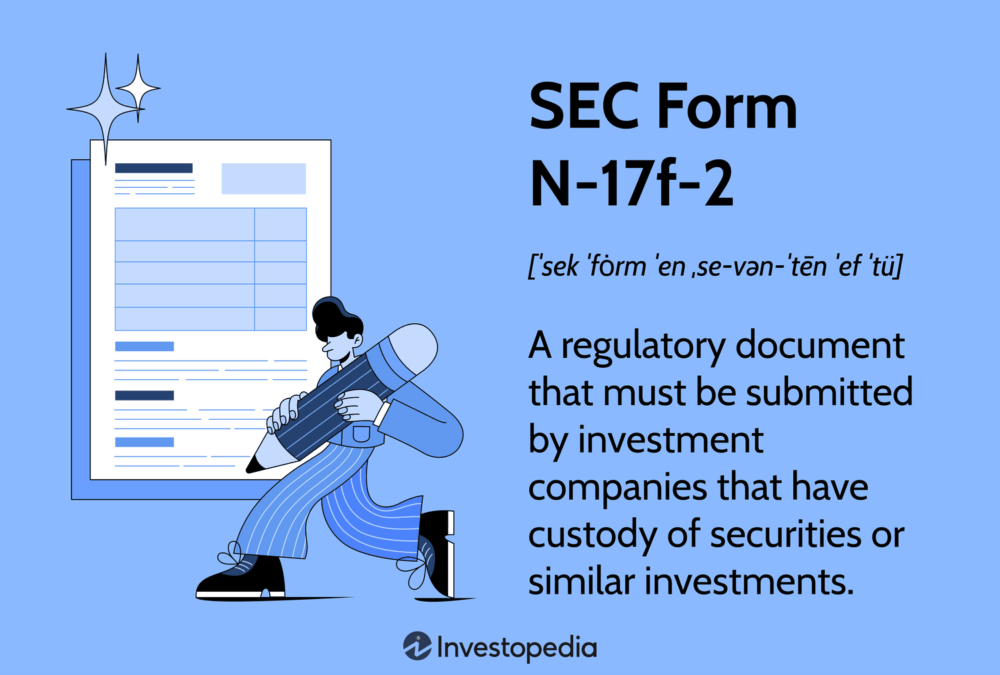

SEC Form N-17f-2 is a critical filing required by the Securities and Exchange Commission (SEC) for investment companies. Its primary purpose is to serve as a custodian verification document, ensuring the safeguarding of securities held by these companies. This verification is particularly significant for firms engaged in algorithmic trading and other forms of automated investing, where large volumes of securities are managed and traded at high speeds.

Central to the function of Form N-17f-2 is the requirement for certification by an independent public accountant. This certification process is crucial for maintaining transparency and trust in the financial markets. By involving an unbiased third party, the filing ensures that the reported assets are accurate and securely held, mitigating the risk of financial misstatement or misrepresentation.

The importance of SEC Form N-17f-2 is underscored by its role in protecting investors and maintaining market integrity. In algorithmic trading, where automated systems make split-second trading decisions, the accurate reporting and safekeeping of client assets become vital. The form provides a mechanism for compliance that enhances the credibility of investment companies operating in the high-stakes arena of automated trading.

In the article, we will explore the significance of SEC Form N-17f-2, focusing on its value in ensuring custodial integrity and trust. Additionally, the article will outline the regulatory requirements and the role of independent auditors, while also highlighting the impact and importance of this form in the evolving landscape of algorithmic trading.

## Table of Contents

## Understanding SEC Form N-17f-2

SEC Form N-17f-2, also known as the "Certificate of Accounting of Securities and Similar Investments in the Custody of Management Investment Companies," is an essential document that investment companies must file with the Securities and Exchange Commission (SEC). The requirement for this form stems from the stipulations of the Investment Company Act of 1940, which emphasizes the significance of rigorous custodial practices to safeguard client securities.

The primary purpose of Form N-17f-2 is to ensure that investment companies holding their clients' securities are doing so securely and that these holdings are accurately reported in clients' accounts. This form is mandatory for any investment company that holds custody of its clients' securities, reinforcing the importance of transparency and trust in financial operations.

A critical aspect of the process is the involvement of an independent public accountant. This professional conducts audits to confirm the securities' existence and proper documentation. The role of the independent accountant is vital to mitigate conflicts of interest and ensure unbiased verification of the reported securities. By conducting these audits, the accountant provides an additional layer of oversight, enhancing the integrity of the reporting and safeguarding mechanisms.

The procedures mandated by Form N-17f-2 enable the SEC to verify and confirm that securities are not only securely held but also accurately reported. This verification process is crucial for preventing discrepancies in the reported assets of clients and ensuring compliance with regulatory standards. The form's requirements reflect the broader objective of the Investment Company Act, which seeks to protect investors and uphold the highest standards of custodial practices within the investment industry.

## Key Elements of Rule 17f-2

Rule 17f-2 of the Securities and Exchange Commission (SEC) establishes critical guidelines for the custody and safekeeping of securities by investment companies. It ensures the protection of investors by implementing stringent custodial requirements. One major stipulation is that securities must be physically segregated and deposited with an authorized bank or financial facility. This requirement is designed to prevent the commingling of assets, thereby reducing the risk of loss or misappropriation.

Exceptions to this rule exist for securities that are collateralized or temporarily in transit due to ongoing transactions. These exceptions recognize the practicalities of financial transactions while maintaining the integrity of asset custody.

Rule 17f-2 mandates a minimum of three independent examinations of securities each fiscal year. Two of these examinations must be surprise audits to ensure that custodial practices are consistently adhered to without prior preparation by the investment company. This auditing process is crucial for verifying that actual securities are held as reported and aligns the company's custodial practices with regulatory expectations.

These examinations serve as a check against potential discrepancies or fraudulent activities, thereby enhancing the protection of investors. By enforcing these requirements, Rule 17f-2 plays an integral role in maintaining transparency and trust within the financial market.

## The Role of Independent Auditors

Independent auditors are indispensable for ensuring the integrity and accuracy of SEC Form N-17f-2 filings, which are essential for investment companies holding client securities. Their impartiality ensures unbiased auditing services, crucial for avoiding conflicts of interest and maintaining the fidelity of the financial reporting process. This impartiality is especially critical given past financial scandals, which have highlighted the necessity of rigorous independent oversight.

The significance of independent auditors has increased substantially following the enactment of the Sarbanes-Oxley Act of 2002. This legislation was a response to notable financial improprieties, underscoring the vital role of reliable financial disclosures. Independent auditors help restore trust by confirming that the securities held by investment companies are accurately reported in their submissions to the SEC.

In practical terms, independent auditors conduct detailed examinations of a company's securities holdings and organizational controls. Their audits validate that the statements presented by investment companies accurately reflect the securities in their custody. For [algorithmic trading](/wiki/algorithmic-trading) platforms, which are characterized by high-frequency and large-[volume](/wiki/volume-trading-strategy) transactions, this assurance is critical. It upholds the confidence of investors who need to trust that their assets are securely held and properly accounted for in an environment increasingly reliant on digital solutions.

The transparency that independent audits bring to financial reporting is paramount, particularly as the complexity of trading and asset management increases. Maintaining investor confidence requires that these audits are thorough and that the conclusions reached by the auditors are clearly communicated. This trust in the auditing process supports stable and transparent financial markets, ensuring that algorithmic and other automated trading strategies operate with integrity within regulatory frameworks.

In conclusion, independent auditors play a vital role in SEC Form N-17f-2 filings, strengthening the regulatory compliance of investment companies. Their work fosters transparency and accountability, which are fundamental to sustaining investor trust, particularly in sectors defined by rapid technological advancement.

## Impact and Importance in Algorithmic Trading

Algorithmic trading, a method that uses automated software to execute trades at high speeds, relies significantly on precise compliance with regulations and the secure custodianship of client assets. SEC Form N-17f-2 plays a crucial role in fulfilling these needs by mandating the verification of securities held by investment companies engaged in algorithmic trading. This form ensures that these companies implement stringent controls to safeguard the assets they manage on behalf of their clients.

The transparent reporting and auditing process required under SEC Form N-17f-2 bolsters trust among clients who utilize algorithmic trading platforms. This trust is vital, as the fast-paced nature of algorithmic trading may increase the risk of discrepancies or malpractices if securities are not adequately protected. By requiring regular audits conducted by independent auditors, the form provides assurance that the securities held are being accurately reported and securely managed.

As algorithmic trading continues its rapid growth, adhering to SEC regulations, including Form N-17f-2, remains essential to mitigate associated risks. The dynamic and automated nature of algorithmic trading can introduce specific vulnerabilities related to the handling of client securities, making compliance with SEC guidelines even more critical. This adherence not only mitigates risks but also fosters investor confidence, which is indispensable for maintaining a competitive edge in the financial markets.

For investment companies, SEC Form N-17f-2 compliance should be a priority to sustain their operations and enhance their market reputation. Failure to comply with the form's requirements could lead to regulatory actions, which might harm a company's credibility and deter potential clients. Therefore, consistent and rigorous application of the Form N-17f-2 guidelines in conjunction with the engagement of independent auditors serves as a protective measure, ensuring that the companies operate within the expected legal and ethical standards while prioritizing the security of client assets.

## Conclusion

SEC Form N-17f-2 is pivotal in ensuring the safety and transparency of securities held by investment companies. It is integral to the regulatory framework that governs algorithmic trading, a sector increasingly dependent on robust compliance mechanisms. Rule 17f-2 mandates that investment companies adhere to specific custodianship protocols, including engaging independent auditors to perform regular examinations. This practice serves as a safeguard for client assets, minimizing the risk of mismanagement or fraud.

The process of thorough documentation and auditing is crucial in maintaining market integrity. Independent audits ensure that securities are appropriately managed and reported, fostering investor trust in an industry underpinned by transparency and accountability. As financial markets continue to evolve with the integration of advanced technologies and innovative trading strategies, the importance of maintaining strict adherence to SEC Form N-17f-2 cannot be overstated.

Investment companies, especially those employing algorithmic trading techniques, must prioritize procedural compliance to sustain their operations and uphold their reputation within the market. The continued focus on rigorous custodial practices, as outlined in Form N-17f-2, will be essential to navigate the complexities of modern financial landscapes and to protect the interests of all stakeholders involved.

## References & Further Reading

[1]: Securities and Exchange Commission. ["Form N-17f-2 Certification of Accounting of Securities and Similar Investments of a Management Investment Company in the Custody of a Fund"](https://public-inspection.federalregister.gov/2024-31457.pdf).

[2]: Investment Company Act of 1940. ["Public Law 76-768"](https://en.wikipedia.org/wiki/Investment_Company_Act_of_1940). 

[3]: Sarbanes-Oxley Act of 2002. ["Public Law 107–204"](https://www.congress.gov/107/plaws/publ204/PLAW-107publ204.pdf).

[4]: Deloitte. ["Custody Rule and Related Requirements for Investment Advisers"](https://dart.deloitte.com/USDART/home/accounting/sec/sec-material-supplement/small-entity-compliance-guides/custody-funds-or-securities-clients-by).

[5]: PWC. ["Trust and Transparency in Algorithmic Trading"](https://www.pwc.ch/en/insights/regulation/pre-trade-controls-for-algorithmic-trading-techniques.html).