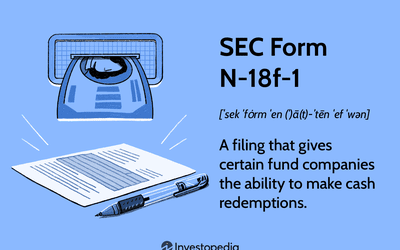

Navigating the world of investments can be complex, especially when it involves mutual funds, SEC regulations, and the latest trends like algorithmic trading. The financial landscape is continuously evolving, driven by technological advancements and regulatory changes aimed at safeguarding investors and maintaining market integrity. Mutual funds, as collective investment schemes, provide an accessible and professionally managed option for individual investors, helping them diversify their portfolios. However, managing these funds requires adherence to strict regulations enforced by the Securities and Exchange Commission (SEC), which plays a critical role in overseeing the market.

In this article, we will explore the intersection of these elements and how they shape the financial industry. We aim to unravel the multifaceted aspects of investment management by examining the regulatory framework, technical innovations, and strategic considerations that influence market participants. Understanding SEC Form N-18f-1 is crucial for investment companies as they navigate regulatory requirements for mutual funds. This particular form allows investment companies some flexibility in managing cash flows, especially during heightened periods of redemptions. By comprehending the nuances of such regulatory instruments, companies can strategically plan their operations to align with compliance standards while optimizing performance.

Additionally, we will examine the rise of algorithmic trading and its impact on the investment landscape. Algorithmic trading employs sophisticated computer algorithms to execute trades at speeds and frequencies beyond human capability, greatly enhancing trading efficiency and cost-effectiveness. However, it also introduces complexities and challenges that necessitate careful consideration, such as market volatility and regulatory scrutiny.

Our goal is to provide a comprehensive view that aids both seasoned investors and newcomers in making informed decisions. By shedding light on these crucial elements, we aim to empower investors with the knowledge to optimize their strategies and achieve their financial goals while remaining compliant with current and future regulations. This understanding is vital to navigate the contemporary financial environment effectively, ensuring sound investment decisions and sustainable growth.

## Table of Contents

## Understanding Mutual Funds

Mutual funds are investment instruments that consolidate capital from a multitude of investors to purchase a diverse portfolio of securities such as stocks, bonds, and other assets. This pooling of resources allows investors to gain access to a diversified investment portfolio managed by professional fund managers. One of the primary advantages of mutual funds is the diversification they offer, which can mitigate risk by spreading investments across a range of assets. This is based on the principle that diversification reduces unsystematic risk, which is specific to a particular company or industry.

Professional management is another key feature of mutual funds. Typically, investment managers are responsible for selecting the securities and continuously monitoring the performance of the fund. They apply various investment strategies aimed at meeting the fund's objectives, whether those objectives pertain to growth, income, or capital preservation. The expertise provided by these managers is particularly attractive to investors who may lack the time or knowledge to manage their investments directly.

Investment companies are instrumental in managing mutual funds. They take on the responsibility of ensuring that the funds adhere not only to their stated investment objectives but also to applicable regulatory frameworks. These companies are governed by regulations issued by governmental bodies, such as the Securities and Exchange Commission (SEC) in the United States, which mandate disclosures and compliance with certain standards to protect investors.

Mutual funds can be categorized into several types, each with its own investment strategy. For instance, equity funds primarily invest in stocks and are suited for investors seeking capital appreciation. Bond funds invest in fixed-income securities and tend to attract investors interested in generating income. Money market funds, on the other hand, invest in short-term debt instruments, offering high [liquidity](/wiki/liquidity-risk-premium) with minimal risk. Hybrid funds, like balanced funds, combine equities and fixed-income securities to achieve a balance between growth and income.

The varying types of mutual funds can align with the risk tolerance and investment goals of different investors. Some funds might employ passive strategies, such as index funds, which aim to replicate the performance of a specific index. Conversely, actively managed funds strive to outperform market indices through strategic stock [picking](/wiki/asset-class-picking) and market timing, although they often incur higher fees.

In summary, mutual funds serve as a crucial component of many investors' portfolios by offering diversification, professional management, and adaptability to different investment objectives. Understanding the types and strategies of these funds is vital for investors to make informed decisions and align their investment choices with their financial goals.

## SEC Form N-18f-1 Explained

SEC Form N-18f-1 is a significant regulatory tool for mutual fund companies seeking operational flexibility and efficiency. This form is specifically designed to notify the Securities and Exchange Commission (SEC) of a fund's decision to use cash instead of securities for redemptions exceeding a certain percentage of its portfolio, as outlined in SEC Rule 18f-1. By filing this form, funds can opt out from the limitations imposed by section 18(f)(1) of the Investment Company Act of 1940, which otherwise mandates mutual funds to fulfill redemption requests in cash for up to 15% of the fund's net asset value over any 90-day period.

The primary benefit of SEC Form N-18f-1 is that it allows funds to engage in "in-kind" redemptions. This means that rather than liquidating securities to meet cash redemption requests, a fund can transfer securities directly to investors. This capability is particularly advantageous during periods of significant cash outflows, as it helps preserve the fund's portfolio composition and mitigate the adverse effects of forced sales on the fund's overall value and performance.

To leverage the benefits of SEC Form N-18f-1, mutual funds must adhere to specific requirements. Firstly, the form must be filed with the SEC as a public document, thereby providing transparency about the fund's redemption strategy. Additionally, funds must communicate their intention to use in-kind redemptions clearly to investors in their prospectus and offer detailed information on the process and potential impacts on shareholders.

Understanding the interaction between SEC Form N-18f-1 and SEC Rule 18f-1 is crucial for compliance. SEC Rule 18f-1 permits funds to redeem shares partially in cash and partially in kind, which aligns with the flexibility sought through Form N-18f-1. However, careful operational management is required to balance investor expectations with regulatory obligations and ensure fair treatment of all shareholders.

In conclusion, filing SEC Form N-18f-1 is an effective strategy for mutual funds to manage redemption pressures while maintaining portfolio integrity. It provides mutual fund managers with a valuable tool to support fund liquidity and investor interests, particularly during volatile market conditions.

## Algorithmic Trading and Its Influence

Algorithmic trading, often referred to as algo trading, employs sophisticated software systems to make trading decisions at speeds and levels of precision far exceeding human capability. This technology is revolutionizing the financial industry by offering enhanced efficiency and reduced transaction costs. Mutual funds and investment companies are increasingly leveraging these automated systems to streamline trading processes, minimize human error, and maximize the responsiveness to market fluctuations.

### Advantages of Algorithmic Trading

Algorithmic trading offers numerous advantages that can significantly benefit investment companies. One of the primary benefits is speed. Algorithms can process market data and execute trades in fractions of a second, which is crucial in taking advantage of short-lived market opportunities. This speed is complemented by the precision of algorithms, which can execute trades at optimal price points, ensuring the best possible returns.

Cost reduction is another critical advantage. By automating trade execution, investment companies can minimize the reliance on human traders, thereby reducing labor costs. Additionally, algo trading can also reduce transaction costs by optimizing the timing and [volume](/wiki/volume-trading-strategy) of trades to minimize market impact and slippage.

### Risks Associated with Algorithmic Trading

Despite its advantages, [algorithmic trading](/wiki/algorithmic-trading) is not without risks. One major concern is the potential for technical failures. An error in the algorithm's code or a system malfunction at a crucial moment could result in significant financial losses. Furthermore, algorithms can inadvertently exacerbate market [volatility](/wiki/volatility-trading-strategies). As demonstrated by events like the 2010 Flash Crash, automated systems can trigger rapid price movements if they all react simultaneously to a market event.

Another risk is market manipulation. Malicious actors may employ algorithms for predatory trading practices, like spoofing or layering, which can distort market prices and hurt investors. Regulatory bodies like the SEC are increasingly focused on monitoring algorithmic trading to prevent such manipulations and maintain market integrity.

### Impact on Market Dynamics

Algorithmic trading is not only reshaping internal operations within investment companies but it is also altering broader market dynamics. With a significant portion of trades being executed by algorithms, the market landscape is increasingly characterized by high-frequency trading, where large volumes of orders are processed at ultra-fast speeds. This shift has led to an increase in market liquidity and often tighter bid-ask spreads.

However, it has also contributed to a more complex market structure, where traditional models of supply and demand are influenced by the behaviors programmed into trading algorithms. This complexity necessitates advanced analytical tools and techniques for both traders and regulators to effectively navigate and monitor market activities.

In conclusion, while algorithmic trading presents powerful tools for enhancing efficiency and cutting costs, it also requires careful management of its inherent risks. As it continues to influence market behavior, understanding its mechanics and implications remains paramount for investment companies seeking to harness its full potential.

## The Role of SEC Regulation

The Securities and Exchange Commission (SEC) is paramount in ensuring the integrity of financial markets and safeguarding investors. By implementing regulations such as SEC Form N-18f-1, the SEC promotes transparency and fairness within the operations of mutual funds. Form N-18f-1 allows investment companies to limit redemptions in kind, providing them with the flexibility needed to manage cash outflows without destabilizing the fund's structure.

The broader regulatory landscape is integral to maintaining orderly markets. The Investment Company Act of 1940 is a cornerstone of mutual fund regulation, requiring funds to register, disclose financial and managerial information, and adhere to certain operational standards. This framework helps maintain investor confidence by ensuring a level of transparency and accountability within mutual funds.

Algorithmic trading, characterized by the use of automated software for executing trades rapidly and accurately, is increasingly influential. As algorithmic trading gains prominence, the SEC faces the challenge of ensuring these systems do not disrupt market fairness or stability. Rules regarding high-frequency trading, transparency, and market manipulation are key focus areas as the landscape evolves. The SEC's regulation here aims to mitigate risks related to market volatility and trading malpractices while reaping the benefits of increased efficiency and reduced transaction costs that algorithms can offer.

Looking towards the future, several trends and potential regulatory adjustments are anticipated. The SEC continues to explore ways to enhance the regulatory framework to accommodate technological advancements and evolving market behaviors. For example, regulations may need to adapt to handle the growing intersection of digital assets and traditional securities, ensuring they are governed by adequate investor protections. Additionally, with increasing focus on environmental, social, and governance ([ESG](/wiki/esg-investing)) criteria, disclosures related to these factors might become a regulatory priority.

Overall, the SEC plays a crucial role in aligning regulations with the dual goals of protecting investors and fostering innovation within the financial markets. Maintaining this balance is essential for the continued health and growth of the investment environment.

## Conclusion

Investment companies that engage with mutual funds, SEC regulatory frameworks, and algorithmic trading face the challenging task of balancing complex regulations and market dynamics. Mastery of SEC Form N-18f-1 is vital for investment companies, allowing them to gain exemptions from certain redemption restrictions. This understanding facilitates better cash flow management during periods of redemptions, thus reinforcing operational stability. 

Algorithmic trading, with its promise of increased efficiency and cost reduction, is rapidly transforming the investment landscape. By capitalizing on these innovations, companies can improve their trading operations and benefit from market timing precision and reduced human error. Nevertheless, algorithmic trading carries its own set of risks, such as systemic errors or flash crashes, which must be meticulously managed.

Institutional and retail investors alike should remain vigilant about these evolving elements to refine their investment strategies. Awareness and understanding of regulatory changes and technological advancements can yield competitive advantages, particularly in a rapidly changing financial market.

Maintaining compliance while embracing new technologies like algorithmic trading is essential for future-proofing investment strategies. As the financial world continues to evolve, those who adeptly navigate the intersection of regulation and innovation will likely be well-positioned for success. The key lies in harmonizing regulatory compliance with technological advancements to harness the full potential of modern investment strategies.

## References & Further Reading

[1]: ["The Investment Company Act of 1940"](https://en.wikipedia.org/wiki/Investment_Company_Act_of_1940) - U.S. Securities and Exchange Commission

[2]: SEC, ["Guidelines for In-Kind Redemptions"](https://www.mutualfunds.com/education/what-is-an-in-kind-redemption-for-mutual-funds/)

[3]: ["Machine Trading: Deploying Computer Algorithms to Conquer the Markets"](https://www.amazon.com/Machine-Trading-Deploying-Computer-Algorithms/dp/1119219604) by Ernest P. Chan

[4]: Hendershott, T., Jones, C. M., & Menkveld, A. J. (2011). ["Does Algorithmic Trading Improve Liquidity?"](https://onlinelibrary.wiley.com/doi/full/10.1111/j.1540-6261.2010.01624.x) The Review of Financial Studies, 24(8), 2115-2154.

[5]: Cartea, Á., Jaimungal, S., & Penalva, J. (2015). ["Algorithmic and High-Frequency Trading"](https://assets.cambridge.org/97811070/91146/frontmatter/9781107091146_frontmatter.pdf) Cambridge University Press.