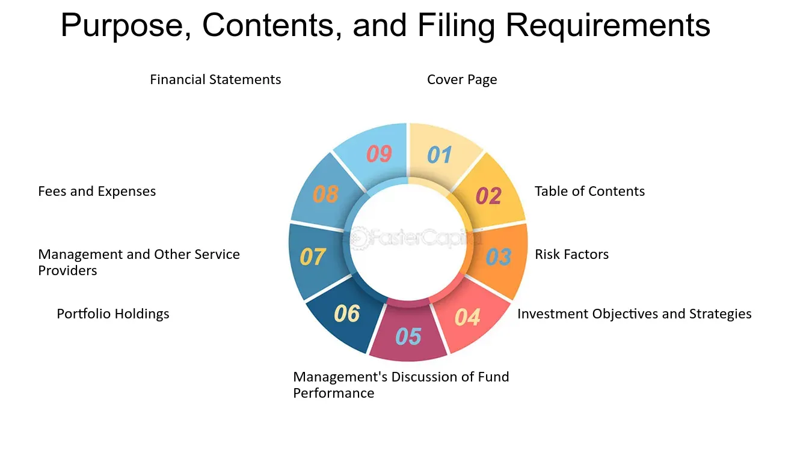

## Table of Contents

## What is SEC Form N-1A?

SEC Form N-1A is a document that mutual funds and exchange-traded funds (ETFs) use to register with the Securities and Exchange Commission (SEC). It's like an application that these funds fill out to provide important details about their operations, investment goals, and risks to potential investors. By using this form, the SEC can make sure that the funds are sharing all the necessary information in a clear and honest way.

The form includes sections about the fund's investment strategies, fees, and how it's managed. It also has a section called the prospectus, which is a summary that investors can read to understand the fund better before deciding to invest. This helps investors make informed choices by knowing what they're getting into, including any potential risks and rewards.

## Who is required to file SEC Form N-1A?

SEC Form N-1A must be filed by mutual funds and exchange-traded funds (ETFs) that want to offer their shares to the public. These funds need to register with the Securities and Exchange Commission (SEC) to make sure they follow the rules and give investors all the information they need.

Filing Form N-1A helps the SEC keep an eye on these funds and make sure they are being honest about what they do and the risks involved. It's important for these funds to use this form so that investors can make smart choices about where to put their money.

## What is the primary purpose of SEC Form N-1A?

The main reason for SEC Form N-1A is to make sure that mutual funds and exchange-traded funds (ETFs) tell the truth about what they do and the risks involved. When these funds want to sell their shares to the public, they need to fill out this form and give it to the Securities and Exchange Commission (SEC). This helps the SEC watch over these funds and make sure they are being honest with everyone.

By using Form N-1A, funds have to share important details about their goals, how they invest money, and what fees they charge. This information is put into a document called a prospectus, which is like a summary that investors can read. The prospectus helps people understand what the fund is all about before they decide to invest their money. This way, investors can make smart choices and know what they are getting into.

## How does SEC Form N-1A benefit investors?

SEC Form N-1A helps investors by giving them clear and honest information about mutual funds and ETFs. When these funds want to sell their shares to the public, they have to fill out this form and tell the SEC all about their goals, how they invest money, and what fees they charge. This information is put into a document called a prospectus, which is like a summary that anyone can read. By reading the prospectus, investors can learn about what the fund does and the risks involved before they decide to invest their money.

Having this information helps investors make smart choices. They can compare different funds and see which ones match their own goals and how much risk they are willing to take. This way, investors can feel more confident about where they put their money, knowing they have all the details they need to make a good decision. In the end, SEC Form N-1A makes the investment process more open and fair for everyone.

## What are the key components included in SEC Form N-1A?

SEC Form N-1A includes several important parts that help investors understand mutual funds and ETFs. One key part is the prospectus, which is a summary of the fund's main details. It tells investors about the fund's goals, how it plans to invest money, and what risks are involved. This helps people see if the fund matches what they want and how much risk they are okay with taking.

Another important part of Form N-1A is the information about fees and expenses. This section tells investors how much it will cost to invest in the fund, including any management fees or other charges. Knowing these costs is important because they can affect how much money an investor might make from the fund. The form also includes details about the fund's management team, how often the fund's portfolio is changed, and how investors can buy or sell shares.

Overall, SEC Form N-1A makes sure that mutual funds and ETFs share all the important information with investors. By including sections on the fund's goals, risks, fees, and management, the form helps people make smart choices about where to put their money. This way, investors can feel more confident and informed when deciding to invest in a fund.

## How often must SEC Form N-1A be updated?

SEC Form N-1A needs to be updated whenever there are big changes to the mutual fund or [ETF](/wiki/etf-trading-strategies). This could be things like changing how the fund invests money, changing the fees, or if there are new risks that investors should know about. The fund has to tell the SEC about these changes by updating the form and sending it in. This makes sure that the information investors see is always up to date and honest.

Also, the fund has to update the form at least once a year, even if nothing big has changed. This yearly update is called an annual update, and it helps keep everything fresh and accurate. By doing this, the SEC can keep watching over the funds and make sure they are still following the rules and giving investors all the information they need to make good choices.

## What are the specific disclosure requirements in SEC Form N-1A?

SEC Form N-1A has specific disclosure requirements that help investors understand what they are getting into when they invest in a mutual fund or ETF. The form requires funds to clearly state their investment objectives, which means what the fund is trying to achieve with the money it manages. It also asks for details about the fund's principal investment strategies, which explains how the fund plans to reach those objectives. Additionally, the form requires information about the risks involved with investing in the fund, so investors know what could go wrong and lose them money.

Another important part of the disclosure requirements is information about the fees and expenses that investors will have to pay. This includes management fees, which are charges for running the fund, and any other costs like sales charges or redemption fees. The form also asks for details about the fund's management team, including who is in charge and their experience. Finally, the form requires information on how to buy and sell shares of the fund, making it easier for investors to understand the process and any rules they need to follow.

Overall, these disclosure requirements in SEC Form N-1A make sure that investors get a full picture of the fund before they decide to invest. By providing clear information on the fund's goals, strategies, risks, fees, management, and how to invest, the form helps investors make informed choices and feel more confident about where they put their money.

## How does the SEC review and process Form N-1A submissions?

When a mutual fund or ETF sends in their SEC Form N-1A, the SEC takes a close look at it to make sure everything is correct and honest. They check that the form has all the important details about the fund's goals, how it invests money, the risks involved, and the fees it charges. The SEC also makes sure that the information in the prospectus, which is a summary for investors, is clear and easy to understand. If the SEC finds any problems or missing information, they might ask the fund to fix it before they can approve the form.

Once the SEC is happy with the form, they will approve it, and the fund can start selling its shares to the public. The SEC keeps watching over the fund even after it's approved to make sure it follows the rules and keeps its information up to date. If the fund makes big changes, like changing how it invests or its fees, it has to update the form and send it back to the SEC. This way, the SEC can keep making sure that investors always have the latest and most accurate information to help them make good choices.

## What are the common challenges faced when completing SEC Form N-1A?

Completing SEC Form N-1A can be tricky because it needs a lot of detailed information about the fund. Funds have to clearly explain their goals, how they plan to invest money, and what risks are involved. This can be hard because they need to make sure everything is accurate and easy for investors to understand. If they miss something or get it wrong, the SEC might send the form back and ask them to fix it, which can delay the process of getting approval to sell shares.

Another challenge is keeping the form up to date. Funds have to update the form whenever there are big changes, like changing their investment strategy or fees. This means they need to keep an eye on everything and be ready to fill out the form again if needed. Plus, they have to do a yearly update even if nothing big has changed, which can be a lot of work. But it's important because it helps make sure investors always have the latest information to make good choices.

## How has SEC Form N-1A evolved over time, and what recent changes have been made?

SEC Form N-1A has changed a lot since it first started. At first, it was a simple way for mutual funds to tell the SEC about their plans and risks. Over time, as more people started investing and new types of funds like ETFs came along, the form got more detailed. It now asks for a lot more information to make sure investors know everything they need to make smart choices. The SEC keeps updating the form to make sure it stays useful and helps protect investors.

Recently, the SEC made some important changes to Form N-1A. They wanted to make the information even clearer and easier for investors to understand. One big change was to make the prospectus, which is like a summary of the fund, shorter and simpler. They also added new sections about how funds use derivatives and other complex investments. These changes help investors see the full picture of what they are getting into and make better decisions about where to put their money.

## What are the penalties for non-compliance with SEC Form N-1A filing requirements?

If a mutual fund or ETF doesn't follow the rules for filing SEC Form N-1A, they could face some serious penalties. The SEC can fine the fund, which means they have to pay money for not doing things right. The fines can be pretty big, depending on how bad the mistake was and if it was done on purpose or by accident. Sometimes, the SEC might also stop the fund from selling its shares to the public until they fix the problem. This can hurt the fund's business because they can't bring in new investors.

Besides fines and being stopped from selling shares, the fund might also get in trouble with investors. If the fund doesn't give all the right information, investors might lose money or feel cheated. They could even sue the fund to get their money back or to punish the fund for not being honest. All these penalties can make it hard for the fund to keep running and can damage its reputation. That's why it's really important for funds to follow the SEC's rules carefully and make sure they always give investors the information they need.

## How can technology and software assist in the preparation and filing of SEC Form N-1A?

Technology and software can really help when it comes to getting SEC Form N-1A ready and sending it in. There are special programs that can make filling out the form easier. These programs have templates that guide you through all the sections of the form, so you don't miss any important information. They can also check your work for mistakes and make sure everything is filled out correctly. This can save a lot of time and help make sure the form is done right the first time, so the SEC doesn't send it back.

Another way technology helps is by keeping track of all the information and updates. Since funds have to update the form whenever there are big changes, software can remind them when it's time to do this. It can also keep all the old forms in one place, so it's easy to see how things have changed over time. This makes it simpler to stay organized and follow the SEC's rules. Plus, many programs let you file the form online, which is faster and more convenient than sending it in by mail.

## References & Further Reading

[1]: ["Investment Company Act of 1940"](https://en.wikipedia.org/wiki/Investment_Company_Act_of_1940) - Legal Information Institute, Cornell Law School.

[2]: ["SEC Form N-1A"](https://www.sec.gov/files/form-n-1a.pdf) - U.S. Securities and Exchange Commission.

[3]: Khandani, A.E., & Lo, A.W. (2007). ["What Happened to the Quants in August 2007?"](#) *Journal of Investment Management*. [External link](https://web.mit.edu/Alo/www/Papers/august07.pdf).

[4]: ["Algorithmic Trading: Winning Strategies and Their Rationale"](https://www.wiley.com/en-us/Algorithmic+Trading%3A+Winning+Strategies+and+Their+Rationale-p-9781118746912) by Ernest P. Chan

[5]: ["The Impact of Machine Learning on Economics"](https://projects.iq.harvard.edu/files/pegroup/files/athey2018.pdf) - Mullainathan, S., & Spiess, J. *Journal of Economic Perspectives*, 33(3), 85-106.

[6]: Linnainmaa, J.T., & Roberts, M.R. (2019). ["The History of the Cross-Section of Stock Returns"](https://www.nber.org/papers/w22894) *Journal of Financial Economics*, 132(1), 97-125.