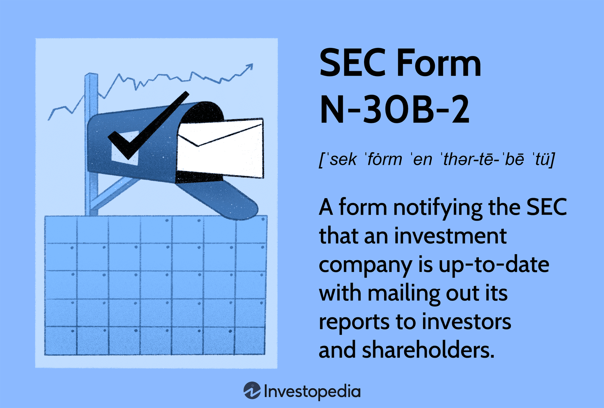

In the rapidly evolving landscape of financial markets, compliance and transparency have become paramount. The complexity and pace of current financial activities, driven by technology and digital communication, necessitate robust regulatory frameworks to ensure fairness and protect investor interests. Within this regulatory framework, Form N-30B-2 emerges as a pivotal tool for mutual fund companies. This form, mandated by the Securities and Exchange Commission (SEC), acts as a mechanism to monitor and enforce adherence to established financial regulations, particularly those concerning investor communications and disclosures.

Form N-30B-2 plays a crucial role by requiring mutual fund companies to provide detailed reports on their activities and performance. These disclosures are integral to maintaining transparency in the financial sector, which in turn fosters trust among investors. By ensuring that investors are adequately informed about how their investments are handled, Form N-30B-2 helps to prevent misinformation and potential malpractices that could arise from a lack of oversight.

Furthermore, this article explores the significance of Form N-30B-2 concerning SEC regulations, highlighting its importance in upholding the standards set forth by the Investment Company Act of 1940. As mutual funds play a significant role in the investment landscape, maintaining stringent reporting requirements helps to uphold market integrity.

The implications of Form N-30B-2 extend beyond traditional investment management. With the advent of algorithmic trading, which leverages sophisticated technology to execute trades at unprecedented speeds and volumes, the necessity for compliance becomes even more critical. Transparency and adherence to regulations ensure that even complex, automated systems operate within ethical and legal boundaries. Therefore, understanding the role of Form N-30B-2 in both conventional and emerging trading platforms is essential for maintaining a fair and efficient market.

## Table of Contents

## Understanding SEC Form N-30B-2

Form N-30B-2 is a crucial filing requirement for mutual fund companies, as stipulated by the Investment Company Act of 1940. This regulation mandates that these companies maintain transparency in their communications with investors, particularly through periodic and interim reports. The primary objective of this form is to ensure that mutual funds provide an accurate depiction of their financial status, operations, and results to investors, thereby promoting trust and informed decision-making.

The form necessitates that mutual fund companies submit detailed reports, which include financial statements and other pertinent information that reflect the funds' performance and financial condition. These reports serve as essential communication tools, enabling investors to assess the health and prospects of their investments. By providing comprehensive data on the periodic and interim performance of funds, the form helps maintain a level of transparency that is critical in safeguarding investors’ interests.

An integral component of the filing process for Form N-30B-2 is the utilization of the Electronic Data Gathering, Analysis, and Retrieval (EDGAR) system. EDGAR is the Securities and Exchange Commission's (SEC) electronic filing platform, designed to streamline the submission, review, and disclosure of documents required under federal securities laws. The system is vital for mutual fund companies as it aids in efficiently managing the filing process and ensures that all submitted documents are readily accessible to the public.

The EDGAR system's role extends beyond merely facilitating electronic submissions; it also enhances accessibility by making the documents available for public scrutiny. This accessibility supports the SEC's overarching goal of protecting investors, maintaining fair, orderly, and efficient markets, and facilitating capital formation by providing instant access to crucial financial information.

Thus, the filing requirement of Form N-30B-2, enforced through the EDGAR system, serves as a fundamental mechanism to uphold transparency and accountability in the financial operations of mutual fund companies, aligning with the SEC’s regulatory objectives.

## Importance of Financial Compliance

Financial compliance is essential for maintaining investor confidence in markets by ensuring that mutual fund companies operate transparently and adhere to regulatory standards. The Securities and Exchange Commission (SEC) mandates various filings to safeguard the interests of investors, among which Form N-30B-2 plays a crucial role. This form is specifically designed to ensure that mutual fund companies provide accurate and timely disclosures regarding their investor communications, particularly periodic and interim reports.

The responsibility of investment companies to offer precise information is integral to protecting investors' interests. By maintaining transparency, companies help build trust, which is vital for the stability and growth of financial markets. Regulatory frameworks, such as those requiring Form N-30B-2, serve as mechanisms to reduce information asymmetry between investors and fund managers. This ensures that investors can make well-informed decisions based on reliable data.

Form N-30B-2 is instrumental in validating that mutual funds comply with the regulatory requirements set forth by the SEC. By mandating the disclosure of critical information, it protects smaller investors from potential malpractices and market manipulation. Smaller investors often lack the resources or expertise to thoroughly investigate a fund's financial practices, making regulatory measures indispensable. Ensuring that mutual funds adhere to these rules levels the playing field, allowing smaller investors equitable access to market opportunities.

In summary, financial compliance through forms like N-30B-2 is vital for fostering trust and safeguarding the financial ecosystem. It ensures that all market participants, regardless of their size, operate with a shared understanding of the regulatory landscape, thereby promoting an environment of fairness and accountability.

## Implications for Algorithmic Trading

Algorithmic trading, characterized by the use of computer algorithms to execute trades at high speeds and large volumes, has fundamentally altered the landscape of financial markets. Its ability to process vast data sets and execute trades based on complex criteria presents opportunities for increased efficiency and reduced transaction costs. However, these benefits come with significant challenges related to regulatory compliance and transparency.

Compliance regulations, including Form N-30B-2, aim to ensure that even the most complex trading mechanisms are transparent and subject to scrutiny. This form is essential for mutual fund companies as it mandates regular and comprehensive communication with investors, providing them with insights into interim and periodic financial reports. In the context of [algorithmic trading](/wiki/algorithmic-trading), Form N-30B-2 plays a similar role by ensuring that mutual funds engaging in algorithmic strategies disclose relevant information, thereby maintaining market integrity.

The transparency required by Form N-30B-2 helps mitigate risks associated with automated trading systems. Given their complexity, algorithmic trading strategies can sometimes obscure trade rationale and risk metrics, potentially leading to unpredictable market impacts. By mandating detailed disclosures, regulatory compliance ensures that investors and regulators can assess the strategies used by mutual funds, thus spotting systemic risks before they materialize.

For algorithmic trading to comply with regulations such as Form N-30B-2, a robust framework for data management and reporting is necessary. This involves meticulous record-keeping of trades and algorithms, as well as implementing systems that can automatically generate and file reports as required by the SEC. Advanced technological tools, such as [machine learning](/wiki/machine-learning) algorithms, can be employed to analyze trading behavior and ensure that trading strategies adhere to both internal guidelines and regulatory standards.

Understanding the impact of these regulations is crucial for the development and deployment of algorithmic trading systems. Continuous advancements in technology require an adaptive approach to compliance, one that can seamlessly integrate regulatory requirements within the trading strategies themselves. For instance, automated scripts can be utilized within the trading algorithm to check for regulatory compliance at various stages of trade execution, thus ensuring that any deviations are promptly identified and addressed.

In conclusion, regulations like Form N-30B-2 are integral to maintaining transparency and accountability in algorithmic trading. While the rapid execution and data processing capabilities of algorithmic trading present numerous benefits, they also underline the importance of a stringent regulatory framework. Compliance not only protects investors but also reinforces trust in the integrity of financial markets. Traders and firms must remain vigilant and informed about these regulations to ensure ethical and compliant trading operations.

## Challenges and Considerations

Fulfilling the requirements of Form N-30B-2 presents particular challenges for mutual fund companies, mainly in the realm of electronic filing through the SEC's Electronic Data Gathering, Analysis, and Retrieval (EDGAR) system. This system is integral for ensuring that the submitted data is accessible and analyzable both by regulators and investors. However, the complexity of maintaining accurate and timely records can pose significant logistical hurdles.

To comply with Form N-30B-2, mutual fund companies must institute robust electronic filing systems. This involves not just adopting the technical infrastructure necessary for electronic submissions, but also creating processes and training personnel to handle the filings effectively. Failure to establish these systems can result in penalties or other regulatory actions unless a company qualifies for specific exemptions.

Temporary or permanent hardship exemptions provide a crucial avenue for companies that face significant difficulties in meeting electronic filing requirements. These exemptions are not granted lightly and require demonstrable evidence of an inability to file electronically. Companies must apply for these exemptions with comprehensive documentation, potentially consuming additional resources and time.

The ongoing need for compliance in a digital era demands that mutual fund companies constantly monitor regulatory updates and technological advancements. Financial regulations frequently evolve, and companies must possess the foresight and flexibility to adapt quickly. The transition to digital compliance systems could also expose companies to cybersecurity risks, necessitating the implementation of robust data protection measures.

Moreover, maintaining compliance with Form N-30B-2 requires continuous vigilance to prevent lapses that could affect investor trust or invite scrutiny from regulatory bodies. Implementing automated systems for monitoring compliance can ease this burden but also introduces the need for ongoing oversight to ensure these systems function correctly.

In summary, while Form N-30B-2 plays a critical role in promoting transparency and accountability in financial markets, the challenges associated with fulfilling its requirements necessitate significant effort and resources. Mutual fund companies must proactively manage these challenges to remain compliant and uphold their duty to investors.

## Conclusion

Form N-30B-2 remains a critical element in the regulation of mutual fund companies. By mandating transparency and adherence to disclosure obligations, it serves to protect small investors, thereby bolstering trust in financial markets. Ensuring that mutual funds comply with these standards is paramount for maintaining investor confidence and safeguarding their interests. As financial markets increasingly integrate technology, with algorithmic trading becoming more prevalent, the importance of robust compliance measures is accentuated. Traders and financial institutions must stay informed about regulatory developments to operate ethically and within legal boundaries. This vigilance not only helps to mitigate risks associated with high-speed trading systems but also promotes a fair and equitable trading environment. In this evolving landscape, the significance of regulatory frameworks like Form N-30B-2 cannot be overstated, as they play a fundamental role in maintaining the integrity and stability of financial markets.

## References & Further Reading

[1]: ["The Investment Company Act of 1940"](https://en.wikipedia.org/wiki/Investment_Company_Act_of_1940) - U.S. Securities and Exchange Commission

[2]: ["Understanding EDGAR: How to Research Public Companies"](https://www.sec.gov/search-filings/edgar-search-assistance/using-edgar-research-investments) - U.S. Securities and Exchange Commission

[3]: ["Algorithmic Trading and DMA: An Introduction to Direct Access Trading Strategies"](https://www.amazon.com/Algorithmic-Trading-DMA-introduction-strategies/dp/0956399207) by Barry Johnson

[4]: ["Dynamic Hedging: Managing Vanilla and Exotic Options"](https://www.amazon.com/Dynamic-Hedging-Managing-Vanilla-Options/dp/0471152803) by Nassim Nicholas Taleb

[5]: Kearns, M., & Nevmyvaka, Y. (2013). ["Machine Learning for Market Microstructure and High-Frequency Trading"](https://www.cis.upenn.edu/~mkearns/papers/KearnsNevmyvakaHFTRiskBooks.pdf) - Social Science Research Network