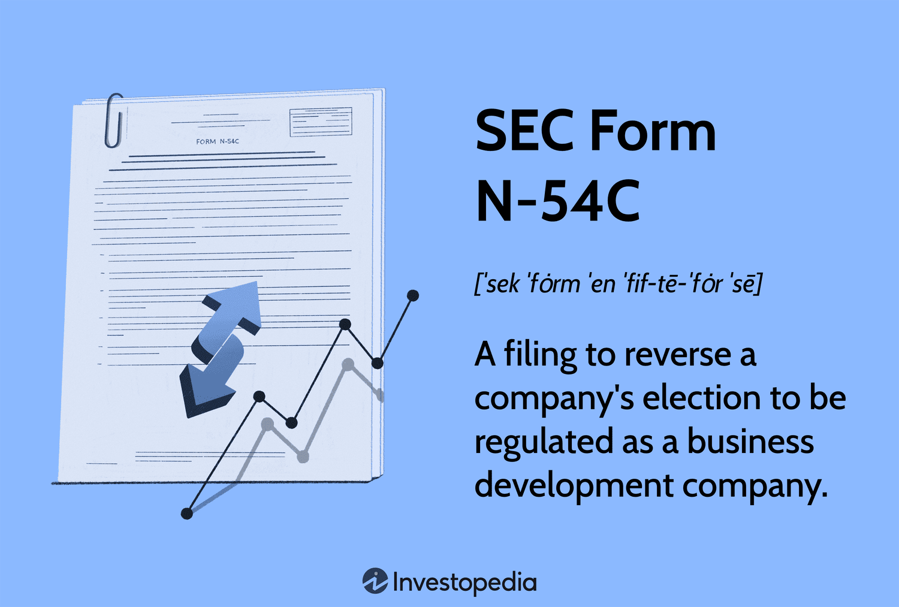

In the modern financial landscape, regulations play a crucial role in ensuring market stability and protecting investors. As financial markets evolve, integrating advanced technologies such as algorithmic trading, regulatory measures must adapt to maintain their efficacy. One such regulatory element is SEC Form N-54C, a critical document for companies electing to transition away from being classified as Business Development Companies (BDCs). Understanding the significance of this form within the regulatory framework is essential for firms involved in business development and those operating within the algorithmic trading space.

Algorithmic trading, which relies on computer algorithms to execute trades at speeds and frequencies beyond human capabilities, has significantly transformed the trading environment. These technological advancements necessitate a robust regulatory mechanism to mitigate associated risks, such as market manipulation and systemic failures. Within this context, SEC Form N-54C becomes a vital aspect of regulatory compliance, ensuring that companies' operational shifts are transparent and align with established guidelines.

This article examines the impact of SEC Form N-54C on algorithmic trading operations. As we explore its role, the intersection of financial regulation and technology emerges as an area of paramount importance for navigating today's investment environment. Grasping the nuances of SEC Form N-54C and its implications allows companies to effectively manage strategic transitions while adhering to regulatory expectations.

## Table of Contents

## What is SEC Form N-54C?

SEC Form N-54C is a document required by the Securities and Exchange Commission (SEC) for companies electing to withdraw their status as a Business Development Company (BDC). BDCs are entities created to support the growth of small- and mid-sized businesses by providing investment capital. This form is crucial as it legally formalizes the company's decision to no longer operate under the specific regulatory framework established for BDCs.

The filing of SEC Form N-54C generally indicates a fundamental change in a company’s strategy or operational direction. By withdrawing from BDC status, the company may intend to pursue alternative business objectives that are incompatible with BDC regulatory requirements. The form thus serves as a transitional mechanism, reflecting shifts in business purposes, growth strategies, or structural reorganizations.

The process of filing SEC Form N-54C necessitates that companies thoroughly understand the criteria for such withdrawal. Firms must clearly articulate the rationale behind their decision to deregulate as a BDC, ensuring that the reasons align with the categories predetermined by the SEC. These might include compliance with alternate regulatory bodies, restructuring for mergers, acquisitions, or pursuing distinct business models that BDC status might restrict.

In practice, providing a comprehensive and cogent explanation in the submission is paramount. Companies must delineate their strategic considerations to ensure transparent communication with regulators and the market. This clarity helps maintain market trust and protects against potential legal repercussions arising from ambiguous withdrawal motivations.

Ultimately, SEC Form N-54C holds significant implications for a company's regulatory alignment and operational future. As such, companies contemplating this transition must judiciously evaluate their motives and strategies, ensuring full compliance with SEC protocols and a clear articulation of their new business direction.

## Understanding Business Development Companies (BDCs)

Business Development Companies (BDCs) are specialized closed-end funds primarily established to furnish capital to small- and medium-sized enterprises (SMEs) within the U.S. economy. BDCs were created under the Small Business Investment Incentive Act of 1980 as an amendment to the Investment Company Act of 1940. Their primary goal is to facilitate economic growth by providing companies with the financial means necessary to expand and develop. BDCs fulfill this objective by offering a range of financial products, such as equity investments, debt securities, and alternative financing solutions tailored to meet the diverse needs of SMEs.

To qualify as a BDC, a company must adhere to specific criteria set forth in the Investment Company Act of 1940. Notably, a BDC is required to invest at least 70% of its total assets in private or public firms that do not have ready access to other forms of traditional financing, such as bank loans. Furthermore, BDCs are mandated to provide managerial assistance to the companies they invest in, offering guidance and strategic support to help these enterprises thrive. This assistance is a key differentiator for BDCs, positioning them not just as financial backers, but as partners in the growth of their portfolio companies.

The role of BDCs in the economic ecosystem extends beyond simply providing capital. By investing in and supporting SMEs, BDCs serve as vital conduits for economic stimulation, job creation, and innovation. Their investments help bridge the funding gap that many smaller companies face, facilitating entrepreneurship and competition across various sectors of the economy. 

Transitioning away from BDC status is a significant decision that often indicates strategic shifts within a company. This may occur when a BDC decides to diversify its operations, pursue alternative business models, or seek less regulatory oversight. The withdrawal from BDC status commonly involves filing SEC Form N-54C, which allows the company to align more closely with its evolving strategic objectives. Such a transition could reflect a response to changing market conditions, growth into new business areas, or a reallocation of resources toward alternative investment strategies.

In summary, BDCs play a critical role in supporting small- and medium-sized enterprises by providing necessary financial resources and strategic guidance. Their continuous investment and operational support contribute to the dynamism and resilience of the broader economic landscape.

## The Role of SEC Form N-54C in Financial Regulation

SEC Form N-54C plays a crucial role in maintaining transparency and ensuring compliance within financial markets. It serves as a regulatory instrument that aligns operational changes of companies with the expectations set forth by financial regulations. Companies that elect to transition away from being regulated as a Business Development Company (BDC) must file this form to notify the Securities and Exchange Commission (SEC) of their intent.

The regulatory framework underpinning SEC Form N-54C is deeply rooted in the provisions of the Investment Company Act of 1940. This act establishes the legislative requirements for companies operating as BDCs, which are designed to support financing for small- and medium-sized businesses within the United States. Withdrawing this status through the filing of Form N-54C indicates a fundamental shift in the company’s business strategy or operational focus, necessitating full disclosure to regulatory bodies to ensure continued compliance with all other applicable securities laws.

The process of filing SEC Form N-54C requires companies to provide a comprehensive explanation for their withdrawal from BDC status. These explanations must fall within specific predetermined categories recognized by the SEC, such as changes in financial strategy, restructuring of business operations, or transition to other forms of business regulation. By accurately completing this form, companies demonstrate their commitment to transparency and regulatory compliance during significant operational transitions.

Understanding these regulatory requirements is imperative for companies as they consider and implement changes to their corporate structure. Such knowledge enables them to make informed strategic decisions, anticipating regulatory implications while preserving compliance with existing laws. Companies must consider how a shift from BDC status impacts elements such as tax obligations, financial reporting requirements, and investor communications.

By examining the filing process and its impact on a company's regulatory status, the significance of SEC Form N-54C becomes clear. This form acts as a critical checkpoint for regulatory bodies to monitor and assess the legitimacy of a company's transformation away from BDC regulations. Ultimately, the framework ensures that companies maintain the integrity and transparency expected by both investors and regulatory authorities within the highly regulated financial ecosystem.

## Implications for Algorithmic Trading

Algorithmic trading, often referred to as algo trading, has become a cornerstone of modern financial markets, with algorithms executing trades based on pre-set criteria at speeds and frequencies beyond human capability. The regulatory landscape, however, poses significant challenges, particularly as it continuously evolves to address innovative trading strategies and market dynamics. 

Withdrawing from Business Development Company (BDC) status using SEC Form N-54C can have profound implications for firms engaged in [algorithmic trading](/wiki/algorithmic-trading). The transition marks a significant shift in regulatory obligations and operational framework. When a company elects to withdraw its BDC status, it must reassess its compliance structure, particularly concerning the Investment Company Act of 1940 and Securities Exchange Act of 1934.

Algorithmic trading firms need to remain vigilant about these regulatory shifts because SEC requirements can affect a range of operational parameters, including disclosure obligations, leverage limits, and investment strategies. For example, BDCs, while offering financing capabilities, are subject to specific restrictions and benefits that can influence how algorithmic trading is conducted. Once a firm files Form N-54C, it must ensure its trading algorithms align with the SEC's oversight mechanisms that apply to non-BDC entities.

A key consideration is the potential change in the risk profile and trading strategies allowed under new regulatory conditions. Algorithmic trading strategies may need modification to comply with different capital requirements or risk assessments imposed by the SEC once BDC status is rescinded. An understanding of these shifts is crucial as non-compliance can lead to significant legal and financial repercussions.

Moreover, withdrawing from BDC designation might alter the firm's market perception, which can indirectly influence algorithmic trading operations. Market participants, including institutional and retail investors, continuously assess the regulatory standings of firms. These perceptions can affect [liquidity](/wiki/liquidity-risk-premium), price discovery, and, consequently, the efficacy of algorithmic models.

In essence, the withdrawal from BDC status through SEC Form N-54C requires algorithmic trading firms to undertake a comprehensive review of their operational, strategic, and regulatory alignment. By staying informed and adaptable, firms can ensure the robustness and compliance of their algorithmic trading initiatives in an ever-changing financial regulatory landscape.

## Conclusion

SEC Form N-54C holds significant importance at the intersection of financial regulation and innovation. Acting as a regulatory instrument, it facilitates the withdrawal process for companies transitioning from Business Development Company (BDC) status. This transition is not merely administrative; it underscores the necessity of strategic business planning, allowing companies to realign their business models and operations to better meet evolving market demands and opportunities. 

As algorithmic trading becomes increasingly prevalent in financial markets, the understanding of regulatory frameworks such as those involving SEC Form N-54C becomes crucial. Algorithmic trading systems rely heavily on compliance with financial regulations to ensure their strategies operate within legal boundaries. Any changes in a company's regulatory status, such as those signaled by filing Form N-54C, could have substantial implications on how algorithmic trading activities are conducted, necessitating a thorough comprehension of such frameworks.

Being well-informed about regulatory forms like N-54C empowers companies to navigate corporate and operational changes effectively. This understanding aids in minimizing compliance risks while optimizing strategic decisions, ensuring that businesses remain adaptable and agile in a technologically advancing marketplace. The relationship between regulation and technological innovation in financial markets is complex and dynamic, and recognizing this interplay is essential for companies seeking to maintain competitiveness and drive growth. This article emphasizes the importance of regulatory knowledge as a cornerstone of successful adaptation to market and technological developments.

## References & Further Reading

[1]: Bergstra, J., Bardenet, R., Bengio, Y., & Kégl, B. (2011). ["Algorithms for Hyper-Parameter Optimization."](https://dl.acm.org/doi/10.5555/2986459.2986743) Advances in Neural Information Processing Systems 24.

[2]: ["Advances in Financial Machine Learning"](https://www.amazon.com/Advances-Financial-Machine-Learning-Marcos/dp/1119482089) by Marcos Lopez de Prado

[3]: ["The Regulation of Algorithmic Trading: Developments and the Challenges Ahead"](https://blog.counselstack.com/algorithmic-trading-regulations-compliance-risk-controls/) by Yesha Yadav, The Journal of Law and Economics

[4]: Securities and Exchange Commission. (1940). ["Investment Company Act of 1940."](https://www.sec.gov/investment/laws-and-rules)

[5]: ["Quantitative Trading: How to Build Your Own Algorithmic Trading Business"](https://github.com/LucindaYa/quant-resources/blob/master/Quantitative%20Trading%20How%20to%20Build%20Your%20Own%20Algorithmic%20Trading%20Business.pdf) by Ernest P. Chan

[6]: Securities and Exchange Commission. ["SEC Form N-54C Instructions."](https://www.sec.gov/files/formn-54c.pdf)