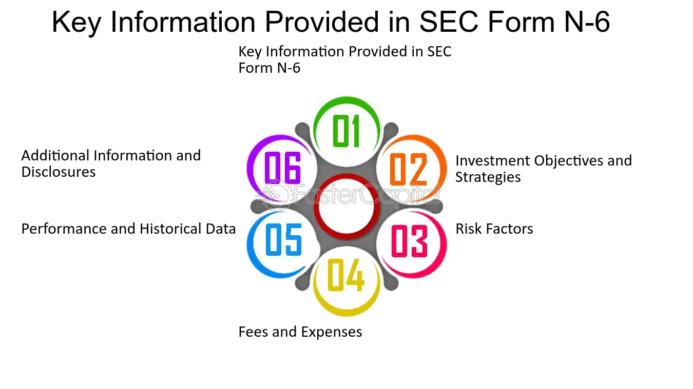

## Table of Contents

## What is SEC Form N-6?

SEC Form N-6 is a document used by insurance companies in the United States. It is filed with the Securities and Exchange Commission (SEC) when they want to register a separate account that holds the assets of variable life insurance policies. This form helps the SEC keep track of these accounts and make sure they follow the rules.

The information in Form N-6 includes details about the insurance company, the separate account, and the variable life insurance policies it supports. It also has information about the fees, risks, and how the policies work. By using this form, the SEC can protect people who buy these insurance policies by making sure they get all the important information they need to make good choices.

## Who is required to file SEC Form N-6?

Insurance companies need to file SEC Form N-6 when they want to set up a separate account for variable life insurance policies. This separate account is where the money from these policies is kept and managed. By filing Form N-6, the insurance company lets the SEC know about this account and the policies it supports.

The SEC uses the information in Form N-6 to make sure that the insurance company is following the rules. This helps protect people who buy variable life insurance policies. The form includes details about the insurance company, the separate account, and the policies, as well as information about fees, risks, and how the policies work.

## What is the purpose of SEC Form N-6?

SEC Form N-6 is a document that insurance companies use when they want to set up a special account for variable life insurance policies. This account is separate from the company's other money and is used to hold and manage the funds from these policies. By filing Form N-6, the insurance company tells the SEC about this account and the policies it supports.

The main purpose of Form N-6 is to help the SEC make sure that insurance companies follow the rules. The form includes important details about the insurance company, the separate account, and the policies, including information about fees, risks, and how the policies work. This helps protect people who buy variable life insurance policies by making sure they get all the important information they need to make good choices.

## How does SEC Form N-6 differ from other SEC forms?

SEC Form N-6 is special because it's just for insurance companies that want to set up a separate account for variable life insurance policies. This form tells the SEC about the account and the policies it supports. Other SEC forms might be used for different things, like registering stocks or bonds, or reporting financial information. For example, Form S-1 is used when a company wants to go public and sell its stock to the public, which is very different from setting up an insurance account.

The information in Form N-6 is focused on the details of the insurance company, the separate account, and the variable life insurance policies. It includes things like fees, risks, and how the policies work. Other forms, like Form 10-K, are used by public companies to give a yearly report of their financial health and business activities. So, while Form N-6 is all about insurance and protecting policyholders, other forms can be about different parts of a company's operations or financial dealings.

## What information must be included in SEC Form N-6?

SEC Form N-6 needs to have information about the insurance company, the separate account for variable life insurance policies, and the policies themselves. This includes the name of the insurance company and the account, and details about what the account does. It also needs to explain the variable life insurance policies, like how they work, what they cost, and what risks they have.

The form also needs to include financial information, like fees and charges that policyholders might have to pay. It should tell people about any risks they might face when they buy these policies. By including all this information, Form N-6 helps the SEC make sure that insurance companies are honest and clear with people who buy their policies.

## When must SEC Form N-6 be filed?

SEC Form N-6 must be filed by insurance companies when they want to set up a special account for variable life insurance policies. This account is separate from the company's other money and is used to hold and manage the funds from these policies. The insurance company needs to file Form N-6 before they start using this account, so the SEC knows about it and can make sure everything is done correctly.

The timing of filing Form N-6 is important because it helps the SEC keep track of these accounts and make sure they follow the rules. By filing the form before starting to use the account, the insurance company gives the SEC a chance to review all the details about the account and the policies. This helps protect people who buy variable life insurance policies by making sure they get all the important information they need to make good choices.

## How can one access SEC Form N-6 filings?

You can access SEC Form N-6 filings through the SEC's website, which is called EDGAR (Electronic Data Gathering, Analysis, and Retrieval system). Just go to the SEC's website, find the EDGAR search tool, and type in the name of the insurance company you're looking for. You can also search by the specific form number, N-6, to find all the filings related to variable life insurance policies.

Once you find the right filing, you can read it online or download it to your computer. The form will have all the details about the insurance company, the separate account, and the policies, including information about fees, risks, and how the policies work. This helps you understand what you're getting into if you're thinking about buying a variable life insurance policy.

## What are the key regulatory requirements associated with SEC Form N-6?

The key regulatory requirements for SEC Form N-6 are important for insurance companies setting up separate accounts for variable life insurance policies. The main requirement is that the insurance company must file Form N-6 with the SEC before they start using the account. This filing needs to include all the details about the insurance company, the separate account, and the policies, like how they work, what they cost, and the risks involved. This helps the SEC make sure that the insurance company is following the rules and being clear with people who might buy these policies.

Another important requirement is that the information in Form N-6 must be accurate and complete. The SEC uses this information to protect policyholders by making sure they get all the important details they need to make good choices. If the insurance company doesn't follow these rules, they could face penalties or other actions from the SEC. So, it's really important for insurance companies to be honest and clear when they fill out Form N-6.

## How does SEC Form N-6 impact investors?

SEC Form N-6 helps investors by making sure they get all the important information they need about variable life insurance policies. When an insurance company wants to set up a special account for these policies, they have to file Form N-6 with the SEC. This form tells investors about the insurance company, the separate account, and the policies. It includes details like how the policies work, what they cost, and what risks they might have. By having this information, investors can make better choices about whether to buy these policies.

The SEC uses Form N-6 to keep an eye on insurance companies and make sure they follow the rules. This helps protect investors from being misled or not getting all the facts. If an insurance company doesn't tell the truth or leaves out important information, the SEC can take action. So, Form N-6 is a big help for investors because it makes sure they have the right information to decide if a variable life insurance policy is a good choice for them.

## What are common challenges faced when filing SEC Form N-6?

Filing SEC Form N-6 can be tricky for insurance companies because they have to make sure all the information is correct and complete. This form needs to include details about the insurance company, the separate account for variable life insurance policies, and the policies themselves. If something is wrong or missing, the SEC might not approve the filing, which can delay the company's plans to set up the account. Also, insurance companies need to understand all the rules about what to include in the form, like fees, risks, and how the policies work. If they don't follow these rules, they could face penalties from the SEC.

Another challenge is that the process of filing Form N-6 can take a lot of time and effort. Insurance companies have to gather all the necessary information, which can be a big job. They might need help from lawyers or other experts to make sure everything is done right. Plus, the SEC might ask for more information or changes after the form is submitted, which can make the process even longer. So, it's important for insurance companies to plan ahead and be ready to work hard to get Form N-6 filed correctly and on time.

## How has SEC Form N-6 evolved over time?

SEC Form N-6 has changed over time to keep up with new rules and to make sure it gives people all the important information they need about variable life insurance policies. When it first came out, the form was simpler and focused on the basics of the insurance company and the separate account. But as the rules got more detailed and people needed more information to make good choices, the form got longer and more detailed. Now, it includes things like how the policies work, what they cost, and what risks they might have.

The SEC keeps an eye on how well Form N-6 is working and makes changes when they need to. For example, if there are new kinds of risks or fees that people should know about, the SEC might update the form to include that information. This helps make sure that the form stays useful and that people who buy variable life insurance policies have all the facts they need to make smart decisions.

## What are the best practices for ensuring compliance with SEC Form N-6 requirements?

To make sure they follow the rules for SEC Form N-6, insurance companies should start by gathering all the needed information carefully. They need to know the details about their company, the separate account, and the variable life insurance policies. This includes how the policies work, what they cost, and what risks they might have. It's important to double-check everything to make sure it's correct and complete. If something is wrong or missing, the SEC might not approve the filing, which can delay the company's plans.

Another good practice is to work with experts like lawyers who know a lot about SEC rules. They can help make sure the form is filled out right and that all the rules are followed. Also, insurance companies should plan ahead and give themselves plenty of time to file the form. The SEC might ask for more information or changes after the form is submitted, so it's good to be ready for that. By being careful and getting help when they need it, insurance companies can make sure they follow the SEC Form N-6 rules and protect the people who buy their policies.

## References & Further Reading

[1]: SEC. (n.d.). ["Form N-6."](https://www.sec.gov/files/formn-6.pdf) U.S. Securities and Exchange Commission.

[2]: Mayo, H. B. (2018). ["Investments: An Introduction."](https://www.cengage.com/c/investments-an-introduction-13e-mayo/9780357127957PF/?app=cmp) Cengage Learning.

[3]: Hull, J. (2017). ["Options, Futures, and Other Derivatives."](https://elibrary.pearson.de/book/99.150005/9781292212920) Pearson.

[4]: Hendershott, T., & Moulton, P. (2011). ["Automation, Speed, and Stock Market Quality: The NYSE’s Hybrid."](https://www.sciencedirect.com/science/article/pii/S138641811100005X) Review of Financial Studies.

[5]: Hasbrouck, J., & Saar, G. (2013). ["Low-latency trading."](https://www.sciencedirect.com/science/article/abs/pii/S1386418113000165) Review of Financial Studies.