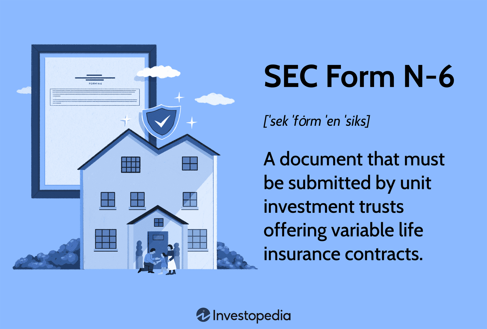

In the complex world of financial markets, regulatory forms are vital for ensuring transparency and safeguarding investors against potential risks. One pivotal document in this regulatory landscape is the SEC Form N-6. This form holds particular significance for variable life insurance contracts, serving as a crucial instrument for disclosing comprehensive information about these financial products. Variable life insurance contracts blend insurance protection with investment opportunities, creating intricate financial structures that necessitate clear communication and regulation.

The SEC Form N-6 requires detailed disclosure of the investment components, associated risks, and the financial status of the issuing insurance company. This transparency is essential for investors, enabling them to make informed decisions regarding the viability and risk profile of their insurance investments. As financial markets evolve, the integration of technologies like algorithmic trading further complicates the landscape. Algorithmic trading utilizes sophisticated algorithms and rapid data processing to optimize investment strategies, including those associated with variable life insurance products.

Understanding the relevance of SEC Form N-6, its impact on variable life insurance companies, and the role of algorithmic trading is crucial for both investors and insurers. For investors, it aids in assessing potential returns against associated risks. For insurance companies, compliance with SEC regulations is fundamental to maintaining trust and integrity in their operations. In an ever-evolving financial environment, maintaining this understanding equips all stakeholders to navigate market complexities effectively.

## Table of Contents

## Understanding SEC Form N-6

SEC Form N-6 is a critical document required by the U.S. Securities and Exchange Commission (SEC) for separate accounts that offer variable life insurance contracts. The form is designed to ensure transparency and protect investors by providing comprehensive information about the investment attributes and potential risks of variable life insurance policies.

One of the primary purposes of SEC Form N-6 is to offer a detailed description of the variable life insurance contract. This includes outlining the terms and conditions, explaining how the investment component works, and specifying how the policyholder's premium payments are allocated between insurance coverage and investment accounts. By delineating these aspects, the form enables investors to have a clear understanding of the contractual obligations and potential outcomes of their insurance policy.

Another essential element of Form N-6 is its focus on investment risks. Variable life insurance policies allow policyholders to invest in a variety of funds, often mirroring mutual fund investments. This means that the cash value of the policy can fluctuate based on the performance of the selected investment vehicles. Form N-6 provides a thorough analysis of these risks, helping investors to gauge the volatility and potential returns associated with their chosen investments. It includes information on market risk, [interest rate](/wiki/interest-rate-trading-strategies) risk, and the risk associated with the investment management strategies employed.

Additionally, SEC Form N-6 requires disclosure of the financial health of the insurance company issuing the policy. This section of the form typically includes the company's financial statements, performance metrics, and any relevant ratings from credit rating agencies. By reviewing this data, investors can assess the stability and reliability of the insurer, which is crucial for making informed investment decisions.

For investors considering variable life insurance, Form N-6 serves as an indispensable tool. It provides the requisite knowledge to evaluate both the potential benefits and the inherent risks of their investment, allowing them to make decisions that align with their financial goals and risk tolerance. Understanding the information contained in SEC Form N-6 is essential for safeguarding one's investment and ensuring that the variable life insurance aligns with personal financial objectives.

## The Role of Variable Life Insurance in Investment

Variable life insurance contracts represent a hybrid financial product that merges the security features of life insurance with the investment opportunities typically associated with mutual funds. These distinct policies permit policyholders to allocate the cash value component of their insurance into a diverse range of investment funds. These funds can include equity funds, bond funds, or money market funds, thereby offering the policyholder an opportunity to generate returns that are akin to those achieved through mutual fund investments.

The dual nature of variable life insurance policies introduces a dynamic where the cash value and potentially the death benefit can vary based on the performance of the chosen investments. This investment characteristic inherently carries a degree of market risk, as the value of the policy is susceptible to fluctuations dependent on the financial markets and the performance of the selected investment options. Consequently, the policy's surrender value and the death benefit can adjust upwards or downwards, reflecting the successes or failures of these investments.

Integral to understanding these policies is the SEC Form N-6, which serves as a disclosure document mandated by the Securities and Exchange Commission. This form provides prospective investors with crucial information regarding the investment nature and associated risks of variable life insurance contracts. Within Form N-6, detailed narratives describe the insurance contract, highlight the investment risks, and present the financial condition of the issuing insurance company. By doing so, it equips investors with the necessary knowledge to evaluate the viability and potential risks of their investment, ensuring they make informed decisions before committing their financial resources.

In summary, while variable life insurance contracts hold the potential for significant growth through investments, they also introduce a level of risk due to market [volatility](/wiki/volatility-trading-strategies). SEC Form N-6 plays an essential role in demystifying these complexities, enabling investors to understand and navigate the intrinsic risks and rewards associated with such financial products.

## Algorithmic Trading in Insurance Companies

Algorithmic trading systems utilize sophisticated algorithms and data analytics to make trading decisions, executing these operations often at an exceedingly rapid pace. In the insurance sector, these systems have found a significant application in managing the investment portfolios associated with variable life insurance policies. Variable life insurance combines the benefits of traditional life insurance with the potential for investment growth, allowing policyholders to allocate a portion of their premium payments to a range of investment funds. This arrangement introduces a level of financial complexity where [algorithmic trading](/wiki/algorithmic-trading) can be beneficial.

The application of algorithmic trading in managing these portfolios involves leveraging advanced computational models to optimize investment strategies and enhance returns. These algorithms can analyze vast datasets, including market trends and asset performances, to make informed decisions swiftly. This capability is particularly useful in variable life insurance products where the value of investment-linked policies can fluctuate with market conditions. By using algorithmic trading, insurance companies can potentially manage risk exposure better and improve the overall performance of the investment component of these policies.

Understanding how these algorithmic systems operate and their impact on investment performance is crucial for both insurers and policyholders. For insurers, employing these systems effectively means achieving a balance between maximizing returns and controlling risks. They must also ensure that their algorithmic trading strategies align with their overall financial goals and comply with applicable regulatory frameworks. One such critical regulatory standard comes from the Securities and Exchange Commission (SEC), specifically through mandates like SEC Form N-6, which requires detailed reporting on the investment aspects and risks of variable life insurance policies.

Insurers are obligated to ensure that their algorithmic trading strategies do not result in conflicts of interest or breach regulatory requirements. As per SEC Form N-6, insurance companies must disclose the methods used in managing investments, including any algorithmic trading schemes. This disclosure is essential to maintain transparency with policyholders, fostering trust and reliability in how their premiums are being managed. Non-compliance or inadequate reporting could result in significant regulatory penalties and damage to an insurer's reputation.

In summary, algorithmic trading plays a pivotal role in enhancing the management of investment portfolios associated with variable life insurance policies. However, its integration into the insurance sector demands rigorous adherence to regulatory practices like those outlined in SEC Form N-6 to ensure both compliance and the protection of investor interests.

## Implications of Algorithmic Trading on Reporting

The integration of algorithmic trading in managing investments associated with variable life insurance policies presents unique challenges and opportunities in the context of regulatory reporting. SEC Form N-6 is crucial for documenting any potential conflicts of interest and the myriad risks linked to employing algorithmic strategies. This ensures that investors are adequately informed about the methodologies influencing the value and stability of their investments.

Algorithmic trading, which leverages computational algorithms and data analytics for automatic decision-making, can influence investment outcomes significantly. These systems have the capability to adjust holdings at a speed and level of complexity beyond traditional human-operated strategies. However, this brings forward pertinent questions about transparency and risk management. SEC regulations require insurance companies to provide comprehensive disclosures on Form N-6, detailing how these algorithms function, the assumptions on which they are based, and any conflicts that might arise as a consequence of their use.

Furthermore, thorough reporting is necessary to assure investors of the reliability of their investments. The algorithms employed must be scrutinized for biases in decision-making processes, especially those that might disproportionately impact risk assessments or market positions. Disclosures on Form N-6 should encapsulate the possibility of market manipulation or undue preference, whether intentional or as an error intrinsic to the algorithm's design. For instance, an insurance company utilizing algorithmic trading might have to detail how their systems manage sell-offs in volatile markets to prevent exacerbating losses.

Insurance companies must maintain meticulous records and provide clear, understandable information on these algorithms’ operations and their impacts on investment portfolios. Despite the inherent complexities, this clear documentation helps safeguard against penalties for non-compliance and bolsters investor confidence. When conflicts of interest or risks are transparently reported and managed in alignment with SEC regulations, investors can better understand the dynamics affecting their investments.

The importance of maintaining transparency cannot be understated. It builds trust among policyholders and streamlines the relationship between insurers and the regulatory bodies. By ensuring all algorithmic trading practices are well documented and potential impacts disclosed on Form N-6, insurance companies can better manage investor expectations and comply with regulatory standards. This transparency, in turn, acts as a foundational pillar supporting the integrity and stability of the variable life insurance market in a technologically advancing investment landscape.

## The Future of SEC Form N-6 and Algorithmic Trading

As technology continues to progress, transformative changes are unfolding within the financial services industry, fundamentally altering the landscape of investments and regulatory reporting. The advent of sophisticated algorithmic trading strategies, driven by [artificial intelligence](/wiki/ai-artificial-intelligence) and [machine learning](/wiki/machine-learning), is significantly influencing how insurance products, particularly variable life insurance, are managed and reported. This evolution calls for a reassessment of regulatory frameworks such as SEC Form N-6, which holds a pivotal role in maintaining transparency between insurance companies and their policyholders.

The current regulatory framework, while robust, may not be adequately equipped to handle the complexities introduced by advanced algorithmic trading. These systems, designed to execute trades based on defined sets of rules and algorithms, offer both opportunities for enhanced portfolio management and challenges concerning regulatory compliance. As algorithmic trading increasingly becomes integral to managing the investment portfolios within variable life insurance policies, it is foreseeable that the SEC will need to update Form N-6 or establish new reporting standards. Such updates will likely aim to capture the intricate details associated with algorithmic decision-making processes, thereby ensuring the integrity and reliability of investment disclosures.

Insurance companies, to remain compliant and competitive, must stay informed about these regulatory changes and adapt their compliance frameworks accordingly. This necessitates a proactive approach in monitoring and implementing the latest technological advancements in their trading strategies while ensuring that all operations align with existing and evolving SEC requirements. Enhanced transparency in trading activities, through updated reporting mechanisms, can serve to reassure policyholders of the stability and soundness of their investments.

For investors, comprehending the impact of these technological and regulatory shifts is equally vital. A nuanced understanding of how algorithmic trading affects investment portfolios can guide investors in making informed choices regarding their insurance and investment strategies. As the SEC potentially introduces new reporting requirements, investors will need to be vigilant of these developments to effectively evaluate the performance and risks associated with their variable life insurance products.

In conclusion, the intersection of technological advancement and regulatory oversight presents both challenges and opportunities within the variable life insurance market. As the SEC considers updates or introductions to Form N-6 to address these advancements, both insurance companies and investors must remain adaptable, ensuring compliance and maximizing the potential benefits of algorithmic trading in investment management.

## Conclusion

SEC Form N-6 is fundamental in ensuring transparency and protecting investors within the variable life insurance sector. It provides a structured framework for disclosing information that helps investors understand the risks and investment aspects associated with variable life insurance policies. The effectiveness of this form is heightened by the increasing complexity introduced by algorithmic trading, which offers both advantages and potential challenges for insurance companies. Algorithmic trading allows for the efficient management and growth of investment portfolios associated with variable life insurance contracts, but it also requires precise regulatory compliance to prevent conflicts of interest and to maintain investor trust.

A major concern in this context is the need for complete and accurate disclosure, as mandated by SEC Form N-6. This transparency is essential to ensure that policyholders are fully informed about their investments, which reinforces confidence in the financial products they choose. Clear reporting requirements serve to align the interests of insurers and policyholders effectively, minimizing misunderstandings and potential disputes.

As the financial landscape continues to evolve with advancements in technology, regulatory practices must also adapt to address the challenges and opportunities arising from such developments. This involves anticipating changes in trading technologies and investment strategies and adjusting regulatory frameworks accordingly. Insurance companies and investors alike must stay informed and proactive regarding updates to SEC Form N-6 and related regulations. As financial markets become more complex, the ongoing adaptation of these practices will be crucial in maintaining the delicate balance between regulatory compliance and technological advancement.

## References & Further Reading

[1]: SEC. (n.d.). ["Form N-6."](https://www.sec.gov/files/formn-6.pdf) U.S. Securities and Exchange Commission.

[2]: Mayo, H. B. (2018). ["Investments: An Introduction."](https://www.cengage.com/c/investments-an-introduction-13e-mayo/9780357127957PF/?app=cmp) Cengage Learning.

[3]: Hull, J. (2017). ["Options, Futures, and Other Derivatives."](https://elibrary.pearson.de/book/99.150005/9781292212920) Pearson.

[4]: Hendershott, T., & Moulton, P. (2011). ["Automation, Speed, and Stock Market Quality: The NYSE’s Hybrid."](https://www.sciencedirect.com/science/article/pii/S138641811100005X) Review of Financial Studies.

[5]: Hasbrouck, J., & Saar, G. (2013). ["Low-latency trading."](https://www.sciencedirect.com/science/article/abs/pii/S1386418113000165) Review of Financial Studies.