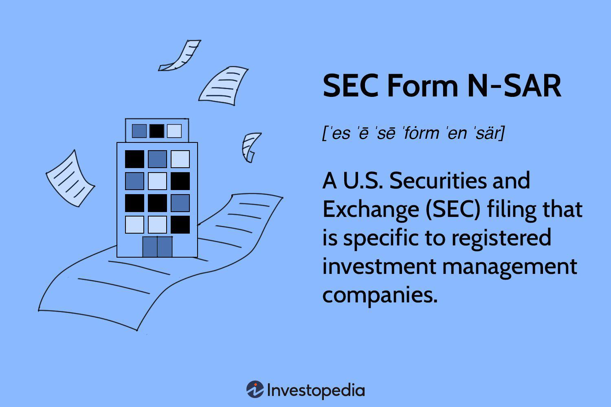

The world of financial reporting and compliance is a landscape characterized by its complexity and constant evolution. Central to this landscape are various regulatory filings mandated by the U.S. Securities and Exchange Commission (SEC), designed to ensure transparency and protect investors. Among these was Form N-SAR, a document that played a significant role in the reporting obligations of registered investment management companies. Although now obsolete, Form N-SAR was pivotal in collecting important financial information such as share sales and portfolio turnover rates.

The transition from Form N-SAR to Form N-CEN in 2018 marked a shift towards modernizing reporting requirements, reflecting the dynamic nature of financial regulations. This evolution was necessitated by advancements in financial practices and the need for more comprehensive data reporting mechanisms to accommodate these changes.

Simultaneously, algorithmic trading has emerged as a crucial element of contemporary financial markets. It employs sophisticated algorithms to execute trades at high speeds and volumes, offering benefits such as increased efficiency and reduced human error. Nevertheless, algorithmic trading introduces additional regulatory challenges, as the SEC must ensure these practices align with existing laws to maintain market integrity.

This article examines the intersection of financial reporting, the transition from SEC Form N-SAR to N-CEN, and the rising prominence of algorithmic trading, providing insight into how these components coalesce within the broader framework of modern financial regulation.

## Table of Contents

## What Was SEC Form N-SAR?

SEC Form N-SAR was a regulatory document mandated by the U.S. Securities and Exchange Commission (SEC) for registered investment management companies. This form played a pivotal role in ensuring transparency and regulatory compliance by requiring companies to disclose vital financial information. Primarily, the Form N-SAR focused on capturing data encompassing share sales and portfolio turnover rates, which are integral metrics for understanding a fund's trading activity and investment strategies.

The necessity for such disclosure stemmed from the SEC's objective to maintain an open and transparent environment in the investment community, allowing investors and regulators to make informed decisions based on reliable data. The gathered information provided a comprehensive view of a company's operational performance and transactional behavior, which was essential for regulatory oversight and investor assurance.

In 2018, the SEC replaced Form N-SAR with Form N-CEN as part of an initiative to modernize and streamline the reporting process. This transition marked a significant shift in how financial data was collected and reported, aiming to enhance the timeliness and relevance of the information provided. Form N-CEN introduced updated metrics and reporting protocols aligned with contemporary financial practices, thus addressing the evolving needs of the financial industry. The modernization of reporting requirements was intended to reduce redundancy, improve data quality, and cater to emerging trends within the investment management sector.

## Transition to Form N-CEN

The replacement of SEC Form N-SAR with Form N-CEN marked a significant change in the compliance landscape for registered investment management companies. Introduced in 2018, Form N-CEN was developed to address the need for more comprehensive and up-to-date financial reporting, aligned with modern practices and regulatory requirements.

Form N-CEN streamlined reporting duties by focusing on current financial practices and eliminating the need for outdated data. This modernization was designed to reduce the administrative burden on companies and enhance the granularity of information provided to the U.S. Securities and Exchange Commission (SEC). Form N-CEN's reporting scope includes novel metrics that were not previously captured by Form N-SAR, thereby offering a more refined snapshot of a company's financial activities.

One of the key improvements introduced by Form N-CEN is the incorporation of elements pertinent to contemporary financial operations. A prominent example is the inclusion of metrics related to securities lending, a practice that has gained prominence in recent years. Securities lending refers to the process of lending securities to investors or firms for various purposes, including short selling or hedging. The updated reporting requirements ensure that the SEC has visibility into such activities, offering a clearer perspective on the risk exposure and operational dynamics of investment companies.

By aligning reporting obligations more closely with current industry practices and technological advancements, Form N-CEN enables the SEC to maintain robust oversight of the financial markets. The transition demonstrates the Commission's commitment to refining regulatory frameworks in response to the evolving needs of the investment landscape, ensuring that information remains pertinent and reflective of the actual operational environment of investment companies.

## Understanding Algorithmic Trading

Algorithmic trading involves the utilization of advanced computational algorithms to automate and enhance the execution speed of trading activities in financial markets. These algorithms analyze market conditions, identify trading opportunities, and execute trades based on predefined criteria without direct human intervention. The primary advantage of [algorithmic trading](/wiki/algorithmic-trading) is its ability to process vast volumes of data at ultrafast speeds, leading to enhanced market efficiency. This can significantly reduce transaction costs and improve the accuracy and speed of trade execution.

One of the key benefits of algorithmic trading is its ability to minimize reaction times to market events. Unlike traditional trading methods where decisions are made by human traders, algorithms can react to favorable conditions in milliseconds. This rapid response capability allows traders to capitalize on price discrepancies quickly, thereby optimizing their profit margins.

Furthermore, algorithmic trading reduces the potential for human error, such as emotional decision-making or calculation mistakes, as trades are executed based on structured and objective criteria. This level of precision is particularly valuable in high-frequency trading environments where the decision speed is crucial.

Despite its advantages, algorithmic trading poses unique challenges in ensuring compliance with regulatory standards. The U.S. Securities and Exchange Commission (SEC) is instrumental in overseeing and regulating algorithmic trading practices to align them with current financial regulations. Concerns such as market manipulation, unfair trading practices, and system failures are some of the issues that regulatory bodies aim to address. As such, firms engaged in algorithmic trading must implement stringent risk management and compliance strategies to adhere to legal requirements.

The SEC remains vigilant in monitoring algorithmic trading to mitigate risks and ensure market integrity. Their regulatory framework is continuously adapted to address developments in trading technologies and their potential impact on financial markets. In this way, the SEC aims to balance innovation in trading methodologies with the need for a fair and transparent marketplace.

## SEC Regulations and Algorithmic Trading

The Securities and Exchange Commission (SEC) has developed a regulatory framework to address the rapid rise and inherent complexities of algorithmic trading. Algorithmic trading utilizes pre-programmed instructions to execute orders at speeds and frequencies that are impractical for human traders. While it offers significant benefits like expedited trade execution and cost efficiency, it also poses substantial risks such as market [volatility](/wiki/volatility-trading-strategies) and the potential for unfair trading practices. Consequently, the SEC has instituted a series of rules that algorithmic trading strategies must comply with.

Market manipulation is one of the primary concerns associated with algorithmic trading. Strategies designed to create artificial prices or inflate trading volumes can lead to distorted market conditions. As a result, the SEC enforces strict rules against practices like "spoofing," where traders place orders with the intent to cancel them before execution to manipulate prices. Compliance with the Dodd-Frank Wall Street Reform and Consumer Protection Act, among others, ensures that algorithmic traders do not engage in deceptive tactics that undermine market integrity.

Fair trading practices are another cornerstone of SEC regulation in this domain. The agency prioritizes maintaining a level playing field, so that all market participants have equitable opportunities for access and information. This includes stringent monitoring of execution quality, whereby algorithms are expected to adhere to best execution practices that prioritize the investor's best interests.

Further, financial reporting forms such as the former N-SAR and the current N-CEN play an essential role in enhancing transparency within investment environments. These forms provide the baseline for regulatory oversight by ensuring that investment companies disclose detailed financial information. This includes reporting on assets, operations, and securities transactions—all of which are indispensable for assessing compliance with applicable laws and for monitoring the influence of algorithmic trading activities on market dynamics.

In sum, the SEC continues to refine its regulations to mitigate risks posed by algorithmic trading, balancing innovation with the need to protect investors and maintain orderly markets. The enforcement of regulations against market manipulation, assurance of fair trading practices, and rigorous financial reporting obligations constitute fundamental elements of this approach. As the field of algorithmic trading continues to evolve, the SEC's adaptability remains crucial to safeguarding the financial ecosystem.

## The Impact of Regulatory Changes on Financial Markets

The transition from Form N-SAR to Form N-CEN marks a significant milestone in the evolution of financial market regulations. This shift aligns with the broader objective of regulatory bodies to enhance transparency, efficiency, and adaptability in response to the dynamic nature of modern financial markets. 

Form N-SAR, which was supplanted by Form N-CEN in 2018, represented an older framework that was beginning to show signs of inefficiency and obsolescence. The advent of Form N-CEN reflects a refined approach to compliance, characterized by the requirement for more comprehensive and timely disclosures from registered investment companies. This modernized form facilitates improved data collection and analysis, crucial for regulatory bodies in overseeing market activities and ensuring robust investor protection.

One of the critical catalysts for ongoing regulatory updates is the increasing prevalence of algorithmic trading. With its ability to execute high-speed transactions using complex algorithms, algorithmic trading introduces both opportunities and challenges in financial markets. On the one hand, it enhances market [liquidity](/wiki/liquidity-risk-premium) and efficiency. On the other hand, it necessitates rigorous oversight to prevent potential malpractices such as market manipulation or systemic risks that could arise from automated trading errors.

The U.S. Securities and Exchange Commission (SEC) plays a pivotal role in this regulatory landscape by continuously adapting its rules and frameworks to manage the intricate aspects of algorithmic trading. By implementing guidelines that mandate fairness and transparency, the SEC aims to maintain an equitable trading environment. The data gleaned from instruments like Form N-CEN becomes integral in this respect, providing a foundation for monitoring compliance and identifying potential areas of concern.

Furthermore, the SEC’s proactive regulatory stance underscores the need for continuous evolution in their oversight mechanisms as market conditions change. Anticipating future trends, including the potential effects of emerging technologies on trading practices, the SEC is likely to update regulations to address new challenges. Such forward-thinking measures are essential to ensure the financial markets operate with integrity and that all participants, regardless of size, are protected.

In conclusion, the transition to Form N-CEN and the regulation of algorithmic trading highlight the necessity for adaptable and comprehensive regulatory frameworks. By fostering an environment of transparency and fairness, these developments aim to support the integrity and stability of financial markets amidst ongoing technological advancements and shifts in trading paradigms.

## Conclusion

Understanding the intricacies of financial reporting forms and evolving regulations is essential for compliance. The transition from SEC Form N-SAR to Form N-CEN underscores the need for regulatory frameworks to adapt to modern financial realities. Form N-CEN not only aligns reporting with contemporary practices but also simplifies the compliance process by incorporating more relevant and timely data, thereby enhancing transparency and functionality for investment management companies.

As algorithmic trading continues to reshape financial markets, it introduces both opportunities and complexities. The rapid execution capabilities and efficiency offered by algorithmic trading necessitate an ongoing reevaluation of regulatory standards to ensure they adequately address potential risks, such as market manipulation and systemic vulnerabilities. In this context, maintaining a dynamic regulatory environment is crucial for safeguarding market integrity and ensuring fair trading practices.

Staying informed about these regulatory changes is vital for investment management companies to maintain adherence to SEC requirements. Regular updates and educational initiatives can aid companies in navigating the complexities of financial reporting and compliance, allowing them to efficiently manage their obligations while capitalizing on the benefits of modern trading strategies. By doing so, firms can foster a robust and transparent investment ecosystem that aligns with both regulatory expectations and market advancements.

## References & Further Reading

[1]: Securities and Exchange Commission. ["Investment Company Reporting Modernization"](https://www.sec.gov/rules-regulations/2017/12/investment-company-reporting-modernization). Release No. 33-10231, October 2016.

[2]: Kahan, M., & Rock, E. B. (2008). ["The Hanging Chads of Corporate Voting."](https://papers.ssrn.com/sol3/papers.cfm?abstract_id=1007065) Georgetown Law Journal, 96(4), 1227-1283.

[3]: Gomber, P., Arndt, B., Lutat, M., & Uhle, T. (2011). ["High-frequency trading."](https://papers.ssrn.com/sol3/papers.cfm?abstract_id=1858626) Journal of Information Technology, 26(4), 312-320.

[4]: Domowitz, I., & Steil, B. (1999). ["Automation, Trading Costs, and the Structure of the Trading Services Industry."](https://www.nomurafoundation.or.jp/en/wordpress/wp-content/uploads/2014/09/19971011_Ian_Domowitz_-_Benn_Steil.pdf) Review of Financial Studies, 12(3), 639-675.

[5]: Aldridge, I. (2013). ["High-Frequency Trading: A Practical Guide to Algorithmic Strategies and Trading Systems."](https://www.amazon.com/High-Frequency-Trading-Practical-Algorithmic-Strategies/dp/1118343506) Wiley.