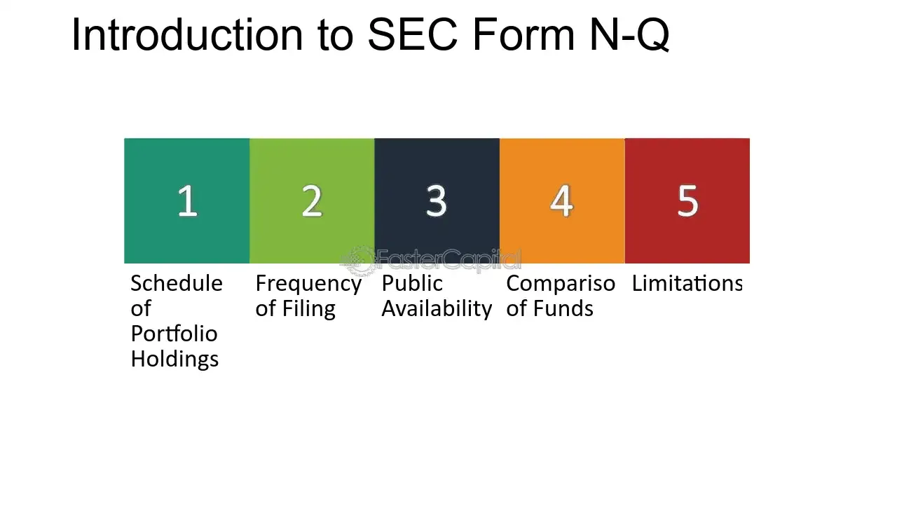

## Table of Contents

## What is SEC Form N-Q?

SEC Form N-Q is a document that investment companies, like mutual funds, have to file with the U.S. Securities and Exchange Commission (SEC). It shows what stocks, bonds, and other investments the fund owns at the end of each quarter. This helps investors see what the fund is investing in and how it's doing.

The form is important because it gives investors a clear picture of the fund's holdings. By looking at Form N-Q, investors can make better decisions about whether to buy, sell, or keep their investments in the fund. It's like a report card that comes out every three months, showing the fund's performance and what it's invested in.

## Who is required to file SEC Form N-Q?

SEC Form N-Q needs to be filed by investment companies, like mutual funds and exchange-traded funds (ETFs). These companies have to tell the SEC what stocks, bonds, and other investments they own at the end of every three months. This rule applies to all management investment companies that are registered with the SEC under the Investment Company Act of 1940.

The reason for this form is to keep things open and honest. By sharing this information, investors can see exactly what their money is being used for. This helps them decide if they want to keep their money in the fund or move it somewhere else. It's all about making sure investors have the information they need to make smart choices.

## What is the purpose of SEC Form N-Q?

SEC Form N-Q is a report that investment companies, like mutual funds, have to send to the SEC every three months. The main purpose of this form is to show what stocks, bonds, and other investments the fund owns at that time. This helps investors know exactly where their money is being invested.

By looking at Form N-Q, investors can see if the fund is making good choices with their money. It's like a regular check-up that helps people decide if they should keep their money in the fund or move it somewhere else. This openness is important because it helps investors make smart decisions based on what the fund is doing.

## How often must SEC Form N-Q be filed?

SEC Form N-Q needs to be filed every three months. This means investment companies like mutual funds have to send this report to the SEC four times a year.

The reason for filing it so often is to keep investors up-to-date on what the fund is investing in. By getting this information every three months, investors can see if the fund is doing well and make better choices about their money.

## What information is included in SEC Form N-Q?

SEC Form N-Q includes details about the investments a mutual fund or similar company holds at the end of each three-month period. This includes a list of all the stocks, bonds, and other securities the fund owns. It also shows how much of each investment the fund has, which helps investors understand the fund's strategy and where their money is being put.

The form also gives information about any big changes in the fund's investments since the last report. This could be buying or selling a lot of a certain stock or bond. By looking at these changes, investors can see if the fund is sticking to its plan or if it's making big shifts in what it's investing in. This helps investors decide if they want to keep their money in the fund or move it somewhere else.

## How does SEC Form N-Q differ from other SEC forms like N-CSR?

SEC Form N-Q and SEC Form N-CSR are both important reports that investment companies like mutual funds have to file with the SEC, but they focus on different things. Form N-Q is all about showing what stocks, bonds, and other investments the fund owns at the end of each three months. It's like a snapshot that comes out every quarter, helping investors see exactly where their money is being put. This form is important because it lets investors keep an eye on the fund's investment choices and decide if they want to stay invested or not.

On the other hand, Form N-CSR is a bit different. It's a yearly report that not only lists the fund's investments but also includes other important details like the fund's financial statements, how well it did over the year, and any big changes in its policies or operations. It's like a yearly summary that gives investors a broader look at the fund's performance and management. While Form N-Q is more about the current holdings, Form N-CSR gives a more complete picture of the fund's overall health and activities over the past year.

## What are the key components of a typical SEC Form N-Q filing?

SEC Form N-Q is a report that investment companies, like mutual funds, have to send to the SEC every three months. It lists all the stocks, bonds, and other investments the fund owns at the end of each quarter. This helps investors see exactly where their money is being put and how much of each investment the fund holds. By looking at this list, investors can understand the fund's strategy and make sure it matches what they want their money to do.

The form also includes information about any big changes in the fund's investments since the last report. This means if the fund bought or sold a lot of a certain stock or bond, it will show up in the form. This part is important because it helps investors see if the fund is sticking to its plan or if it's making big shifts in what it's investing in. Knowing about these changes can help investors decide if they want to keep their money in the fund or move it somewhere else.

## How can investors use the information from SEC Form N-Q?

Investors can use the information from SEC Form N-Q to keep track of what their mutual fund is investing in. Every three months, the form shows a list of all the stocks, bonds, and other investments the fund owns. By looking at this list, investors can see if the fund is sticking to its strategy or if it's making big changes. This helps investors decide if the fund is still a good fit for their goals. For example, if an investor wants to invest in technology companies, they can check if the fund is buying more tech stocks or moving away from them.

The form also shows how much of each investment the fund has, which can help investors understand how risky the fund might be. If the fund has a lot of money in just a few stocks, it might be riskier than a fund that spreads its money across many different investments. By keeping an eye on these details, investors can make smarter choices about whether to keep their money in the fund or move it to another investment that better matches what they want.

## What are the penalties for non-compliance with SEC Form N-Q filing requirements?

If an investment company doesn't file SEC Form N-Q on time, they could face penalties from the SEC. These penalties can include fines, which are like money punishments. The fines can be pretty big, depending on how late the filing is and how many times the company has missed the deadline before. The SEC might also take other actions, like making the company fix the problem or even taking them to court.

Not filing Form N-Q on time can also hurt the company's reputation. Investors might lose trust in the company if they see it's not following the rules. This could lead to people pulling their money out of the fund, which is bad for the company. So, it's really important for investment companies to make sure they file Form N-Q on time to avoid these problems.

## How has the requirement for SEC Form N-Q changed over time?

The requirement for SEC Form N-Q has changed a bit over the years. Before, investment companies like mutual funds had to file Form N-Q every three months to show what they were investing in. This was really helpful for investors who wanted to keep an eye on where their money was going. But in 2020, the SEC decided to stop requiring Form N-Q and replace it with a new form called Form N-PORT. The main reason for this change was to make the reporting process more modern and efficient.

Form N-PORT is similar to Form N-Q but it's filed a bit differently. Instead of being public right away, Form N-PORT is filed with the SEC every month, but only the information from the end of each quarter is made public after a 60-day delay. This new way of doing things gives the SEC more detailed and timely information, which can help them keep a closer watch on investment companies. Even though Form N-Q isn't used anymore, the idea behind it—to keep investors informed about what their funds are doing—still stays the same with Form N-PORT.

## What are some common challenges faced by filers when completing SEC Form N-Q?

One common challenge for filers when completing SEC Form N-Q is making sure all the information is correct and up-to-date. Every three months, they have to list all the stocks, bonds, and other investments the fund owns. If there's a mistake or if something is left out, it can cause problems with the SEC and confuse investors. It's a lot of work to gather all this information and double-check it to make sure it's right.

Another challenge is meeting the deadline. The form has to be filed within a certain time after the end of each quarter. If the filers are late, they might have to pay fines or face other penalties from the SEC. Keeping track of all the deadlines and making sure everything is ready on time can be stressful, especially if the fund is big and has a lot of different investments to report.

## Can you explain the impact of recent regulatory changes on SEC Form N-Q filings?

The recent regulatory changes have had a big impact on SEC Form N-Q filings. In 2020, the SEC decided to stop requiring Form N-Q and replace it with a new form called Form N-PORT. This change was made to make the reporting process more modern and efficient. Instead of filing Form N-Q every three months, investment companies now have to file Form N-PORT every month, but only the information from the end of each quarter is made public after a 60-day delay. This new way of doing things gives the SEC more detailed and timely information, which helps them keep a closer watch on investment companies.

Even though Form N-Q is no longer used, the main goal of keeping investors informed about what their funds are doing stays the same with Form N-PORT. The switch to Form N-PORT means that investment companies have to adjust their reporting processes. They need to make sure they can gather and report the required information every month, which can be more work. But this change also means that the SEC can get a better, more up-to-date picture of what's going on with these funds, which is good for everyone involved.

## References & Further Reading

[1]: Securities and Exchange Commission. (2004). [Final Rule: Disclosure of Quarterly Portfolio Holdings of Registered Management Investment Companies](https://www.sec.gov/files/rules/final/33-8393a.htm). 

[2]: Lopez de Prado, M. (2018). ["Advances in Financial Machine Learning"](https://www.amazon.com/Advances-Financial-Machine-Learning-Marcos/dp/1119482089). John Wiley & Sons.

[3]: Securities and Exchange Commission. (2016). [Investment Company Reporting Modernization](https://www.sec.gov/rules-regulations/2016/10/investment-company-reporting-modernization). 

[4]: SEC Division of Investment Management. (2018). [Investment Company Reporting—Modernization](https://www.sec.gov/about/divisions-offices/division-investment-management/accounting-disclosure-information/investment-company-reporting-modernization-frequently-asked-questions).

[5]: Aronson, D. (2006). ["Evidence-Based Technical Analysis: Applying the Scientific Method and Statistical Inference to Trading Signals"](https://www.amazon.com/Evidence-Based-Technical-Analysis-Scientific-Statistical/dp/0470008741). John Wiley & Sons.