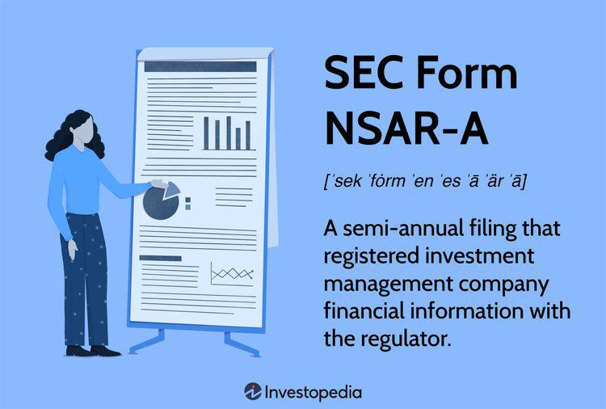

In today's rapidly evolving financial markets, regulatory compliance is crucial for ensuring transparency and protecting investor interests. SEC Form NSAR-A played a significant role in regulatory compliance for investment management companies, providing the Securities and Exchange Commission (SEC) with essential insights into financial activities, such as sales of shares and portfolio turnover rates. However, the ever-changing landscape of financial markets necessitated updates in regulatory frameworks to accommodate modern practices and technological advancements.

In 2018, the SEC replaced Form NSAR-A with Form N-CEN as part of a broader initiative to streamline and modernize securities filings. This transition reflects a significant step towards improved data accessibility and analysis, essential for monitoring the increasingly complex and dynamic environment of investment management. Understanding these regulatory updates is vital for both investors and industry professionals seeking to navigate the complexity of securities markets effectively.

As algorithmic trading becomes an integral component of financial operations, securities regulations must adapt to oversee these technological developments adequately. Algorithmic trading, characterized by high-speed, high-frequency operations, poses unique challenges for regulatory bodies tasked with maintaining market integrity and preventing manipulative practices. Therefore, continued awareness and understanding of the regulatory frameworks governing these technologies are crucial for stakeholders engaged in investment activities.

This article examines the historical context and transition from SEC Form NSAR-A to Form N-CEN and highlights the importance of regulatory compliance in algorithmic trading and its impact on investment companies. Through this exploration, we aim to provide insights into how these regulatory frameworks serve as essential tools for ensuring market transparency and protecting investor interests in today's complex financial landscape.

## Table of Contents

## What Was SEC Form NSAR-A?

SEC Form NSAR-A was a semi-annual filing required by the Securities and Exchange Commission (SEC) specifically for investment management companies operating under the Investment Company Act of 1940. The primary purpose of this form was to collect comprehensive data regarding the financial and operational performance of these companies. 

The information captured in SEC Form NSAR-A was extensive and included details such as sales of shares, portfolio turnover rates, and other financial metrics crucial for assessing the activities and performance of investment managers. Sales data provided transparency on how investment companies were managing inflows and outflows of investor capital, while portfolio turnover rates offered insights into the trading strategies and frequency of transactions executed by these firms.

In 2018, SEC Form NSAR-A was officially phased out and replaced by form N-CEN as part of a broader regulatory initiative aimed at modernizing and streamlining reporting requirements for investment companies. This transition was indicative of a trend towards greater efficiency in the submission and processing of regulatory data, reflecting advancements in technology and the need for more accessible and analyzable reporting formats. 

The discontinuation of NSAR-A in favor of N-CEN also represented a shift towards enhancing the SEC's ability to monitor market activities, reduce administrative burdens on investment companies, and improve data quality. The move symbolized a significant development in the evolution of financial regulations designed to protect investors and maintain market integrity.

## Significance of Form NSAR-A in Regulatory Compliance

SEC Form NSAR-A was integral to the regulatory framework governing investment management companies, playing a central role in the SEC's efforts to ensure comprehensive oversight of the financial industry. As a mandatory semi-annual filing, Form NSAR-A required these companies to provide detailed disclosures about their financial and operational activities. The information captured in this form included crucial metrics like sales of shares and portfolio turnover rates, which were paramount for ensuring transparency and aiding the SEC in its vigilant regulatory oversight.

The requirement for detailed disclosures on SEC Form NSAR-A was not merely a bureaucratic exercise; it held substantive importance for investor protection and market transparency. By mandating investment management companies to report specific financial information, the SEC could better monitor and identify patterns or irregularities that might indicate fraudulent or risky behaviors. This form served as a tool to maintain investor confidence, reassuring them that the companies managing their investments operated under stringent regulatory scrutiny.

Understanding the historical significance of NSAR-A filings is essential to appreciate their influence on contemporary SEC regulations. The form laid a foundational framework that underscored the importance of transparency and detailed financial reporting within the investment management sector. Although the form was eventually phased out and replaced by Form N-CEN in 2018, the principles it embodied continue to shape modern regulatory practices. Form N-CEN, while more aligned with contemporary market practices, still echoes the core objectives of its predecessor, emphasizing the ongoing need for detailed disclosures to protect investors and support market integrity.

In conclusion, SEC Form NSAR-A was more than just a regulatory form; it was a key instrument in maintaining the financial health and transparency of investment management companies. By requiring specific disclosures, it played a critical role in safeguarding investor interests and ensuring that the market operated within ethical and legal boundaries. Its legacy persists in current regulatory practices, ensuring that the objectives of transparency and investor protection remain at the forefront of SEC policy.

## Transition to Form N-CEN

In 2018, the Securities and Exchange Commission (SEC) implemented a significant change in its regulatory filing system with the introduction of Form N-CEN, replacing the older Form NSAR-A. This transition was initiated as part of a broader strategy to enhance and modernize the reporting processes required from investment management companies. The implementation of Form N-CEN introduced several important updates and features designed to better align with current market practices and the evolving landscape of the financial industry.

Form N-CEN brought in several enhancements by incorporating elements that specifically address modern investment vehicles and practices. For instance, the form includes fields for detailed information on exchange-traded funds (ETFs) and securities lending activities. These additions reflect the growing prominence of ETFs as an investment product and securities lending as a key component of portfolio management strategies, providing the SEC with crucial insights into these areas.

A notable advancement with the adoption of Form N-CEN was the standardization of data using Extensible Markup Language (XML). This change greatly enhanced the accessibility and usability of the data submitted by investment companies. XML allows for more efficient data processing and facilitates easier aggregation and analysis by the SEC. This technical improvement means that the SEC can more effectively oversee and monitor compliance across the industry, as well as identify trends and potential areas of risk.

Overall, the transition to Form N-CEN represents a significant step towards the modernization of SEC filings. By incorporating elements that mirror contemporary investment activities and by enhancing the technological infrastructure through standardized data formats, the SEC aims to improve its regulatory oversight and maintain a robust framework for investor protection and market integrity.

## Algorithmic Trading and Securities Regulation

Algorithmic trading has become a dominant force in contemporary financial markets, reshaping the landscape with its speed, precision, and efficiency. This method leverages computer algorithms to execute trading strategies at speeds and frequencies that would be impossible for human traders. However, the rapid rise of [algorithmic trading](/wiki/algorithmic-trading) introduces new regulatory challenges aimed at preventing distortions in market behavior and maintaining fair trading practices.

The Securities and Exchange Commission (SEC) plays a pivotal role in regulating and monitoring algorithmic trading activities. Form N-CEN, among other regulatory filings, assists the SEC in tracking and assessing practices within the investment management sector. These filings provide crucial data that the SEC uses to identify and mitigate risks associated with algorithmic trading, including potential market manipulation scenarios like spoofing, layering, and front-running.

Algorithmic trading can be manipulated to create false signals in the market, misleading other investors about the true demand or supply of a security. To combat such challenges, the SEC has implemented stringent requirements on disclosures and reporting through forms like N-CEN. This form ensures transparency by requiring detailed information about the fund's activities, which includes insights relevant to algorithmic trading operations. 

To illustrate, consider the presence of high-frequency trading ([HFT](/wiki/high-frequency-trading-strategies)) strategies that utilize algorithms to exploit minute price discrepancies across different exchanges. While these strategies can enhance [liquidity](/wiki/liquidity-risk-premium), they may also contribute to market instability if left unchecked. By examining the data submitted through Form N-CEN, regulators gain the ability to monitor such strategies in real-time, facilitating prompt responses to any breach in compliance or instances of market manipulation.

For stakeholders who employ algorithmic trading, adherence to SEC regulations is not merely advisory but mandatory to avoid penalties. Non-compliance with these regulations can result in significant consequences, including monetary fines and reputational harm. Firms must ensure that their algorithmic models are compliant with regulatory standards, regularly audited, and updated according to any changes in SEC rules.

Given the complexities and rapid advancements in trading technologies, investment companies should invest in compliance infrastructure and training. This involves deploying systems capable of real-time monitoring and reporting to the SEC, as well as establishing robust internal controls to preempt any deviation from regulatory norms.

Overall, maintaining regulatory compliance in algorithmic trading is critical. It requires cooperation between market participants and regulators to create an equitable trading environment. Through a combination of rigorous compliance practices and robust regulatory oversight enabled by filings like Form N-CEN, the integrity and transparency of the financial markets can be safeguarded.

## Impact of Regulatory Changes on Investment Management

The transition from SEC Form NSAR-A to Form N-CEN highlights significant regulatory changes affecting investment management companies. This shift reflects ongoing efforts to modernize and streamline reporting processes, helping firms align with evolving market practices and regulatory expectations. The modernization aims to enhance data accuracy, accessibility, and comprehensiveness, which is crucial for effective oversight and risk management.

For investment management firms, adapting to these regulatory changes is essential to maintaining compliance and operational efficiency. Form N-CEN, introduced in 2018, incorporates various enhancements over its predecessor, such as standardized XML format data, improving the SEC's ability to process and analyze information. Consequently, firms must upgrade their reporting systems to comply with these new requirements, ensuring accurate and timely submission of data. Adopting improved reporting technologies and practices facilitates better regulatory adherence and can reduce errors, operational delays, and compliance costs.

Additionally, these regulatory updates intersect with the burgeoning domain of algorithmic trading. Algorithmic trading, which relies on advanced technologies and automation, must align with regulatory requirements to prevent manipulative activities and ensure market integrity. The SEC's oversight, supported by updated filings like Form N-CEN, plays a crucial role in monitoring these activities. This surveillance helps to identify potentially disruptive trading patterns and unethical practices, thereby safeguarding investor interests and market stability.

Investment management companies must integrate compliance mechanisms with their trading operations to mitigate risks associated with algorithmic strategies. By doing so, firms can not only adhere to current regulations but also position themselves to respond effectively to future regulatory developments, maintaining a competitive edge and fostering trust among investors. In summary, the regulatory changes from NSAR-A to N-CEN, along with algorithmic trading oversight, are key factors shaping the evolving landscape of asset management.

## Conclusion

Navigating the complexities of securities regulations necessitates a thorough understanding of both historical and current filing requirements. This understanding is critical for ensuring compliance and operational efficiency. The regulatory shift from SEC Form NSAR-A to Form N-CEN exemplifies the ongoing evolution in reporting protocols aimed at increasing transparency and modernizing data accessibility. Investment management companies must remain vigilant and adapt to these changes to maintain compliance and enhance operational efficiencies.

Moreover, the rise of algorithmic trading introduces additional layers of complexity and compliance challenges. As algorithmic trading becomes more prevalent, it is imperative for market participants to acquaint themselves with its regulatory environment. The SEC's updated filing requirements, such as those embedded in Form N-CEN, play a crucial role in monitoring trading activities to prevent manipulative practices. Staying informed about these regulatory shifts not only aids in compliance but also supports the integrity and stability of the financial markets.

In conclusion, a proactive approach to understanding and implementing regulatory changes is essential for investment management firms. By keeping informed of both past and current regulations, and by staying updated on developments in algorithmic trading oversight, companies can ensure they remain compliant and competitive within the financial landscape.

## References & Further Reading

[1]: Bokor, Aaron. ["Regulation of Algorithmic Trading in the EU and the US: Finding the Right Balance for Organization and Regulation."](https://github.com/ValveSoftware/counter-strike_regional_standings/blob/main/live/2024/standings_global_2024_12_18.md) Yale Journal on Regulation, January 24, 2019.

[2]: Securities and Exchange Commission. ["Investment Company Reporting Modernization."](https://www.sec.gov/rules-regulations/2017/12/investment-company-reporting-modernization) Release No. 33-10231, October 13, 2016.

[3]: Staff, Investment Management. ["Frequently Asked Questions on Form N-CEN."](https://www.sec.gov/rules-regulations/staff-guidance/division-investment-management-frequently-asked-questions) U.S. Securities and Exchange Commission, February 20, 2019.

[4]: Hu, Jie. ["The Impact of Algorithmic Trading on the Stock Market: Evidence from U.S. Securities."](https://www.semanticscholar.org/paper/Analyzing-the-impact-of-algorithmic-trading-on-A-Damilare-Oyeniyi/cfaa220cded37f824aa2bf5b97f26c9b2aa6cb95) Journal of Financial Studies, 2021.

[5]: Lhabitant, François-Serge. ["Handbook of Hedge Funds."](https://www.amazon.com/Handbook-Hedge-Funds-Fran%C3%A7ois-Serge-Lhabitant/dp/0470026634) Wiley Finance, 2006.

[6]: Lopez de Prado, Marcos. ["The Future of Securities Regulation: How Fintech is Impacting Capital Markets."](https://www.quantresearch.org/Vita.htm) Journal of Portfolio Management, 2017.