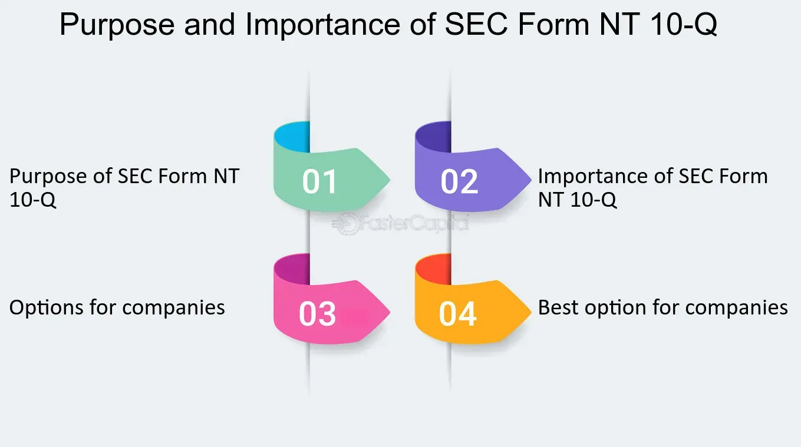

## Table of Contents

## What is SEC Form NT 10-Q?

SEC Form NT 10-Q is a form that companies file with the U.S. Securities and Exchange Commission (SEC) when they cannot submit their quarterly report on time. The quarterly report is usually filed using Form 10-Q, but if a company needs more time, they use Form NT 10-Q to notify the SEC about the delay. This form helps the company explain why they are late and when they expect to file the complete report.

Filing Form NT 10-Q is important because it keeps investors and the public informed about the company's situation. It shows that the company is aware of the delay and is working on getting the required information ready. By using this form, the company can avoid penalties for late filing, as long as they submit the full Form 10-Q within the extra time they requested.

## Why is SEC Form NT 10-Q important for companies?

SEC Form NT 10-Q is important for companies because it allows them to tell the SEC that they can't file their quarterly report on time. This form helps companies avoid getting in trouble for being late. When a company knows it will miss the deadline for the Form 10-Q, it can use the NT 10-Q to explain why and ask for more time. This keeps everything honest and open with the SEC and investors.

Using Form NT 10-Q also helps keep investors informed. When a company files this form, it tells everyone that they are working on the report but need a bit more time. This way, investors know what's going on and can make better decisions. It's all about being clear and keeping trust with the people who have put money into the company.

## How does a company file an NT 10-Q?

A company files an NT 10-Q by sending it to the SEC electronically through the SEC's Electronic Data Gathering, Analysis, and Retrieval (EDGAR) system. To do this, the company needs to have an EDGAR account. They go to the EDGAR website, log in, and use the system to upload the NT 10-Q form. The form must include basic information like the company's name, the reason for the delay, and when they expect to file the complete 10-Q report.

Once the NT 10-Q is submitted through EDGAR, the SEC will review it. If everything is in order, the form will be accepted, and it becomes public information. This lets investors and the public know that the company is having a delay with their quarterly report but is working on it. The company then has up to five extra days, or a longer period if the SEC agrees, to file the full 10-Q report.

## What information is required in an NT 10-Q filing?

When a company files an NT 10-Q, they need to include some basic information. This includes the company's name and the reason why they can't file their quarterly report on time. They also need to say when they expect to file the full 10-Q report. This helps everyone understand what's going on and when they can expect the complete report.

The NT 10-Q form is sent to the SEC through a special online system called EDGAR. The company logs into their EDGAR account, fills out the form with the required information, and submits it. Once the SEC accepts the form, it becomes public, letting investors and others know about the delay and the company's plan to fix it.

## What are the deadlines for filing an NT 10-Q?

A company has to file an NT 10-Q if they can't submit their quarterly report on time. The deadline for filing the quarterly report, which is the Form 10-Q, is 40 days after the end of the quarter for most companies. If a company knows they will miss this deadline, they need to file the NT 10-Q before the 40 days are up.

After filing the NT 10-Q, the company gets a little more time to submit the full Form 10-Q. They usually have up to five extra days to file the complete report. If they need more time than that, they have to ask the SEC for permission. This way, they can avoid getting in trouble for being late, as long as they file the NT 10-Q on time and follow the rules.

## How does filing an NT 10-Q affect a company's stock price?

Filing an NT 10-Q can affect a company's stock price because it tells investors that the company is having trouble getting their quarterly report ready on time. When investors see this, they might worry that something is wrong with the company. This worry can make them want to sell their shares, which can cause the stock price to go down. The more worried investors are, the bigger the drop in the stock price might be.

However, the effect on the stock price can also depend on other things. If the company explains the delay well and says they will file the full report soon, investors might not worry too much. Also, if the company usually does a good job and people trust it, the stock price might not drop as much. But if the delay is because of big problems, like financial trouble, the stock price could fall a lot.

## What are the common reasons for filing an NT 10-Q?

Companies file an NT 10-Q when they can't get their quarterly report ready on time. A common reason for this is that they need more time to gather all the information they need. This can happen if they are waiting on important financial data or if they are in the middle of a big business change, like a merger or acquisition. Another reason might be that they are having trouble with their accounting systems or need to fix errors they found.

Sometimes, a company might also need to file an NT 10-Q because of unexpected events. For example, if there's a natural disaster or a big problem at the company, it can slow things down. They might also need more time if they have to change their auditors or if the auditors need more time to finish their work. In all these cases, filing an NT 10-Q helps the company tell the SEC and investors why they are late and when they expect to have everything ready.

## How does the SEC review and respond to NT 10-Q filings?

When a company files an NT 10-Q, the SEC looks at it to make sure it has all the needed information. They check if the company explained why they can't file their quarterly report on time and when they expect to file the full report. If everything looks right, the SEC accepts the form. This means the company gets a little more time to finish their report.

Sometimes, the SEC might ask the company for more details if something in the NT 10-Q isn't clear. They want to make sure the company is being honest and that investors get all the information they need. The SEC's review helps keep everything fair and open, so investors can trust what companies are saying.

## What are the potential penalties for late or non-filing of an NT 10-Q?

If a company does not file an NT 10-Q when they need to, they can get in trouble with the SEC. The SEC might make them pay a fine. The fine can be a lot of money, and it depends on how late the company is and how serious the SEC thinks the problem is. The SEC might also say that the company did something wrong on purpose, which can make things even worse.

Besides fines, the company's leaders could also get in trouble. The SEC might say they broke the rules and make them pay money too. This can hurt the company's reputation and make it harder for them to do business. It's important for companies to file the NT 10-Q on time to avoid these problems.

## How can investors use NT 10-Q filings to make informed decisions?

Investors can use NT 10-Q filings to learn about delays in a company's quarterly reports. When a company files an NT 10-Q, it tells investors that something is holding up their financial information. By reading the NT 10-Q, investors can find out why the company is late and when they expect to have the full report ready. This helps investors understand if the delay is because of something small, like waiting on data, or something big, like financial problems.

Knowing about these delays can help investors make better choices. If a company often files NT 10-Qs or if the reason for the delay sounds serious, investors might decide to sell their shares to avoid risk. On the other hand, if the delay seems minor and the company has a good track record, investors might choose to hold onto their shares or even buy more. By keeping an eye on NT 10-Q filings, investors can stay informed and make decisions that fit their investment goals.

## What are the differences between Form NT 10-Q and other SEC forms like 10-Q and 10-K?

Form NT 10-Q is different from Form 10-Q and Form 10-K because it's used when a company can't file their quarterly report on time. Form 10-Q is the actual quarterly report that companies have to file every three months. It has all the financial details and updates about the company's business. Form NT 10-Q is just a notice that says the company needs more time to finish the 10-Q, and it explains why they are late and when they expect to file the full report.

Form 10-K is different because it's the annual report that companies file once a year. It's a bigger report than the 10-Q and includes a lot more detailed information about the company's finances and operations over the whole year. There's also a form called NT 10-K, which is like the NT 10-Q but for the annual report. It's used when a company can't file their 10-K on time and needs to tell the SEC about the delay. So, while the NT forms are about delays, the 10-Q and 10-K forms are the actual reports that companies have to file regularly.

## How have recent regulatory changes impacted the use and effectiveness of NT 10-Q filings?

Recent regulatory changes have made NT 10-Q filings more important for companies. The SEC has been focusing more on making sure companies are honest and open with investors. Because of this, companies have to be very clear about why they are late with their reports and when they will have them ready. This means NT 10-Q filings are now a big part of keeping investors informed and keeping trust in the market.

These changes have also made NT 10-Q filings more effective. Companies know they have to explain delays well, or they might get in trouble. This has made the NT 10-Q a better tool for investors to understand what's going on with a company. When investors see an NT 10-Q, they can make smarter choices about their investments, knowing that the company is working on getting their report done and will share it soon.

## References & Further Reading

[1]: Hribar, P., & Jenkins, N. T. (2004). [The effect of deferred tax valuation allowance changes on earnings management.](https://papers.ssrn.com/sol3/papers.cfm?abstract_id=877000) Journal of the American Taxation Association, 26(s-1), 43-65.

[2]: ["Algorithmic Trading: Winning Strategies and Their Rationale"](https://www.wiley.com/en-us/Algorithmic+Trading%3A+Winning+Strategies+and+Their+Rationale-p-9781118746912) by Ernest P. Chan

[3]: Securities and Exchange Commission. (n.d.). [Form 10-Q.](https://www.sec.gov/files/form10-q_0.pdf)

[4]: Securities and Exchange Commission. (n.d.). [Form NT 10-Q.](https://www.sec.gov/Archives/edgar/data/1510832/000149315215002961/nt10-q.htm)

[5]: Laub, M. (2016). [Blockchain & Distributed Ledger Technology: Use Cases, Business Models, and Ecosystems](https://www.researchgate.net/publication/341958649_Blockchain_and_Distributed_Ledger_Technology_Use_Cases_Applications_and_Lessons_Learned).