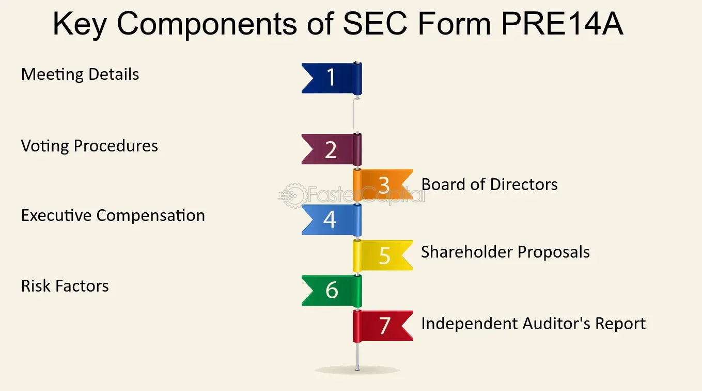

## Table of Contents

## What is SEC Form PRE 14C?

SEC Form PRE 14C is a document that companies file with the Securities and Exchange Commission (SEC) in the United States. It is used when a company wants to make changes to its corporate structure or governance without needing a shareholder vote. This form is also known as the Preliminary Information Statement, and it informs shareholders about the proposed changes before they are officially made.

The form is important because it ensures that shareholders are kept in the loop about significant company decisions, even if their vote isn't required. It includes details about the changes being made, why they are being made, and how they might affect the company and its shareholders. By using this form, companies can maintain transparency and keep their shareholders informed, which helps build trust and maintain good relationships.

## Who is required to file SEC Form PRE 14C?

SEC Form PRE 14C must be filed by companies that want to make big changes to how they are run or organized without asking their shareholders to vote on it. This can include things like changing the company's rules, merging with another company, or selling off major parts of the business. The company has to let the SEC know about these plans before they happen.

The people who run the company, like the board of directors or top managers, are the ones who need to fill out and send in the form. They do this to make sure everyone who owns a part of the company knows what's going on, even if they don't get to vote. This helps keep things open and honest between the company and its shareholders.

## What is the purpose of filing SEC Form PRE 14C?

The main reason for filing SEC Form PRE 14C is to tell shareholders about big changes the company wants to make without needing their vote. This can include things like changing the company's rules, merging with another company, or selling off major parts of the business. By using this form, the company keeps everyone in the loop and makes sure they know what's happening.

This form helps keep things open and honest between the company and its shareholders. Even if shareholders don't get to vote, they still get important information about decisions that could affect the company and their investments. This helps build trust and keeps good relationships between the company and the people who own a part of it.

## How does SEC Form PRE 14C differ from other SEC forms?

SEC Form PRE 14C is different from other SEC forms because it is used when a company wants to make big changes without a shareholder vote. For example, if a company wants to change its rules or merge with another company, it can use this form to tell shareholders about these plans. Other forms, like the DEF 14A, are used when a company does need a shareholder vote for these kinds of changes. So, the main difference is that Form PRE 14C is for changes that don't need a vote, while other forms are for changes that do.

Another way Form PRE 14C differs is that it's a preliminary statement. This means it's filed before the final changes are made, giving shareholders early notice. Other forms might be final statements or used for different purposes, like reporting financial results (like Form 10-K) or insider trading (like Form 4). So, while other forms might be about different kinds of information or used at different stages, Form PRE 14C is specifically about informing shareholders about upcoming changes that don't require their vote.

## What information must be included in SEC Form PRE 14C?

SEC Form PRE 14C needs to include a lot of information to make sure shareholders know what's going on. It must explain the changes the company wants to make, like changing the company's rules, merging with another company, or selling off major parts of the business. The form should also say why these changes are being made and how they might affect the company and its shareholders. This helps everyone understand the reasons behind the decisions and what might happen next.

The form also needs to include details about the company itself, like its name, address, and the date of the filing. It should list the people who are making these changes, like the board of directors or top managers, and their roles in the company. This way, shareholders know who is behind the decisions. By including all this information, the company makes sure that shareholders are well-informed about important changes, even if they don't get to vote on them.

## What are the key steps in the process of filing SEC Form PRE 14C?

The first step in filing SEC Form PRE 14C is for the company's board of directors or top managers to decide on the changes they want to make, like changing the company's rules or merging with another company. They need to make sure these changes don't need a shareholder vote. Once they've decided, they start preparing the form. They gather all the information that needs to go into the form, like the details of the changes, why they're being made, and how they might affect the company and its shareholders.

After preparing the form, the company files it with the Securities and Exchange Commission (SEC). This is done electronically through the SEC's online system. Once filed, the form becomes public, and shareholders can see it. The company also sends out the information to its shareholders to make sure they know about the changes. This step is important because it keeps things open and honest between the company and its shareholders, even if they don't get to vote on the changes.

## How long does it typically take to prepare and file SEC Form PRE 14C?

The time it takes to prepare and file SEC Form PRE 14C can vary depending on how big the changes are and how ready the company is. Usually, it might take a few weeks to a couple of months. The company needs to make sure all the information is right and that they've explained the changes well. They also need to check that these changes don't need a shareholder vote. This part can take time because they have to go over everything carefully.

Once the form is ready, filing it with the SEC is pretty quick. It's done online through the SEC's system, and it becomes public right away. After filing, the company sends out the information to its shareholders. This whole process, from deciding on the changes to filing the form and telling shareholders, can take anywhere from a few weeks to a few months, depending on how complex the changes are and how quickly the company can get everything ready.

## What are the common challenges faced when filing SEC Form PRE 14C?

One common challenge when filing SEC Form PRE 14C is making sure all the information is correct and complete. The company needs to explain the changes clearly and say why they're being made. This can be hard because the changes might be complicated, and the company has to make sure shareholders understand them. If something is missing or wrong, the SEC might ask for more information or send the form back, which can delay the process.

Another challenge is deciding if the changes really don't need a shareholder vote. Sometimes, it's not clear if a vote is needed, and the company has to be careful to follow the rules. If they get it wrong, they might have to start over with a different form, like the DEF 14A, which does need a vote. This can take more time and effort, and it can be confusing for everyone involved.

Lastly, the timing can be tricky. The company needs to prepare the form, file it with the SEC, and then send it out to shareholders. This whole process can take weeks or even months, and any delays can push back when the changes can be made. It's important for the company to plan ahead and make sure everything is ready on time to avoid any problems.

## How does the SEC review and process Form PRE 14C?

When a company files SEC Form PRE 14C, the SEC looks at it to make sure it has all the right information. The SEC checks that the form explains the changes the company wants to make and why they're being made. They also make sure the form says how these changes might affect the company and its shareholders. If anything is missing or wrong, the SEC might ask the company for more details or send the form back. This is to make sure shareholders get all the information they need about the changes.

Once the SEC is happy with the form, they make it public. This means anyone can see it on the SEC's website. The company then sends the information to its shareholders to keep them in the loop. The whole process, from when the company files the form to when it's made public, usually doesn't take too long. But if the SEC needs more information, it can take a bit longer. The goal is to make sure everything is clear and open so shareholders know what's happening with the company.

## What are the consequences of not filing SEC Form PRE 14C correctly?

If a company doesn't file SEC Form PRE 14C the right way, it can run into some big problems. The SEC might send the form back and ask for more information. This can slow things down and make it take longer for the company to make the changes it wants. If the company keeps making mistakes, the SEC might even start looking into it more closely to see if there are bigger issues going on. This can lead to fines or other punishments if the SEC finds out the company did something wrong on purpose.

Also, not filing the form correctly can hurt the trust between the company and its shareholders. Shareholders need to know what's happening with the company, and if they don't get the right information, they might feel left out or confused. This can make them less happy with the company and might even make them want to sell their shares. Keeping shareholders informed is important for the company to keep a good relationship with them, so it's really important to get the form right.

## Can amendments be made to SEC Form PRE 14C after initial filing, and if so, how?

Yes, amendments can be made to SEC Form PRE 14C after the initial filing. If a company realizes there are mistakes or missing information in the form, they need to fix it. They do this by filing an amendment, which is a new version of the form with the changes. The amendment is filed with the SEC just like the original form, using the SEC's online system. This way, the SEC and shareholders get the right information.

The process of making an amendment is important because it keeps everything accurate and up-to-date. If the company finds out something was wrong or left out, they need to act quickly to fix it. This helps keep the trust between the company and its shareholders. By filing an amendment, the company shows they are being open and honest about any changes or mistakes.

## What advanced strategies can be used to optimize the filing of SEC Form PRE 14C?

To optimize the filing of SEC Form PRE 14C, companies should start by planning ahead. They need to make sure they understand all the changes they want to make and why they're making them. It's a good idea to get help from lawyers or experts who know about SEC rules. They can check the form to make sure everything is right before it's filed. Also, using special software can help. This software can keep track of all the information and make sure nothing is missed. By being ready and using the right tools, companies can file the form faster and with fewer mistakes.

Another strategy is to keep good communication with shareholders. Companies should tell shareholders about the changes early and clearly. This can be done through meetings or emails, so shareholders feel included and understand what's happening. It's also smart to have a plan for what to do if the SEC asks for more information. Companies should be ready to answer quickly and correctly. By being open and quick to respond, companies can make the filing process smoother and keep a good relationship with shareholders and the SEC.

## References & Further Reading

[1]: ["SEC Proxy Rules and Schedules"](https://www.sec.gov/rules-regulations/staff-guidance/compliance-disclosure-interpretations/proxy-rules-schedules-14a14c), U.S. Securities and Exchange Commission.

[2]: U.S. Securities and Exchange Commission. (2023). ["Business and Financial Disclosure Required by Regulation S-K."](https://www.mofo.com/resources/insights/230515-us-sec-adopts-share-repurchase-disclosure-rules)

[3]: James, C., Bennett, R.L., & Washington, R. (2020). ["Introduction to U.S. Securities Regulation: A Guide for International Audience."](https://seattlewindsymphony.org/previous-seasons/)

[4]: Hasbrouck, J. (2007). ["Empirical Market Microstructure: The Institutions, Economics, and Econometrics of Securities Trading."](https://academic.oup.com/book/52241) Oxford University Press.

[5]: Yermack, D. (2010). ["Shareholder Voting and Corporate Governance"](https://papers.ssrn.com/sol3/papers.cfm?abstract_id=1523562), Annual Review of Financial Economics, Vol. 2: 103-125.

[6]: Lo, A.W. (2016). ["Adaptive Markets: Financial Evolution at the Speed of Thought."](https://www.jstor.org/stable/j.ctvc77k3n) Princeton University Press.