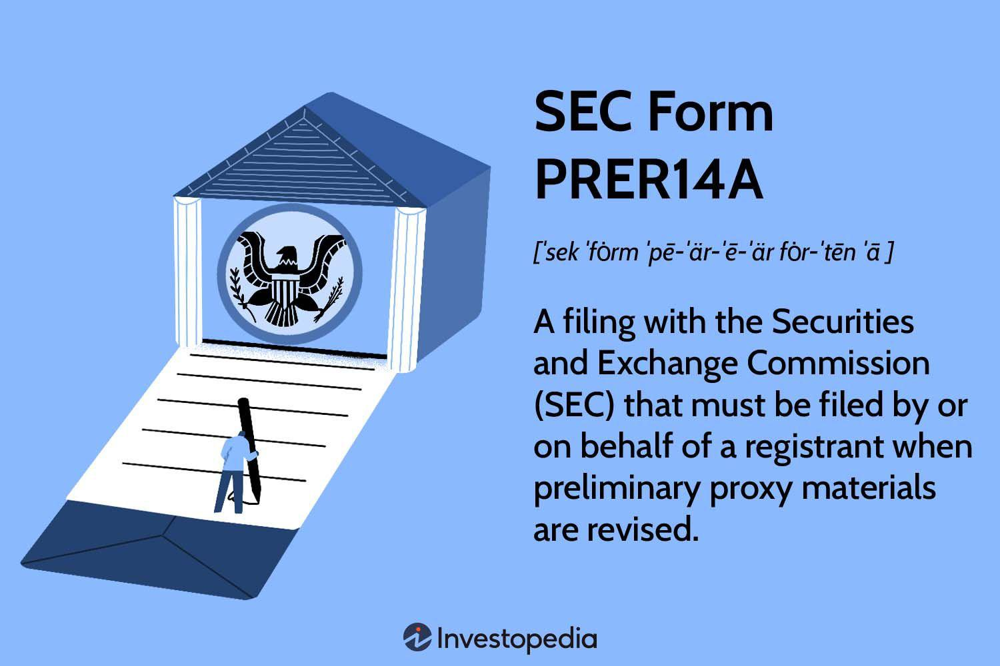

SEC filings are fundamental tools in corporate finance, ensuring transparency and accountability to shareholders. Among these filings, the SEC Form PRER14A and the proxy statement emerge as critical documents for maintaining robust investor relations. SEC Form PRER14A, a revised preliminary proxy statement, is filed with the Securities and Exchange Commission (SEC) to inform shareholders about important voting matters, typically in scenarios where amendments have been made to preliminary proxy materials. This document, along with the definitive proxy statement (SEC Form DEF 14A), plays a vital role when shareholder votes are needed on various corporate activities.

The significance of the SEC Form PRER14A extends beyond mere compliance. It intersects with emerging financial technologies such as algorithmic trading, where detailed and timely information from these filings is crucial for making informed trading decisions. Algorithmic traders rely on the data contained within SEC filings to fine-tune their trading strategies, especially around corporate events that might influence stock prices.

Furthermore, these filings are instrumental in influencing corporate governance and investor decision-making. They provide in-depth insights into significant corporate actions, from board elections to merger approvals, thus empowering shareholders to exercise their rights knowledgeably and responsibly. As a result, understanding SEC Form PRER14A is essential for stakeholders aiming to navigate the intricacies of corporate actions and shareholder rights effectively. By staying informed, investors can ensure their voices are heard and their interests are protected in the ever-evolving financial landscape.

## Table of Contents

## Understanding SEC Form PRER14A

The SEC Form PRER14A is a vital component of corporate communications, functioning as a revised preliminary proxy statement filed with the Securities and Exchange Commission. This document comes into play when there are amendments to the preliminary proxy materials, ensuring that shareholders receive accurate and current information regarding significant voting matters. The main purpose of the PRER14A is to inform shareholders about changes in the agenda of upcoming shareholder meetings, covering essential details like the date, time, location, and the procedures for voting.

These revised statements are critical in scenarios where shareholder votes have substantial impacts, such as elections of board members, approvals of mergers or acquisitions, or modifications to executive compensation plans. The revised proxy statement often accompanies the SEC Form DEF 14A, which is the definitive proxy statement issued when companies solicit shareholder votes on key issues.

By comprehending the subtleties of Form PRER14A, investors can appreciate its significance in upholding shareholder rights. The form plays a crucial role in facilitating informed voting, as it guarantees that shareholders have access to all necessary information to make decisions that reflect their best interests. This emphasis on transparency not only protects shareholders but also promotes trust and integrity within the corporate governance framework.

## The Role of Proxy Statements in Corporate Governance

Proxy statements are pivotal in the corporate governance framework, serving as essential communications between a corporation and its shareholders. These documents primarily inform shareholders about critical corporate matters necessitating their vote, thereby ensuring their active participation in governance decisions.

Among the key issues typically addressed in proxy statements are the election of board members, major corporate transactions such as mergers and acquisitions, and executive compensation. By presenting these matters transparently, proxy statements play a fundamental role in building trust between a company's management and its shareholders. 

The meticulous dissemination of proxy statements is integral to maintaining transparency. They offer detailed accounts of proposed executive compensation, auditor approvals, and shareholder proposals. Such disclosures are crucial in upholding the integrity of corporate governance by ensuring that all stakeholders are informed and can make educated decisions.

Moreover, proxy statements facilitate the empowerment of shareholders, enabling them to cast their votes with full knowledge of the issues at stake. This empowerment is critical, as it allows shareholders to influence corporate policies and decisions meaningfully. Through this mechanism, the balance of power is distributed more equitably, reinforcing the fundamental principles of shareholder democracy.

In summary, proxy statements fortify the corporate governance process by fostering transparency and accountability. They ensure that companies operate in a manner that respects and cultivates shareholder trust, ultimately contributing to the stability and integrity of the financial markets.

## Algorithmic Trading and SEC Filings

Algorithmic trading utilizes automated systems to execute trades in the stock market based on predefined criteria and financial data. A crucial component influencing these automated decisions is the wealth of information available in SEC filings, with proxy statements being particularly significant. These documents offer valuable insights, detailing corporate actions that can sway market sentiments and impact stock prices.

Proxy statements contain information about company decisions that require shareholder votes, such as executive appointments, mergers, acquisitions, and other strategic corporate moves. By processing this data, [algorithmic trading](/wiki/algorithmic-trading) systems can detect patterns and predict market movements likely to follow significant corporate announcements. For instance, a proxy statement indicating an upcoming merger might be interpreted by an algorithm as a potential opportunity for stock price fluctuation, thereby triggering a trade based on anticipated market reactions.

The speed at which algorithmic trading systems can access and process SEC filings is fundamental to their success. Timely access to updated filings like the SEC Form PRER14A can provide traders with a competitive edge. These revised preliminary proxy statements indicate amendments to previously disclosed information, offering real-time insights that can be instrumental in adjusting trading strategies quickly and efficiently.

In algorithmic trading, the emphasis on timely and accurate data underscores the critical role of comprehensive disclosures in SEC filings. Traders rely on these filings not only to predict market movements but also to ensure that their strategies align with the latest available information, minimizing risks associated with outdated or incomplete data.

The reliance of algorithmic trading on SEC filings illustrates the intricate connection between regulatory compliance and technological advancement in finance. As algorithms become more sophisticated, the importance of robust, timely, and accurate disclosures in SEC filings continues to grow, ensuring that these automated systems can operate effectively within the legal and ethical frameworks established by financial regulators.

## Regulatory Requirements and Compliance

SEC Form PRER14A is governed by the Securities Exchange Act of 1934, with Section 14(a) specifically addressing the regulation of proxy solicitations. The form is crucial for companies needing to amend preliminary proxy statements already submitted to the Securities and Exchange Commission (SEC). This requirement ensures that shareholders are kept adequately informed and can participate effectively in decision-making processes.

The act of filing a revised proxy statement, as required by SEC Form PRER14A, is imperative for maintaining compliance with regulatory standards. Companies must adhere to strict disclosure guidelines tailored to protect investors by providing comprehensive information regarding key corporate issues. These disclosures support shareholders in making well-informed voting decisions during shareholder meetings.

The SEC rigorously monitors these filings to ensure that companies meet their obligations, reflecting the critical role of regulatory frameworks in safeguarding shareholder rights. These regulations not only instill confidence in the financial markets but also uphold the integrity of corporate governance. By ensuring that all relevant information is transparently communicated, the SEC facilitates a fair and efficient market environment where investors can trust the data they rely upon for decision-making.

In compliance with SEC requirements, companies contribute to the stability and reliability of financial markets. Adhering to these norms is not only a legal obligation but a fundamental aspect of responsible corporate conduct. The transparency afforded by such regulatory adherence enhances trust and accountability, encouraging more robust investor participation and promoting a healthy market ecosystem.

## Conclusion

SEC Form PRER14A and proxy statements are pivotal elements in enhancing corporate governance and investor relations. They are essential in fostering transparency and enabling shareholders to make informed voting decisions. These documents play a substantial role in influencing corporate governance standards, ensuring that shareholder interests are duly considered during pivotal corporate actions. The data disclosed in these filings provide a structured approach to understanding corporate proposals, board elections, and executive compensations, all of which are crucial for maintaining the integrity of the governance process.

Algorithmic traders find value in the detailed and timely SEC filings as they serve as critical data sources for developing trading strategies. The accessibility and comprehensiveness of these filings enable algorithms to assess and predict market movements based on the disclosed corporate actions and shareholder decisions. With the growing prominence of algorithmic trading, the role of SEC filings as reliable data repositories has become more significant. Unlike traditional analysis, algorithmic systems analyze vast amounts of data quickly, including events reported in SEC filings, to execute informed trading decisions in a rapidly changing financial landscape.

Understanding SEC Form PRER14A and related proxy statements, along with their regulatory context, is indispensable for investors and stakeholders aiming to effectively navigate the corporate financial landscape. As financial markets evolve, these regulatory filings continue to uphold transparency and accountability. The meticulous compliance with SEC requirements not only ensures investor protection but also bolsters confidence in the financial markets. In a world where information is paramount, the structure and accessibility of SEC filings will remain central to advancing both corporate governance and investor empowerment.

## References & Further Reading

[1]: Hall, B.J. & Murphy, K.J. (2003). ["The Trouble with Stock Options."](https://www.nber.org/papers/w9784) Harvard Business Review.

[2]: Lopez de Prado, M. (2018). ["Advances in Financial Machine Learning."](https://www.amazon.com/Advances-Financial-Machine-Learning-Marcos/dp/1119482089) Wiley.

[3]: Securities and Exchange Commission. ["Proxy Voting: SEC's Oversight of the Proxy Process"](https://www.sec.gov/rules-regulations/2020/07/exemptions-proxy-rules-proxy-voting-advice).

[4]: Jansen, S. (2020). ["Machine Learning for Algorithmic Trading."](https://github.com/stefan-jansen/machine-learning-for-trading) Packt Publishing.

[5]: Securities and Exchange Commission. ["Concept Release on the U.S. Proxy System"](https://www.sec.gov/rules-regulations/2010/07/concept-release-us-proxy-system).