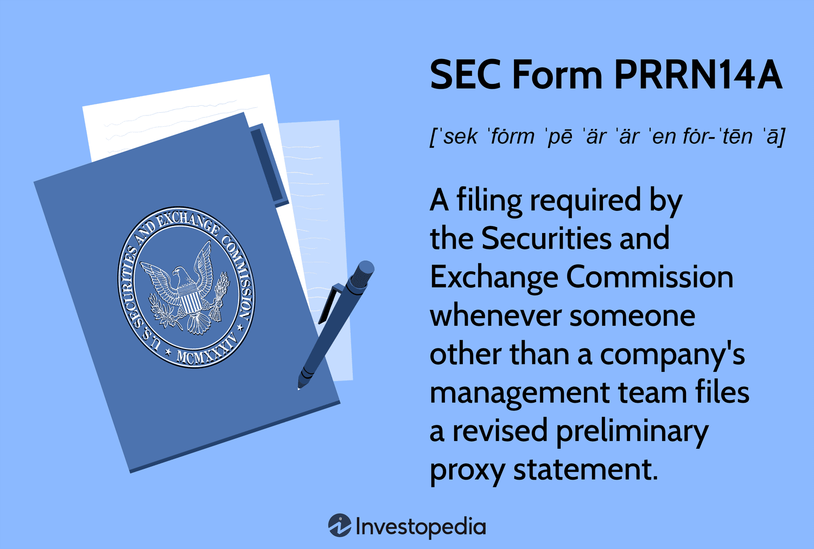

The field of finance encompasses an extensive range of instruments and documents that uphold governance and ensure transparency. Among these, the SEC Form PRRN14A holds significant importance, particularly in the governance of shareholder meetings. This form is essential for facilitating shareholder engagement, offering a platform for non-management to express their perspectives during proxy contests. Understanding forms like the PRRN14A is indispensable for shareholders and investors, especially within the sphere of shareholder activism. These forms equip stakeholders with the knowledge required to influence corporate governance issues, such as board elections and strategic management decisions.

In this article, we focus on SEC Form PRRN14A to provide insights into its essential features and its influence on modern corporate governance. This form emerges as a potent instrument in the hands of shareholders aiming to assert their rights and interests within a company. Additionally, we examine the relevance of this form in the context of algorithmic trading, where investors need to navigate corporate actions that might affect trading strategies and market dynamics.

Algorithmic trading, which involves the use of computer algorithms to execute trading decisions, has transformed the landscape of financial markets. The intersection of algorithmic trading and proxy forms like PRRN14A requires investors to be exceedingly informed and strategic. By examining SEC Form PRRN14A and understanding its implications, shareholders and investors are better equipped to adapt to and capitalize on the evolving financial ecosystem.

## Table of Contents

## What is SEC Form PRRN14A?

SEC Form PRRN14A is a filing requirement established by the Securities and Exchange Commission (SEC) for instances when an entity outside of a company prepares and submits a revised preliminary proxy statement. This filing is integral to the process of corporate governance and transparency, as it ensures that shareholders receive essential information that assists them in making informed decisions during shareholder meetings. Such information typically includes proposed changes to corporate policies, board compositions, and other critical company decisions that shareholders may vote on.

The requirement for filing SEC Form PRRN14A is mandated under Section 14(a) of the Securities Exchange Act of 1934. This section is designed to protect investors by ensuring the full disclosure of all material information relevant to shareholders’ voting decisions. The Act places a strong emphasis on transparency and accountability in proxy contests, which are often situations where external entities, or non-management groups, attempt to influence or challenge the decisions made by a company’s existing management or board of directors.

In the context of proxy contests, SEC Form PRRN14A serves as a strategic tool for non-management entities seeking to sway shareholder opinion and influence corporate governance. This could include actions such as proposing new board members or suggesting modifications to company bylaws and operational strategies. By providing shareholders with a revised preliminary proxy statement, these entities can highlight their perspectives, propose alternative strategies, and present their rationale for desired changes within the company structure or policy.

The filing of SEC Form PRRN14A is crucial for maintaining an equitable and informed decision-making process for shareholders. It ensures that all parties involved in the governance of a company have access to the same pertinent information, allowing for fair and democratic voting outcomes. This form, therefore, plays a vital role in the dynamics of corporate governance, particularly during periods of heightened shareholder activism and proxy contests.

## Shareholder Meetings and Proxy Statements

Shareholder meetings are a cornerstone of corporate governance, inheriting a pivotal role in the decision-making process of public companies. These gatherings allow shareholders to engage directly with management on pressing issues, such as board elections, policy changes, mergers, and other strategic decisions. One of the fundamental tools used during these meetings is the proxy statement, which is essential for facilitating informed and effective shareholder participation.

Proxy statements, including forms like the SEC Form PRRN14A, are documents that furnish shareholders with critical information required for voting on key issues discussed in shareholder meetings. The PRRN14A, in particular, is filed when an outside entity revises a preliminary proxy statement. These forms play a significant part in proxy contests where non-management groups seek to influence corporate policies or board composition.

Understanding the content and purpose of proxy forms like the PRRN14A is paramount for shareholders. It ensures their interests are adequately represented and their voices heard in corporate governance. Proxy statements typically contain detailed meeting agendas, identification of the solicitation entities, comprehensive financial statements, and procedural guides for casting votes. This information is vital for shareholders to make informed judgments on the issues at hand, contributing to the accountability and transparency of corporate management.

Proxy statements also outline the specifics concerning the timing and location of meetings, the procedures for voting in person or by proxy, and any significant proposals that will be submitted for shareholder approval. By possessing knowledge of these documents, shareholders are better positioned to navigate the complexities of corporate governance, thereby reinforcing their influence on the company's direction and future.

## The Role of Algorithmic Trading

Algorithmic trading, also known as algo trading, employs computer-driven algorithms to execute trading orders at high speed and precision. This method applies predefined criteria such as timing, price, and [volume](/wiki/volume-trading-strategy) to achieve optimal trading outcomes. It revolutionizes modern trading by influencing [liquidity](/wiki/liquidity-risk-premium) and market efficiency. By enabling rapid execution of trades, [algorithmic trading](/wiki/algorithmic-trading) contributes to tighter bid-ask spreads and smoother price discovery. This practice is not limited to quantitative hedge funds but is also used by large institutional investors and investment banks.

In today's complex financial ecosystem, algorithmic trading accounts for a significant portion of market transactions. Its role in enhancing market efficiency is particularly crucial as it reduces transaction costs and minimizes human error. However, high-frequency trading, a subset of algorithmic trading, has been scrutinized for potentially destabilizing the market and executing trades based on fleeting imbalances.

One critical aspect traders must consider in algorithmic trading is the impact of corporate actions. SEC filings such as Form PRRN14A provide crucial information on upcoming shareholder meetings and potential changes in corporate governance. These documents often precede significant stock price movements due to strategic decisions made by companies or activist shareholders. Consequently, traders employing algorithmic strategies should integrate analysis of these proxy statements into their decision-making processes. This integration helps in anticipating [volatility](/wiki/volatility-trading-strategies) and adjusting trading models to capitalize on potential price shifts.

The relationship between algorithmic trading and proxy statements like PRRN14A underscores the necessity for strategic decision-making. Investors and traders must be vigilant and responsive to corporate announcements, adjusting their algorithms accordingly to align with evolving market conditions. This vigilance promises both improved risk management and the opportunity to leverage corporate developments for financial gain.

## Case Study: Real-World Application

In 2017, Elliott Management Corporation, a well-known activist investment firm, utilized SEC Form PRRN14A as part of its campaign to instigate significant changes within the board of Arconic Inc., a prominent engineering and manufacturing company. This filing was part of Elliott’s broader strategy to influence the direction and governance of Arconic, aiming to enhance shareholder value. 

The filing of the PRRN14A by Elliott Management provided intricate details of their proposals and the rationale behind their challenges to the existing management team. For shareholders, this information was pivotal in understanding the motivations of Elliott Management, which argued for strategic shifts in Arconic's operations and leadership to unlock latent value. The document detailed Elliott's perspectives on corporate governance practices that they believed were suboptimal and delineated the strategic benefits of their proposed board nominees.

Elliott's use of the PRRN14A exemplifies how proxy forms can be strategically employed to exert pressure on companies to adopt new governance practices. It underscores the critical role that such documents play in facilitating shareholder activism by ensuring transparency and providing a formal channel for presenting alternate visions for corporate management. 

For shareholders and investors, Elliott’s campaign at Arconic served as a case study on the importance of being well-versed in proxy forms like the PRRN14A. The information contained in such filings can drastically influence investment strategies and decision-making processes, reinforcing the need for continuous engagement with corporate disclosures and shareholder communications. By strategically engaging with these forms, investors can position themselves advantageously, making informed decisions that align with their investment objectives and risk profiles.

## Special Considerations and Other Forms

In the landscape of proxy filings and corporate governance, understanding the nuances of various Securities and Exchange Commission (SEC) forms is pivotal for investors and corporate participants engaged in mergers, acquisitions, or proxy battles. Forms such as PRRN14A, PRE14A, and PREM14A each serve specific roles in these financial processes.

The SEC Form PRRN14A is integral in non-management's attempt to influence corporate actions, often utilised in proxy contests where external entities seek to alter board compositions or company decisions. However, it is essential to distinguish between the different 'Preliminary' forms, such as PRE14A and PREM14A. The PRE14A is a preliminary proxy statement often filed by management to inform shareholders about significant company matters that require voting, such as mergers or significant business changes. On the other hand, the PREM14A is used when a merger or acquisition is at play, providing shareholders with preliminary details before a definitive statement is released.

The distinction between 'Preliminary' and 'Definitive' forms impacts the sequence and timing of shareholder notifications and the subsequent influence on decision-making outcomes. Preliminary forms, denoted with the prefix 'Pre', signal the initial phase of communication with shareholders, often open to revisions and updates before definitive statements, marked by 'Def', are filed. This progression from preliminary to definitive status is crucial for shareholders, as it allows for a window of feedback and the possibility of influencing decisions before they become final.

For investors and corporate stakeholders, a thorough comprehension of these forms aids in effectively navigating the regulatory landscape and strategically positioning themselves during corporate actions. Moreover, this knowledge ensures compliance with SEC regulations and enhances the ability to make informed decisions that align with individual or collective financial goals. Understanding both preliminary and definitive forms is a strategic advantage in the structured processes that govern shareholders' influence on corporate outcomes.

## Conclusion

The SEC Form PRRN14A serves as a fundamental component in the landscape of corporate governance and shareholder activism. It is a crucial document that equips shareholders with the necessary information to make informed voting decisions. By providing clarity and transparency on the matters to be voted upon, including board elections and policy changes, it ensures that shareholder meetings are conducted with a high degree of integrity.

In today's financial markets, shaped significantly by the rise of algorithmic trading, the importance of understanding proxy forms like the PRRN14A cannot be understated. Algorithmic trading relies heavily on data-driven decision-making, and being aware of corporate actions documented in these forms allows investors to anticipate and react swiftly to changes in stock prices and market conditions. For investors employing algorithmic trading strategies, comprehending the implications of proxy statements enhances their ability to optimize trading outcomes.

Furthermore, maintaining an informed and proactive stance regarding the various proxy forms aids investors in aligning their investment strategies with their financial objectives effectively. Whether participating in shareholder meetings or engaging in strategic positioning within the markets, having a comprehensive understanding of documents like the PRRN14A facilitates better alignment with long-term financial goals. By combining awareness of corporate governance developments with an agile response to market dynamics, investors can achieve greater strategic cohesion in their investment pursuits.

## References & Further Reading

[1]: ["Algorithmic Trading and DMA: An Introduction to Direct Access Trading Strategies"](https://www.amazon.com/Algorithmic-Trading-DMA-introduction-strategies/dp/0956399207) by Barry Johnson

[2]: Ro, S. K., & Gallagher, K. M. (2004). ["The SEC's Proxy Voting Disclosure Rule: Spending in the Sunshine."](https://link.springer.com/article/10.1007/s42058-024-00178-5) Business and Society Review, 109(3), 385-404.

[3]: Eckbo, B. E. (2007). ["Handbook of Empirical Corporate Finance."](https://www.sciencedirect.com/book/9780444532657/handbook-of-empirical-corporate-finance) Elsevier.

[4]: Lopez de Prado, M. (2018). ["Advances in Financial Machine Learning"](https://www.amazon.com/Advances-Financial-Machine-Learning-Marcos/dp/1119482089). Wiley.

[5]: Bebchuk, L. A., & Cohen, A. (2005). ["The Costs of Entrenched Boards."](http://www.law.harvard.edu/faculty/bebchuk/pdfs/Bebchuk-Cohen_Costs-of-Entrenched-Boards.pdf) Journal of Financial Economics, 78(2), 409-433.

[6]: "SEC Filing Forms" (2023). [U.S. Securities and Exchange Commission](https://www.sec.gov/submit-filings/forms-index).