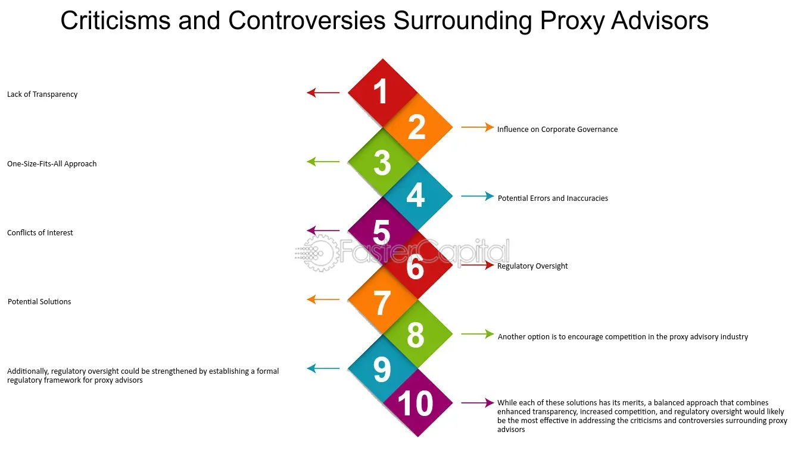

## Table of Contents

## What is SEC Form PX14A6G?

SEC Form PX14A6G is a document that companies file with the U.S. Securities and Exchange Commission (SEC). It is used when a company wants to tell its shareholders about important matters, like voting on company decisions or changes in management. This form is specifically for situations where the company is not asking for proxies, which are permissions from shareholders to vote on their behalf.

The form helps keep shareholders informed about what is happening in the company. It includes details about the meeting where these important decisions will be discussed and voted on. By filing this form, the company makes sure that all shareholders have the information they need to make decisions about the company's future.

## Who is required to file SEC Form PX14A6G?

SEC Form PX14A6G is filed by companies that want to communicate important information to their shareholders about upcoming meetings where significant decisions will be made. This form is used when the company is not soliciting proxies, meaning they are not asking shareholders to vote on their behalf. Instead, the company is simply providing information to keep shareholders in the loop about important matters like voting on company decisions or changes in management.

The requirement to file this form applies to publicly traded companies in the United States that are subject to the rules and regulations of the SEC. By filing Form PX14A6G, these companies ensure that all shareholders receive the necessary information to understand and participate in the decision-making process of the company. This helps maintain transparency and allows shareholders to make informed decisions about the company's future.

## What is the purpose of filing SEC Form PX14A6G?

The purpose of filing SEC Form PX14A6G is to keep shareholders informed about important company meetings and decisions. When a company files this form, it is telling its shareholders about upcoming meetings where big decisions will be made, like changes in management or voting on company policies. The company is not asking for permission to vote on behalf of the shareholders, but just wants to make sure everyone knows what's happening.

This form helps maintain transparency between the company and its shareholders. By providing this information, the company makes sure that all shareholders can understand what is going on and make their own decisions about the company's future. It's an important way for companies to communicate and keep everyone in the loop without asking for proxies.

## How does SEC Form PX14A6G differ from other SEC forms?

SEC Form PX14A6G is different from other SEC forms because it is used when a company wants to tell its shareholders about important meetings and decisions without asking for proxies. Proxies are when shareholders let someone else vote for them. With Form PX14A6G, the company is just sharing information and not asking shareholders to give them permission to vote on their behalf. This makes it different from forms like the DEF 14A, which is used when a company does want to solicit proxies.

Another difference is that Form PX14A6G focuses on keeping shareholders informed about what's happening in the company, like changes in management or voting on company policies. It's all about transparency and making sure everyone knows what's going on. Other forms might have different focuses, like the 10-K which provides a detailed annual report of the company's financial performance, or the 8-K which reports significant events that shareholders should know about. Each form serves a unique purpose in keeping shareholders updated and engaged with the company.

## What information is required to be included in SEC Form PX14A6G?

SEC Form PX14A6G requires companies to include information about upcoming meetings where important decisions will be made. This includes the date, time, and place of the meeting. The form also needs to explain what will be discussed at the meeting, such as voting on company policies or changes in management. It's important for the company to clearly state that they are not asking for proxies, which means they are not asking shareholders to let someone else vote for them.

The form should also provide any other relevant details that shareholders need to know. This might include information about who is proposing the changes or decisions, and why these changes are being considered. By including all this information, the company makes sure that shareholders are well-informed and can make their own decisions about the company's future.

## When must SEC Form PX14A6G be filed?

SEC Form PX14A6G must be filed with the Securities and Exchange Commission (SEC) before the company holds a meeting where important decisions will be made. This is to make sure that all shareholders have enough time to read the information and understand what will be discussed at the meeting.

The exact timing for filing Form PX14A6G can depend on the specific rules set by the SEC and the company's own schedule for the meeting. Usually, it needs to be filed a certain number of days before the meeting, giving shareholders plenty of time to get ready. This helps keep everything fair and open for everyone involved.

## What are the consequences of not filing SEC Form PX14A6G on time?

If a company does not file SEC Form PX14A6G on time, it can face serious problems. The Securities and Exchange Commission (SEC) might take action against the company. This could mean fines or other penalties. The SEC wants to make sure that all shareholders have the information they need before important meetings, so not filing on time breaks their rules.

Not filing on time can also hurt the company's relationship with its shareholders. Shareholders might feel left out or confused about what's happening in the company. This can lead to less trust and more problems for the company in the future. It's important for companies to follow the rules and keep everyone informed to avoid these issues.

## How can one access and review filed SEC Form PX14A6G documents?

To access and review filed SEC Form PX14A6G documents, you can visit the SEC's official website, which is called EDGAR (Electronic Data Gathering, Analysis, and Retrieval system). On the EDGAR website, you can search for the company you are interested in by typing its name into the search bar. Once you find the company, you can look through their filings to find the Form PX14A6G. The website is easy to use and lets you see all the important documents that companies have filed with the SEC.

After you find the Form PX14A6G, you can read it online or download it to your computer. The form will have all the details about the upcoming meeting, like the date, time, and what will be discussed. This helps you understand what's happening in the company and what decisions are being made. By using the EDGAR system, you can stay informed about the companies you care about and make better decisions as a shareholder.

## What are some common mistakes to avoid when filing SEC Form PX14A6G?

When filing SEC Form PX14A6G, one common mistake to avoid is missing the filing deadline. It's important to file the form on time so that shareholders have enough time to read and understand the information before the meeting. If you file late, the SEC might fine the company, and shareholders might feel left out or confused.

Another mistake to watch out for is leaving out important details. The form should clearly explain what will be discussed at the meeting, like voting on company policies or changes in management. Make sure to include the date, time, and place of the meeting, and state clearly that you are not asking for proxies. By including all the necessary information, you help keep everything transparent and fair for everyone involved.

## How has the filing process for SEC Form PX14A6G evolved with technological advancements?

The filing process for SEC Form PX14A6G has changed a lot because of new technology. Before, companies had to send paper forms to the SEC, which took a long time and was hard to keep track of. Now, with the internet, companies can file the form online using the SEC's EDGAR system. This makes it faster and easier to submit the form, and it's also easier for shareholders to find and read the information.

Technology has also made it simpler to share and store the information from SEC Form PX14A6G. Companies can now use electronic signatures and digital documents, which saves time and reduces mistakes. Shareholders can access the form anytime from anywhere, using their computers or smartphones. This helps everyone stay more informed and involved in the company's decisions.

## What are the strategic considerations for companies when preparing SEC Form PX14A6G?

When preparing SEC Form PX14A6G, companies need to think about how to clearly explain what will be discussed at the upcoming meeting. It's important to make sure the information is easy to understand so that all shareholders know what's happening. Companies should also consider the timing of the filing, making sure it's done well before the meeting so shareholders have enough time to read and think about the information. This helps build trust and keeps everyone informed.

Another strategic consideration is how the company presents the information. The form should not only meet the SEC's requirements but also be written in a way that shows the company cares about keeping shareholders in the loop. By being open and honest, companies can improve their relationship with shareholders. This can lead to more support for the company's decisions and a stronger connection with the people who own part of the company.

## How do regulatory changes impact the requirements and use of SEC Form PX14A6G?

Regulatory changes can affect how companies use SEC Form PX14A6G. When the SEC updates its rules, companies might need to include new information in the form or follow different deadlines. For example, if the SEC decides that more details about the meeting are needed, companies will have to make sure they include all the new required information in their filings. This helps keep the form up to date and useful for shareholders.

These changes can also impact how often the form is used or what it's used for. If the SEC changes the rules about when companies need to file the form, it might mean companies have to file it more or less often. Also, if the SEC decides that certain types of meetings no longer need this form, companies will adjust how they communicate with shareholders. Keeping up with these changes is important for companies to stay compliant and maintain good relationships with their shareholders.

## References & Further Reading

[1]: ["Algorithmic Trading and High-Frequency Trading"](https://assets.cambridge.org/97811070/91146/frontmatter/9781107091146_frontmatter.pdf) - U.S. Securities and Exchange Commission.

[2]: Mallin, C. A. (2018). ["Corporate Governance."](https://books.google.com/books/about/Corporate_Governance.html?id=fLzmCwAAQBAJ) Oxford University Press.

[3]: FCA (2020). ["Algorithmic Trading Compliance in Wholesale Markets."](https://www.fca.org.uk/publications/multi-firm-reviews/algorithmic-trading-compliance-wholesale-markets) Financial Conduct Authority.

[4]: Lopez de Prado, M. (2018). ["Advances in Financial Machine Learning."](https://www.amazon.com/Advances-Financial-Machine-Learning-Marcos/dp/1119482089) Wiley.

[5]: SEC's Office of Investor Education and Advocacy. ["Investor Bulletin: Proxy Voting."](https://www.sec.gov/about/divisions-offices/office-investor-education-advocacy) U.S. Securities and Exchange Commission.