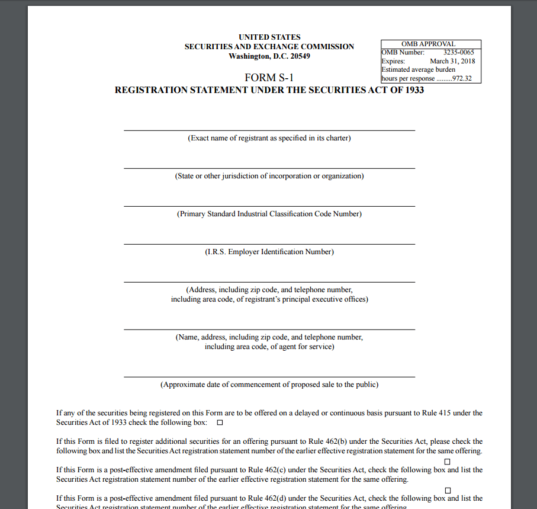

## Table of Contents

## What is SEC Form S-1?

SEC Form S-1 is a document that companies need to file with the U.S. Securities and Exchange Commission (SEC) when they want to go public and offer their stocks to the public for the first time. This form is crucial because it contains important information about the company, like its business model, financial performance, and the risks involved in investing in it. By making this information available, the company helps potential investors make informed decisions.

The S-1 form is very detailed and includes sections on the company's history, what it plans to do with the money it raises, and who its key executives are. It also has financial statements that are audited, which means they have been checked by independent accountants to make sure they are accurate. Once the SEC reviews and approves the S-1, the company can move forward with its initial public offering (IPO), allowing it to sell its shares to the public.

## Who is required to file SEC Form S-1?

SEC Form S-1 must be filed by any company that wants to offer its stocks to the public for the first time. This is called an initial public offering, or IPO. The company needs to provide a lot of information about itself, like how it makes money, how it's been doing financially, and any risks people should know about before investing.

The main goal of the S-1 form is to make sure that people who might want to buy the company's stocks have all the information they need to make a good decision. The SEC looks over the form to make sure it's complete and honest. Once the SEC says it's okay, the company can go ahead and sell its stocks to the public.

## What is the purpose of filing an S-1 form?

The main reason a company files an S-1 form is to tell people about its plan to sell stocks to the public for the first time. This is called an initial public offering, or IPO. The S-1 form gives a lot of information about the company, like how it makes money, how well it's doing financially, and what risks people should know about before buying its stocks. This helps people who might want to invest make smart choices.

The S-1 form is checked by the Securities and Exchange Commission, or SEC, to make sure everything in it is true and complete. Once the SEC approves the S-1 form, the company can go ahead and sell its stocks to the public. This process is important because it makes sure that everyone has the same information, which helps keep the stock market fair and open.

## What are the key components of an S-1 filing?

An S-1 filing has several important parts that help people understand a company before it goes public. The first part is about the company itself, including its history, what it does, and who its leaders are. This section also talks about the company's business plan and how it makes money. Another key part is the financial information, which includes the company's financial statements that have been checked by independent accountants to make sure they are correct. This helps investors see how well the company is doing financially.

The S-1 also includes a section on the risks of investing in the company. This part is important because it tells people about things that could go wrong and affect the company's success. Additionally, the filing explains what the company plans to do with the money it raises from selling its stocks. This could be things like expanding the business, paying off debts, or investing in new projects. By including all this information, the S-1 form helps make sure that people who might buy the company's stocks have all the facts they need to make a good decision.

## How does a company prepare to file an S-1?

To get ready to file an S-1, a company first needs to gather all its important information. This includes details about how the company started, what it does, and who its leaders are. The company also needs to put together its financial statements, which show how much money it has made and spent. These financial statements have to be checked by independent accountants to make sure they are correct. The company also has to think about any risks that could affect its business and write those down in the S-1 form.

Once all the information is ready, the company works with lawyers and other experts to write the S-1 form. They make sure everything is clear and follows the rules set by the Securities and Exchange Commission (SEC). After the form is written, the company sends it to the SEC for review. The SEC looks at the S-1 to make sure it has all the necessary information and that everything is honest. If the SEC finds any problems, the company has to fix them before it can move forward with its plan to sell stocks to the public.

## What is the process for submitting an S-1 form to the SEC?

To submit an S-1 form to the SEC, a company first needs to gather all its important information. This includes details about its business, financial statements that have been checked by independent accountants, and any risks that might affect the company. Once all this information is ready, the company works with lawyers and other experts to write the S-1 form. They make sure everything is clear and follows the SEC's rules.

After the S-1 form is written, the company sends it to the SEC through the SEC's online system called EDGAR. The SEC then reviews the S-1 form to make sure it has all the necessary information and that everything is honest. If the SEC finds any problems, they will ask the company to fix them. Once the SEC is happy with the S-1 form, they will approve it, and the company can move forward with its plan to sell stocks to the public.

## How long does the SEC review process for an S-1 filing typically take?

The SEC review process for an S-1 filing can take anywhere from a few weeks to several months. The exact time can depend on how busy the SEC is, how complicated the company's business is, and how quickly the company can fix any issues the SEC finds. On average, it might take around 30 to 90 days, but it can be shorter or longer.

During the review, the SEC looks at the S-1 form to make sure it has all the right information and that everything is honest. If they find any problems, they will send a letter called a "comment letter" to the company. The company then has to fix these issues and send the updated S-1 back to the SEC. This back-and-forth can happen a few times, which is why the process can take longer. Once the SEC is happy with the S-1 form, they will approve it, and the company can go ahead with its plan to sell stocks to the public.

## What are common reasons for the SEC to request amendments to an S-1 filing?

The SEC often asks for changes to an S-1 filing because they want to make sure the information is clear and complete. One common reason is if the company's financial statements are not detailed enough or if they have not been checked by independent accountants. The SEC wants to see that the numbers are correct and that investors can trust them. Another reason could be if the company does not explain its business well enough. The SEC wants to know exactly how the company makes money and what its plans are for the future.

Another reason for requesting amendments is if the company does not list all the risks that could affect its business. The SEC wants investors to know about any problems that might come up so they can make smart choices. Sometimes, the SEC also asks for changes if the company does not say clearly what it plans to do with the money it raises from selling stocks. The SEC wants to make sure the company's plans are clear and that the money will be used in a way that makes sense.

## How can a company respond to SEC comments on an S-1 filing?

When a company gets comments from the SEC about its S-1 filing, it needs to respond carefully. The company should read the comments and understand what the SEC is asking for. Often, the SEC wants more details or clearer information about the company's business, financials, or risks. The company should work with its lawyers and accountants to make the changes the SEC wants. They might need to add more information to the S-1 form or explain things better.

Once the company has made the changes, it sends the updated S-1 form back to the SEC. This can happen through the SEC's online system called EDGAR. The company needs to make sure it answers all the SEC's questions and fixes all the issues mentioned in the comment letter. If the SEC is happy with the changes, they will approve the S-1 form, and the company can go ahead with selling its stocks to the public. If there are still problems, the SEC might send more comments, and the company will need to keep working on the S-1 until it meets the SEC's standards.

## What are the implications of amending an S-1 filing?

When a company has to change its S-1 filing, it means they need to fix something the SEC pointed out. This can take more time and might delay when the company can sell its stocks to the public. The company has to work with its lawyers and accountants to make the changes the SEC wants. They might need to add more information or explain things better in the S-1 form. This back-and-forth can happen a few times until the SEC is happy with everything.

Changing the S-1 filing can also mean the company needs to be more open about its business. If the SEC asks for more details about the company's financials or risks, the company has to share that information with everyone. This can help investors make better choices, but it might also make the company look less attractive if there are big risks or if the financials are not as good as people thought. In the end, making the changes the SEC wants is important to get the S-1 form approved and move forward with the plan to sell stocks.

## How does the effectiveness of an S-1 filing impact a company's IPO?

When a company's S-1 filing becomes effective, it means the SEC is okay with the information in the form. This is a big step because it lets the company go ahead with its IPO, which is when it sells its stocks to the public for the first time. If the S-1 filing is effective, it shows that the company has been open about its business, how it makes money, and any risks. This helps investors feel more confident about buying the company's stocks.

If the S-1 filing is not effective, it can delay the IPO. The company might need to fix things the SEC pointed out or add more information. This back-and-forth can take time, and the longer it takes, the longer people have to wait to buy the company's stocks. A delay can also make investors worried about the company, which might affect how much they are willing to pay for the stocks when the IPO finally happens.

## What are some advanced strategies for optimizing an S-1 filing and its amendments?

To make an S-1 filing and its changes better, a company should start by getting help from experienced lawyers and accountants. These experts know what the SEC looks for and can help make sure the S-1 form has all the right information. It's also smart to do a lot of research and be very clear about the company's business, financials, and any risks. The more detailed and honest the S-1 form is, the less likely the SEC will ask for big changes. Another good idea is to talk to other companies that have gone through the IPO process before. They can share what worked for them and what the SEC usually asks about.

Another strategy is to plan ahead and give the SEC more information than they might need. This can show that the company is being open and can help avoid delays. It's also important to respond to the SEC's comments quickly and carefully. The company should fix any issues the SEC points out and explain the changes clearly. By doing this, the company can make the S-1 filing process smoother and get to the IPO faster.

## References & Further Reading

[1]: Piotroski, J. D., & Roulstone, D. T. (2004). ["The Influence of Analysts, Institutional Investors, and Insiders on the Incorporation of Market, Industry, and Firm-Specific Information into Stock Prices."](https://www.jstor.org/stable/pdf/4093088.pdf) The Accounting Review, 79(4), 1119-1151.

[2]: Marquardt, C. A., & Wiedman, C. I. (2005). ["Earnings Management Through Transaction Structuring: Contingent Convertible Debt and Diluted EPS."](https://papers.ssrn.com/sol3/papers.cfm?abstract_id=515255) Journal of Accounting Research, 43(2), 205-243.

[3]: Loughran, T., & McDonald, B. (2013). ["IPO First-day Returns, Offer Price Revisions, Volatility, and Form S-1 Language."](https://www.sciencedirect.com/science/article/pii/S0304405X13000603) Review of Financial Studies, 26(10), 2638-2673.

[4]: Gompers, P. A., Gornall, W., Kaplan, S. N., & Strebulaev, I. A. (2020). ["How Do Venture Capitalists Make Decisions?"](https://www.sciencedirect.com/science/article/pii/S0304405X19301680) The Quarterly Journal of Economics, 135(1), 413-436.

[5]: Merton, R. C. (1987). ["A Simple Model of Capital Market Equilibrium with Incomplete Information."](https://onlinelibrary.wiley.com/doi/full/10.1111/j.1540-6261.1987.tb04565.x) The Journal of Finance, 42(3), 483-510.