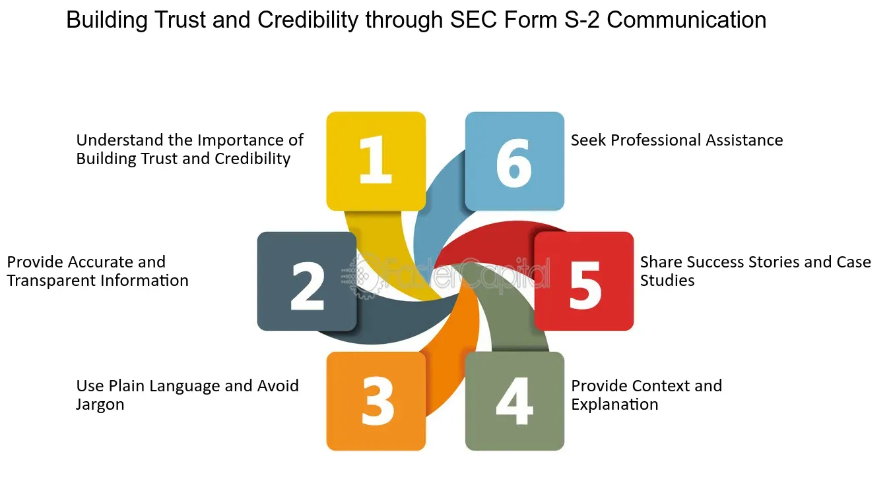

## Table of Contents

## What is SEC Form S-2?

SEC Form S-2 is a document that companies use when they want to sell new stocks or bonds to the public. It's like a detailed report that tells investors everything they need to know about the company and the securities being offered. The form is filed with the Securities and Exchange Commission (SEC), which is the government agency that makes sure companies follow the rules when they sell securities.

The main purpose of Form S-2 is to make sure that investors have all the information they need to make smart decisions. It includes things like the company's financial statements, how the money raised will be used, and any risks involved with investing in the company. By requiring companies to file this form, the SEC helps protect investors and keeps the market fair and transparent.

## Who is required to file SEC Form S-2?

SEC Form S-2 is for companies that want to sell new stocks or bonds to the public. It's not for every company, though. Only companies that have already reported their financials to the SEC for at least one year can use this form. This means they need to have filed their annual and quarterly reports with the SEC.

The rule is that if a company has been reporting to the SEC for a while, it can use Form S-2 to tell investors about new securities they want to sell. This helps investors know more about the company before they decide to buy the stocks or bonds. So, basically, Form S-2 is for companies with a bit of history of reporting to the SEC, not for new companies that haven't reported yet.

## What are the main purposes of filing SEC Form S-2?

The main purpose of filing SEC Form S-2 is to give investors important information about a company that wants to sell new stocks or bonds. When a company has been reporting its financials to the SEC for at least a year, it can use Form S-2 to tell investors about the new securities it wants to offer. This form includes details like the company's financial statements, how the money raised will be used, and any risks involved with investing. By providing this information, the company helps investors make smart choices about whether to buy the stocks or bonds.

Another key purpose of Form S-2 is to keep the market fair and transparent. The SEC requires companies to file this form to make sure that everyone has access to the same important information about the company and its securities. This helps prevent fraud and protects investors by ensuring they have all the facts before they invest. In this way, Form S-2 plays a crucial role in maintaining trust and integrity in the financial markets.

## How does SEC Form S-2 differ from other SEC registration forms?

SEC Form S-2 is different from other SEC registration forms because it's meant for companies that have been reporting their financials to the SEC for at least a year. This means that only companies with a bit of history of reporting can use Form S-2 to sell new stocks or bonds. Other forms, like Form S-1, can be used by companies that are new to the SEC and haven't been reporting yet. So, Form S-2 is for more established companies, while Form S-1 is for newer ones.

Another difference is in the level of detail and the type of information required. Form S-2 has a bit less paperwork than Form S-1 because the company has already been sharing its financials with the SEC. This makes the process a bit easier for companies that have been reporting for a while. On the other hand, Form S-1 requires more detailed information because it's for companies that are new to the SEC and need to introduce themselves to investors. So, while Form S-2 is simpler for established companies, Form S-1 is more thorough for new ones.

## What information must be included in SEC Form S-2?

SEC Form S-2 requires companies to share important information with investors. This includes the company's financial statements, which show how much money the company has made and spent. It also needs to explain how the money raised from selling new stocks or bonds will be used. For example, the company might want to use the money to grow their business or pay off debts. Additionally, the form must list any risks involved with investing in the company, like if the company is in a risky industry or if it has a lot of debt.

The form also needs to include details about the new stocks or bonds being offered. This means explaining what kind of securities they are, how many are being sold, and at what price. The company also has to give information about the people who are selling the securities, like the company's leaders or other investors. By including all this information, Form S-2 helps investors understand what they're buying and make smart decisions about whether to invest.

## What are the eligibility requirements for using SEC Form S-2?

To use SEC Form S-2, a company must have been reporting its financials to the SEC for at least one year. This means the company needs to have filed its annual and quarterly reports with the SEC, showing its financial performance over time. The idea is that the company has a history of being open about its finances, which makes it easier for investors to trust the information in the form.

The main reason for this rule is to make sure that only companies with a bit of history can use Form S-2. New companies that haven't been reporting to the SEC yet can't use this form. Instead, they would need to use a different form, like Form S-1, which is for companies that are new to the SEC. By having this requirement, the SEC helps make sure that investors get reliable information from companies that have been around for a while.

## How has the use of SEC Form S-2 evolved over time?

The use of SEC Form S-2 has changed a lot over the years. When it first came out, it was a way for companies that had been reporting to the SEC for a while to sell new stocks or bonds more easily. They didn't need to fill out as much paperwork as new companies because they already had a history of sharing their financials. But as the rules changed and the market grew, the SEC started to tweak the form to keep up with new needs and make sure investors were still protected.

Today, Form S-2 is still used by companies that have been reporting to the SEC for at least a year, but the information it requires has gotten more detailed. The SEC wants to make sure that investors have all the facts they need to make smart choices. So, even though the form is simpler than others like Form S-1, it still asks for important details about the company's finances, the new securities being offered, and any risks involved. This way, the form helps keep the market fair and transparent, even as the world of investing keeps changing.

## What are the common challenges companies face when filing SEC Form S-2?

When companies file SEC Form S-2, one of the biggest challenges they face is making sure all the information they put in the form is correct and up-to-date. Since the form is for companies that have been reporting to the SEC for at least a year, they need to make sure their financial statements and other details are accurate. If there are any mistakes or missing information, it can delay the whole process and might even get them in trouble with the SEC. So, they have to be very careful and thorough when putting together the form.

Another challenge is explaining the risks involved with investing in the company. The form needs to list any risks that could affect the company's future, like if it's in a risky industry or has a lot of debt. This can be tricky because companies don't want to scare off investors, but they also have to be honest about the risks. Finding the right balance can be hard, and if they don't do it well, investors might not trust the information in the form. So, it's important for companies to be clear and honest about the risks to keep investors informed and confident.

## What are the potential consequences of not filing SEC Form S-2 correctly?

If a company doesn't file SEC Form S-2 correctly, it can face some big problems. The SEC might not let them sell their new stocks or bonds to the public. This is because the form is really important for making sure investors know everything they need to before they decide to invest. If the information in the form is wrong or missing, the SEC might say the company can't go ahead with the sale. This can be a big deal because it can stop the company from getting the money they need to grow their business.

Also, if the SEC finds out that a company didn't file the form right, they might get fined or even face legal trouble. The SEC has rules to protect investors and keep the market fair, and if a company breaks those rules, they could have to pay a lot of money. This can hurt the company's reputation and make it harder for them to do business in the future. So, it's really important for companies to make sure they fill out Form S-2 correctly and honestly.

## How does the SEC review process for Form S-2 work?

When a company wants to sell new stocks or bonds using SEC Form S-2, they send the form to the SEC. The SEC then looks over the form to make sure all the information is right and that the company is following the rules. This can take some time because the SEC wants to be sure that everything is correct before they let the company go ahead with the sale. They might ask the company for more information or changes if they find any problems.

If the SEC is happy with the form, they will let the company know that they can start selling the new securities. But if there are issues, the SEC might send the form back and ask the company to fix it before they can move forward. The whole process is to make sure that investors get all the information they need to make smart choices about whether to buy the stocks or bonds.

## Can amendments be made to SEC Form S-2 after initial filing, and if so, how?

Yes, amendments can be made to SEC Form S-2 after the initial filing. If a company finds mistakes or needs to update information, they can file an amendment. This is done by submitting a new form that shows the changes. The company needs to explain what they changed and why. This helps keep the information accurate and up-to-date for investors.

The SEC will review the amendment just like they did with the original form. They want to make sure the new information is correct and that the company is still following the rules. If the SEC is okay with the changes, the company can go ahead with selling the new stocks or bonds. If there are still problems, the SEC might ask for more changes before they approve it.

## What advanced strategies can companies use to optimize their SEC Form S-2 filings?

Companies can optimize their SEC Form S-2 filings by being proactive about their financial reporting. This means keeping their financial statements up-to-date and making sure they are accurate before they even start filling out the form. By doing this, they can avoid mistakes that might delay the filing process. It's also a good idea to work with experienced lawyers and accountants who know the SEC rules well. They can help make sure the form is filled out correctly and that all the important information is included, like how the company plans to use the money raised and any risks for investors.

Another strategy is to communicate clearly and honestly with investors. Companies should explain the new securities they are offering in a way that's easy to understand. They should also be upfront about any risks, even if it's hard. This helps build trust with investors, which is important for a successful sale. By being thorough and transparent, companies can make their Form S-2 filings stronger and more likely to be approved quickly by the SEC.

## What is the Role of SEC Filings in Algorithmic Trading?

Algorithmic trading is heavily dependent on accurate and timely data, with SEC filings being a critical source of information. Documents such as the SEC Form S-1 provide comprehensive insights into a company's financial health, operational strategies, and market potential. These disclosures are pivotal for investors and automated trading systems, as they facilitate thorough assessments of potential investments.

Investors utilize SEC filings to gauge company performance, which aids in pricing securities accurately. For instance, the financial statements and risk factors outlined in a Form S-1 allow investors to calculate key financial ratios crucial for evaluating a company's valuation. These ratios might include metrics like the Price-to-Earnings (P/E) ratio, calculated as:

$$
\text{P/E Ratio} = \frac{\text{Market Value per Share}}{\text{Earnings per Share (EPS)}}
$$

Algorithmic trading systems leverage this data to optimize trading strategies. By ingesting SEC filings, algorithms can dynamically adjust to market conditions, identify [arbitrage](/wiki/arbitrage) opportunities, and improve execution efficiency. The transition from Form S-2 to S-1 has enhanced these capabilities. Form S-1 demands more detailed disclosures, allowing automated systems to perform more nuanced analyses of market opportunities.

Python is often used to process and analyze the data from SEC filings. A simple example involving Python might use libraries such as `pandas` to parse financial data from SEC filings and calculate financial metrics:

```python
import pandas as pd

# Example dataframe with financial data from an SEC filing
data = {
    'Market_Value_per_Share': [100, 120, 90],
    'EPS': [5, 6, 4.5]
}

# Create a DataFrame
df = pd.DataFrame(data)

# Calculate the P/E Ratio
df['P/E_Ratio'] = df['Market_Value_per_Share'] / df['EPS']

print(df)
```

The enhanced reporting obligations introduced with Form S-1 provide a richer dataset for these analytical techniques, driving more precise trading algorithms. This advancement underscores the importance of SEC filings in facilitating sophisticated trading strategies in modern finance.

## References & Further Reading

[1]: Kimm, G. W. (2015). ["The SEC's Integration of Secondary Market Trading and Order Routing Practices."](https://www.sec.gov/pdf/annrep02/ar02marketr.pdf) Journal of Law, Economics, and Policy.

[2]: Hazen, T. L. (2012). ["Treatise on the Law of Securities Regulation"](https://store.legal.thomsonreuters.com/law-products/Law-School-Publications/Hazens-Treatise-on-the-Law-of-Securities-Regulation-8th-Practitioner-Treatise-Series/p/106918949) (7th ed.). West Academic Publishing.

[3]: Lopez de Prado, M. (2018). ["Advances in Financial Machine Learning"](https://www.amazon.com/Advances-Financial-Machine-Learning-Marcos/dp/1119482089). Wiley.

[4]: Jansen, S. (2020). ["Machine Learning for Algorithmic Trading"](https://github.com/stefan-jansen/machine-learning-for-trading). Packt Publishing. 

[5]: Securities and Exchange Commission. ["Form S-1 Registration Statement under the Securities Act of 1933."](https://www.sec.gov/files/forms-1_0.pdf)

[6]: Securities and Exchange Commission. (2005). ["Final Rule: Securities Offering Reform."](https://www.sec.gov/rules-regulations/2005/07/securities-offering-reform)

[7]: Chan, E. P. (2009). ["Quantitative Trading: How to Build Your Own Algorithmic Trading Business"](https://github.com/ftvision/quant_trading_echan_book). Wiley.