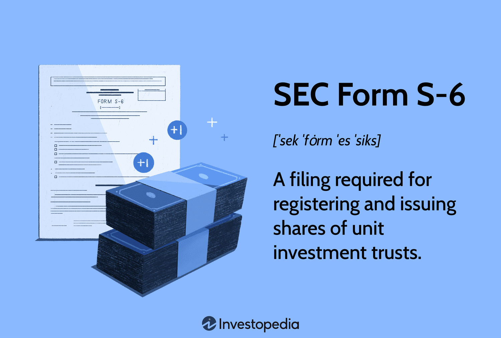

## Table of Contents

## What is SEC Form S-6?

SEC Form S-6 is a document that companies use when they want to register unit investment trusts with the Securities and Exchange Commission (SEC). A unit investment trust is a type of investment company that offers shares to investors, and these shares represent a fixed portfolio of securities. The form helps the SEC make sure that the company is following the rules and that investors get all the important information they need about the trust.

When a company fills out Form S-6, they have to include details about the trust, like what securities it holds, how it works, and any risks involved. This form is important because it helps investors make smart choices by giving them clear and complete information. By using Form S-6, the SEC can keep an eye on these trusts and make sure they are being run fairly and honestly.

## Who needs to file SEC Form S-6?

SEC Form S-6 needs to be filed by companies that want to set up a unit investment trust. A unit investment trust is a type of investment where the company collects money from investors and uses it to buy a set group of securities, like stocks or bonds. The company then sells shares of this trust to the public.

The main reason a company files Form S-6 is to register the unit investment trust with the Securities and Exchange Commission (SEC). This registration helps the SEC make sure that the company is following the rules and that investors get all the important details about the trust. By filing this form, the company can legally offer the trust's shares to the public and make sure everything is done correctly and openly.

## What is the purpose of filing SEC Form S-6?

The main reason for filing SEC Form S-6 is to register a unit investment trust with the Securities and Exchange Commission (SEC). A unit investment trust is a type of investment where a company pools money from investors to buy a fixed set of securities, like stocks or bonds. By filing Form S-6, the company can legally offer shares of this trust to the public. This process helps the SEC keep track of these trusts and make sure they follow the rules.

Filing Form S-6 also helps investors by giving them important information about the trust. The form includes details about what securities the trust holds, how it works, and any risks involved. This way, investors can make smart choices about whether to buy shares in the trust. By making sure all this information is clear and complete, the SEC helps protect investors and keeps the investment market fair and honest.

## What information is required on SEC Form S-6?

SEC Form S-6 requires a company to provide detailed information about the unit investment trust they want to register. This includes the name of the trust, the type of securities it will hold, and how those securities will be selected. The form also needs information about any fees or charges that investors will have to pay, and how the trust will be managed. This helps investors understand what they are buying into and what to expect.

Additionally, the form asks for information about the risks involved in investing in the trust. This includes any potential downsides or uncertainties that could affect the value of the trust's securities. The company must also include financial statements and other documents that show the trust's financial health. By providing all this information, the SEC can make sure the trust is set up correctly and that investors have all the facts they need to make a good decision.

## How does one file SEC Form S-6?

To file SEC Form S-6, a company needs to go to the SEC's Electronic Data Gathering, Analysis, and Retrieval (EDGAR) system. They first have to get an EDGAR filer code, which is like a special ID that lets them use the system. Once they have the code, they can log into EDGAR and find the Form S-6. They fill out all the required information about the unit investment trust, like what securities it holds, how it works, and any risks involved. After filling everything out, they submit the form through EDGAR.

After submitting the form, the SEC reviews it to make sure all the information is correct and complete. If everything looks good, the SEC will approve the registration of the unit investment trust. This means the company can start selling shares of the trust to the public. If there are any issues or missing information, the SEC might ask the company to fix it before they can approve the registration. It's important for the company to make sure all the information is accurate and clear so that investors can make good decisions.

## What are the fees associated with filing SEC Form S-6?

When a company files SEC Form S-6, they have to pay a fee to the Securities and Exchange Commission. The fee is based on the value of the securities that the unit investment trust will hold. The SEC uses a fee rate that changes from time to time, so the company needs to check the current rate when they file. This fee helps the SEC cover the costs of reviewing the form and making sure everything is done correctly.

The fee is usually a small percentage of the total value of the securities in the trust. For example, if the trust is going to hold securities worth $10 million and the fee rate is 0.00875%, the company would have to pay $8,750. It's important for the company to calculate this fee correctly and include it with their filing. This way, they can make sure their registration goes smoothly and they can start selling shares of the trust to the public.

## What are the deadlines for filing SEC Form S-6?

There isn't a specific deadline for filing SEC Form S-6. A company can file it whenever they want to register a unit investment trust with the SEC. The important thing is to make sure all the information on the form is correct and complete before sending it in.

Once the form is filed, the SEC will review it. This review can take some time, so it's a good idea for the company to file the form well before they want to start selling shares of the trust. If the SEC finds any problems or missing information, they might ask the company to fix it, which could delay the process.

## Can SEC Form S-6 be amended, and if so, how?

Yes, SEC Form S-6 can be amended if there are changes or if the SEC asks for more information. To amend the form, the company goes back to the EDGAR system, logs in with their filer code, and finds the original Form S-6 filing. They then fill out an amendment form, which is usually called a "pre-effective amendment," and include all the new or corrected information. After filling it out, they submit the amendment through EDGAR.

Once the amendment is submitted, the SEC reviews it to make sure everything is correct and complete. If the SEC is happy with the changes, they will approve the amendment, and the registration process can move forward. If there are still issues, the SEC might ask for more changes before they approve it. It's important for the company to keep the information up-to-date and accurate so that investors have all the right details about the unit investment trust.

## What are the common mistakes to avoid when filing SEC Form S-6?

When filing SEC Form S-6, one common mistake is not providing all the required information. The form asks for details about the unit investment trust, like what securities it holds, how it works, and any risks involved. If a company misses any of these details, the SEC might ask for more information, which can delay the registration process. It's important to double-check that all sections of the form are filled out correctly and completely.

Another mistake to avoid is not calculating the filing fee correctly. The fee is based on the value of the securities in the trust, and the company needs to use the current fee rate set by the SEC. If the fee is wrong, the SEC might send the form back, which can slow things down. It's a good idea to make sure the fee is calculated right and included with the filing.

Lastly, companies sometimes forget to keep the information up-to-date. If there are changes after the form is filed, the company needs to file an amendment to keep everything accurate. Not doing this can cause problems with the SEC and confuse investors. Always make sure to update the form if anything changes.

## How does SEC Form S-6 differ from other SEC registration forms?

SEC Form S-6 is used to register unit investment trusts, which are different from other types of investment companies. Other common SEC registration forms, like Form S-1 or Form S-3, are used for different purposes. For example, Form S-1 is used by companies to register securities for the first time, like when a company goes public with an initial public offering (IPO). Form S-3, on the other hand, is used by companies that are already public and want to issue more securities.

The main difference between Form S-6 and other forms is the type of investment product it deals with. Unit investment trusts are fixed portfolios of securities, and Form S-6 requires specific details about these securities, the trust's operations, and any risks involved. Other forms might focus more on the company itself, its financials, and its business plans. By using Form S-6, the SEC can make sure that unit investment trusts are set up correctly and that investors get all the important information they need about these trusts.

## What are the implications of non-compliance with SEC Form S-6 filing requirements?

If a company doesn't follow the rules for filing SEC Form S-6, it can get into trouble. The SEC might send the form back and ask for more information, which can delay the process of registering the unit investment trust. If the company keeps not following the rules, the SEC might take legal action against them. This could mean fines or other penalties, which can be costly and bad for the company's reputation.

Not following the rules also means that investors might not get all the information they need about the trust. This can make it hard for them to decide if they want to buy shares. If investors feel like they were not given all the facts, they might lose trust in the company. This can make it harder for the company to sell shares in the future and can harm their business in the long run.

## How has the filing process for SEC Form S-6 evolved with technological advancements?

The filing process for SEC Form S-6 has changed a lot because of technology. Before, companies had to fill out paper forms and mail them to the SEC. This took a long time and was hard to keep track of. Now, with the EDGAR system, companies can file their forms online. They just log in, fill out the form, and send it to the SEC right away. This makes the process faster and easier to manage.

Technology has also made it easier for the SEC to review the forms. They can now check the forms quickly and ask for more information if needed. This means companies can get their unit investment trusts registered faster. Also, because everything is online, it's easier for companies to make changes or amendments to their forms if something needs to be updated. This helps keep everything accurate and up-to-date for investors.

## References & Further Reading

[1]: Bergstra, J., Bardenet, R., Bengio, Y., & Kégl, B. (2011). ["Algorithms for Hyper-Parameter Optimization."](https://dl.acm.org/doi/10.5555/2986459.2986743) Advances in Neural Information Processing Systems 24.

[2]: ["Advances in Financial Machine Learning"](https://www.amazon.com/Advances-Financial-Machine-Learning-Marcos/dp/1119482089) by Marcos Lopez de Prado

[3]: ["Evidence-Based Technical Analysis: Applying the Scientific Method and Statistical Inference to Trading Signals"](https://www.amazon.com/Evidence-Based-Technical-Analysis-Scientific-Statistical/dp/0470008741) by David Aronson

[4]: ["Machine Learning for Algorithmic Trading"](https://github.com/stefan-jansen/machine-learning-for-trading) by Stefan Jansen

[5]: ["Quantitative Trading: How to Build Your Own Algorithmic Trading Business"](https://www.amazon.com/Quantitative-Trading-Build-Algorithmic-Business/dp/1119800064) by Ernest P. Chan