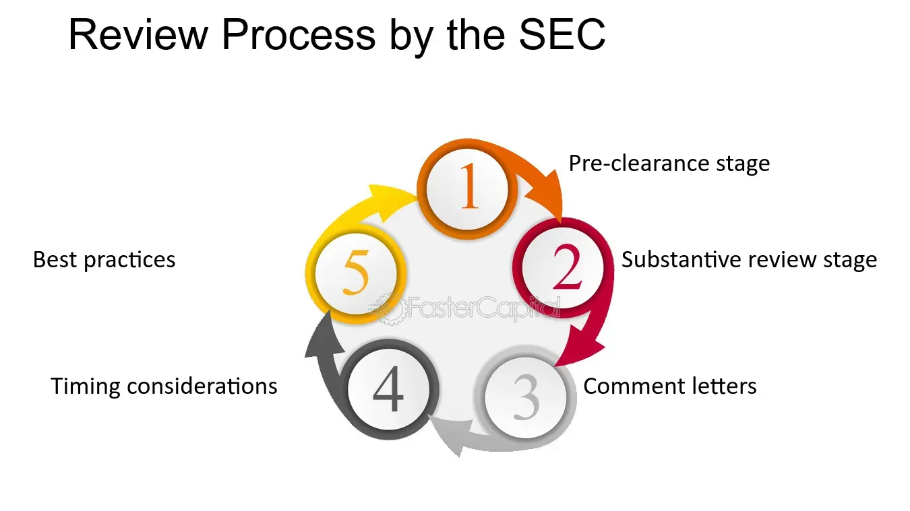

## Table of Contents

## What is SEC Form S-3?

SEC Form S-3 is a document that companies use to register certain securities with the Securities and Exchange Commission (SEC). This form is used by companies that have already been reporting to the SEC and meet specific requirements. It allows these companies to quickly and easily offer new securities to the public, like stocks or bonds, without going through a long registration process.

Using Form S-3 makes it easier for well-established companies to raise money. They can issue new securities faster because they already provide regular financial updates to the SEC. This form is popular because it simplifies the process and saves time, helping companies to get the funds they need more efficiently.

## Who is eligible to use SEC Form S-3?

Companies that want to use SEC Form S-3 need to meet certain rules. They must have been reporting to the SEC for at least 12 months and must have filed all the required reports on time. Also, the company should not have any problems with the SEC, like being late with reports or breaking any rules.

Another rule is that the company must be big enough. This means it should have at least $75 million worth of stock that people can buy and sell, or it should have made at least $50 million in revenue in the last year. If a company meets these rules, it can use Form S-3 to quickly offer new stocks or bonds to the public.

## What are the main components of SEC Form S-3?

SEC Form S-3 has several important parts that help the company tell investors about the new securities it wants to sell. The first part is the prospectus, which is like a guide for investors. It tells them what the securities are, how much they cost, and what risks come with buying them. It also includes information about the company, like its business, how it makes money, and any legal problems it might have.

The second part of Form S-3 is the exhibits. These are extra documents that the company has to attach to the form. They can include things like legal agreements, the company's articles of incorporation, and opinions from lawyers. These documents give more details and help make sure everything is clear and legal.

Overall, Form S-3 is designed to be a quick way for companies that are already well-known to the SEC to raise money. By including a prospectus and exhibits, the form makes sure that investors get all the information they need to make smart choices about buying the new securities.

## How does SEC Form S-3 differ from other SEC forms like S-1?

SEC Form S-3 and SEC Form S-1 are both used to register securities with the SEC, but they are used in different situations. Form S-1 is used by companies that are new to the SEC or don't meet certain requirements. It's a longer and more detailed form that takes more time to prepare and get approved. Companies use Form S-1 when they are going public for the first time or if they haven't been regularly reporting to the SEC.

On the other hand, Form S-3 is used by companies that are already well-known to the SEC and meet specific requirements. These companies have been reporting to the SEC for at least a year and have a good track record. Form S-3 is shorter and easier to use, allowing these companies to quickly offer new securities to the public. This makes it a faster and more efficient way for established companies to raise money.

## What are the benefits of using SEC Form S-3 for a company?

Using SEC Form S-3 helps companies raise money faster and easier. It's like a shortcut for companies that have been reporting to the SEC for a while and have a good record. Instead of going through a long process, these companies can quickly tell investors about new stocks or bonds they want to sell. This means they can get the money they need without waiting too long.

Another benefit is that it's less work for the company. Form S-3 is simpler and shorter than other forms like S-1. This saves time and money because the company doesn't have to spend as much on preparing the form and getting it approved. It's a big help for well-established companies that want to keep growing and need to raise money often.

## What types of securities can be registered using SEC Form S-3?

SEC Form S-3 can be used to register different kinds of securities. Companies can use it to sell new stocks, which means they can offer shares of their company to investors. They can also use it to sell bonds, which are like loans that the company promises to pay back with interest. Sometimes, companies might want to sell other types of securities too, like warrants, which give people the right to buy stocks later at a set price.

The form is flexible and can be used for many kinds of offerings. For example, it can be used for primary offerings, where the company sells new securities directly to the public. It can also be used for secondary offerings, where existing shareholders sell their shares. This makes Form S-3 a handy tool for companies that want to raise money in different ways.

## What is the process for filing SEC Form S-3?

Filing SEC Form S-3 starts with the company making sure it meets all the rules. The company needs to have been reporting to the SEC for at least a year and must have filed all its reports on time. It also needs to be big enough, with at least $75 million in stock that people can buy and sell, or it should have made $50 million in revenue last year. Once the company checks these boxes, it can start preparing the form.

To prepare the form, the company puts together a prospectus, which is like a guide for investors. This tells them about the new securities, how much they cost, and any risks involved. The company also attaches exhibits, which are extra documents like legal agreements and opinions from lawyers. After everything is ready, the company files Form S-3 with the SEC. Once the SEC looks it over and says it's okay, the company can start selling the new securities to the public.

## What are the key requirements and conditions for filing SEC Form S-3?

To file SEC Form S-3, a company needs to meet certain rules set by the SEC. The company must have been reporting to the SEC for at least 12 months and must have filed all the required reports on time. It's important that the company doesn't have any problems with the SEC, like being late with reports or breaking any rules. Another rule is that the company needs to be big enough. This means it should have at least $75 million worth of stock that people can buy and sell, or it should have made at least $50 million in revenue in the last year.

Once these rules are met, the company can start preparing Form S-3. The form includes a prospectus, which is a guide for investors that explains what the new securities are, how much they cost, and any risks involved. The company also needs to attach exhibits, which are extra documents like legal agreements and opinions from lawyers. After everything is ready, the company files Form S-3 with the SEC. Once the SEC reviews and approves it, the company can start selling the new securities to the public.

## How long does the SEC review process for Form S-3 typically take?

The SEC review process for Form S-3 usually takes about 30 days. This time can change a bit depending on how busy the SEC is and if they need more information from the company. If everything is clear and the company has done a good job with the form, it might go faster. But if the SEC finds problems or needs more details, it could take longer.

Once the SEC gets Form S-3, they look at it carefully to make sure it follows all the rules. They check the prospectus and all the extra documents to see if everything is right. If they have questions or need changes, they will tell the company. The company then has to fix things and send it back. This back-and-forth can add time to the process, but usually, it's still quicker than other forms because Form S-3 is for companies that are already well-known to the SEC.

## What are common mistakes to avoid when filing SEC Form S-3?

When filing SEC Form S-3, it's important to make sure all the information is correct and complete. A common mistake is not including all the required exhibits or not having the right legal documents attached. Another mistake is not being clear in the prospectus about the risks of buying the securities. Investors need to know what they're getting into, so leaving out important details can cause problems.

Also, companies sometimes forget to check if they meet all the SEC's rules for using Form S-3. They need to have been reporting to the SEC for at least a year, and they must have filed all their reports on time. If they don't meet these rules, the SEC might not approve the form. It's also important to make sure the company is big enough, with enough stock value or revenue, or the form won't be accepted.

## How can a company ensure compliance when using SEC Form S-3?

To make sure a company follows the rules when using SEC Form S-3, it needs to check that it meets all the SEC's requirements. The company must have been reporting to the SEC for at least a year and should have filed all its reports on time. It also needs to be big enough, with at least $75 million worth of stock that people can buy and sell, or it should have made $50 million in revenue last year. If the company doesn't meet these rules, the SEC won't approve the form. So, it's important to double-check everything before filing.

Once the company is sure it meets the rules, it should carefully prepare the form. The prospectus, which is like a guide for investors, needs to clearly explain what the new securities are, how much they cost, and any risks involved. The company also needs to attach all the right exhibits, like legal agreements and opinions from lawyers. If anything is missing or not clear, the SEC might ask for more information, which can delay the process. By being thorough and making sure everything is correct, the company can help make sure the filing goes smoothly and quickly.

## What are the recent updates or amendments to SEC Form S-3 that filers should be aware of?

There have been some recent changes to SEC Form S-3 that companies need to know about. One big change is about how companies can use the form for what's called "at-the-market" offerings. This means companies can now use Form S-3 to sell securities directly into the market at the current price, which can be easier and faster than before. Also, the SEC has updated the rules about who can use Form S-3. Now, companies that have been reporting to the SEC for less than a year might still be able to use it if they meet certain other conditions, like having a big enough stock value or revenue.

Another important update is about how companies need to report information about their business and risks. The SEC now wants companies to be clearer and more detailed in the prospectus. This means companies need to explain their business and any risks in a way that's easy for investors to understand. These changes are meant to make sure investors get all the information they need to make smart choices. Companies should read the new rules carefully and make sure their Form S-3 follows them to avoid any problems with the SEC.

## References & Further Reading

[1]: ["SEC Form S-3"](https://www.sec.gov/files/forms-3.pdf) - Investopedia's detailed overview of SEC Form S-3, including its purpose and filing requirements.

[2]: Bratton, William W. (2016). ["Securities Regulation: Cases and Analysis"](https://www.amazon.com/Corporate-Finance-Materials-University-Casebook/dp/1684679273) - This book provides an in-depth analysis of securities regulations, including forms like the SEC Form S-3.

[3]: ["U.S. Securities and Exchange Commission's EDGAR Database"](https://www.sec.gov/search-filings) - The official SEC database for accessing and searching public company filings, including Form S-3 submissions.

[4]: Coffee, John C., Sale, Hillary A., & Henderson, M. Todd (2020). ["Securities Regulation: Cases and Materials"](https://archive.org/details/securitiesregula0000coff) - A comprehensive case book covering U.S. securities regulation, including form and filing processes.

[5]: ["Algorithmic Trading and DMA: An introduction to direct access trading strategies"](https://www.amazon.com/Algorithmic-Trading-DMA-introduction-strategies/dp/0956399207) by Barry Johnson - A guide to understanding algorithmic trading strategies, which can be enriched by knowledge of forms like SEC Form S-3.

[6]: ["Securities Act of 1933"](https://www.sec.gov/rules-regulations/statutes-regulations) - U.S. Securities and Exchange Commission's brief explainer and resources on the Securities Act of 1933, under which Form S-3 operates.