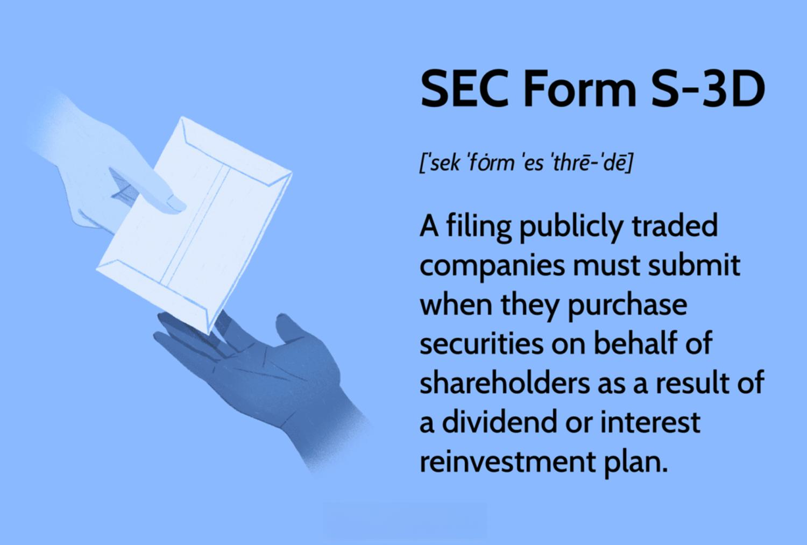

In the modern financial landscape, the Securities and Exchange Commission (SEC) plays a fundamental role in regulating and overseeing the actions of investors and companies within the financial markets. By enforcing laws and regulations, the SEC ensures the maintenance of fair, orderly, and efficient markets, which is vital for the protection of investors and the stability of the financial system. For publicly traded companies, compliance with the SEC's regulatory framework is not just a legal requirement but a component essential for maintaining investor trust and facilitating capital market activities.

SEC Form S-3D is particularly significant within this framework. It serves as a mandatory filing for publicly traded companies engaging in specific securities activities, especially those conducted on behalf of shareholders. These activities often include transactions under dividend or interest reinvestment plans, commonly referred to as DRIPs. Understanding SEC Form S-3D is crucial as it underscores the intersection of compliance, shareholder engagement, and corporate financial practices.



The increasing prevalence of automated trading and technological advancements in the financial sector has added another layer of complexity to the regulatory landscape. SEC Form S-3D's relevance is further amplified when considered in conjunction with automated trading systems, where algorithms play a pivotal role in executing and managing securities transactions. These systems have transformed trading by providing unprecedented speed and efficiency, prompting a need for updated regulatory oversight to ensure these practices align with existing legal and ethical standards.

Moreover, SEC Form S-3D holds implications for dividend reinvestment plans, which allow shareholders to reinvest cash dividends into additional company shares without the need for brokerage intervention. These plans provide benefits such as compounding returns and reduced transaction costs, while also presenting unique regulatory and tax considerations that require careful attention from the participating investors.

Understanding these elements is vital for anyone navigating today’s financial markets. As investors and market participants continue to embrace automation and innovation, a thorough comprehension of SEC Form S-3D and associated regulatory measures is imperative for informed decision-making and compliance. This article will further explore these themes, unraveling the complexities and opportunities within the intertwined worlds of securities regulation and automated trading.

## Table of Contents

## Understanding SEC Form S-3D

SEC Form S-3D is a specific filing requirement that publicly traded companies must submit to the Securities and Exchange Commission (SEC) through its Electronic Data Gathering, Analysis, and Retrieval (EDGAR) system. This particular form is pivotal when companies engage in transactions involving the purchase of securities on behalf of shareholders, typically as part of dividend or interest reinvestment plans. Essentially, SEC Form S-3D facilitates the documentation of these transactions, ensuring they comply with existing regulatory frameworks.

The genesis of the requirement for SEC Form S-3D aligns with the broader historical context of the Securities Act of 1933. This Act was one of the initial legislative measures introduced to restore investor confidence in the financial markets following the catastrophic 1929 stock market crash. Rule 462 under the Securities Act stipulates the filing requirements for Form S-3D. This rule and the Act's overall framework are designed to protect investors by ensuring transparency and accountability in financial transactions.

The form serves a critical role in maintaining transparent records of securities transactions related to dividend reinvestment plans (DRIPs) or similar financial activities. By documenting these activities meticulously, Form S-3D helps to uphold regulatory compliance, providing a safeguard for investor interests. This transparency is key to fostering a fair and equitable trading environment, as it enables regulatory bodies to monitor and manage potential risks associated with these transactions effectively.

Moreover, SEC Form S-3D also plays a part in safeguarding investors by ensuring companies adhere to the principles laid out in the Securities Act. These principles emphasize the need for material information about securities being offered for sale to the public, thereby enabling investors to make informed decisions.

In sum, SEC Form S-3D is a cornerstone of regulatory compliance for publicly traded companies, particularly in the context of DRIPs and other shareholder-involved securities transactions. Its role in maintaining transparent documentation not only fosters regulatory compliance but also enhances investor protection by providing clear insights into the transactions executed on their behalf.

## Dividend Reinvestment Plans (DRIPs) and SEC Form S-3D

Dividend reinvestment plans (DRIPs) are innovative mechanisms that allow shareholders to automatically reinvest their cash dividends into additional shares of the issuing company. This reinvestment occurs without the intermediary involvement of brokerage firms and without incurring brokerage fees, providing a cost-effective way for investors to increase their holdings. SEC Form S-3D plays a crucial role in facilitating these transactions by ensuring that the purchase and distribution of the additional shares are clearly documented and easily accessible, thus enhancing transparency and maintaining regulatory compliance.

DRIPs offer a range of benefits to both investors and companies. For investors, the primary advantage is the ability to build equity over time, thereby maximizing the potential for compound growth. Instead of receiving dividends in cash and potentially spending them, shareholders leverage DRIPs to automatically convert dividends into equity, which can lead to significant growth in share holdings, particularly over long investment horizons. Additionally, this process often allows shareholders to purchase shares at a slight discount and without incurring additional trading fees.

For companies, DRIPs offer the advantage of retaining capital that might otherwise be distributed to shareholders in the form of cash dividends. This retention can enhance a company's [liquidity](/wiki/liquidity-risk-premium) and provide additional funds for reinvestment in growth initiatives, research and development, or other strategic endeavors. Moreover, these plans can bolster shareholder loyalty, as they encourage investors to maintain or increase their holdings over the long term.

However, DRIPs do have tax implications that investors must consider. In the United States, for instance, the Internal Revenue Service (IRS) treats dividends as taxable income, even if they are reinvested rather than received as cash. This means that investors must still report dividends reinvested through DRIPs as taxable income on their federal income tax returns. It is important for investors to accurately account for these reinvestments to ensure compliance with tax regulations. This is where SEC Form S-3D becomes particularly relevant, as it ensures the necessary documentation is available to support accurate tax reporting.

In summary, DRIPs enable shareholders to automatically reinvest dividends into additional shares, fostering growth without brokerage fees. SEC Form S-3D facilitates transparency in these transactions, supporting regulatory compliance and improving tax reporting accuracy. For investors, the benefits include increased share accumulation and potential compounding, while companies benefit from retained capital and potentially enhanced shareholder loyalty. Understanding the tax implications and ensuring compliance is essential for investors participating in DRIPs.

## The Role of Algorithmic Trading in Securities

Algorithmic trading has become a foundational component of modern securities trading, revolutionizing the processes through which stocks and other financial instruments are bought and sold. This method uses complex algorithms to execute trades at speeds and frequencies impossible for human traders. By relying on computer programs and systems designed to follow a pre-defined set of instructions, [algorithmic trading](/wiki/algorithmic-trading) provides significant advantages in terms of speed, efficiency, and precision.

### Understanding Algorithmic Trading

At its core, algorithmic trading leverages mathematical models and computational algorithms to determine trading strategies and execute orders based on various market signals. The primary objective is to capitalize on market opportunities faster than human decision-makers can. These algorithms can process vast amounts of data across multiple markets concurrently, identifying patterns and executing trades when specific conditions are met. Algorithms can be tailored to perform a wide range of activities, from simple trade execution to complex [arbitrage](/wiki/arbitrage) strategies.

### Advantages of Algorithmic Trading

One of the most notable advantages of algorithmic trading is its ability to handle high-[volume](/wiki/volume-trading-strategy) trades without the need for constant human intervention, minimizing the impact of human emotions on trading decisions. Algorithms can execute trades at optimal prices and with minimal transaction costs, improving overall trading efficiency. Furthermore, they facilitate the processing of large datasets in real time and the execution of trades in milliseconds. 

### Potential Risks

Despite its advantages, algorithmic trading carries potential risks that must be carefully managed. These include algorithmic errors, such as coding mistakes, which can lead to unintended trading behavior and significant financial losses. Market disruptions can also occur when algorithms react to anomalies or engage in rapid, high-frequency trading that amplifies price movements. Therefore, robust risk management and monitoring systems are crucial to mitigate these risks and ensure adherence to established trading rules and strategies.

### Integration with DRIPs and SEC Form S-3D

In the context of SEC Form S-3D and dividend reinvestment plans (DRIPs), algorithmic trading allows for efficient execution of trades related to the reinvestment of dividends. Companies can use algorithms to purchase additional shares on behalf of investors quickly, ensuring compliance with SEC regulations. Algorithms ensure timely and accurate reporting of these transactions, which is critical for maintaining transparency and regulatory compliance.

### Role in Market Liquidity and Trading Strategies

Algorithmic trading plays a critical role in maintaining market liquidity by enabling continuous buying and selling activities, which helps stabilize prices and reduces market [volatility](/wiki/volatility-trading-strategies). Algorithms can be programmed to adjust trading strategies dynamically, optimizing performance based on current market conditions. For instance, they can incorporate techniques such as market-making, trend-following, and [statistical arbitrage](/wiki/statistical-arbitrage) to identify and exploit market inefficiencies.

### Example in Python

Here is a simple Python example of how an algorithm might be structured to execute a basic trading strategy:

```python
import yfinance as yf  # For more datasets, visit: https://paperswithbacktest.com/datasets
import numpy as np

# Fetch historical data
ticker = yf.Ticker("AAPL")
hist = ticker.history(period="1y")

# Calculate simple moving average
short_window = 40
long_window = 100

signals = np.zeros(len(hist))
signals[short_window:] = np.where(hist['Close'][short_window:] >
                                   hist['Close'].rolling(window=long_window, min_periods=1).mean()[short_window:], 1.0, 0.0)

# Generate trading rules
buy_signals = signals > 0
sell_signals = signals < 0

# Execution of trades based on signals
for i in range(len(signals)):
    if buy_signals[i]:
        print(f"Buy signal generated for {ticker} on {hist.index[i]}")
    elif sell_signals[i]:
        print(f"Sell signal generated for {ticker} on {hist.index[i]}")
```

This simplified example showcases how an algorithm uses historical stock data to identify buy and sell signals based on moving averages. In practice, trading algorithms are far more complex and integrate multiple data sources and market indicators to refine trade execution strategies.

In conclusion, algorithmic trading has transformed securities markets by providing rapid trade execution and improved market liquidity. However, balancing the advantages of this technology with the associated risks and ensuring compliance with regulatory frameworks like SEC Form S-3D is essential for sustainable market operations.

## Relevance of SEC Regulations in Automated Trading

In the contemporary financial environment, the role of the U.S. Securities and Exchange Commission (SEC) in regulating automated trading systems is increasingly significant. With the proliferation of algorithmic and high-frequency trading, the SEC's regulations have evolved to maintain market integrity and protect investors. SEC Form S-3D, among other regulatory instruments, is pivotal in ensuring legal and ethical compliance in securities transactions facilitated by advanced trading technologies.

SEC regulations, including the Securities Act of 1933 and subsequent provisions like Form S-3D, are designed to address challenges posed by automated trading. These regulations require comprehensive disclosure and transparency in securities transactions, preventing market manipulation and ensuring fairness. The primary aim is to safeguard against practices that could be detrimental to market participants, such as front-running and latency arbitrage, which are often associated with algorithmic trading.

As the trading landscape continues to evolve, regulatory frameworks are adapting to new technological advancements. For instance, the SEC has implemented the Consolidated Audit Trail (CAT), a system that enhances oversight by tracking trading activities across various markets. Furthermore, the use of [machine learning](/wiki/machine-learning) and [artificial intelligence](/wiki/ai-artificial-intelligence) in trading algorithms necessitates a reevaluation of existing regulations to address potential risks and ensure these technologies are used responsibly.

Looking forward, the SEC is expected to increase scrutiny on algorithmic trading practices and employ more advanced analytics to monitor compliance. This may include stricter disclosure requirements for algorithm developers and traders, as well as improved real-time surveillance systems. Additionally, there is likely to be a focus on developing international regulatory standards to address the cross-border nature of modern trading activities.

Ultimately, as automated trading becomes more prevalent, the SEC's role in ensuring transparency, preventing systemic risks, and fostering a fair trading environment will become more critical. Continuous adaptation of regulations will be essential to accommodate technological innovations while upholding the core principles of investor protection and market stability.

## Conclusion

The interplay between SEC regulations, financial securities, and algorithmic trading is central to understanding the modern financial market environment. SEC Form S-3D serves as a crucial instrument for maintaining regulatory oversight in securities trading and Dividend Reinvestment Plans (DRIPs). By mandating disclosures of securities transactions, it ensures transparency and protects investor interests, aligning with the Securities Act of 1933's objectives.

Understanding the synergy between regulatory compliance and technological advancements in trading is essential for investors and market participants. As financial markets evolve with technological innovations, particularly in algorithmic trading, it becomes increasingly important for these technologies to operate within established regulatory frameworks. By doing so, they help preserve the integrity and stability of financial markets while offering unprecedented efficiency and speed in trade execution.

As the financial world moves forward with increasing automation, staying informed about the latest SEC developments remains imperative. SEC regulations not only guide newer and more complex trading methods but also adapt to address emerging risks associated with these advancements. Familiarity with these regulations ensures that investors and companies can capitalize on technological progress while remaining compliant, thereby contributing to a well-functioning market economy.

## References & Further Reading

[1]: Solomon, S. D. (2016). ["The Dodd-Frank Act: A Cheat Sheet."](https://www.riskdata.com/wp-content/uploads/The-Dodd-Frank-Act_Morrison-Foerster.pdf) Harvard Law School Forum on Corporate Governance.

[2]: Stoll, H. R. (2006). ["Electronic Trading in Stock Markets."](https://www.jstor.org/stable/pdf/30033638.pdf) Journal of Economic Perspectives, 20(1), 153-174.

[3]: Securities and Exchange Commission. (2010). ["Concept Release on Equity Market Structure."](https://www.sec.gov/rules-regulations/2010/01/concept-release-equity-market-structure) 

[4]: Securities and Exchange Commission. (2013). ["Final Rule: Security Ratings"](https://www.sec.gov/files/rules/sro/finra/2013/34-71179.pdf)

[5]: Hasbrouck, J., & Saar, G. (2013). ["Low-Latency Trading."](https://www.sciencedirect.com/science/article/abs/pii/S1386418113000165) Review of Financial Studies, 26(9), 2091-2121.