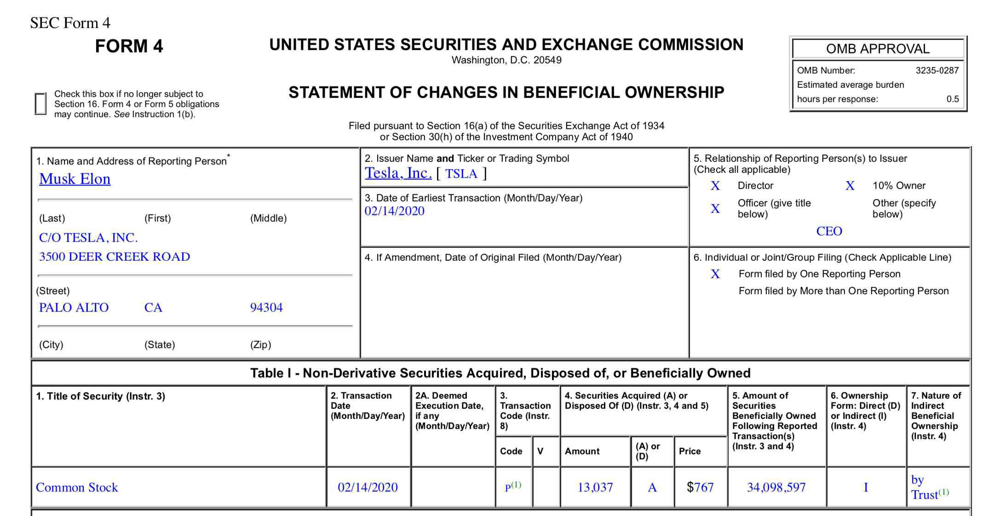

In the complex domain of mergers and acquisitions (M&A), SEC Form S-4 stands as a pivotal element to ensure transparency and adherence to regulatory standards. This form, mandated under the Securities Act of 1933, is crucial for companies intending to register securities in relation to business combinations, such as mergers, acquisitions, or similar reorganization activities. It encompasses essential information that allows shareholders and the investment community to make informed decisions regarding the transaction.

Form S-4 promotes legal compliance by requiring comprehensive disclosures about the involved entities, the terms of the transaction, and the financial state of the companies concerned. This mandatory disclosure aids in upholding the principles of fairness and openness in corporate transactions, thereby safeguarding the interests of investors and maintaining market integrity.

The modern financial market operates in an environment where securities exchanges and algorithmic trading play a significant role. Securities exchanges serve as platforms for facilitating the buying and selling of securities, ensuring market liquidity and efficiency. Meanwhile, algorithmic trading leverages computer algorithms to execute trades at speeds and volumes beyond human capabilities, offering benefits such as heightened accuracy and data-driven decision-making.

The purpose of this article is to explore how SEC Form S-4 interacts with the domains of securities exchange and algorithmic trading. By examining this connection, we can better understand how regulatory compliance influences trading patterns and market behavior.

This article will proceed by thoroughly defining SEC Form S-4, its role in mergers and acquisitions, and its implications on the financial market. We will then look into the functions of securities exchanges, the transformation brought about by algorithmic trading, and the synergy that exists among these three elements. The analysis will conclude by reflecting on the evolving landscape of financial markets, emphasizing the importance of regulatory practices in enhancing market efficiency.

## Table of Contents

## Understanding SEC Form S-4

SEC Form S-4 is a significant regulatory document required under the Securities Act of 1933, instrumental in the landscape of corporate mergers and acquisitions. The primary function of Form S-4 is to register securities offered in connection with business combinations, such as mergers, consolidations, acquisitions, and takeovers. This form is pivotal in ensuring that companies disclose material information to their shareholders when issuing new securities during such transactions, thereby protecting investors and maintaining market transparency.

Form S-4 is structured into two main parts: the prospectus/proxy statement and supplemental information. The prospectus or proxy statement serves as the primary disclosure document, providing comprehensive details about the transaction. It outlines the terms of the transaction, the identities of the companies involved, the nature of their businesses, and the financial implications for shareholders. This section is critical for shareholders to make informed voting and investment decisions. It typically includes financial statements, management's discussion and analysis, and information on how the transaction aligns with corporate strategy.

The supplemental information section encompasses additional data that supports the disclosures made in the prospectus. This may involve detailed accounting reconciliations, legal opinions, tax implications, and any risk factors associated with the transaction. This supplementary data ensures a robust and comprehensive understanding of the financial and strategic repercussions of the proposed corporate actions.

The mandatory submission of Form S-4 is crucial during mergers and exchange offers as it aligns with the legal requirements set forth by the Securities and Exchange Commission (SEC). The form is required to be filed with the SEC before any public solicitation or distribution of new securities in connection with the transaction, ensuring that the information presented to shareholders is both comprehensive and accurate. Non-compliance or inaccuracies in an S-4 submission can result in delays, legal complications, and potential financial penalties, which underscores the necessity for timely and precise filings.

Accurate and timely submissions of Form S-4 hold significant value in legal corporate mergers by facilitating informed decision-making among investors and ensuring a level playing field. This transparency is not just a legal obligation but a cornerstone of investor confidence. As such, corporations are motivated to provide full and clear disclosures to avoid potential litigation, ensure smooth transaction flows, and uphold their reputational standing in the market. Ensuring accuracy in these submissions enhances the credibility of the transaction and supports regulatory oversight, ultimately contributing to a stable and efficient capital market system.

## Functionality of SEC Form S-4 in Mergers and Acquisitions

Form S-4 is an essential document used by public companies during mergers and acquisitions (M&A) to register important information under the Securities Act of 1933. It serves as a critical communication tool for disclosing pertinent details about the financial and business operations implicated in these transactions. By providing a comprehensive prospectus and proxy statement, Form S-4 ensures that all stakeholders are adequately informed, thereby facilitating smoother regulatory compliance and transparency.

Public companies leverage Form S-4 to furnish material information necessary for the fair valuation and assessment of the potential merger. This information typically includes financial statements, details about the transaction structure, anticipated synergies, risks involved, and the expected impact on shareholders. By doing so, Form S-4 aids investors in making informed decisions, aligning their strategies with the company's future directions after the merger.

Exchange offers, often highlighted in Form S-4, are vital mechanisms by which companies propose to exchange new securities for their existing securities. This process allows the issuing company to alleviate financial distress by restructuring its capital framework without immediate cash payment. Exchange offers are crucial during M&A activities because they enable more flexible financial strategies, often acting as a trigger to initiate transformative changes within the company.

Prominent mergers have been significantly streamlined through the effective use of Form S-4 submissions. For instance, the merger between AT&T and Time Warner in 2018 involved detailed Form S-4 filings that clarified the strategic importance of the acquisition and its benefits to shareholders. Another example is the acquisition of Sprint by T-Mobile in 2020, which required thorough disclosures in Form S-4 to elucidate the merger's implications for competition and consumer choice in the telecommunications industry.

The impact of S-4 filings on investor decision-making is profound. These documents provide clarity on not only the terms of the merger but also the company's forward-looking statements and management's rationale behind the merger. This transparency helps investors evaluate potential changes in stock value, dividend policies, and overall corporate strategy. As such, Form S-4 acts as an indispensable element that guides investor behavior and expectations, shaping their strategies amidst the uncertainties of a merger. 

In summary, SEC Form S-4 plays a pivotal role in facilitating merger and acquisition activities by ensuring comprehensive disclosure of critical information. It supports effective exchange offers, promotes informed investor actions, and has been instrumental in numerous high-profile mergers, thereby underscoring its significance in corporate compliance and strategic execution.

## Securities Exchange: A Brief Overview

A securities exchange is a structured platform where financial securities such as stocks, bonds, and other financial instruments are bought and sold. The primary purpose of a securities exchange is to facilitate the transfer of these instruments between buyers and sellers, ensuring [liquidity](/wiki/liquidity-risk-premium) and price transparency in the financial markets. By providing a centralized venue, exchanges enable market participants to execute trades efficiently, minimizing the time and costs associated with such transactions.

Securities exchanges play a crucial role in maintaining financial market stability by promoting market liquidity. Liquidity refers to the ease with which an asset can be converted into cash without affecting its market price. In highly liquid markets, traders can buy and sell assets rapidly, thereby encouraging active participation and ensuring that prices reflect the latest market information. This liquidity is vital for both individual investors and institutional participants, as it reduces the risk associated with holding or trading securities.

An essential aspect of securities exchanges is their role in regulatory compliance, particularly concerning forms such as SEC Form S-4. Authorized exchanges are required to adhere to stringent regulatory standards set forth by financial authorities to protect investors and maintain fair market practices. Forms like the S-4, which disclose important financial details about mergers and acquisitions, are crucial for maintaining transparency in corporate transactions. By ensuring that all relevant information is available, exchanges support regulatory compliance and help investors make informed decisions.

Recent advancements have further enhanced the efficiency of securities exchanges. Technological innovations, such as electronic trading platforms and high-frequency trading systems, have revolutionized the way transactions are conducted. These developments have significantly reduced the time needed to execute trades by automating processes and providing sophisticated algorithms that match buyers and sellers at lightning speed. Furthermore, the integration of big data analytics and [machine learning](/wiki/machine-learning) in exchange operations has improved the ability to detect anomalies, prevent fraudulent activities, and optimize trading strategies.

Overall, the evolving landscape of securities exchanges continues to impact trading efficiencies and market behaviors. As they adapt to new technologies and regulatory requirements, exchanges play a fundamental role in ensuring the seamless operation of financial markets, safeguarding investor interests, and supporting economic growth.

## The Rise of Algorithmic Trading

Algorithmic trading, commonly referred to as algo trading, has significantly reshaped the landscape of financial markets. It involves the use of computerized systems to execute a large number of trades at speeds and frequencies that are impossible for human traders. The automation of trading strategies allows for improved efficiency and has become a vital component of modern financial markets.

The primary advantages of [algorithmic trading](/wiki/algorithmic-trading) are its speed, accuracy, and data-driven decision-making capabilities. Algorithms can process vast amounts of market data and execute trades in fractions of a second, capturing [arbitrage](/wiki/arbitrage) opportunities that are fleeting and capitalizing on small price discrepancies. This level of speed is unparalleled in traditional trading, where human reaction times introduce delays. Moreover, algorithmic trading minimizes human errors such as mistakes in order placement or emotional biases that can cloud judgment.

Another key benefit is accuracy, as algorithms can be programmed to execute trades based on pre-defined criteria and market conditions without deviation. This precision eliminates manual errors and ensures consistency in trading strategies. Furthermore, data-driven insights empower traders to backtest strategies over historical data, optimizing parameters for maximized returns and minimized risks. This quantitative approach provides a robust framework for decision-making.

However, algorithmic trading presents its own set of challenges and risks. One significant concern is the potential for technical failures, such as system crashes or erroneous order executions due to programming errors or unforeseen market conditions. Additionally, the speed and [volume](/wiki/volume-trading-strategy) of trades generated by algorithms can exacerbate market [volatility](/wiki/volatility-trading-strategies), as seen in incidents like the Flash Crash of 2010 when the Dow Jones Industrial Average plummeted nearly 1,000 points within minutes.

Regulatory considerations are also paramount, as authorities strive to mitigate systemic risks posed by high-frequency trading ([HFT](/wiki/high-frequency-trading-strategies)) and other algorithmic strategies. Compliance with regulatory requirements, including those involving disclosures under SEC Form S-4, is essential for maintaining market integrity. Algorithms rely on accurate and timely information from forms like S-4 to assess mergers and acquisitions (M&A) activities, influencing trading decisions and market strategies.

Examples of algorithmic trading strategies include [statistical arbitrage](/wiki/statistical-arbitrage), [trend following](/wiki/trend-following), and [market making](/wiki/market-making). Statistical arbitrage exploits statistical deviations across correlated securities, while trend following seeks to capitalize on established market trends. Market making involves providing liquidity to markets by simultaneously quoting buy and sell prices, profiting from the bid-ask spread. These strategies require real-time data from various regulatory submissions, such as Form S-4, to adjust to corporate events that might affect security prices.

In conclusion, algorithmic trading is a powerful mechanism driving efficiency and innovation in financial markets. Nonetheless, it necessitates careful calibration to manage its inherent risks and compliance obligations. The interplay between algo trading and regulatory frameworks, such as those involving Form S-4 disclosures, exemplifies the dynamic between technology and regulatory oversight in the ever-evolving financial ecosystem.

## Synergy Between SEC Form S-4, Securities Exchange, and Algorithmic Trading

SEC Form S-4 plays a crucial role in ensuring transparency and compliance during mergers and acquisitions (M&A), which can, in turn, significantly influence trading algorithms and patterns in the securities exchange market. The detailed disclosures provided by Form S-4 allow algorithmic traders to access material information that is vital for making informed buying and selling decisions. This enhanced transparency assists in reducing information asymmetry, a crucial [factor](/wiki/factor-investing) that algorithms use to assess market conditions effectively.

When companies plan mergers or exchange offers, the mandatory submission of Form S-4 ensures that pertinent information such as financial statements, risk factors, and forward-looking statements are available to investors, including those using algorithmic trading strategies. This level of detail allows algorithms to adjust their decision-making processes based on realistic assessments of the company's future performance and the potential impact of the merger. Trading strategies powered by such algorithms can gain a competitive edge by incorporating this data to optimize transactions, forecast market trends, and identify arbitrage opportunities.

Regulatory compliance mechanisms like Form S-4 also influence trading patterns due to their impact on market behavior during M&A. The anticipation and announcement of mergers typically lead to significant shifts in trading volumes and volatility, which algorithms are designed to capitalize on. These algorithms assess patterns in historical trading volumes and price movements related to similar disclosures to predict future market behavior, maximizing profit potential. A high level of transparency in such regulatory filings allows algorithms to iterate and improve accuracy, further influencing market liquidity and price efficiency.

The future outlook on the synergy between SEC Form S-4, securities exchanges, and algorithmic trading hinges on evolving financial regulations. As regulatory frameworks continue to develop, particularly with the incorporation of technologies such as AI and machine learning in trading practices, the interaction between these elements is poised to grow even more sophisticated. Changes in regulations that affect the timeliness and accuracy of disclosures could directly impact algorithmic strategies, affecting trading volumes and market stability. The continuous enhancement of financial transparency and regulatory compliance will play a vital role in ensuring that this synergy fosters an equitable, efficient, and resilient financial market environment.

Overall, regulatory frameworks like SEC Form S-4, in concert with securities exchanges and algorithmic trading, will likely engage in an iterative cycle of adaptation and enhancement, driven by technological advancements and market dynamics. This evolution will potentially yield a robust synergy that enhances market efficiency and preserves financial integrity.

## Conclusion

SEC Form S-4 plays a pivotal role in ensuring legal compliance during corporate deals, particularly mergers and acquisitions. By mandating comprehensive disclosure of material information, it helps maintain transparency and protect investor interests. The accurate and timely submission of this form is fundamental for the smooth execution of corporate transactions, thereby preventing legal disputes and safeguarding the integrity of the financial markets.

Securities exchanges serve as essential platforms for facilitating transactions and maintaining market liquidity. They provide a regulated environment that promotes fair and efficient trading, which is vital for the healthy functioning of financial markets. In parallel, algorithmic trading has revolutionized the trading landscape by offering speed, precision, and data-driven decision-making capabilities. This evolution underscores the critical need for synchronized regulatory frameworks, where forms such as the S-4 are tightly interwoven with trading strategies to ensure compliance and market stability.

Reflecting on the integrated future of regulatory compliance, trading technologies, and market efficiency, it is evident that a seamless synergy between these elements is crucial. Regulatory forms like SEC Form S-4 are integral in providing the necessary transparency and information that fuel trading algorithms. Such integration will only become more important as financial markets continue to evolve and face new challenges.

In conclusion, as the financial markets continue to advance, keeping regulatory practices up-to-date will be essential to navigate the complexities introduced by novel trading technologies and evolving market structures. This will ensure continued market efficiency, transparency, and protection of investor interests in an increasingly dynamic financial landscape.

## References & Further Reading

[1]: U.S. Securities and Exchange Commission. ["Form S-4 Registration Statement."](https://www.sec.gov/files/forms-4.pdf) Securities and Exchange Commission.

[2]: Brealey, R. A., Myers, S. C., & Allen, F. (2020). ["Principles of Corporate Finance."](https://www.mheducation.com/highered/product/Principles-of-Corporate-Finance-Brealey.html) McGraw Hill.

[3]: Lopez de Prado, M. (2018). ["Advances in Financial Machine Learning."](https://www.amazon.com/Advances-Financial-Machine-Learning-Marcos/dp/1119482089) Wiley.

[4]: Chan, E. P. (2009). ["Quantitative Trading: How to Build Your Own Algorithmic Trading Business."](https://github.com/ftvision/quant_trading_echan_book) Wiley.

[5]: Hull, J. C. (2017). ["Options, Futures, and Other Derivatives."](https://www.semanticscholar.org/paper/Options%2C-Futures%2C-and-Other-Derivatives-Hull/89bdee500c8623864fc9eb7a471546aa713acc44) Pearson.