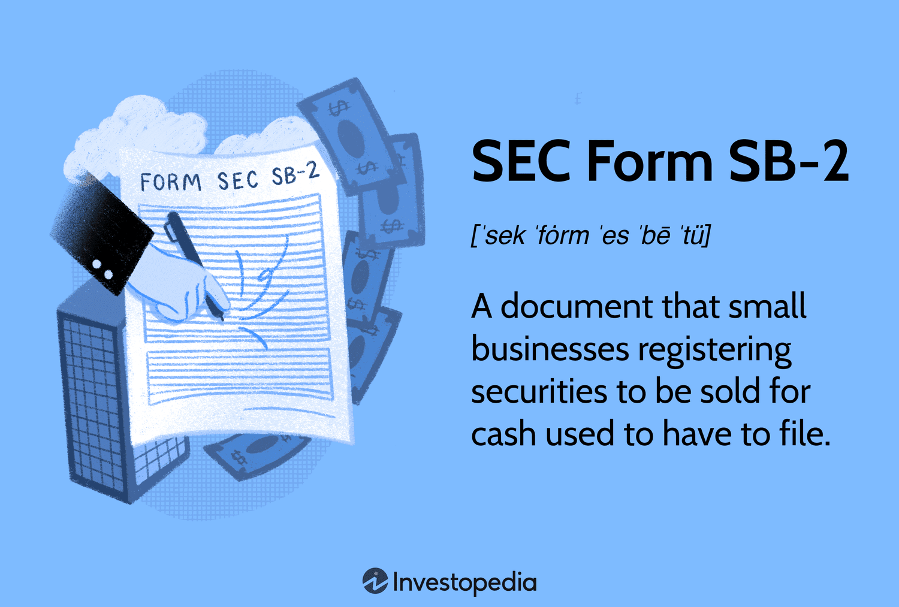

## Table of Contents

## What is SEC Form SB-2?

SEC Form SB-2 is a document used by smaller companies to register securities with the U.S. Securities and Exchange Commission (SEC). It is designed for companies that are considered "small businesses" under the SEC's rules, which typically means they have less than $25 million in annual revenue and less than $25 million in public float. This form allows these smaller companies to offer and sell their stocks, bonds, or other securities to the public.

Using Form SB-2 can be less burdensome than other registration forms because it requires less detailed disclosures. This makes it easier for small businesses to access the public markets and raise capital. However, the SEC still requires enough information to ensure that investors can make informed decisions. The form includes details about the company's business, the securities being offered, financial statements, and potential risks.

## Who is eligible to file SEC Form SB-2?

SEC Form SB-2 is for small businesses that want to sell stocks or other securities to the public. To be eligible, a company must be considered a "small business" by the SEC. This usually means the company makes less than $25 million in revenue each year and has a public float of less than $25 million. The public float is the value of the company's shares that are owned by the public.

Using Form SB-2 can help small businesses raise money more easily. It requires less detailed information than other forms, which makes it simpler for small companies to use. But, the company still has to give enough information so that people who might buy the securities can make good choices. This includes details about the business, the securities being sold, financial statements, and any risks involved.

## What is the purpose of filing SEC Form SB-2?

The purpose of filing SEC Form SB-2 is to help small businesses raise money by selling stocks or other securities to the public. Small businesses can use this form because it is easier than other forms. The SEC made Form SB-2 so that small companies, which usually make less than $25 million a year and have less than $25 million in public float, can get the money they need to grow.

When a small business files Form SB-2, it tells the public about its business, the securities it wants to sell, its financial situation, and any risks involved. This information helps people decide if they want to buy the securities. Even though Form SB-2 is simpler, it still gives enough information for people to make smart choices about investing in the company.

## How does SEC Form SB-2 differ from other SEC forms like S-1?

SEC Form SB-2 and Form S-1 are both used to register securities with the SEC, but they are designed for different types of companies. Form SB-2 is meant for small businesses that have less than $25 million in annual revenue and less than $25 million in public float. This form is simpler and requires less detailed information, making it easier for small companies to raise money by selling stocks or other securities to the public.

On the other hand, Form S-1 is used by larger companies and requires more detailed disclosures. This form is more complex and is used by companies of all sizes, but it is especially common for those that do not qualify as small businesses under the SEC's rules. Because Form S-1 requires more information, it can be more challenging for smaller companies to use, which is why Form SB-2 was created to help small businesses access the public markets more easily.

## What are the key components required in SEC Form SB-2?

SEC Form SB-2 has several important parts that a small business needs to fill out. The first part is about the company itself. This includes the company's name, address, and what it does. It also needs to explain the securities it wants to sell, like stocks or bonds, and how much money it hopes to raise. The company also has to talk about any risks that might affect its business or the value of the securities.

The second part of Form SB-2 is about the company's finances. This includes financial statements like the balance sheet, income statement, and cash flow statement. These statements show how much money the company makes, spends, and has. The company also needs to include information about its management team, like who the key people are and their experience. This helps people who might buy the securities understand the company better and make good choices about investing.

## What are the financial disclosure requirements for SEC Form SB-2?

The financial disclosure requirements for SEC Form SB-2 are important for small businesses that want to sell securities to the public. When filling out Form SB-2, a company needs to include its financial statements. These statements show how much money the company makes, how much it spends, and how much money it has. The main financial statements are the balance sheet, which shows what the company owns and owes, the income statement, which shows the company's profits or losses, and the cash flow statement, which shows how money moves in and out of the business.

These financial statements need to be audited by an independent accountant. This means that someone who doesn't work for the company checks the statements to make sure they are correct. The company also needs to include notes to the financial statements. These notes explain important details about the numbers in the statements, like how the company made certain calculations or what big events affected the business. By including all of this information, the company helps people who might buy its securities understand its financial health and make informed decisions.

## How long does the SEC review process typically take for Form SB-2?

The SEC review process for Form SB-2 can take several weeks to a few months. The exact time depends on how busy the SEC is, how complete and clear the form is, and if the SEC has any questions or needs more information. If everything is done right and the SEC has no issues, the review might be quicker. But if there are problems or missing information, it can take longer.

During the review, the SEC looks at all the information in the Form SB-2 to make sure it follows the rules and gives enough details for people to make good choices about investing. If the SEC finds something wrong or needs more information, they will send a comment letter to the company. The company then has to fix the problems and send the form back. This back-and-forth can add time to the review process. Once the SEC is happy with everything, they will declare the form effective, and the company can start selling its securities.

## What are the common reasons for SEC Form SB-2 rejections?

When a company submits SEC Form SB-2, the SEC might reject it for different reasons. One common reason is if the form is not filled out completely. The company needs to include all the information the SEC asks for, like details about the business, the securities being sold, and the financial statements. If something is missing, the SEC will not approve the form. Another reason for rejection is if the information in the form is not clear or is hard to understand. The SEC wants people who might buy the securities to be able to make good choices, so the form needs to be easy to read and understand.

Another reason for rejection is if the financial statements are not right. The company needs to include audited financial statements, which means an independent accountant has checked them to make sure they are correct. If the financial statements have mistakes or if the audit was not done properly, the SEC will reject the form. Also, if the company does not answer the SEC's questions or fix problems quickly, this can lead to rejection. The SEC wants to make sure everything is done correctly and on time to protect investors.

## Can amendments be made to SEC Form SB-2 after initial filing?

Yes, a company can make changes to SEC Form SB-2 after it has been filed. If the SEC finds problems or needs more information, they will send a comment letter to the company. The company can then fix the issues and send back an amended form. This back-and-forth can happen a few times until the SEC is happy with everything.

Making amendments is important because it helps the company meet the SEC's rules and give all the information that investors need. It's a way to make sure the form is complete and correct before the company can start selling its securities. The process can take some time, but it's a normal part of getting the form approved.

## What are the costs associated with filing SEC Form SB-2?

Filing SEC Form SB-2 can cost a company a lot of money. One big cost is hiring lawyers who know about SEC rules. These lawyers help the company fill out the form correctly and make sure it follows all the rules. The company also has to pay for accountants to check its financial statements. This is called an audit, and it makes sure the numbers in the form are right. All these professional fees can add up to thousands or even tens of thousands of dollars.

Another cost is the time it takes for the company's own people to work on the form. They have to gather all the information, write the form, and answer any questions from the SEC. This can take many hours or even weeks, which means the company's employees are not doing their regular jobs. There is also a filing fee that the company has to pay to the SEC when they submit the form. While this fee is usually smaller than the other costs, it is still something the company needs to think about when planning to file Form SB-2.

## How has the use of SEC Form SB-2 evolved over time?

The use of SEC Form SB-2 has changed a lot since it was first made. It was created to help small businesses raise money more easily by selling stocks or other securities to the public. When it started, many small companies used it because it was simpler than other forms and required less detailed information. This made it easier for small businesses to follow the rules and get their securities approved by the SEC.

Over time, the SEC made some changes to Form SB-2. In 2008, the SEC got rid of Form SB-2 and replaced it with other forms like S-1, which are used by companies of all sizes. The reason for this change was to make the rules simpler and the same for all companies. Now, small businesses have to use the same forms as bigger companies, but they can still use some special rules that make it easier for them to raise money. Even though Form SB-2 is not used anymore, the idea behind it still helps small businesses today.

## What strategic considerations should be taken into account when deciding to file SEC Form SB-2?

When a small business thinks about filing SEC Form SB-2, it needs to consider a few important things. First, the company should think about why it wants to raise money. Is it to grow the business, pay off debts, or something else? Knowing the reason can help the company decide if selling securities is the best way to get the money it needs. The company also needs to think about the costs of filing the form, like paying for lawyers and accountants. These costs can be high, so the company should make sure the money it raises will be worth it.

Another thing to think about is the timing. Filing Form SB-2 can take a long time because the SEC needs to review it and might ask for changes. The company needs to be ready to wait and answer any questions from the SEC quickly. Also, the company should think about how selling securities might change who owns the business. If the company sells a lot of stock, it might have to share control with new investors. This can be good or bad, depending on what the company wants. So, the company should think carefully about all these things before deciding to file Form SB-2.

## What are the details of the offering and the use of proceeds in SEC Form SB-2?

SEC Form SB-2 was specifically tailored to make it easier for small businesses to raise capital by simplifying the disclosure requirements compared to those applicable to larger entities. A pivotal section of Form SB-2 focused on the offering details and the intended use of proceeds, providing investors with crucial information about the securities being issued and how the funds raised would be utilized.

### Offering Details

The section on offering details in SEC Form SB-2 required companies to specify the type, amount, and price of the securities being offered. This included information on whether the securities were common or preferred stock, debt securities, or other types of financial instruments. The price per security, the total number of securities offered, and the aggregate offering amount were also disclosed. These details were vital for potential investors to assess the value of the investment and the potential dilution of existing equity.

Mathematically, the aggregate offering amount could be expressed as follows:

$$
\text{Aggregate Offering Amount} = \text{Number of Securities} \times \text{Price Per Security}
$$

This formula provided a clear depiction of the total capital the company aimed to raise through the offering.

### Use of Proceeds

The use of proceeds section outlined the specific purposes for which the funds raised through the securities offering would be utilized. Companies had to provide a detailed breakdown of their financial plans, which could include a wide range of objectives such as:

1. **Business Expansion**: Funds allocated here would be used for purchasing new equipment, expanding facilities, or entering new markets.
2. **Debt Repayment**: Proceeds might be used to pay off existing debts, thereby improving the company's financial health and reducing interest expenses.
3. **Research and Development**: A portion of the funds could be set aside for R&D to develop new products or services.
4. **Working Capital**: Companies often use proceeds for everyday operational expenses, ensuring sufficient cash flow for regular business activities.

An example of practical application could be a tech startup using proceeds to enhance their software platform and expand their sales team to capture a larger market share. By clearly outlining such plans, companies provided investors with transparency regarding their strategic objectives and financial health.

Overall, the offering details and use of proceeds sections in SEC Form SB-2 played a crucial role in informing investors, enabling them to make informed decisions based on the company's specified objectives and the potential returns from their investment.

## What is the Intersection of SEC Form SB-2 and Algorithmic Trading?

Algorithmic trading, characterized by the use of computer algorithms to automate trading decisions, has transformed securities markets over recent decades. Its impact on small business securities offerings, particularly those that historically used the SEC Form SB-2, illustrates significant shifts in how market conditions are assessed and securities are valued.

### Impact of Algorithmic Trading on Small Business Securities Offerings

Algorithmic trading leverages advanced computational methods to process vast amounts of data quickly. For small businesses, this means their securities can be assessed and traded with unprecedented speed and efficiency. This capability benefits small businesses by enhancing [liquidity](/wiki/liquidity-risk-premium) and potentially broadening their investor base. Enhanced liquidity means that shares can be bought and sold more easily, which can contribute to more stable pricing and reduced [volatility](/wiki/volatility-trading-strategies).

Furthermore, [algorithmic trading](/wiki/algorithmic-trading) can influence the pricing of new securities issued by small businesses. Algorithms analyze public financial disclosures, market trends, and other variables to determine securities valuations. This technology could potentially lead to more accurate pricing, minimizing instances where newly issued securities are under or overvalued.

Consider the basic principle of price valuation used by algorithms, which often employ a discounted cash flow (DCF) model. The DCF model calculates the present value of expected future cash flows, effectively determining a security's fair value:

$$

PV = \sum_{t=1}^{n} \frac{CF_t}{(1 + r)^t} 
$$

where $PV$ is the present value, $CF_t$ is the cash flow in period $t$, $r$ is the discount rate, and $n$ is the total number of periods. Sophisticated trading algorithms can adjust $CF_t$ and $r$ dynamically based on latest market information, thereby offering more responsive valuations.

### Role of Technology in Assessing Market Conditions

Technology plays a pivotal role in assessing market conditions, with algorithms facilitating real-time analysis of market sentiments, investor behavior, and economic indicators. This facilitates rapid identification of trends that could impact the securities of small businesses. Algorithms can process several data inputs, such as historical price data, earnings reports, and even social media sentiment to predict short-term price movements and inform trading strategies.

Here is an illustrative Python snippet that demonstrates how algorithms might analyze a simple moving average crossover, a basic technique for generating trade signals:

```python
import numpy as np
import pandas as pd

# Sample data: closing prices
price_data = pd.Series([10.1, 10.7, 10.9, 11.4, 10.9, 11.2, 11.8, 12.1, 11.9, 12.3])

# Calculate moving averages
short_window = 3
long_window = 5

signals = pd.DataFrame(index=price_data.index)
signals['short_mavg'] = price_data.rolling(window=short_window, min_periods=1).mean()
signals['long_mavg'] = price_data.rolling(window=long_window, min_periods=1).mean()

# Generate signals
signals['signal'] = 0.0
signals['signal'][short_window:] = np.where(signals['short_mavg'][short_window:] > signals['long_mavg'][short_window:], 1.0, 0.0)

print(signals)
```

### Synergies Between Traditional Offerings and Modern Algorithmic Trading

The integration of traditional securities offerings and algorithmic trading opens up new possibilities for small businesses. Traditional methods, such as using registration forms like the former SEC Form SB-2, provide comprehensive financial disclosures and transparency, which are critical for informed investment decisions. Algorithmic trading enhances these benefits by utilizing this disclosed information to execute trades efficiently and sustainably.

Moreover, the confluence of traditional offering practices and algorithmic trading facilitates better risk management. Algorithms can assess various risk factors mentioned in small business disclosures, providing insights that could lead to more secure investment decisions. Additionally, emerging technologies, such as [machine learning](/wiki/machine-learning), continue to refine algorithms, ensuring that they evolve alongside market needs and regulatory adjustments.

In conclusion, algorithmic trading has a pronounced impact on the securities offerings of small businesses, offering both challenges and opportunities. As this field progresses, the potential synergies between detailed regulatory disclosures and algorithmic sophistication promise a dynamic evolution of market practices.

## References & Further Reading

[1]: ["Securities Act of 1933."](https://en.wikipedia.org/wiki/Securities_Act_of_1933) U.S. Securities and Exchange Commission.

[2]: Lhabitant, F.-S. (2004). ["Hedge Funds: Quantitative Insights."](https://www.wiley.com/en-us/Hedge+Funds%3A+Quantitative+Insights-p-9780470687772) John Wiley & Sons.

[3]: Cvitanic, J. & Zapatero, F. (2004). ["Introduction to the Economics and Mathematics of Financial Markets."](https://rupertstudies.weebly.com/uploads/9/5/8/4/9584887/introduction_to_the_economics_and_mathematics_of_financial_markets-cvitanic_and_zapatero_the_mit.pdf) MIT Press.

[4]: Chan, E. (2009). ["Quantitative Trading: How to Build Your Own Algorithmic Trading Business."](https://github.com/ftvision/quant_trading_echan_book) Wiley Finance Series.

[5]: Hasbrouck, J. (2007). ["Empirical Market Microstructure: The Institutions, Economics, and Econometrics of Securities Trading."](https://academic.oup.com/book/52241) Oxford University Press.

[6]: Aldridge, I. (2013). ["High-Frequency Trading: A Practical Guide to Algorithmic Strategies and Trading Systems."](https://books.google.com/books/about/High_Frequency_Trading.html?id=6l0DDQAAQBAJ) Wiley Trading.

[7]: Gomber, P., Arndt, B., Lutat, M., & Uhle, T. (2011). ["High-Frequency Trading."](https://papers.ssrn.com/sol3/papers.cfm?abstract_id=1858626) Springer.

[8]: Hendershott, T., Jones, C. M., & Menkveld, A. J. (2011). ["Does Algorithmic Trading Improve Liquidity?"](https://onlinelibrary.wiley.com/doi/full/10.1111/j.1540-6261.2010.01624.x) Review of Financial Studies, 24(8), 2624-2664.

[9]: Lopez de Prado, M. (2018). ["Advances in Financial Machine Learning."](https://www.amazon.com/Advances-Financial-Machine-Learning-Marcos/dp/1119482089) Wiley.