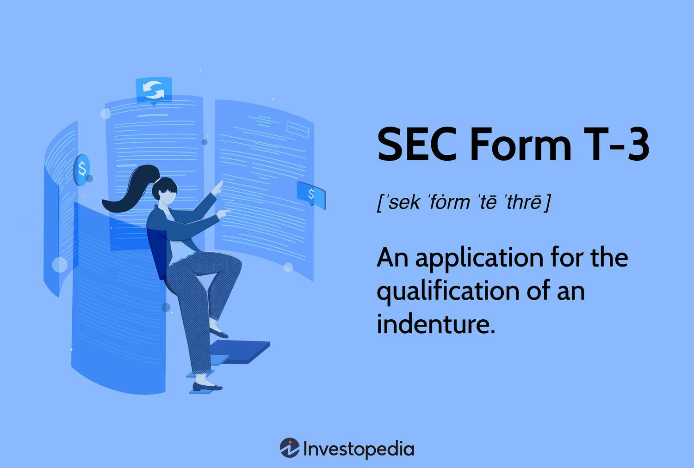

Understanding SEC Form T-3 is crucial for companies planning to offer debt securities to the public. This form acts as a pivotal component in the process of a registration statement filed with the Securities and Exchange Commission (SEC). It is specifically intended to qualify indentures as indispensable elements in the issuance of public debt securities. Ensuring compliance with regulatory frameworks such as the Trust Indenture Act of 1939, SEC Form T-3 aids in safeguarding the interests of bondholders by stipulating essential protective measures.

Filing this form is mandatory for corporations and government entities planning such offerings, although certain exemptions do exist. Comprehensively understanding the form involves knowing its purpose, the detailed information it provides regarding the debt securities, and the structuring of the trust indenture and offering terms. This ensures transparency and adherence to stringent compliance requirements.



Moreover, the information disclosed in SEC Form T-3 also has implications for algorithmic trading, as it provides vital data that can inform automated trading decisions. Traders can leverage this detailed information to adjust strategies in response to current market conditions and regulatory standards.

This article will guide you through the core purposes of SEC Form T-3, highlight the essential components within its framework, and offer insights into the preparation, filing, and review processes. Additionally, we will examine the impact of SEC Form T-3 disclosures on algorithmic trading strategies, illustrating how such data can be pivotal for traders and investors in the public debt market.

## Table of Contents

## What is SEC Form T-3?

SEC Form T-3 is a regulatory document used to apply for the qualification of an indenture, which is critical for companies planning to offer debt securities to the public. This form is a requirement under the Trust Indenture Act of 1939. The Act aims to protect the interests of bondholders by ensuring that debt agreements, or indentures, meet specific legal standards. These standards are designed to establish a legal framework that defines the rights and responsibilities of both bond issuers and bondholders.

The Trust Indenture Act of 1939 mandates that any entity issuing public debt securities must qualify the indenture associated with their issuance, barring certain exemptions. SEC Form T-3 facilitates this process by ensuring that issuers disclose comprehensive and relevant information about the indenture and the security issuance process. This requirement underscores the importance of regulatory adherence, even in cases of exempt securities offerings. Such exemptions might include securities offered by specific governmental bodies or certain private placements, but even these scenarios are subject to particular conditions that still necessitate elements of compliance.

By mandating SEC Form T-3, the SEC ensures that investors are afforded protection through the enforcement of transparency and the integrity of financial disclosures. This is vital in maintaining investor confidence and protecting the market from potential abuses. The form's enforcement serves as a commitment by issuers to adhere to regulations and provide potential investors with all necessary details, thereby facilitating informed investment decisions.

In summary, SEC Form T-3 is pivotal in maintaining the orderly offer and sale of debt securities to the public, ensuring that both the interests of the issuing entities and the protection of investors are adequately addressed within a regulated framework.

## Purpose of SEC Form T-3

SEC Form T-3 serves an essential function by ensuring that issuers provide complete transparency regarding the debt securities they intend to offer to the public. The form encapsulates detailed information about several critical aspects of the offering.

Firstly, the form requires issuers to disclose comprehensive details about themselves, including their business and financial status. This information allows potential investors to evaluate the issuer's credibility and financial health, which are crucial factors in assessing the risk associated with the securities being offered. The inclusion of such detailed issuer information in Form T-3 aligns with the Securities and Exchange Commission's (SEC) overarching goal of protecting investors by ensuring they have access to all necessary information before making investment decisions.

Secondly, SEC Form T-3 provides specific details about the trust indenture. A trust indenture is a legal contract between the bond issuer and the bondholders, governed by the Trust Indenture Act of 1939. This agreement outlines the responsibilities of the issuer, the rights of the bondholders, and the role of the trustee in protecting these rights. By requiring this information, Form T-3 ensures there is a clear understanding of the legal framework governing the debt issuance, which helps maintain investor confidence and market integrity.

Moreover, the form includes crucial terms of the offering, such as interest rates, maturity dates, and redemption conditions. These details enable investors to fully comprehend the potential returns and risks associated with the securities. Having access to such information is fundamental for investors to make informed decisions.

By completing and submitting Form T-3, issuers not only comply with regulatory mandates but also demonstrate their commitment to transparency and good governance. This transparency builds trust among investors, which can facilitate a smoother offering process and potentially lower the cost of capital.

In summary, SEC Form T-3 is pivotal for maintaining transparency in public debt offerings. Through its detailed disclosure requirements, it empowers investors with the necessary information to make educated investment choices and ensures that the issuers meet their regulatory obligations.

## Who Needs to File SEC Form T-3?

SEC Form T-3 is a crucial requirement for any corporation or government entity intending to issue debt securities to the public. This filing obligation ensures that comprehensive information regarding the debt offering is disclosed not only to the Securities and Exchange Commission (SEC) but also to potential investors, thereby promoting transparency and investor protection.

The form is fundamentally a tool for regulatory compliance, mandating detailed disclosures which encompass the issuer's identity, the terms and conditions of the securities, and critical details about the trust indenture governing the offering. The necessity to file SEC Form T-3 applies universally to public offerings of debt securities; however, there are specific exemptions. Notably, these exemptions are narrowly defined and typically pertain to securities that are otherwise regulated at a federal level, such as certain municipal bonds that may benefit from this relief under their unique regulatory frameworks.

While the general requirement for filing is clear-cut, the exemptions underscore the importance of understanding the legal and regulatory nuances associated with debt offerings. For issuers, ensuring accurate compliance requires not only a thorough grasp of these exemptions but also a strategic approach to financial and legal disclosure practices. This commitment to regulatory adherence serves to enhance market integrity and build investor confidence, providing a structured pathway for entities to engage capital markets effectively.

## Key Components of SEC Form T-3

SEC Form T-3 is integral to the issuance of debt securities, as it requires comprehensive documentation to protect investors and ensure compliance with the Trust Indenture Act of 1939. The form is structured into several key sections that collectively provide a detailed snapshot of the offering's nature and the issuer's obligations.

**General Information**: This section captures the foundational details of the issuer, including its legal name, principal business address, and organizational structure. It sets the stage for transparency by offering a clear picture of the entity behind the debt issuance.

**Securities Act Exemption**: Here, issuers must specify whether an exemption from Securities Act registration is claimed. If an exemption is asserted, the issuer needs to provide the basis for such a claim, ensuring that all legislative guidelines are met while acknowledging any deviations.

**Affiliates**: Disclosure of affiliates is essential in evaluating potential conflicts of interest and understanding the influence these relationships may pose on the company’s operations and governance. This section demands information about any entity that controls, is controlled by, or is under common control with the issuer.

**Directors and Officers**: The form requires a detailed account of the issuer’s management team. This includes names, addresses, positions held, and relevant biographical information for each director and officer. Such disclosures are vital for assessing the leadership's credibility and experience.

**Underwriters**: SEC Form T-3 necessitates identification of any underwriting parties involved in the offering process. Information about their operations, compensation, and potential conflicts of interest must be disclosed. This helps investors evaluate the integrity of the underwriting process.

**Bond Classification**: Detailed categorization of the bonds being offered is required, including interest rates, maturity dates, and conversion terms if applicable. This section provides potential investors with essential attributes of the debt securities, aiding in investment analysis and decision-making.

Each section within Form T-3 serves the dual purpose of informing potential investors and meeting regulatory mandates. By ensuring thorough and accurate completion of these sections, issuers can facilitate a transparent and orderly investment process, ultimately fostering investor confidence in public debt offerings.

## Preparing and Filing SEC Form T-3

Preparing and filing SEC Form T-3 requires meticulous attention to detail and understanding of regulatory obligations. This process involves gathering comprehensive data about the securities being offered, the issuer, and ensuring strict compliance with pertinent SEC regulations and requirements.

### Preparation for Filing SEC Form T-3

The preparation phase includes collecting and organizing information related to the offering and issuer. Key elements include:

1. **Issuer Information**: Detailed information about the issuer, such as corporate structure, creditworthiness, financial history, and any existing obligations or liabilities.

2. **Securities Details**: Specific information about the debt securities being offered, including bond type, amount, interest rates, maturity, and any special features or conditions attached to the securities.

3. **Compliance Documentation**: Documentation demonstrating compliance with legal and regulatory requirements, with special attention to the Trust Indenture Act of 1939. This includes legal opinions, exemptions, and disclosures pertinent to the offering.

4. **Trust Indenture Analysis**: Description and analysis of the trust indenture, identifying the roles and responsibilities of trustees and ensuring that all required protection mechanisms for bondholders are in place.

### Filing Process

Filing SEC Form T-3 must adhere to strict deadlines and regulatory standards. The steps for successful filing involve:

1. **Compilation of Supporting Documentation**: Ensure that all required schedules, financial statements, and supplementary exhibits are prepared accurately and thoroughly. This includes audited financial statements, contracts, and any other material agreements associated with the offering.

2. **SEC Submission Deadlines**: Adherence to SEC timelines is crucial. Issuers must ensure timely submissions to avoid penalties or delays in the public offering process.

3. **Use of Electronic Filing Systems**: The mandatory use of the SEC’s Electronic Data Gathering, Analysis, and Retrieval (EDGAR) system for submissions. Proper formatting and validation checks must be conducted before submission to prevent rejection by the system.

4. **Professional Guidance and Compliance**: Due to the complexity of the form and the regulatory scrutiny involved, professional advice from legal counsels, financial advisors, or compliance experts is often sought. These professionals assist in ensuring that all filing components meet the SEC regulatory standards and to strategize responses to any potential queries from the SEC.

5. **Amendments and Revisions**: Be prepared for possible revisions or amendments based on feedback from the SEC review and comment process. The iterative nature of this process calls for efficient management of any necessary changes to the form, documentation, or disclosures.

By meticulously preparing the required documentation and engaging with experts, issuers can navigate the complex process of filing SEC Form T-3, facilitating a smoother path to a compliant public debt securities offering.

## SEC Review and Comment Process

The SEC review and comment process plays a crucial role in ensuring that SEC Form T-3 submissions adhere to relevant laws and regulations while providing sufficient disclosure to investors. Upon submission of the form, the Securities and Exchange Commission (SEC) undertakes a detailed examination to confirm compliance with the Trust Indenture Act of 1939 and other pertinent securities laws. The primary objective of this review is to enhance transparency and protect investor interests by ensuring the accuracy and completeness of the information provided.

During the review process, the SEC may identify areas within the Form T-3 or its accompanying documentation that require clarification or additional detail. In such cases, the SEC issues comments or requests for further information to the issuer. It is imperative for issuers to promptly address these comments, as the SEC expects timely and comprehensive responses. The prompt and efficient handling of SEC comments can significantly influence the timeline and success of the debt offering process.

The iterative nature of the review and comment process facilitates an ongoing dialogue between the SEC and the issuer. This continuous interaction often leads to multiple rounds of feedback and revisions intended to refine the registration statement. Through this process, issuers can ensure that all disclosures related to the offering are clear, accurate, and complete, ultimately benefiting potential investors by providing them with the necessary information to make informed decisions.

Overall, the SEC review and comment process serves as an essential checkpoint within the regulatory framework, fostering transparency and accuracy in the disclosure of debt securities offerings. It underscores the importance of thorough preparation and responsiveness on the part of issuers to meet regulatory standards and uphold investor confidence.

## Role of Financial Statements in SEC Form T-3

Financial statements serve as an integral component of SEC Form T-3, offering critical insights into an issuer's financial health and stability. These statements are pivotal in the registration process as they provide potential investors with a transparent and detailed picture of financial risks and opportunities associated with the debt securities being offered.

The inclusion of financial statements in SEC Form T-3 involves the disclosure of various financial documents, such as balance sheets, income statements, cash flow statements, and statements of shareholders' equity. These documents collectively present a comprehensive view of the issuer's financial performance and condition. By examining these statements, investors can assess the issuer's ability to meet its financial obligations, the potential for future growth, and the overall financial stability.

Accurate and transparent financial disclosures are essential in fostering trust and confidence among investors. They ensure that investors have access to reliable information, reducing information asymmetry between the issuer and the investor. This transparency is crucial for making informed investment decisions and for facilitating the proper functioning of capital markets.

Failure to provide accurate financial statements or any misleading financial reporting can lead to significant repercussions for issuers, including regulatory penalties and loss of investor confidence. Therefore, the preparation of these documents often requires the involvement of qualified financial professionals, auditors, and compliance experts to ensure adherence to regulatory standards and accounting principles.

In summary, financial statements within SEC Form T-3 are not merely optional disclosures but rather essential elements that underpin investor trust and market integrity. They play a fundamental role in the decision-making process of investors and contribute to the overall transparency and efficiency of public debt offerings.

## Using SEC Form T-3 in Algorithmic Trading Strategies

SEC Form T-3 plays a pivotal role in [algorithmic trading](/wiki/algorithmic-trading) by offering critical data essential for making automated trading decisions. This form encompasses detailed information about debt securities, issuer financials, and regulatory compliance, all of which can significantly influence trading strategies. Algorithmic traders can leverage the insights from SEC Form T-3 to optimize their trading models and assess investment opportunities more accurately.

One of the primary ways that SEC Form T-3 aids algorithmic trading is through its comprehensive financial disclosures. These disclosures allow trading bots to evaluate the financial stability and risk profile of the issuer. This input can be vital for algorithms engaged in quantifying risk or in performing predictive modeling. For instance, using Python's data processing libraries like Pandas, trading algorithms can extract and analyze datasets from SEC Form T-3 filings to determine the creditworthiness and overall financial health of the issuer. Here's a basic example of how such data could be analyzed using Python:

```python
import pandas as pd

# Assume 'financial_data.csv' contains parsed SEC Form T-3 financial data
data = pd.read_csv('financial_data.csv')

# Calculate metrics like debt-to-equity ratio
data['Debt_to_Equity'] = data['Total_Liabilities'] / data['Shareholder_Equity']

# Analyze key financial indicators
anomalies = data[data['Debt_to_Equity'] > threshold].index.tolist()

print(f"Issuers with high debt-to-equity ratio: {anomalies}")
```

These insights facilitate the refinement of trading algorithms, enabling them to comply with market regulations and adapt to changing market conditions. Moreover, understanding the disclosures in SEC Form T-3, particularly those that relate to bond covenants and indenture agreements, can help algorithms in constructing strategies that anticipate potential price movements precipitated by covenant violations or changes in indenture terms.

Furthermore, the regulatory information provided in Form T-3 can ensure that trading models remain compliant with mandatory legal standards, dramatically reducing the risk of executing trades on misrepresented securities. This safety net is vital for maintaining a rational and orderly market, particularly in automated environments where trades occur at high frequencies.

In summary, by incorporating data from SEC Form T-3, algorithmic trading strategies can be adjusted for improved accuracy and efficiency, allowing traders to capitalize on under-explored opportunities while adhering to essential regulatory frameworks.

## Conclusion

Navigating the SEC Form T-3 process is vital for ensuring compliant and transparent public debt offerings. By adhering to its comprehensive requirements, both issuers and investors gain a thorough understanding of the nature and specifics of the securities involved. This form serves as a critical tool in facilitating informed decision-making, offering detailed insights into the financial health of the issuer, the conditions of the securities, and the essential terms prescribed by the Trust Indenture Act of 1939.

Algorithmic traders, in particular, can significantly benefit from the extensive data provided in SEC Form T-3. The detailed disclosures allow for more robust and data-driven trading strategies. By analyzing the financial statements and other critical information detailed in the form, trading algorithms can dynamically adjust to market conditions, optimizing for regulatory compliance and market analysis.

For algorithmic trading strategies, critical data points such as issuer's financial stability, securities classification, and market conditions can be extracted, enabling algorithms to make more informed predictions and trading decisions. For example, Python scripts utilizing libraries like pandas and numpy can be leveraged to process the financial data contained within Form T-3, facilitating real-time market analysis and decision-making:

```python
import pandas as pd
import numpy as np

# Example code to process a sample financial dataset
def analyze_financial_data(financial_data):
    df = pd.DataFrame(financial_data)
    trends = df.groupby('year').agg({'profit': 'sum', 'debt': 'sum'})
    trends['debt_ratio'] = trends['debt'] / trends['profit']
    return trends

# Sample data input
financial_data = {
    'year': [2020, 2021, 2022],
    'profit': [50000, 60000, 75000],
    'debt': [20000, 25000, 30000]
}

# Running the analysis
result = analyze_financial_data(financial_data)
print(result)
```

Through such analytical tools, traders and financial analysts can simulate scenarios, assess risk levels, and predict future financial outcomes, thereby enhancing their market strategies. Understanding and leveraging the robust data contained within SEC Form T-3 not only ensures compliance but can also provide a competitive edge in the rapidly evolving landscape of algorithmic trading.

## References & Further Reading

[1]: United States Securities and Exchange Commission. ["Trust Indenture Act of 1939"](https://www.sec.gov/rules-regulations/staff-guidance/compliance-disclosure-interpretations/trust-indenture-act-1939)

[2]: Securities and Exchange Commission. ["EDGAR—Search and Access"](https://www.sec.gov/search-filings)

[3]: Hunt, B. (2020). ["The Trust Indenture Act of 1939: A Valuation Perspective"](https://www.jstor.org/stable/3158540?googleloggedin=true) SSRN Electronic Journal.

[4]: Lopez de Prado, M. (2018). ["Advances in Financial Machine Learning."](https://www.amazon.com/Advances-Financial-Machine-Learning-Marcos/dp/1119482089) Wiley.

[5]: Securities and Exchange Commission. ["Form T-3, Application for Qualifications of Indentures"](https://www.sec.gov/files/formt-3.pdf)