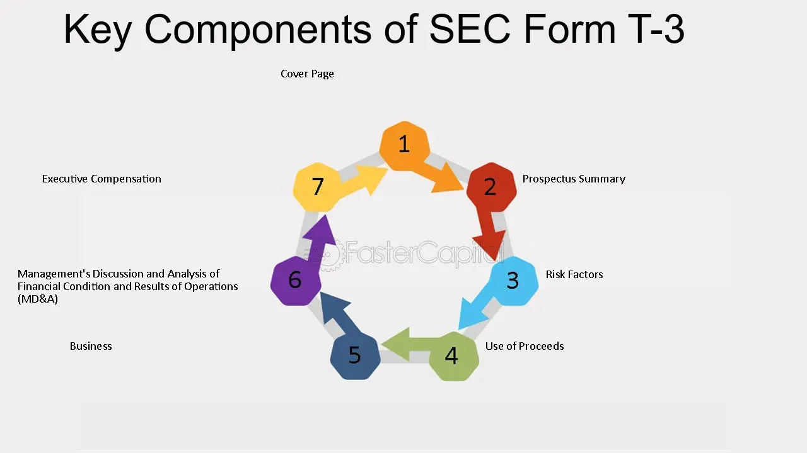

## Table of Contents

## What is SEC Form T-3?

SEC Form T-3 is a document used by companies to register certain types of securities with the U.S. Securities and Exchange Commission (SEC). It is specifically used for trust indentures, which are agreements between a company issuing bonds and the bondholders. This form helps ensure that the company follows the rules and protects the rights of the bondholders.

When a company wants to issue bonds, they need to file Form T-3 to make sure everything is legal and transparent. The form includes important details about the bond issue, like the terms of the trust indenture, the rights of the bondholders, and how the bond will be managed. By filing this form, the company shows that it is following the law and being open with investors about the bond offering.

## Who is required to file SEC Form T-3?

Companies that want to issue bonds and need a trust indenture have to file SEC Form T-3. A trust indenture is like a contract that protects the people who buy the bonds. It makes sure the company follows certain rules and treats bondholders fairly. So, if a company is planning to issue bonds and needs this kind of agreement, they must use Form T-3 to register it with the SEC.

Filing Form T-3 is important because it helps keep things honest and clear. It tells the SEC and potential investors all about the bond issue, including the terms of the trust indenture and the rights of the bondholders. This way, everyone knows what they are getting into, and the company shows it is playing by the rules.

## What is the purpose of filing SEC Form T-3?

The main reason for filing SEC Form T-3 is to make sure that a company follows the rules when they want to issue bonds. When a company wants to sell bonds, they need a special agreement called a trust indenture. This agreement protects the people who buy the bonds by setting clear rules that the company must follow. By filing Form T-3, the company registers this agreement with the SEC, showing that they are doing everything by the book.

Filing Form T-3 also helps keep things transparent for investors. It gives them all the important details about the bond issue, like how the bond will work and what rights the bondholders have. This way, investors can make smart choices about whether to buy the bonds. It's all about making sure everyone knows what's going on and that the company is playing fair.

## What are the key components of SEC Form T-3?

SEC Form T-3 has several important parts that help explain the bond issue to the SEC and investors. One key part is the details about the trust indenture, which is like a contract between the company and the bondholders. It lays out the terms of the bond, like how much interest will be paid, when payments are due, and what happens if the company can't pay. This part is crucial because it protects the bondholders by making sure the company follows certain rules.

Another important part of Form T-3 is the information about the bondholders' rights. This section tells investors what they can expect if they buy the bonds, like what happens if the company wants to change the terms or if they need to vote on something. It's all about keeping things clear and fair for everyone involved. By including this information, Form T-3 helps investors make informed decisions and ensures the company is open and honest about the bond issue.

## How does SEC Form T-3 differ from other SEC forms?

SEC Form T-3 is different from other SEC forms because it is specifically for registering trust indentures related to bond issues. Unlike forms like the S-1, which companies use to register securities like stocks for an initial public offering (IPO), Form T-3 focuses on the agreement between the company issuing bonds and the bondholders. This form makes sure that the terms of the bond are clear and that the bondholders' rights are protected, which is not the main focus of other forms.

While other forms might be used for different types of securities or for different purposes, like Form 10-K for annual reports or Form 8-K for significant events, Form T-3 is all about the trust indenture. It's important because it helps keep the bond issue transparent and legal, ensuring that the company follows the rules and that investors know exactly what they are getting into when they buy the bonds.

## What are the filing deadlines for SEC Form T-3?

There isn't a specific deadline for filing SEC Form T-3 like there is for some other SEC forms. Instead, companies need to file Form T-3 before they can issue the bonds. This means they have to get everything ready and submit the form to the SEC before they start selling the bonds to investors.

The reason for this is to make sure that the trust indenture, which is the agreement between the company and the bondholders, is all set and approved by the SEC. By filing Form T-3 on time, the company shows that they are following the rules and being open with investors about the bond issue.

## How can one access SEC Form T-3 filings?

You can access SEC Form T-3 filings on the SEC's official website, which is called EDGAR (Electronic Data Gathering, Analysis, and Retrieval system). Just go to the SEC's website and use the search tool to look for the company you're interested in. Type in the company's name and choose the right form, which in this case is Form T-3. The website will show you a list of all the Form T-3 filings for that company, and you can click on them to read the details.

Some other websites also offer access to SEC filings, but the SEC's EDGAR system is the most reliable and official source. These other websites might make it easier to search or give you extra tools, but always check the information against what's on the SEC's website to make sure it's correct. By using these resources, you can stay informed about a company's bond issues and trust indentures.

## What are common mistakes to avoid when filing SEC Form T-3?

When filing SEC Form T-3, one common mistake to avoid is not providing all the required information about the trust indenture. This agreement is really important because it sets the rules for the bond issue and protects the bondholders. If you leave out details like the interest rate, payment dates, or what happens if the company can't pay, the SEC might not approve your filing. It's like trying to build a house without all the pieces—you need everything to make it work right.

Another mistake to watch out for is not being clear about the bondholders' rights. The form should explain what rights the people who buy the bonds have, like voting on changes or what happens if the company wants to do something different. If this part is confusing or missing, investors won't know what they're getting into, and the SEC might send the filing back. It's all about being open and honest so everyone understands the deal.

## How has SEC Form T-3 evolved over time?

SEC Form T-3 has changed over the years to keep up with new laws and make things easier for companies and investors. When it first came out, it was a basic form that companies used to register trust indentures for bond issues. But as time went on, the SEC added more rules to make sure that companies were being clear and fair with bondholders. This meant that Form T-3 had to include more details about the bond issue, like the terms of the trust indenture and the rights of the bondholders.

Today, Form T-3 is more detailed and easier to use because of technology. Companies can now file the form online through the SEC's EDGAR system, which makes the process faster and more accessible. The form still focuses on protecting bondholders, but it's been updated to include clearer instructions and more space for important information. This way, both the company and the investors can understand the bond issue better, making the whole process smoother and more transparent.

## What are the penalties for non-compliance with SEC Form T-3 filing requirements?

If a company doesn't file SEC Form T-3 properly or on time, they could face some serious penalties. The SEC might stop them from issuing the bonds until they fix the problem. This can cause big delays and might even make investors lose trust in the company. Plus, the SEC could fine the company for breaking the rules. These fines can be really expensive and can hurt the company's reputation.

On top of that, if the company keeps messing up with their filings, the SEC could take even stronger action. They might start an investigation, which could lead to more fines or even legal action against the company or its leaders. It's really important for companies to follow the rules and file Form T-3 correctly to avoid these problems and keep everything running smoothly.

## Can SEC Form T-3 be amended, and if so, how?

Yes, SEC Form T-3 can be amended if there are changes or mistakes that need to be fixed. If a company finds out that something on the form is wrong or if something about the bond issue changes, they need to file an amendment. This is done by submitting a new Form T-3 with the updated information. The amendment has to be filed with the SEC before the company can move forward with the bond issue.

To file an amendment, the company uses the same EDGAR system they used for the original filing. They just need to make sure they clearly mark the new form as an amendment and explain what has changed. This way, the SEC and investors can see the updated details and make sure everything is still okay with the bond issue. Keeping the form up to date helps keep everything honest and clear for everyone involved.

## What strategic considerations should companies keep in mind when preparing SEC Form T-3?

When preparing SEC Form T-3, companies should think about how to make the trust indenture clear and fair for bondholders. This means they need to be very detailed about the terms of the bond, like the interest rate, payment dates, and what happens if the company can't pay. By being clear, the company can build trust with investors and make sure everyone understands the deal. It's also important to think about the bondholders' rights and make sure those are well-explained in the form. If the rights are not clear, investors might not want to buy the bonds, which could hurt the company's ability to raise money.

Another thing to consider is timing. Companies should file Form T-3 well before they plan to issue the bonds. This gives them time to fix any mistakes or make changes if the SEC asks for them. Rushing the filing can lead to errors or delays, which can be costly. Also, companies should think about how the bond issue fits into their overall financial strategy. They need to make sure that issuing bonds is the best way to raise money at that time and that they can meet the terms of the bond without putting too much strain on their finances.

## References & Further Reading

[1]: United States Securities and Exchange Commission. ["Trust Indenture Act of 1939"](https://www.sec.gov/rules-regulations/staff-guidance/compliance-disclosure-interpretations/trust-indenture-act-1939)

[2]: Securities and Exchange Commission. ["EDGAR—Search and Access"](https://www.sec.gov/search-filings)

[3]: Hunt, B. (2020). ["The Trust Indenture Act of 1939: A Valuation Perspective"](https://www.jstor.org/stable/3158540?googleloggedin=true) SSRN Electronic Journal.

[4]: Lopez de Prado, M. (2018). ["Advances in Financial Machine Learning."](https://www.amazon.com/Advances-Financial-Machine-Learning-Marcos/dp/1119482089) Wiley.

[5]: Securities and Exchange Commission. ["Form T-3, Application for Qualifications of Indentures"](https://www.sec.gov/files/formt-3.pdf)