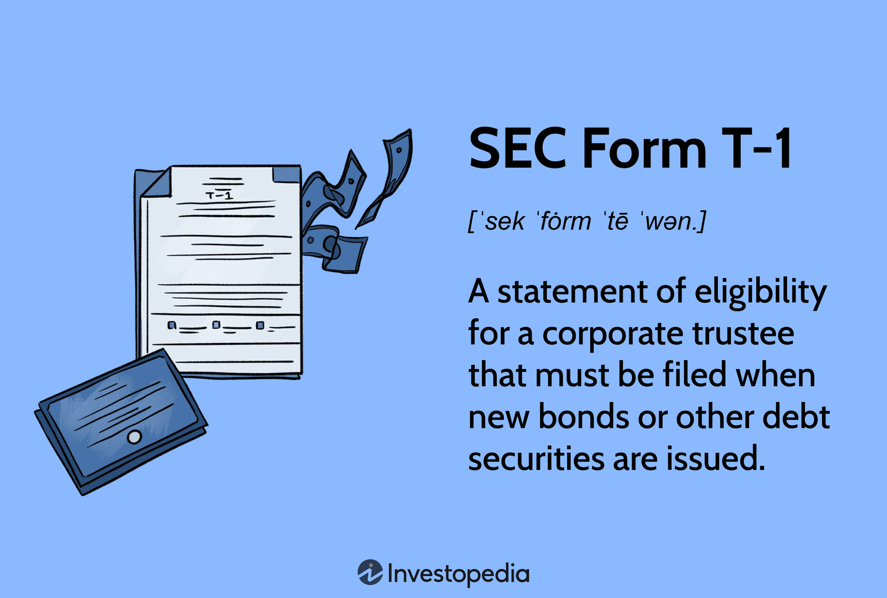

## Table of Contents

## What is SEC Form T-1?

SEC Form T-1 is a document that companies need to file with the U.S. Securities and Exchange Commission (SEC) when they want to issue certain types of securities. These securities are usually debt securities, like bonds, that are backed by specific assets. The form helps the SEC make sure that the company is following the rules and that the securities are being offered fairly to investors.

Filing Form T-1 is important because it gives the SEC the information they need to approve the securities. The form includes details about the securities, the assets backing them, and the company issuing them. By reviewing this information, the SEC can protect investors and maintain trust in the financial markets.

## Who needs to file SEC Form T-1?

Companies need to file SEC Form T-1 when they want to issue certain types of securities, specifically debt securities like bonds that are backed by assets. This form is important because it helps the SEC make sure that the company is following the rules and that the securities are being offered fairly to investors.

Filing Form T-1 is a key step in getting approval from the SEC for these securities. The form includes important details about the securities, the assets backing them, and information about the company issuing them. By reviewing this information, the SEC can protect investors and keep the financial markets trustworthy.

## What is the purpose of filing SEC Form T-1?

The purpose of filing SEC Form T-1 is to get approval from the SEC when a company wants to issue certain types of securities, like bonds that are backed by assets. This form helps the SEC check if the company is following the rules and if the securities are being offered fairly to investors.

By filing Form T-1, companies provide the SEC with important details about the securities, the assets backing them, and information about the company itself. This helps the SEC make sure that everything is in order, protecting investors and keeping the financial markets trustworthy.

## What information is required on SEC Form T-1?

SEC Form T-1 requires companies to give details about the securities they want to issue. This includes information about the type of securities, like bonds, and how much they plan to issue. The form also needs details about the assets that back these securities. These assets could be things like loans or other financial instruments. The company has to explain how these assets will support the securities.

The form also asks for information about the company itself. This includes the company's name, address, and details about its business. The SEC wants to know who is behind the company and how they plan to use the money they raise from the securities. By providing all this information, the company helps the SEC check if everything is fair and follows the rules.

## How does one obtain SEC Form T-1?

To get SEC Form T-1, you can visit the U.S. Securities and Exchange Commission's official website. On the website, look for the section called "Forms and Filings." There, you will find a list of all the forms the SEC uses. Click on the link for Form T-1, and you can download it as a PDF file. This way, you can easily access the form and start filling it out.

If you prefer, you can also ask for a copy of Form T-1 by contacting the SEC directly. You can call their main office or send them an email asking for the form. They will be able to send you the form or guide you on how to download it from their website. Either way, getting the form is simple and straightforward.

## What are the deadlines for filing SEC Form T-1?

When a company wants to issue securities backed by assets, they need to file SEC Form T-1. There is no specific deadline for filing this form. Instead, companies should file it well before they plan to issue the securities. This gives the SEC enough time to review the form and make sure everything is okay.

The SEC needs time to check all the details on Form T-1. If companies wait until the last minute, it might delay the approval process. So, it's a good idea to file Form T-1 early, maybe a few weeks or even a month before the securities are set to be issued. This helps everything go smoothly and avoids any last-minute problems.

## Are there any fees associated with filing SEC Form T-1?

Yes, there are fees when you file SEC Form T-1. The fee depends on how much money the company wants to raise with the securities. The SEC has a fee rate that they use to figure out the exact amount. You can find this rate on the SEC's website, and it changes from time to time.

To calculate the fee, you multiply the total amount of securities by the current fee rate. For example, if a company wants to issue securities worth $1 million and the fee rate is 0.00875%, the fee would be $875. It's important to check the latest fee rate on the SEC's website before you file Form T-1 to make sure you pay the right amount.

## What are the common mistakes to avoid when filing SEC Form T-1?

When filling out SEC Form T-1, one common mistake is not providing all the required information. The form asks for details about the securities, the assets backing them, and information about the company. If any of these details are missing or incomplete, the SEC might reject the filing. It's important to double-check everything to make sure all the sections are filled out correctly.

Another mistake to watch out for is not filing the form early enough. The SEC needs time to review the form, and if it's submitted too close to when the securities are supposed to be issued, it can cause delays. It's a good idea to file Form T-1 well in advance, maybe a few weeks or a month before the securities are set to be issued. This gives the SEC enough time to look over everything and approve the securities without any last-minute issues.

## How does the SEC review and process Form T-1 submissions?

When a company files SEC Form T-1, the SEC starts by checking if all the required information is there. They look at details about the securities, the assets backing them, and information about the company. If anything is missing or not clear, the SEC might ask the company to fix it or provide more details. This part of the process is important because it makes sure that everything is correct and complete before moving forward.

Once the form is complete, the SEC reviews it to make sure the company is following the rules and that the securities are being offered fairly to investors. They look at how the assets will support the securities and check if the company's plans are reasonable. If everything looks good, the SEC will approve the securities, and the company can go ahead with issuing them. This careful review helps protect investors and keeps the financial markets trustworthy.

## What are the consequences of failing to file SEC Form T-1 on time?

If a company doesn't file SEC Form T-1 on time, it can cause big problems. The SEC needs this form to check if the securities are okay to be sold. If the form is late, the SEC might not have enough time to review it before the securities are supposed to be issued. This can delay the whole process, and the company might not be able to sell the securities when they planned to. This delay can be frustrating and can hurt the company's plans.

Not filing on time can also lead to fines or other penalties from the SEC. The SEC takes these rules seriously because they want to protect investors and keep the markets fair. If a company doesn't follow the rules, they might have to pay money or face other consequences. It's important for companies to file Form T-1 early enough so the SEC has time to review it and avoid any trouble.

## How can amendments be made to an already filed SEC Form T-1?

If a company needs to make changes to an already filed SEC Form T-1, they can do this by filing an amendment. This means they need to fill out a new form that shows the changes they want to make. The company should clearly explain what parts of the original form they are changing and why. They can do this by marking the new form as an amendment and including all the updated information.

The SEC will then review the amendment just like they did with the original form. They will check to make sure the changes are correct and that the company is still following all the rules. If everything looks good, the SEC will approve the amendment, and the updated information will be used for the securities. It's important for companies to file amendments quickly if they need to make changes, so the SEC has enough time to review them and avoid any delays.

## What are the best practices for managing SEC Form T-1 filings in a corporate setting?

In a corporate setting, it's important to start preparing SEC Form T-1 well before the securities need to be issued. This gives the team enough time to gather all the needed information about the securities, the assets backing them, and details about the company. It's a good idea to have a checklist to make sure nothing is missed. Assigning specific people to handle different parts of the form can help keep things organized. Also, using a calendar to keep track of important dates can help avoid any last-minute rush.

Once the form is ready, it's helpful to have someone else review it to catch any mistakes or missing information. Double-checking all the details can save a lot of time later. After filing, keep an eye on any feedback from the SEC and be ready to make amendments if needed. Good communication within the team and with the SEC is key. By staying organized and planning ahead, companies can manage their SEC Form T-1 filings smoothly and avoid any problems.

## References & Further Reading

For detailed guidance on SEC Form T-1 and algorithmic trading regulations, consulting the SEC's official resources and publications is essential. The SEC provides extensive documentation and updates on their website, including guidelines, rule filings, and educational materials that are critical for understanding the nuances of financial regulation.

Keeping abreast of changes in financial regulatory environments can be aided by continuous learning from industry experts and legal advisors. Financial professionals often benefit from attending webinars, industry conferences, and workshops that focus on regulatory updates and advanced trading strategies. Additionally, subscribing to industry journals and regulatory bodies' newsletters can provide timely information and insights into the evolving landscape of financial regulation.

Legal firms and consulting agencies specializing in financial services also offer whitepapers and reports that delve into specific aspects of regulatory compliance and algorithmic trading. Engaging with these experts can provide practical advice and strategies for navigating complex regulatory requirements.

Adopting a proactive approach to learning can significantly enhance a firm's ability to adapt to changes, ensuring compliance and maintaining a competitive edge in the ever-changing financial markets.

