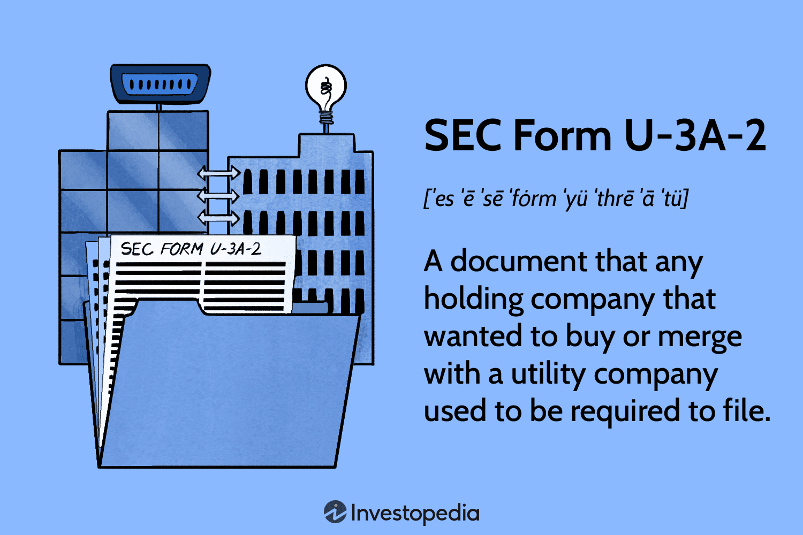

## Table of Contents

## What is SEC Form U-3A-2?

SEC Form U-3A-2 is a document used by companies to request an exemption from certain rules of the Public Utility Holding Company Act of 1935. This act was created to regulate and oversee companies that own utilities like electricity and gas. By filing this form, a company can ask the Securities and Exchange Commission (SEC) to be excused from some of the regulations that apply to public utility holding companies.

The form is important because it helps companies that might be struggling under strict regulations to continue operating more freely. When a company fills out Form U-3A-2, it must provide detailed information about its business and explain why it needs the exemption. The SEC then reviews this information to decide whether to grant the exemption, helping to balance regulatory control with the needs of the company.

## Who is required to file SEC Form U-3A-2?

Companies that own or control utilities like electricity and gas might need to file SEC Form U-3A-2. These companies are called public utility holding companies. If they want to be excused from some of the rules set by the Public Utility Holding Company Act of 1935, they need to use this form. The rules can be tough, so some companies ask for an exemption to make it easier to run their business.

To file Form U-3A-2, a company must give a lot of information about what they do and why they need the exemption. The Securities and Exchange Commission, or SEC, looks at this information to decide if the company can be excused from the rules. This helps the SEC make sure that the rules are fair and that companies can still operate well.

## What is the purpose of filing SEC Form U-3A-2?

The purpose of filing SEC Form U-3A-2 is to ask the Securities and Exchange Commission (SEC) for an exemption from some rules of the Public Utility Holding Company Act of 1935. This act sets strict regulations for companies that own utilities like electricity and gas. By filing this form, a company can explain why it needs to be excused from these rules, which can be tough to follow.

When a company fills out Form U-3A-2, it gives detailed information about its business and the reasons it needs the exemption. The SEC then reviews this information to decide if the company should be allowed to operate under less strict rules. This process helps balance the need for regulation with the needs of the company, making sure that businesses can still run smoothly while following important laws.

## How often must SEC Form U-3A-2 be filed?

SEC Form U-3A-2 does not need to be filed on a regular schedule. Instead, a company only files this form when it wants to ask for an exemption from some rules of the Public Utility Holding Company Act of 1935. This means that a company might file it once if it needs the exemption, and there's no need to file it again unless something changes and they need another exemption.

The form is used by companies that own utilities like electricity and gas. These companies might find the rules too hard to follow and want to be excused from some of them. When they file Form U-3A-2, they explain why they need the exemption, and the SEC looks at their request to decide if it's okay to let them follow fewer rules.

## What are the key components of SEC Form U-3A-2?

SEC Form U-3A-2 has several important parts that a company needs to fill out when asking for an exemption from some rules of the Public Utility Holding Company Act of 1935. The form starts with basic information about the company, like its name, address, and the type of business it does. This helps the Securities and Exchange Commission (SEC) understand who is asking for the exemption. The company also needs to give a clear reason for wanting the exemption, explaining why the rules are too hard to follow and how being excused from them would help their business.

The next part of the form includes detailed information about the company's operations, finances, and any other businesses it might own. This section is important because it helps the SEC see the full picture of the company's situation. The company must also promise to follow any conditions the SEC might set if the exemption is granted. By providing all this information, the company shows the SEC that it deserves to be excused from some rules so it can keep running smoothly.

## What are the deadlines for filing SEC Form U-3A-2?

There isn't a specific deadline for filing SEC Form U-3A-2. A company files this form when it needs an exemption from some rules of the Public Utility Holding Company Act of 1935. This means a company can file it at any time when it feels the rules are too hard to follow.

Once the form is filed, the Securities and Exchange Commission (SEC) will look at the request. The SEC doesn't have a set time to make a decision, but they will review the information the company gives and decide if the exemption can be granted. This helps make sure companies can still run their business well while following important laws.

## How can one access and submit SEC Form U-3A-2?

To access SEC Form U-3A-2, you can visit the Securities and Exchange Commission's (SEC) official website. Look for the section that has forms and filings. Once you find it, search for Form U-3A-2, which is used by companies that own utilities like electricity and gas to ask for an exemption from some rules. You can download the form from the website and print it out or fill it out electronically if that option is available.

To submit the form, you need to send it to the SEC. You can do this by mailing the completed form to the address listed on the SEC's website. If the SEC allows electronic submissions, you can also send it online through their filing system. Make sure you follow all the instructions carefully and include all the information the form asks for, so the SEC can review your request and decide if they will grant the exemption.

## What are the common mistakes to avoid when filing SEC Form U-3A-2?

When filing SEC Form U-3A-2, one common mistake to avoid is not providing enough detail about why the company needs the exemption. The form asks for a clear reason, so it's important to explain well how the rules are too hard to follow and how being excused from them would help the business. If the explanation is not clear or detailed enough, the SEC might not understand the company's situation and could reject the request.

Another mistake is missing important information about the company's operations, finances, or other businesses it owns. The SEC needs this information to see the full picture and make a fair decision. If any part of the form is left blank or filled out incorrectly, it can delay the process or lead to the exemption being denied. Always double-check the form to make sure all sections are complete and accurate before sending it to the SEC.

## What are the penalties for non-compliance with SEC Form U-3A-2 filing requirements?

If a company does not follow the rules for filing SEC Form U-3A-2, it can face penalties. These penalties can include fines from the Securities and Exchange Commission (SEC). The fines can be a lot of money, depending on how serious the mistake is. The SEC might also take other actions, like ordering the company to fix the problem or even stopping them from doing certain business activities until they follow the rules.

Besides fines, the company's reputation can be hurt. If people find out that a company did not follow the rules, they might not trust the company anymore. This can make it hard for the company to do business and make money. So, it's very important for companies to make sure they file SEC Form U-3A-2 correctly and on time if they need an exemption from the Public Utility Holding Company Act of 1935 rules.

## How does SEC Form U-3A-2 relate to other SEC forms and regulations?

SEC Form U-3A-2 is used by companies that own utilities like electricity and gas to ask for an exemption from some rules of the Public Utility Holding Company Act of 1935. This form is different from other SEC forms because it's not about reporting financial information or changes in the company's structure. Instead, it's about asking the SEC to let the company follow fewer rules. This can help the company run its business more easily, but it still needs to follow other SEC rules and regulations.

Other SEC forms, like Form 10-K or Form 8-K, are used for different purposes. Form 10-K is an annual report that gives a detailed look at a company's financial health and operations. Form 8-K is used to report important events that happen between these annual reports. While these forms are about sharing information with the public and the SEC, Form U-3A-2 is about asking for special permission to not follow some rules. Even if a company gets an exemption using Form U-3A-2, it still needs to file these other forms to stay in line with SEC regulations.

## What recent changes or updates have been made to SEC Form U-3A-2?

There have not been any recent changes or updates to SEC Form U-3A-2. The form is used by companies that own utilities like electricity and gas to ask for an exemption from some rules of the Public Utility Holding Company Act of 1935. Since the form is not filed regularly but only when a company needs an exemption, it does not get updated often. The SEC might make changes to the form if there are new laws or if they want to make the process easier, but no such changes have been made recently.

If you need to file Form U-3A-2, you can find the most current version on the SEC's website. It's important to use the latest version to make sure your request for an exemption is considered. Even though the form itself hasn't changed, the SEC might update their website or the instructions for filing, so always check for the most recent information before you submit your form.

## What advanced strategies can be used to optimize the filing process of SEC Form U-3A-2?

To optimize the filing process of SEC Form U-3A-2, it's important to start by gathering all necessary information well in advance. This means understanding exactly what the form asks for and making sure you have detailed records of your company's operations, finances, and any other businesses you own. By preparing this information ahead of time, you can fill out the form more quickly and accurately. It's also helpful to have a clear and strong reason for why you need the exemption. Spend time writing a good explanation that shows how the rules are too hard to follow and how being excused from them would help your business. This can make your request more convincing to the SEC.

Another strategy is to use technology to help with the filing process. Many companies use software that can help fill out forms and check for mistakes. This can save time and reduce the chance of errors that might delay your request. It's also a good idea to have someone else review your completed form before you send it to the SEC. A fresh set of eyes can catch any mistakes or missing information that you might have missed. Finally, keep up to date with any changes on the SEC's website, as they might update the form or the instructions for filing. By staying informed and using these strategies, you can make the filing process smoother and increase your chances of getting the exemption you need.

## References & Further Reading

[1]: Securities and Exchange Commission. (n.d.). ["SEC Form U-3A-2."](https://www.investopedia.com/terms/s/sec-form-u-3a-2.asp) A guide to reporting standards and requirements for corporate insiders.

[2]: Coffee, J. C. Jr. (1995). ["The Future of Corporate Governance: Adapting the SEC's Disclosure Framework."](https://papers.ssrn.com/sol3/papers.cfm?abstract_id=142833) Securities Regulation Law Journal, 23(1), 1-23.

[3]: Karmel, R. S. (2009). ["Insider Trading: Law and Ethics for Private and Public Sector."](https://scholar.smu.edu/cgi/viewcontent.cgi?article=1062&context=smulr) Review of Securities & Commodities Regulation, 42(15), 1-9.

[4]: ["Securities Exchange Act of 1934, Section 16."](https://www.sec.gov/rules-regulations/staff-guidance/compliance-disclosure-interpretations/exchange-act-section-16-related-rules-forms) The Securities and Exchange Commission's rules on insider trading and disclosure.

[5]: Markham, J. W. (2001). ["A Financial History of the United States: From the Age of Derivatives into the New Millennium."](https://books.google.com/books/about/A_Financial_History_of_the_United_States.html?id=hZ9frnkOTsQC) M.E. Sharpe, providing historical context on financial regulations including PUHCA.