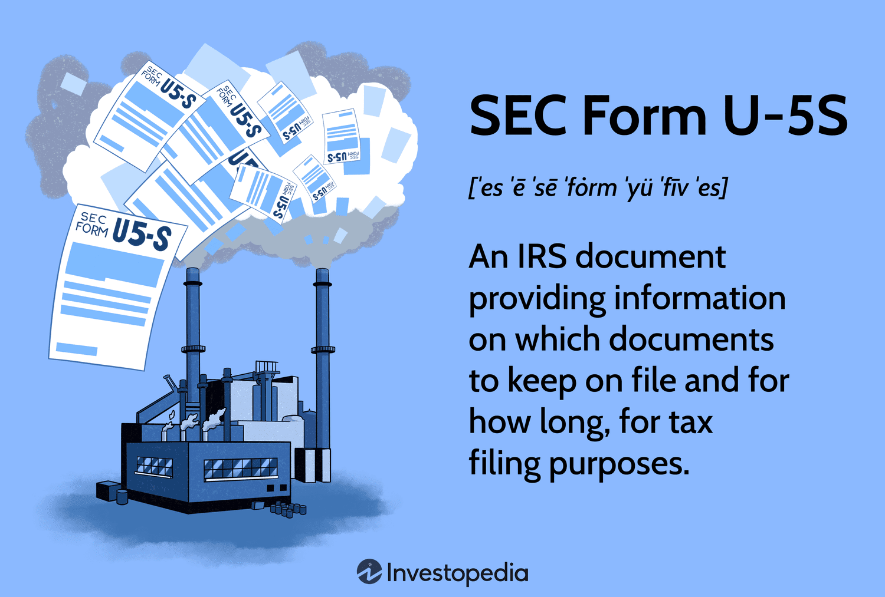

The landscape of securities regulation is multi-faceted, particularly when it involves utility filings and algorithmic trading. Within this complex ecosystem, understanding key forms such as the SEC Form U-5S is crucial for stakeholders in both the finance and energy sectors. This document historically served as a pivotal compliance tool, offering detailed insights into the operational and financial status of registered public utility holding companies. The regulatory environment is continually evolving, and staying informed about these changes is vital for companies to ensure compliance and for investors to make informed decisions. 

Although SEC Form U-5S became obsolete with the repeal of the Public Utility Holding Company Act in 2005, its relevance persists as a part of the regulatory history that has shaped current practices. The data it required provided transparency and oversight, aspects that remain critical in today's regulatory frameworks. Understanding such historical compliance forms provides a foundation for navigating the complexities of modern trading technologies and practices, including algorithmic trading. As utility companies integrate more sophisticated trading strategies into their market participation, knowing how past regulations intersect with these technologies can inform proactive compliance strategies, enhancing both market stability and transparency.



## Table of Contents

## What Was SEC Form U-5S?

SEC Form U-5S was an essential document required annually by the Securities and Exchange Commission (SEC) for all registered public utility holding companies. This form was a crucial element of the regulatory landscape established under the Public Utility Holding Company Act of 1935. It served as an extensive repository of data concerning the structure and financial status of the parent holding company and its subsidiaries.

Primarily, SEC Form U-5S was designed to provide detailed information regarding shares, voting powers, and book values associated with the holding company and its subsidiaries. This comprehensive disclosure allowed the SEC to effectively monitor and assess the operational and financial stability of utility companies, ensuring transparency and accountability. Companies were obliged to submit precise updates on their organizational structure, which included not only financial metrics but also governance aspects such as the roles of officers and directors within the entity.

The submission of SEC Form U-5S enabled the SEC to maintain rigorous oversight of the utility sector, preventing excess concentration of economic power and promoting fair practices. However, the filing requirement for Form U-5S became obsolete after the repeal of the Public Utility Holding Company Act of 1935, effective in 2005. The repeal led to significant shifts in how regulatory oversight was exerted over utility companies, aligning with modernized regulatory frameworks.

## Key Components and Requirements of SEC Form U-5S

SEC Form U-5S required public utility holding companies to provide a comprehensive overview of their corporate structure and financial health. Critical data points included detailed accounts of company structure, shares, and acquisition activities. This involved itemizing all subsidiaries and documenting the ownership structure, which was essential for monitoring controls and ensuring compliance with regulatory standards.

Additionally, the form asked for financial disclosures that encompassed not only traditional financial metrics such as total assets and liabilities but also the distribution and book value of shares. These requirements aimed to provide regulators with a clear view of the financial positioning and changes within the holding company and its subsidiaries.

Governance transparency was another critical aspect of SEC Form U-5S. Companies were obligated to list officers and directors, providing information about each individual's role and possibly their influence within the organization. This was integral for assessing management practices and potential conflicts of interest.

The expectation for precise information updates on the form served the purpose of maintaining market integrity. By requiring detailed disclosures, the SEC could exercise effective oversight and prevent corporate malfeasance, safeguarding both investors and the broader financial system.

## Comparing SEC Form U-5S and FINRA Form U-5

SEC Form U-5S and FINRA Form U-5 both serve roles in regulatory compliance but cater to different sectors and purposes. 

SEC Form U-5S was specifically designed for registered public utility holding companies, primarily to report on corporate structure, financial health, and regulatory compliance under the Public Utility Holding Company Act of 1935. Its focus was on providing a comprehensive overview of the utility company, including details such as share distribution, voting powers, and the book value of assets. This form was central to the SEC’s efforts in monitoring and ensuring the transparency of utility companies until its obsolescence in 2005 following legislative changes.

On the other hand, FINRA Form U-5 is a critical document in the securities industry, utilized to report the termination of brokerage firm employees. This form protects investors and promotes integrity within the securities sector by requiring the disclosure of reasons for employment termination, whether it be voluntary or involuntary, and the circumstances surrounding the departure. The information provided is vital for prospective employers and regulators in assessing the professional history and conduct of brokers and registered representatives.

While they both address compliance, the distinction in their application is significant. SEC Form U-5S primarily dealt with corporate and financial data of utility companies, impacting investor and regulatory transparency within that industry. FINRA Form U-5, conversely, involves employment and conduct-related information, shaping the oversight and accountability framework within the financial services industry. Confusing these forms could lead to misunderstandings about their regulatory functions and the objectives they aim to achieve within their respective domains. Understanding these differences is essential for stakeholders navigating both securities regulation and utility company compliance.

## Impact on Utility Companies and Investors

The repeal of Form U-5S has considerably altered the landscape of regulatory compliance and reporting practices for utility companies. This form was an essential tool that provided the Securities and Exchange Commission (SEC) with detailed insights into the structure and operations of public utility holding companies. It demanded the disclosure of comprehensive data on financial health, governance, and acquisition activities, which were crucial for regulatory oversight.

For investors and analysts, the data encapsulated in Form U-5S was invaluable. It allowed them to gauge the financial stability and strategic positioning of utility companies. The annual submission of detailed information facilitated a transparent view of a company's operations, empowering stakeholders to make informed investment decisions based on quantifiable data rather than speculation. 

The obsolescence of Form U-5S has necessitated a shift in how utility companies fulfill regulatory requirements and how investors access pertinent data. Companies are now required to adapt to new regulatory frameworks that have emerged following the repeal of the Public Utility Holding Company Act of 1935. These frameworks demand innovative approaches to data monitoring and reporting, ensuring that compliance standards are met without the prescriptive format previously offered by Form U-5S.

The transition to new reporting practices may involve leveraging modern technology and data analytics. For instance, utility companies are increasingly employing digital platforms to collate and report data, ensuring accuracy and compliance with contemporary standards. Additionally, investors may need to rely on [alternative data](/wiki/best-alternative-data) sources and advanced analytics to assess the performance and risk associated with utility stocks.

Overall, while the absence of Form U-5S has relieved some regulatory burdens, it simultaneously challenges utility companies and investors to innovate and adapt to maintain transparency and informed decision-making in an evolving regulatory landscape.

## Connection to Algorithmic Trading

As utility companies continue to innovate, their market participation strategies increasingly employ [algorithmic trading](/wiki/algorithmic-trading) techniques. This development necessitates an understanding of how historical regulatory frameworks, such as those enforced through SEC Form U-5S, intersect with the technologies driving modern trading environments. 

The use of algorithmic trading presents unique challenges and opportunities for utility companies. This trading strategy relies on executing orders using high-speed computers driven by complex algorithms, often making split-second decisions that are beyond human capability. Algorithmic trading can increase market [liquidity](/wiki/liquidity-risk-premium) and reduce transaction costs, but it also demands rigorous data oversight and compliance due to its rapid execution and potential impact on market stability.

Historically, forms like SEC U-5S provided detailed snapshots of utility companies' financial health and corporate structure, thus offering a foundation for accountability and transparency in their operations. Though the form became obsolete after the repeal of the Public Utility Holding Company Act of 1935 in 2005, the principles behind such disclosures continue to be relevant. They serve as a reminder of the importance of having robust reporting and compliance mechanisms in place, even as market activities become more technologically advanced.

Algorithmic trading systems thrive on data; the more historical and comprehensive the data available, the more effective the algorithm. The U-5S form's role in compiling detailed transactional and structural data previously supported utilities in maintaining transparent reporting and decision-making processes. Without such comprehensive documentation, utility companies must adapt by integrating new data monitoring tools and compliance strategies.

For instance, utility companies may employ [machine learning](/wiki/machine-learning) models to analyze historical trading patterns that were tracked through forms like the U-5S. A Python-based implementation could involve leveraging libraries such as pandas for data analysis and scikit-learn for building predictive models. Here's a basic example of how a utility company might model price movements using Python:

```python
import pandas as pd
from sklearn.model_selection import train_test_split
from sklearn.linear_model import LinearRegression

# Load historical trading data
data = pd.read_csv('historical_trading_data.csv')

# Feature selection and data preprocessing
X = data[['[volume](/wiki/volume-trading-strategy)', 'prev_close', 'open', 'high', 'low']]
y = data['close']

# Split data into training and testing sets
X_train, X_test, y_train, y_test = train_test_split(X, y, test_size=0.2, random_state=42)

# Initialize and train the model
model = LinearRegression()
model.fit(X_train, y_train)

# Evaluate model performance
score = model.score(X_test, y_test)
print(f'Model accuracy: {score * 100:.2f}%')
```

Such analysis helps in forecasting market trends, adjusting investment strategies, and ensuring compliance with current and anticipated regulations. Utility companies must continuously align their algorithmic strategies with regulatory standards to maintain operational integrity and investor confidence.

As algorithmic trading grows more sophisticated, utility companies must ensure that their strategies remain compatible with both historical and contemporary regulatory expectations. By examining past compliance mandates and adapting them to modern technologies, utility companies can craft proactive compliance strategies that optimize both market performance and adherence to regulatory standards.

## Conclusion

Regulatory frameworks serve as fundamental pillars in maintaining market stability and ensuring transparency across financial and utility sectors. Such frameworks are crucial in fostering an environment where investors and companies can operate with confidence. With the rise of advanced trading technologies, including algorithmic trading, understanding historical compliance forms like the SEC Form U-5S remains crucial. These forms, while obsolete, help contextualize the evolution of regulatory practices and can guide current strategies in managing compliance within today's fast-paced technological landscape.

Stakeholders, including utility companies and investors, must adeptly navigate the ever-changing regulatory landscape. Awareness of both historical forms, like the SEC Form U-5S, and existing requirements is essential for ensuring continued compliance and market integrity. This dual awareness not only aids in understanding the trajectory of regulatory requirements but also prepares stakeholders for potential future regulatory shifts as trading technologies and market practices continue to evolve. Understanding and adapting to these changes will be critical in maintaining competitive advantage and regulatory compliance in today’s dynamic market environment.

## References & Further Reading

[1]: Bergstra, J., Bardenet, R., Bengio, Y., & Kégl, B. (2011). ["Algorithms for Hyper-Parameter Optimization."](https://dl.acm.org/doi/10.5555/2986459.2986743) Advances in Neural Information Processing Systems 24.

[2]: ["Advances in Financial Machine Learning"](https://www.amazon.com/Advances-Financial-Machine-Learning-Marcos/dp/1119482089) by Marcos Lopez de Prado

[3]: ["Evidence-Based Technical Analysis: Applying the Scientific Method and Statistical Inference to Trading Signals"](https://www.amazon.com/Evidence-Based-Technical-Analysis-Scientific-Statistical/dp/0470008741) by David Aronson

[4]: ["Machine Learning for Algorithmic Trading"](https://github.com/stefan-jansen/machine-learning-for-trading) by Stefan Jansen

[5]: ["Quantitative Trading: How to Build Your Own Algorithmic Trading Business"](https://github.com/LucindaYa/quant-resources/blob/master/Quantitative%20Trading%20How%20to%20Build%20Your%20Own%20Algorithmic%20Trading%20Business.pdf) by Ernest P. Chan