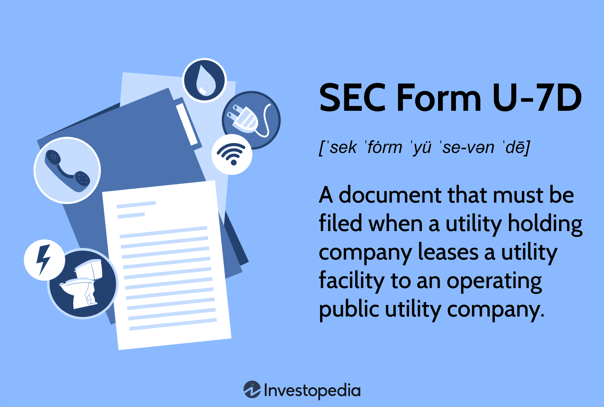

Securities filings are a fundamental aspect of maintaining transparency and regulatory compliance in financial markets. The U.S. Securities and Exchange Commission (SEC) plays a pivotal role in overseeing these filings, ensuring that entities within the financial sector adhere to regulations designed to protect investors and maintain market integrity. Among these filings, Form U-7D stands out as an essential document, particularly for companies involved in utility leasing and automated trading.

Automated trading and algorithmic practices have revolutionized financial markets by increasing trading speed and efficiency. These practices, however, introduce complexities regarding regulatory compliance. The need for robust oversight has grown as algorithmic trading can potentially disrupt markets and lead to unfair trading advantages. Hence, understanding how these trading methods intersect with regulatory requirements is crucial for maintaining market stability.

The SEC enforces rules that require transparency and accountability from all market participants. By mandating the filing of forms like U-7D, the SEC ensures that companies provide necessary disclosures regarding their operations and financial health. This process allows the commission to monitor activities effectively, identify potential risks, and take corrective actions when necessary.

This article aims to provide a comprehensive overview of Securities Filing Form U-7D, highlighting its significance in the context of algorithmic trading. By examining its requirements and regulatory underpinnings, we seek to elucidate its importance for companies engaged in activities that span utility leasing and automated trading environments.

Form U-7D is particularly relevant for entities involved in utility leasing as these companies have specific obligations to disclose operational details, financial positions, and lease terms. For firms at the intersection of utility management and algorithmic trading, comprehending the nuances of Form U-7D is critical for maintaining regulatory compliance and avoiding potential penalties.

In summary, grasping the significance of Form U-7D involves appreciating its role in facilitating market transparency and compliance, especially for firms at the nexus of utility leasing and automated trading. This article will delve further into the intricacies of Form U-7D and its implications for ensuring regulatory adherence in dynamic financial landscapes.

## Table of Contents

## SEC Form U-7D: Overview and Requirements

SEC Form U-7D is a regulatory document mandated by the Securities and Exchange Commission (SEC) under the provisions of the Public Utility Holding Company Act of 1935. It is primarily concerned with the oversight of entities involved in utility leasing, especially those that engage in automated trading. The form serves to enhance transparency and ensure compliance with established regulations, safeguarding both market integrity and consumer interests.

### Filing Requirements Under the Public Utility Holding Company Act of 1935

The Public Utility Holding Company Act of 1935 was designed to eliminate certain utility holding company practices that had become prevalent during its time, and to protect consumers and investors by ensuring greater transparency. Form U-7D is linked to this legislative framework and plays a crucial role in the disclosure of pertinent operational and financial information from entities involved in utility leasing activities.

### Entities Required to File Form U-7D

Any company that functions as a utility provider and engages in leasing activities that fall under the jurisdiction of the SEC must file Form U-7D. This includes firms that are involved in the business of automated or [algorithmic trading](/wiki/algorithmic-trading) wherein they utilize leased utilities as part of their operational infrastructure. The requirement to file this form is triggered under circumstances where such entities operate within the regulatory boundaries defined by the Public Utility Holding Company Act.

### Information Required in Form U-7D

The form mandates the inclusion of specific details relating to operations, financial circumstances, and terms of utility leases. The key components of the required information are as follows:

- **Operational Details**: Entities must disclose the nature of their operations involving leased utilities. This includes the geographic locations of these operations and the type of utilities being utilized.

- **Financial Disclosures**: Companies are required to provide comprehensive financial statements that reveal their income sources, expenditures linked to utility leasing, and any financial risks associated with their operations.

- **Lease Terms**: A detailed account of the lease agreements is necessary, specifying the terms, conditions, duration, and any clauses that might affect the entity's operational capacity or financial health.

### Deadlines and Procedural Guidelines for Filing Form U-7D

The SEC stipulates strict deadlines for the submission of Form U-7D to ensure timely compliance. Filers are expected to submit their forms annually, with provisions available for amendments should there be changes in the operational or financial situations of the company. The procedural guidelines demand that filings be thorough and accurate, supported by relevant documentation to uphold the integrity of the filed information.

Each submission undergoes review by the SEC to verify compliance with regulatory standards. Entities are encouraged to maintain complete records and consider utilizing legal and financial advisory services to navigate the complexities of the filing process effectively. This proactive approach to compliance minimizes the risk of penalties and underscores the firm’s commitment to transparency and regulatory adherence.

## Algorithmic Trading and Regulatory Compliance

Algorithmic trading, or algo trading, refers to the use of computer algorithms to automate trading operations. These algorithms are designed to make complex trading decisions at speeds and frequencies that are not possible for human traders. They analyze vast datasets, identify patterns, and execute trades based on predefined criteria, often in fractions of a second. This technological advancement has revolutionized modern financial markets, accounting for a significant proportion of the trading [volume](/wiki/volume-trading-strategy).

The importance of regulatory compliance in automated trading environments cannot be overstated. As algorithmic trading continues to dominate the financial landscape, regulators like the U.S. Securities and Exchange Commission (SEC) play a crucial role in ensuring these practices are conducted fairly and transparently. Regulatory compliance helps manage systemic risk, protect market integrity, and ensure a level playing field for all market participants.

SEC regulations interact with algorithmic trading practices primarily through mandates that focus on market manipulation, insider trading, and the accuracy of execution processes. The SEC enforces rules and guidelines that require firms engaged in algorithmic trading to maintain robust risk controls and ensure that their automated systems operate within established legal frameworks. This includes the submission of relevant documentation, such as Securities Filing Form U-7D, particularly when activities intersect with areas like utility leasing, which may involve extensive financial and operational disclosures.

The potential risks in algorithmic trading are manifold and can include erroneous trades, flash crashes, and unintended accumulation of market positions. Such risks can stem from faults in algorithm logic, issues with data input, or system failures. Compliance with regulatory requirements can mitigate these risks by enforcing the implementation of appropriate safeguards. For instance, maintaining system redundancies, real-time monitoring, and proper [backtesting](/wiki/backtesting) of trading algorithms are critical practices encouraged by regulatory frameworks.

Case studies highlight the significant impact of non-compliance in algorithmic trading. For example, the 2010 "Flash Crash" demonstrated how algorithms could inadvertently cause major market disruptions, ultimately leading to increased scrutiny from regulators and the imposition of stricter controls. Another notable case is the penalty imposed on Knight Capital in 2012 following a software glitch that resulted in significant losses due to the malfunction of their algorithmic trading system. These instances underline the necessity of a compliance-oriented approach in algorithmic trading operations.

In conclusion, algorithmic trading has become a cornerstone of modern financial markets, necessitating stringent regulatory compliance to safeguard against inherent risks. Effective interaction with SEC regulations, including the adherence to filing requirements like Form U-7D, helps ensure that algorithmic trading firms maintain operational integrity and market stability.

## Critical Components of Form U-7D for Algo Trading Firms

Algorithmic trading firms engaging in utility leasing must accurately disclose specific information on SEC Form U-7D to maintain regulatory compliance. Key components include details regarding their operations, financial posture, lease agreements, and other relevant data crucial for assessing systemic risks and ensuring transparency.

Financial transparency is paramount for algorithmic trading firms, particularly those involved in utility leasing, as it provides a clear depiction of their financial health and operational integrity. Such transparency necessitates detailed reporting standards within Form U-7D, requiring firms to disclose comprehensive financial data, including but not limited to, balance sheets, income statements, and cash flow details. This level of transparency facilitates regulatory oversight and ensures that firms are operating within the established financial governance structures.

Common pitfalls in Form U-7D filings often stem from inaccurate or incomplete data submissions. Algorithmic trading firms may inadvertently overlook intricate details or provide erroneous information, resulting in potential non-compliance penalties. To mitigate these risks, firms should prioritize the meticulous organization of their financial and operational data, ensuring comprehensive internal reviews are conducted before submission. A typical error can be data mismatch between the reported financials and actual figures, which can be addressed by implementing a robust reconciliation process.

Best practices for submitting Form U-7D accurately and promptly include establishing a dedicated compliance team knowledgeable about SEC regulations and the specific intricacies of Form U-7D. Regular training sessions on regulatory updates and proper form submission techniques can enhance the precision of the filings. Employing a standardized checklist for form preparation ensures that all necessary components are thoroughly addressed before final submission to the SEC.

Technological solutions and advisory services play a vital role in streamlining the compliance process for algorithmic trading firms. Utilizing advanced compliance software can automate the preparation and review of Form U-7D, reducing the likelihood of human error and expediting the filing process. Advisory services cater to providing expert insights and guidance, particularly beneficial when navigating complex regulatory landscapes. These services can also assist firms in adopting best practices, ensuring ongoing compliance with evolving SEC regulations.

By adhering to these strategies and leveraging available technologies and expert services, algorithmic trading firms can effectively manage their Form U-7D obligations, maintaining compliance and fostering financial transparency within the regulatory framework.

## Common Mistakes and How to Avoid Them

When filing SEC Form U-7D, algorithmic trading companies often encounter a range of common errors that can have significant repercussions. Recognizing these mistakes and understanding strategies to avoid them is crucial for maintaining compliance and ensuring smooth regulatory processes.

### Frequent Filing Errors

One of the most prevalent issues in completing Form U-7D is the omission of vital information. Companies sometimes neglect to include comprehensive operational details or fail to update financial disclosures accurately. Misreporting lease terms, especially for utility leasing operations, is another typical oversight. These errors often arise from inadequate internal review processes or misunderstanding of the form's requirements.

### Consequences of Incorrect or Incomplete Filings

The ramifications of submitting incorrect or incomplete Form U-7D filings are considerable. Non-compliance can lead to regulatory scrutiny, financial penalties, and reputational damage. For trading firms, this could also mean restricted trading activities or additional audits, which may slow down operations and affect profitability.

### Strategies for Auditing and Reviewing Information

To mitigate the risk of errors, implementing a robust auditing and review process is essential. This can include:

- **Regular Internal Audits**: Conduct periodic audits to ensure that all information is current and requirements are met.

- **Cross-Verification**: Use cross-verification techniques to compare financial and operational data against external records to ensure consistency.

- **Checklists**: Develop detailed checklists based on the latest regulatory guidelines for Form U-7D. This can serve as a reference to ensure no section is overlooked during preparation.

### The Role of Professional Guidance

Engaging professional advisory services can significantly reduce filing errors. Experts in securities law and regulatory compliance can provide tailored advice, ensuring that all aspects of the form are adequately addressed. They can also offer insights into complex areas like financial disclosures and operational specifics, enhancing the accuracy of submissions.

### Learning from Past Filings

Analyzing case studies of both successful and faulty Form U-7D submissions can provide invaluable lessons. Successful filings typically demonstrate meticulous attention to detail and adherence to guidelines, while faulty filings highlight pitfalls such as data inconsistencies or incomplete sections. Learning from these instances, companies can better prepare and avoid similar mistakes in their future filings.

By addressing common errors proactively and incorporating best practices, algorithmic trading firms can ensure precise and compliant Form U-7D submissions, ultimately safeguarding their operations and adhering to regulatory standards.

## The Future of SEC Filings and Algorithmic Trading

Emerging trends in algorithmic trading are reshaping the regulatory landscape, necessitating adaptations in securities filings such as SEC Form U-7D. Algorithmic trading, characterized by the use of complex algorithms to execute orders at speeds far exceeding human capability, constitutes a significant portion of market trades today. This advancement compels regulatory bodies to reassess and potentially amend existing frameworks to ensure fairness, transparency, and market integrity.

In a progressively digitized world, the nature of SEC form filings is evolving. Digital submissions and cloud storage will likely become standard practice, facilitating quicker and more efficient processing and review by regulatory authorities. This transition will not only streamline operations but also reduce errors associated with manual filing processes. As regulatory bodies adapt, the onus is on firms to align their systems with these digital requirements to maintain compliance.

Furthermore, as trading technologies advance, there is an increasing need for regulations to keep pace with the capabilities of these systems. Potential amendments to current regulations could involve stricter guidelines on the use of high-frequency trading ([HFT](/wiki/high-frequency-trading-strategies)) and a focus on preventing market manipulation. Ensuring algorithmic systems are designed with built-in compliance checks could become a standard expectation.

Artificial intelligence (AI) and [machine learning](/wiki/machine-learning) are anticipated to have a profound impact on regulatory compliance and filing practices. These technologies can aid in real-time monitoring and detection of errant trading patterns that may indicate compliance breaches. For instance, machine learning algorithms can be employed to analyze vast datasets, identifying anomalies that warrant regulatory attention. As AI capabilities expand, the potential for automating compliance processes grows, potentially reducing the risk of human oversight errors.

Predictions on the evolution of securities regulations suggest a more collaborative approach between regulators and industry participants. Experts foresee a future where regulatory frameworks are more agile and responsive to technological innovations. This involves ongoing dialogue with trading firms to understand technological advancements and adapting regulations accordingly to uphold market stability without stifling innovation.

In conclusion, the future of SEC filings and algorithmic trading is poised for significant transformation. As the trading landscape becomes increasingly digital, both regulatory bodies and trading firms will need to adopt technologies that ensure compliance and transparency. Balancing the rapid innovation in trading technologies with robust regulatory frameworks will be critical to maintaining the integrity of financial markets.

## Conclusion and Key Takeaways

SEC Form U-7D is pivotal for maintaining regulatory compliance, especially for firms engaging in algorithmic trading. Its meticulous structure ensures that entities involved in utility leasing and automated trading provide crucial information on their financial operations and leasing arrangements. This oversight safeguards the integrity and transparency vital to the efficient functioning of financial markets.

Adhering to SEC Form requirements demands that firms adopt several best practices. One key approach is the consistent auditing and verification of information before submission to minimize errors and discrepancies. Ensuring that all operational details, financial disclosures, and lease specifics are accurately captured can mitigate the likelihood of regulatory penalties. Moreover, identifying common pitfalls—such as incomplete data entries or missed deadlines—and proactively addressing them enhances compliance efficiency.

Firms should prioritize regulatory compliance as an integral part of their operational strategy. By fostering a compliance-centric culture, trading companies not only avoid legal repercussions but also build trust with stakeholders and clients. This trust is fundamental to sustaining long-term operational success and competitive advantage in the fast-evolving financial landscape.

Balancing innovation with regulatory obligations is crucial for firms keen on leveraging advanced trading technologies. Companies must find equilibrium where cutting-edge algorithmic strategies can coexist with stringent compliance mandates. This balance ensures that technological advancements do not come at the cost of regulatory adherence or market integrity.

Firms are encouraged to utilize advisory services and technology to streamline their compliance processes. These resources can facilitate the accurate and timely submission of SEC filings, such as Form U-7D, by offering expert insights and leveraging software solutions for data management and reporting. By doing so, firms not only ensure compliance but also position themselves to adapt swiftly to any regulatory changes driven by technological progress.

In conclusion, the importance of SEC Form U-7D for algo trading firms cannot be overstated. Its role in transparency and accountability is foundational, demanding that firms harness available tools and expert guidance to navigate filing requirements effectively. Through strategic adherence to these regulatory frameworks, companies can continue to innovate responsibly, ensuring their place in a dynamic and compliant financial market.

## References & Further Reading

[1]: ["Algorithmic Trading: An Overview"](https://en.wikipedia.org/wiki/Algorithmic_trading), The Journal of Portfolio Management

[2]: Hull, J. (2021). ["Options, Futures, and Other Derivatives"](https://elibrary.pearson.de/book/99.150005/9781292410623). Pearson.

[3]: Aldridge, I. (2013). ["High-Frequency Trading: A Practical Guide to Algorithmic Strategies and Trading Systems"](https://onlinelibrary.wiley.com/doi/pdf/10.1002/9781119203803.fmatter). Wiley.

[4]: Securities Exchange Act of 1934, 15 U.S.C. § 78a et seq. Retrieved from: [SEC's Official Site](https://www.law.cornell.edu/uscode/text/15/78a)

[5]: Hasbrouck, J., & Saar, G. (2013). ["Low-Latency Trading"](https://www.sciencedirect.com/science/article/abs/pii/S1386418113000165). The Review of Financial Studies, 26(9), 2656-2692.

[6]: Gomber, P., Arndt, B., Lutat, M., & Uhle, T. (2011). ["High-Frequency Trading"](https://papers.ssrn.com/sol3/papers.cfm?abstract_id=1858626). Business & Information Systems Engineering, 3, 167–172. 

[7]: SEC Concept Release on Equity Market Structure, (Release No. 34-61358; File No. S7-02-10). Retrieved from: [SEC's Official Site](https://www.sec.gov/files/rules/concept/2010/34-61358.pdf)